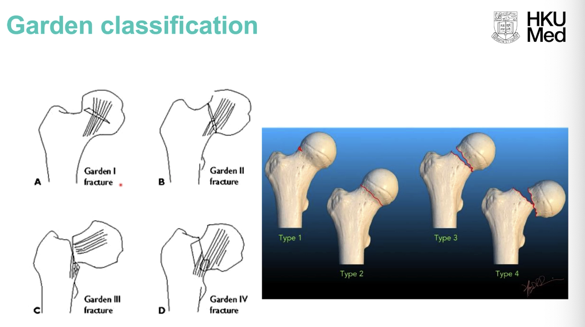

# GC235: Osteoporotic Related Fractures Lecture

## Hip practures

- **Shenton's line** - broken Shenton's line indicative of hip pathologies

- **Anatomy of proximal femur:**

    - Femoral head
    - Femoral neck
    - Intertrochanteric region - greater and lesser tronchanter
    - Subtronchanter
    - Shaft

- **Blood supply of the proximal femur** - prone to avascular necrosis, note retrograde blood flow:

    - Artery of ligamentum teres (foveal artery) - branch from obturator artery from above, clinically insignificant in adults
    - Medial and lateral circumfrex artery - retinicular branches in periosteum and penetrates into head and neck

- Different proximal femoral fracture:

    - Capital fracture
    - Transcervical fracture
    - Basal cervical fracture
    - Intertrochanteric fracture
    - Sub trochanteric fracture

- Avascular necrosis of the hip after proximal femoral fractures - requires intra-capsular fractures where retinicular branches are teared

- Imaging:

    - Deformities of hip joint - Shenton's line, size of lesser trochanter
    - Discontinuity of bony cortex
    - Trabecular patterns - angulation of trabecular lines indicates impacted fractures that are not displaced

- Suspected Hip fracture but XR shows no abnormality - use advanced imaging to preevnt further displacement on weight bearing:

    - CT - 1st line due to short time
    - T2-weighted MRI - detect bone oedema, if CT is negative
    - Bone scan (low utility because poor anatomical information)- detect osteoblast activity

- Garden's classification of femoral neck fractures:

    - Type 1 - valgus impacted fracture
    - Type 2 - displaced
    - Type 3 - angulation
    - Type 4 - grossly translated

  
  

    - Garden's 1-2 - non-displaced or minimally displaced (low risk of AVN)
    - Garden's 3-4 - displaced (risk of AVN)

- Mx:

    - Garden's 1-2 (undisplaced) - internal fixation to prevent displacement
    - Garden's 3-4 - Hemiarthroplasty (for old age to prevent reoperation), reduction and internal fixation (for young age to salvage joint)

- Risk factors of proximal femoral fractures:

    - Increased risk of falls - medical, drugs, alcohol, dementia, <u>sarcopenia</u>
    - Reduction in protective response
    - Loss of shock absorbers - esp. skinny, sarcopenic
    - Loss of bone strength - osteoporosis:
        - Drug related - corticosteroids, phenytoin, thyroxine, alcohol
        - Smoking
        - Vit D or calcium deficiency
        - Physical inactivity

- Mx considerations:

    - Age - young age, \< 65y (can tolerate 2nd surgery, and prosthesis have limited longevity)
    - Displacement - Garden's 3-4 has high risk of AVN, and require hemiarthroplasty
    - Other factors:
        - Time of presentation - delayed (\> 6h)
        - General health

- Factors with increased risk of fixation failure:

    - Old age
    - Osteoporosis
    - Vertical fracture pattern
    - Delayed presentation

- Intertrochanteric fractures (AO classification):

    - 31-A1 - pertrochanteric simple
    - 31-A2 - pertrochanteric multifragmentary
    - 31-A3 - intertrochanteric

- Stable vs unstable per-trochanteric fractures:

    - Stable - oblique pattern, minimal comminution
    - Unstable - reverse obliquity, subtrochanteric extension or highly comminuted

## Osteoporosis

- **Definition** - systemic skeletal disorder, characterised by low bone mass, microarchitectural deterioration of bone tissue, leading to bone fragility, and consequent increase in fracture risk
- Role of DXA scan and T-score - detection of asymptomatic osteoporosis (no fracture yet)
- Fracture and QoL over life span:
    - \> 50% cannot return to the premorbid state
    - General Natural Hx - Colle's fracture -\> multiple vertebral fracture -\> hip fracture -\> mortality
- Atypical femoral fractures after years of bisphosphonate - particularly common in Asian Populations:
    - Pathophysiology:
        - Reduced bone turnover due to osteoclast inhibition
        - Microfractures accumulate
        - Stress fracture and displacement with minimal trauma
    - Clinical signs:
        - Beak sign and dreaded black line on Xray
    - Implications:
        - Use of bisphosphonates still \> risk:
        - Benefits slightly lost after 5y –\> consider replacement with another drug or lifestyle modifications

### Distal wrist fracture

- Colle's fracture - 5 features:
    - Dorsal angulation
    - Dorsal translation
    - Radial angulation
    - Radial translation
    - Axial shortening
- Problems of distal wrist fracture:
    - Pain
    - Unstable
    - Nerve impingement
    - Loss of reduction
    - Skin and tendon impingement
- Mx:
    - Haematoma block - LA injection into haematoma
    - Closed reduction - longitudinal traction to reverse direction of deformity
    - Stabilisation - 3 point fixation proximally, distally, and at fracture line
- Operative Mx - reduction and internal fixation:
    - Evaluation of patient's functional demand
    - Neurological exam
    - Fluoroscopy
    - CT assessment
    - Absolute indications:
        - Carpal dislocation
        - High grade -
        - Progressive median nerve palsy

### Lumbar fracture

- Wedged - trapezoidal shape
- Angulation - leads to progressive deformity (due to accumulation of wedge segments from different episodes) –\> progressive kyphosis –\> +ve feedback because kyphosis predispose to further fractures because excessive loading and bad centre of mass
- Mx:
    - Reduction
    - Stabilisation - internal or external fixation (thoraco-lumbro-sacral orthosis, TLSO)

## Principles of Mx:

- Lower limb - for locomotion, requires more aggressive Mx (operative) and pain control
- Upper limb - for self care, requires more conservative Mx (immobilisation)

# GC Block B Carotid stenosis

- **Definition of TIA** - A focal neurological deficit that lasts for \< 24h with complete, spontaneous recovery
- Amaurosis fugax - painless, mono-ocular vision loss with spontaneous recovery
    - DDx - retinal pathologies, AACG, other strokes (occipital)
- Assessment of TIA:
    - Hx - identify nature, confirm suspected TIA (vs epileptic fit)
    - P/E - look at embolic source (CVS assessment by echo and Holter)
    - Carotid duplex - 4 components:
        - Degree of stenosis - critical stenosis \> 70%
        - Peak systolic velocity after plaque - 2-2.5x prior to plaque is considered significant
        - Plaque characteristic - echo-lucency vs echo-dense
        - Caliber of artery
    - Non-invasive angiography of H&N
- Mx of Carotid stenosis:
    - Principally - carotid stenosis is a chronic condition, equivalent to CCS
    - Mx options - CEA, CAS
    - Indications:
        - Symptomatic \> 50% stenosis
        - Assymptomatic \> 70% stenosis
