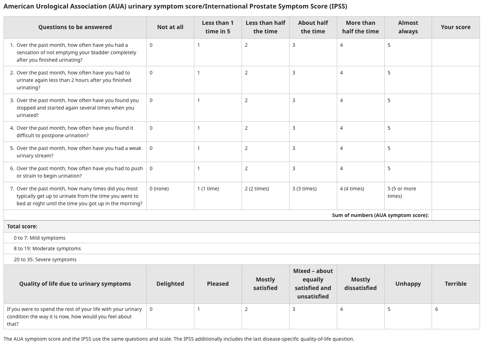

# Acute Urinary Retention - Literature Search on UpToDate

## Acute Retention of Urine

- **Definition** - urological emergency characterised by the inability to voluntarily pass urine
- **Etio-pathophysiology of AROU** - poorly understood, but likely caused by several contributary factors:
    - **Bladder outflow obstruction** - caused by obstruction of urinary flow distal to the bladder neck by static or dynamic factors:
        - <u>Prostate pathologies</u> - Benign prostatic hyperplasia (BPH), Prostate cancer (rare)
        - <u>Bladder pathologies</u> - Bladder cancer, bladder neck stenosis, bladder neck hypertrophy, bladder stones
        - <u>Urethral pathologies</u> - urethral strictures, phimosis
        - <u>Pelvic mass effect</u> - constipation, orgal prolapse (cystocele or rectocele), pelvic mass
    - **Neurological impairment** - caused by interruption of the sensory or motor nerve supply to the detrussor muscles:
        - <u>Spinal cord injury</u> (trauma, infections, metastasis) - results in detrussor-sphincteric dysinergia (UMN bladder) or ineffective detrussor contractions (LMN bladder)
        - <u>Other neurological diseases</u> - e.g. Stroke, Parkinson's disease, Multiple sclerosis, Diabetic autonomic neuropathy
    - **Inefficient detrusor muscles** - may be idiopathic or secondary to over-distension of urinary bladder:
        - Idiopathic - Detrusor underactivity (DUA)
        - Over-distension of urinary bladder - Fluid challenge (esp. alcohol), spinal or general anaesthesia w/o indwelling catheter
    - **Medications** - typically caused by increased sympathetic tone which affects detrussor contractility:
        - Anti-cholinergics - including anti-histamines (1st generation), anti-depressants, and anti-psychotics by reducing bladder contractility
        - Sympathomimetics - e.g. anti-arrhythmics, anti-hypertension
    - **Infection** (by causing outflow obstruction) - e.g. UTI (urethral oedema) and prostatitis
    - **Trauma** - stress incontinence surgery
- **Clinical suspicion of AROU** - inability to pass urine w/ suprapubic discomfort
- **Salient points of Hx** - typically distressed, extended evaluation after relief of AROU:
    - <u>HPI</u> - onset, duration, associated suprapubic discomfort, **previous episodes**
    - <u>Associated Sx</u>:
        - **Previous LUTS** - characterised severity of previous LUTS (BPH) prior to current episode
        - **Fever and prior dysuria** - suggestive of infective cause
        - **Previous haematuria** - suggestive of stone disease, or bladder cancer
        - **Current LBP and neurological Sx** (e.g. LL weakness) - presentation as spinal cord pathology with AROU as part of the clinical picture
    - <u>Other precipitating factors</u>:
        - **Constipation** - often a contributing factor for AROU
        - **Painful perianal lesions** - ask about Hx of haemarrhoids, anal fissures
        - **Organ prolapse** - cytocele, rectocele
        - **Detailed Drug Hx** - include the use of cold medications, alone with other long term medications
    - <u>PMH</u>:
        - **Hx of prostate disease** - BPH and its severity, Mx and presence of complications
        - **Hx of STD** - especially urethritis
        - **Hx of urothelial carcinomas** - cause and C/I for urethral catheterisation
        - **Hx of previous instrumentations** - risk of urethral strictures causing difficulty in urethral catheterisation
        - **Neurological diseases** - past stroke, Parkinson's disease, MS etc.
        - **Previous surgery** - TURP, other urological procedures, spinal surgery, GA, spinal anaesthesia
        - **Long term systemic diseases** - e.g. DM (autonomic neuropathy)
    - <u>Relevant SHx and FHx</u>
- **P/E:**
    - <u>General examination</u> - distress, ill-looking (?urosepsis) and uraemic signs
    - <u>Abdominal examination</u> - mild suprapubic tenderness +/- palpable bladder (dull on percussion)
    - <u>Digital rectal examination</u>:
        - Peri-anal sensation (look out for saddle anaesthesia in SCI) and anal tone
        - Painful perianal lesions
        - Faecal impaction (constipation)
        - Prostate size (in terms of ml/cc)
        - Suspicious features of prostate - hard consistency, nodularity, loss of median groove
    - <u>Pelvic examination</u> - for all F presenting w/ AROU
    - <u>Neurological examination</u> - examination of LL
- **Dx and initial Mx** - prompt bladder decompression by catheterisation:
    - <u>Dx</u> - based on **first cath volume** (\> 200 ml)
    - <u>Modalities of decompression</u>:
        - Urethral catheterisation (Foley) - indicated for most patients
        - Suprapubic catheterisation (SPC) - indicated for selected patients
    - <u>Duration of catheterisation</u> - depends on etiology (discussed in subsequent Mx)
    - <u>Complications of bladder decompression</u>:
        - **Haematuria** (2-16%) - rarely clinically insignificant haematuria that resolves with irrigation for almost all patients
        - **Transient hypotension** - typically normalises without intervetions
        - **Post-obstructive diuresis** - rare in acute setting, unless if a/w chronic urinary retension and obstructive uropathy
- **Urethral catheterisation** - indicated in all patients except for certain selected patients:
    - <u>C/I</u> - recent urological surgery, suspected acute prostatitis, known urothelial carcinoma
    - <u>Catheter of choice</u> - 14-18F Foley catheter
- **Suprapubic catheterisation:**
    - <u>Indications</u> - failed uretheral catheterisation or C/I for urethral catheterisation
- **Subsequent evaluation and Mx** - initial Ix:
    - **Bloods:**
        - <u>CBC</u> - leukocytosis for infection
        - <u>RFT</u> - renal derangement in acute-on-chronic urinary retension causing AKI
    - **Urine:**
        - Urinalysis - for leukocyte esterase, nitrites and blood
        - Urine C/ST - r/o suspected infections
- **Trial w/o a catheter** - duration of catheterisation depends on underlying etiology of AUR:
    - <u>Single episode, reversible etiology</u> (e.g. UTI, medications, post-operative) - voiding trials performed after underlying condition treated
    - <u>BPH-related</u> - initiate alpha-blockers before trial w/o catheter
- **Subsequent Mx** - dependent on etiology:
    - Urodynamic studies - if suspecting bladder outlet obstruction
    - Gynaecological consult - if caused by organ prolapse

## Benign prostatic hyperplasia

- **Terminology:**
    - <u>Benign prostatic hyperplasia</u> (BPH) - histological term describing the increase in cell number, instead of cell size (there is no such thing as benign prostatic hypertrophy)
    - <u>Benign prostatic enlargement</u> (BPE) - increase in anatomical size of the prostate in <u>some, but not all men with BPH</u>, which in turn leads to bladder outlet obstruction (BOO) in some
- **Epidemiology** - BPH is extremely common but not all are symptomatic:
    - **Prevelance:**
        - <u>Increases w/ age</u> - 70% in 60-69y, 80% in 70y
- **Pathophysiology of BPH** - often attributed to aging:
    - <u>Hyperplasia of the epithelial and transitional zones of the prostate</u> - results in yearly enlargement from 40y, which maybe hormonally driven (BPH not observed in patients with hypogonadism)
    - <u>Bladder outlet obstruction and LUTS</u> - based on static and dynamic factors, but symptomatology **may be attributed to non-prostatic factors** as well:
        - Static factors - due to benign prostatic enlargement
        - Dynamic factors - increased SM tone due to alpha-adrenergic activity
    - <u>Other factors altering symptomatology</u> - e.g. detrusor instability DOA, other comorbidities (e.g. on diuretics, DM, neurological factors)
- **Clinical features of BPH:**
    - <u>Clinical course</u> - typically progressive in old age (spontaneous improvement in minority of patients)
    - **Asymptomatic** - correlation between Sx and degree of prostatic enlargement (on DRE and transrectal US) is poor
    - **Symptomatic BPH** - manifests as <u>lower urinary tract symptoms</u> (LUTS) with predomiinant voiding Sx:
        - <u>Storage symptoms</u> - urgency, frequency, nocturia, incontinence
        - <u>Voiding Sx</u> - weak streams, hesitency, intermittency, splitting of voiding streams, terminal dribbling, straining to void
    - **Complications:**
        - <u>Acute retention of urine</u>
        - <u>Chronic retention of urine and associated complications</u> - recurrent UTIs, bladder stones, obstructive uropathy, bladder diverticuli
        - <u>Bleeding BPH</u>
- **Signs:**
    - DRE - non-tender, enlarged prostate
- **Assessment of symptom severity** - International prostate symptom score (IPSS):
    - <u>Stratification</u> - into mild, moderate and severe Sx

  
  
- **DDx of BPH** - consider other causes of LUTS:
    - Urological causes of BOO - urethral strictures, bladder neck stenosis, prostate cancer, bladder cancer
    - Other urological conditions - urinary tract infections
    - Neurological diseases - stroke or PD
    - Causes of polyuria:
        - DM - due to autonomic neuropathy and obligitory polyuria
        - Primary polydipsia
- **Dx** - a clinical diagnosis through compatible Hx without suggestive features of non-BPH causes of LUTS (DRE is unecessary but important to r/o prostate cancer)

### Management of benign prostatic hyperplasia

- **Principles of Mx:**
    - Lifestyle modifications for all patients - behavorial interventions to minimise impact of LUTS from complications
    - Medical therapy - indicated if LUTS persistent despite lifestyle modification
    - Surgical therapy - definite indications if complicated BPH, otherwise based on paient preference
- **Lifestyle modifications** - lessen LUTS:
    - <u>Mx of storage Sx</u>:
        - Avoid fluid intake before bedtime or travel
        - Avoid natural diuretics (e.g. caffeine, alcohol)
        - Avoid constipation
        - Increase exercise
        - Maintain healthy bodyweight
        - Mx of related comorbidities - e.g. DM
    - <u>Mx of voiding Sx</u> - maximise bladder emptying:
        - Timed voiding regimens - schedule urination by the clock regardless of perceived need to urinate
        - Double void regimens - follow one void with another attempt within 1-2 min
        - Pelvic floor muscle training - maintain detrusor stability
- **Medical therapy** - indicated for moderate-to-severe Sx (IPSS) despite lifestyle modifications +/- enlarged prostate size (for 5-ARI):
    - <u>Approach to medical Tx</u>:
        - Moderate-to-severe Sx w/o evidence of BPE - alpha-blocker monotherapy (or PDE-5i, beta-3 adrenergic agonist in patients w/ compelling indications)
        - Moderate-to-severe Sx w/ evidence of BPE - combination therapy w/ alpha-blocker and 5-ARI
    - <u>Alpha-blockers</u>:
        - **Selection** - alfuzosin, silodosin, tamusulosin, doxazosin, terazosin (selective), phenoxybenzamine, phentolamine (non-selective)
        - **MOA** - blockade of alpha-1 stimulation on prostatic smooth muscles (reduce dynamic factors)
        - **Efficacy** - mild improvement in urinary symptom score (30%), and mild improvement in peak urinary flow (25%)
        - **S/E:**
            - Hypotension - titration of dose w/ respect to risk of hypotension
            - Adverse cardiovascular events - demonstrated increased cardiovascular risk in <u>landmark ALLHAT trial</u> (no longer recommended as 1st-line anti-hypertensive agent)
    - <u>5-alpha-reductase inhibitor</u> (5-ARI):
        - **Indications** - evident prostsatic enlargement on DRE, TRUS, CT or MRI (rarely)
        - **Selection** - finasteride, dutasteride
        - **MOA** - inhibition of 5-alpha reductase
- **Surgical treatment:**
    - <u>Indications for surgical Tx of BPH</u>:
        - **Definite indications** - complications of BPH:
            - 1\. Acute urinary retention (refractory)
            - 2\. Recurrent UTI
            - 3\. Recurrent bladder stones
            - 4\. Obstructive uropathy - renal impairments with bilateral hydronephrosis
            - 5\. Bleeding BPH - recurrent gross haematuria when other causes are ruled out
        - **Relative indications** - moderate-to-severe Sx refractory to medical Tx
    - <u>Procedures</u>:
        - Transurethral resection of the prostate (TURP) - gold standard
        - Transurethral incision of the prostate (TUIP)
        - Other ablative techniques:
            - Transurethral vaporisation of the prostate
            - Photoselective vaporization of the prostate
            - Laser enucleation of the prostate
            - Transurethral microwave therapy
            - Robotic waterjet therapy
        - Minimally invasive surgeries:
            - Water vapour therapy therapy
            - Prostatic urethral lift
            - Temporary implanted prostatic devices
            - Prostatic arterial embolisation
    - <u>Complications of TURP</u>:
        - **Early complications:**
            - Anaesthetic risk - cardio-respiratory complications
            - Haemorrhage - surgical bleeding
            - Infection and urosepsis - due to catheterisation
            - Local complications:
                - Perforation - of bladder or prosthatic capsule
                - Incontinence - due to damage of external sphincter mechanism
            - TUR syndrome - absorption of water due to irrigation during TURP, leading to haemolysis, hyponNa, and CHF
        - **Late complications:**
            - Bladder neck stenosis and urethral strictures
            - Incontinence
            - Treatment failure - i.e. reoperation (repeat prostatectomy in 15-18% after 8y)
            - Sexual dysfunction:
                - Retrograde ejaculation (\> 50%) - leads to impotence
                - Erectile dysfunction - rare complication

# Intestinal Obstruction - Literature Search on UpToDate

## Small bowel obstruction

- **Definition** - interuption of normal flow of intraluminal contents at the level of the SB
- **Epidemiology** - accounts for 80% of IO:
    - Prevalence - 2-4% of A&E visits
    - Demographic - M=F
- **Etiology of SBO** - 90% of cases are caused by adhesions, tumours, and complicated hernias:
    - <u>Intraluminal</u> - Foreign body, Bezoar, gallstone ileus, intussusception
    - <u>Mural</u> - Strictures (Crohn's disease, radiation, anastomotic)
    - <u>Extramural</u> - adhesions, hernia, volvolus
- **Classification of SBO:**
    - By chronicity - acute vs Ccronic
    - By completeness - partial vs complete
    - By number of sites - simple SBO, closed-loop obstruction
- **Clinical features of SBO:**
    - **Colicky abdominal pain** - periumbilical cramping with paroxysms of pain every 4-5 minutes, progressing into a focal, dull pain indicating peritoneal irritation due to ischaemia
        - <u>Site</u> - periumbilical localisation, progressing to focal parietal pain followed by diffuse pain
        - <u>Onset</u> - typically sudden onset
        - <u>Progression</u> - colicky type pain that comes and goes, progressing into a focal dull pain (a/w ischaemia and peritoneal irritation) leading to sudden severe pain (perforation)
        - <u>Quality</u> - cramps with paroxysms of pain every few minutes coinciding w/ peristalsis
    - **Nausea and vomiting** - severe N/V, with early onset with high SBO, which may be billous (distal to Ampulla of Vater), progressing into feculent nature (bacterial overgrowth)
    - **Obstipation** - cessation of passage of stool or flatus indicating complete obstruction, but may be late in onset as there is evacuation of intraluminal contents of the distal bowel
    - **Abdominal distension** - variable, but more prominent in low SBO
