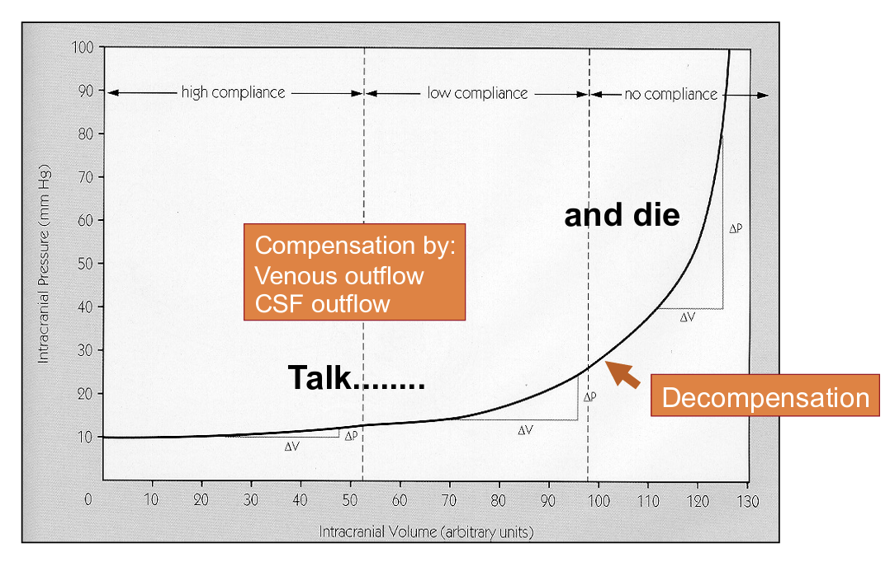
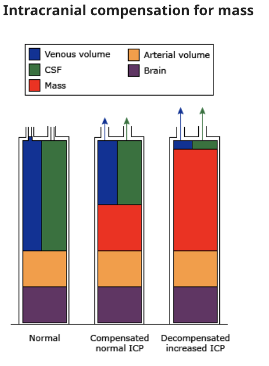
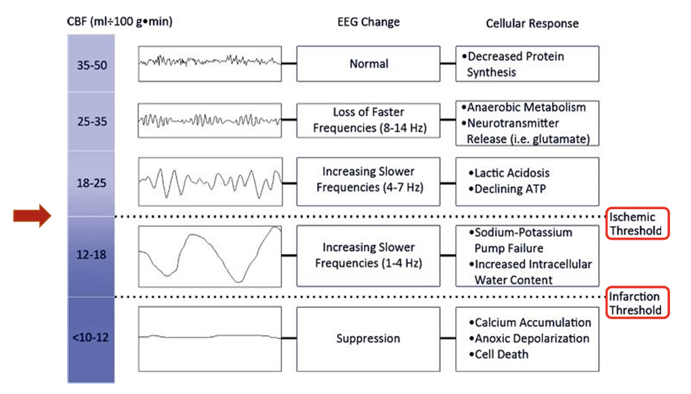
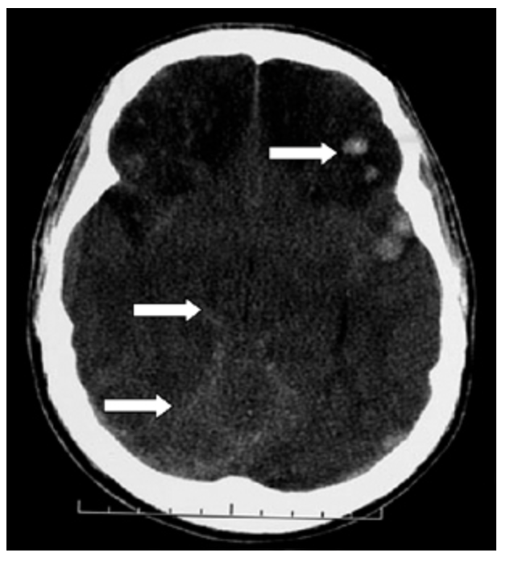

# GC 221 Vertigo, Peripheral and central Lecture ENT

- **Physiology of balance:**
    - <u>Inputs</u> - central integration of visual (70%), proprioceptive (15%), and vestibular (15%) inputs
    - <u>Coordination</u> - integrated within braintem nuclei and cerebellum
    - <u>Outputs</u> - efferent stimulation of muscles of the limbs and trunk to maintain balance
- Anatomy of vestibular system:
    - Peripheral - vestibule (saccule, utricle), semicircular canals
    - Central - brainstem and cerebellum
- Semicircular canals - horizontal (lateral), superior and posterior, at right angles at each other - base connected to vestibules
- **Definition and terminology:**
    - <u>Vertigo</u> - hallucination of movement (felt in the head) despite completely staying still, which may be rotatory or translational, localising to the central or periphereral vestibular systems
    - <u>Disequilibrium</u> - impaired balance w/o illusion of movement, which is associated w/ disordered inputs from vision, proprioception, and minor contributions to the vestibular system
    - <u>Syncope and pre-syncope</u> - pathologically defined as faintness or transient LOC due to global cerebral hypoperfusion
    - <u>Lightheadedness</u> - non-specific feeling, but never a/w LOC or falls
- **DDx of vertigo:**
    - **Peripheral vertigo:**
        - **Inner ear disorders:**
            - <u>Idiopathic</u> - benign paroxysmal positional vertigo (BPPV), Meniere's disease, superior canal dihiscence, perilymph fistula
            - <u>Infective</u> - labyrinthitis, syphilis
            - <u>Iatrogenic</u> - ototoxicity
            - <u>Traumatic</u> - temporal bone fracture, vestibular concussion
        - **Disorder of CN VIII** - acute vestibular failure (vestibular neuronitis), vestibular paroxysmia
    - **Central vertigo:**
        - <u>Vascular</u> - vertebrobasilar insufficiency/ TIA/ posterior circulation stroke
        - <u>Inflammatory</u> - multiple sclerosis
        - <u>Neoplastic</u> - tumours at the cerebropontine angle
- **Differentiation between peripheral and central vertigo:**
    - 
- Clinical approach to vertigo:
    - Is it really vertigo? if so:
        - Central?
        - Peripheral?
    - Characteristics - floating (like on a boat), rotatory, blackout (LOC)
    - Duration of episodes - few seconds, minutes, \> 20min, hours, days
    - Precipitating factors - head movements vs supine, neck extension, laterality of sleep, bright light
    - Associated Sx:
        - Otological Sx - hearing loss, tinnitus, aural fullness, aura
        - Headaches, N/V
    - PMH
    - Drug Hx
- Dizziness - non-specific term encompassing:
    - Lightheadedness - most common but actually causes falls - many metabolic causes (e.g. HypoG, Anaemia, Dehydration, Drugs, Hyperventilation etc.)
    - Pre-syncope or syncope - impending LOC from generalised cerebral hypoperfusion
    - Disequilibrium - impaired balance and gait without abnormal head sensation (腳浮浮 w/o sensation of spinning):
        - Multisystem degeneration:
            - Peripheral sensation
            - Proprioception - e.g. OA, peripheral neuropathies
            - Vision
    - Vertigo - Hallucination of motion and movement which is rotatory caused by lesion in the vestibular system (peripheral vs central)

## Vertigo

- Etiology of vertigo:
    - Peripheral vertigo:
        - Semicircular canal and vestibule - BPPV, labyrinthitis, Meniere's disease, superior canal dishecence, perilymph fistula, ototoxicity, trauma (temporal bone fracture/ vestibular concussion), vestibular insufficiency
        - Vestibulocochlear nerve - vestibular neuronitis, vestibular paroxysmia. ?acoustic neuroma
    - Central vertigo:
        - Vascular - Vertebrobasilar insufficiency, Stroke, TIA
        - Tumors in cerebellum
        - MS
        - Vestibular migraine
        - Drugs
        - Epilepsy
- How to differentiate between peripheral vs central vertigo in Hx and P/E (see lecture notes)
    - Nystagmus:
        - Peripheral - unidirectional (horizontal, or torsional, never vertical), and fatiguable (slows down after a few oscilles), suppressible on visual fixation (focus on point)
        - Central - multidirectional including vertical, but not fatigable, not suppresible on visual fixation

### Benign Paroxysmal Positional Vertigo

- Definition:
    - Benign - self-limiting (80% spontaneously resolves)
    - Paroxysmal - recurrent
    - Positional - related to head position (vertical and horizontal rotational)
    - Vertigo - transient, ususally \< 1 min
- Pathophysiology of BPPV - canalithiasis:
    - Otoconia (CaCO3 in utricles) dislodged
        - Idiopathic
        - Head trauma
        - Infection - vestibular neuronitis, labyrinthitis
    - into semicircular canal:
        - Posterior canal (85%)
        - Lateral canal (15%)
        - Superior canal (rare)
- Dx of BPPV - Dix Hallpike maneuver:
    - Technique - head turned 45 degrees and then immediately lie down into head hanging position (Maximally stimulate posterior canal)
    - +ve test:
        - Torsional nystagmus w/ latency of 1-5s duration \< 30s and fatiguable
- Mx - Epley's Maneuver to return otoconia to utricles:
    - Technique - Dix Halpikes and then turn 90 degrees to the opposite side, and roll on shoulder
    - Post Tx - advise avoid sudden head movements, sleep in 45 degree prop up position, avoid sleeping on side of bad ear

### Meniere's disease

- **Definition** - idiopathic endolymph hydrops
- **Epidemiology:**
    - <u>Prevalence</u> - 0.1% (20% if +ve FHx)
    - <u>Demographic</u>:
        - Age - onset \< 65y
        - Sex - female preponderance (F:M = 3:2)
- **Pathophysiology** - endolymphatic hydrops:
    - <u>Accumulation of endolymph in scala media within cochlea</u> - excessive endolymph volume results in displacement of membrane towards scala tympani, and subsequently unknown irritation of CNVIII that is not fully understood
- **Clinical features of Meniere's disease** - recurrent spontaneous episodes lasting hours:
    - <u>Vertigo</u> - recurrent attacks of vertigo episodes lasting for 20-24h
    - <u>Aural Sx</u> - sensation of tinnitus, or aural fullness in the affected ear in association w/ attacks, but will fluctuate over the disease course
    - <u>Sensorineural hearing loss</u> - progressive SNHL a/w low-tone that is documented on PTA
    - Hearing loss (low tonei SNHL)
    - Tinnitus or aural fullness
- **Dx** - diagnostic criteria of Meniere's disease: 

- **Ix** - PTA to confirm Dx (low-tone SNHL in affected ear)
- **Mx:**
    - **Principles of Mx:**
        - <u>Symptomatic relief of acute episodes</u> - vestibular sedatives and antiemetics to reduce Sx
        - <u>Chronic Mx</u> - lifestyle or ENT interventions +/- surgical intervention
    - **Mx of acute episodes:**
        - <u>Vestibular sedatives</u> - diazepam, cinnarazine
        - <u>Antiemetics</u> - maxolon, ondasetron
    - **Lifestyle modifications:**
        - Diurestics
        - Low salt diet
    - **Meniette device:**
        - <u>Principles</u>:
            - Tympanotomy and gromette tube insertion
            - Air pulses generated by device transmitted to inner ear to regulate endolymph pressure
    - **Surgical intervention** - if progressive Sx failing medical Tx:
        - Endolymphatic sac decompression
        - Labyrinthectomy
        - Vestibular neurectomy

### Vestibular neuritis

- Definition - acute unilateral peripheral vestibular failure postulated to be caused by viral infection of vestibular nerve
- Pathophysiolgy:
    - Inflammation of vestibular nerve likely viral origin
    - Prior Hx of URTI?
- Clinical features:
    - Severe vertigo - lasting for days
    - Severe N/V
    - Imbalance - subsequent weeks to months
    - No hearing loss
- Mx:
    - Vestibular sedatives
    - Early mobilisation and vestibular rehabilitation
    - Natural Hx - resolves by 3 mo

# GC111 Raised intracellular pressure and hydrocephalus Surgery Lecture

### Raised intracranial pressure

- **Definition of ICP** - Pressure measured at the <u>external acoustic meatus</u> (roughly at level of <u>foramina of Monro</u>) relative to atmospheric pressures:
    - <u>Normal ICP</u> - 10-15 mmHg in adults, 1-6 mmHg in infants, subatmospheric in adults
    - <u>Raised ICP</u> - \>= 20 mmHg definitely abnormal in adults
- **Etiology of raised ICP:**
    - **Space-occupying lesion:**
        - <u>Intracranial haemorrhage</u> - extradural haematoma, subdural haematoma, intracerebral haemorrhage
        - <u>Cerebral tumours</u> - particularly posterior fossa lesions or high-grade gliomas
        - <u>Infective causes</u> - brain abscesses, tuberculoma, cysticercosis, hydatid cyst
    - **Hydrocephalus** - communicating vs non-communicating hydrocephalus
    - **Cerebral oedema:**
        - <u>Local oedema</u> - post-cerebral infarction (cytotoxic oedema), local tumour (vasogenic oedema)
        - <u>Diffuse oedema</u> - meningoencephalitis, trauma, SAH, metabolic (e.g. hypoNa, HE)
    - **Hyperaemia** - e.g. idiopathic intracranial HTN
    - **Venous congestion** - cerebral venous thrombosis, trauma (e.g. depressed fractures overlying sinuses)
- **Pathophysiology of raised ICP** - clinical manifestation is dependent on rate of development:
    - **Monro-Kellie-Burrows Doctrine** - the skull is a rigid structure with fixed internal volume (1400-1700 mL) encompassing brain parenchyma (80%), CSF (10%), blood (10%):
        - <u>Principles</u> - Increase in volume of one component necessitates displacement of other structures (out of the skull), or an increase in ICP
        - <u>Intracranial compliance</u> - compliance of the intracranial compartment (dV/dP) decreases w/ increasing volume 
        
        - <u>Changes in volume of each component</u>:
            - **Brain parenchyma** - tumour, cerebral oedema
            - **Blood** - haematoma, hyperaemia, venous congestion
            - **CSF** - hydrocephalus
        - <u>Venous blood and CSF as buffering system</u> - venous blood and CSF can rapidly decrease to compensate for a mass effect to a limited extent, <u>maintaining normal ICP</u>

    
    
    - **Cerebral ischaemia** - cerebral ischaemia ensues when cerebral blood flow (CBF) decreases below a threshold, resulting in global hypoperfusion:
        - <u>Determinants of CBF</u> (N ~ 40-65 ml/min/100g of normal tissue) - CBF = CPP / CVR, i.e. Ohm's law:
            - **Cerebral perfusion pressure** (CPP) - dependent on MAP - ICP (N ~ 60-80 mmHg)
            - **Cerebrovascular resistance** (CVR) - vascular resistance of the cerebral vasculature
        - <u>Physiological autoregulation of CBF</u> - maintained at steady state for a wide range of CPP (50-140 mmHg), but this mechanism is lost in pathological states (e.g. stroke, trauma)
        - <u>Neuronal response to ischaemia</u> (**threshold at \< 18 ml/min/100g**) - neurons are extremely sensitive to ischaemia as they are obligate aerobes (unable to recycle lactate), which cause cellular responses:
            - **Glutamate release** - Na/K pump failure leads to automatic depolarisation (Ca influx) and release of glutamate, resulting in **excitotoxicity** by further increasing cerebral metabolic demand
            - **Cytotoxic oedema** - pump failure results in loss of ionic gradient, resulting in **astrocytic swelling**
            - **Other cellular responses** - e.g. calcium influx, energy failure, DNA damage, all resulting in **rapid cell death**

      
      
    - **Coning** - herniation of brain parenchyma due to pressure gradients developing between two cranial vaults:
        - <u>Temporal coning</u> (midline shift)
        - <u>Central transtentorial herniation</u>
        - <u>Uncal herniation</u>
        - <u>Tonsillar coning</u>
- **Clinical features of raised ICP** - rapidly progressive due to Monro-Kellie-Burrows Doctrine:
    - **Headaches** - mediated by pain fibres of CN V in dura and blood vessels:
        - <u>Exacerbating factors</u> - supine (reduced venous drainage), straining, e.g. cough, sneezing (transient increased ICP)
        - <u>Relieving factors</u> - vomiting (post-emetic hyperventilation), hyperventilation
    - **Nausea and vomiting** - direct stimulation of emetic centre, and transiently causes relieve of headaches due to transient hyperventilation
    - **Diplopia and visual impairment** (late feature) - arising most commonly from CN VI palsy, CN III palsy
    - **Decreasing states of consciousness** (documented by GCS) - late feature typically reflecting herniation syndromes
    - **Papilloedema** - late clinical sign on fundoscopy which can be documented by decrease in VA in both eyes
    - **Cushing's triad** (Bradycardia, HTN, respiratory depression) - late feature caused by brainstem compression
    - **Clinical features related to cause:**
        - <u>Focal neurological S/S</u>
        - <u>False localising signs</u> - e.g. unilateral/ bilateral 6th nerve palsies, contralateral 3rd nerve palsy
        - <u>Seizures</u> - focal onset +/- generalised spread
- **Initial Ix of suspected raised ICP** - demonstrated from compatible Hx and imaging findings:
    - **CT Brain:**
        - **CT findings** - demonstration of raised ICP (non-sensitive) and etiology:
            - <u>Midline shift</u> - shift of midline to contralateral side suggestive of pressure gradient between two sides
            - <u>Effacement of basilar cisterns</u> (Loss of neurosurgical smile) - caused by central transtentorial herniation resulting in obliteration of basal cistern

      
      
    - **Invasive ICP monitoring** - non-inferioriority of serial clinical and radiological assessment compared to continuous ICP monitoring demonstrated in BEST TRIP trial, indicated in certain conditions (see below)
- **ICP monitoring:**
    - <u>Indications</u> - use when necessary due to risk of severe CNS complications:
        - 1\. Clinical assessment no feasible - unreliable GCS due to sedation or intubation
        - 2\. Comatose - GCS \<=8
        - 3\. Evolving disease condition
    - <u>Relative C/I</u>:
        - Bleeding tendancy
        - Awake patient
    - <u>Types of monitors</u>:
        - **External venricular drain** (intraventricular) - surgically placed monitoring catheters into ventricles which is both diagnostic and therapeutic through drainage of CSF (risk of infection ~ 20%)
        - **Intraparenchymal devices** - thin cable with transducers at tip placed of brain parenchyma
        - **Subarachnoid bolts**
        - **Epidural monitors**
- **Mx:**
    - **Principles of Mx** - Mx of raised ICP requires maintenance of CPP and CBF to prevent cerebral ischaemia:
        - <u>Resuscitation always</u> - Secure airway, breathing, an circulation to maintain DO especially to the brain
        - <u>Initial measures for raised ICP</u> - Head elevation fluid Mx, BP control, hyperventilation, osmotherapy
        - <u>Additional medical Mx</u>:
            - Sedation
            - Glucose control
            - Mx electrolytes
            - Prevention of seizures
            - Prevention of pyrexia
            - Glucocorticoids for vasogenic oedema
        - <u>Consult neurosurgery</u> - External ventricular drain, surgical removal of SOL, craniotomy, decompressive craniectomy
    - **Head elevation** - optimal of 30 degrees:
        - <u>Optimal positioning</u> - 30 degrees (above heart), and avoid excessive flexion, rotation, and neck collars (if C-spine cleared)
        - <u>MOA</u> - optimise venous outflow without comprimise of CBF
    - **Fluid management** - especially in setting of SIADH after TBI:
        - <u>Regimens</u> - need not to be severely fluid restricted, kept euvolemic and normo-to-hyperosmolar (295-305 mOsm/L) by **avoiding hypotonic saline**
        - <u>Monitoring</u> - Avoid hypoNa, and maintaine serum osmolality
    - **BP control** - maintain CPP at 60-70 mmHg (note absence of autoregulation)
    - **Hyperventilation** (not used liberally):
        - <u>Target</u> - titrate PaCO2 to 3-3.5 kPa
        - <u>MOA</u>:
            - Hypocapnia induces vasoconstriction, reducing ICP
            - Vasoconstriction can reduce CBP
    - **Osmotherapy:**
        - **Mannitol** - e.g. 100 ml 20% i.v.:
            - <u>MOA</u> - Osmotic effect, removing fluid from brain (requires intact BBB) +/- other effects
            - <u>C/I</u> - shock, hyperNa
        - **FUrosemide**
        - **Hypertonic saline**
- Mx:
    - Always resuscitate first - ABC before ICP
    - Medical Mx:
        - Head elevation 30 degree
        - optimise ventilation
        - Maintain MAP
        - Osmotherapy
        - Sedation
        - Optimise electroyte and glucose
        - Prevent/ control seizures
        - Prevent pyrexia
    - Enhance venous drainage - positioning:
        - Avoid neck rotation, remove neck collar if not indicated
        - Head elevation ~30 degrees - too high comprimises CBF
        - Maintain MAP - very tricky due to loss of autoregulation
    - Hyperventilation - to target PaCO2 3-3.5 (not too low):
        - MOA - Increased vasoconstriction, reduce ICP, but causing increased CVR and reduce CBF
    - Medical Tx:
        - Osmotherapy - mannitol, furosemide, hypertonic saline
        - Glucocorticoids - only in vasogenic oedema, but never in TBI and shock
        - Barbiturate coma
        - Therapeutic hypothermia

### GCS

- **Glasgow Coma Score** (GCS) - objective and reproducible way to assess consciousness
- **Prognistic information regarding GCS** - note that it is a quantitative scale (3-15) but is non-linear:
    - <u>Admission GCS is prognostic</u> - underlies urgency of Tx even if patient is conscious
    - <u>Trends in GCS reflects clinical deterioration or improvement</u> - deteriorating conscious level only occurs in terminal stages of raised ICP
- **Components of GCS** - total GCS is aggregate of each component, but better to report independently (e.g. E1M5V2)
    - <u>Eye opening</u> (E) - max score 4 (opens eyes spontaneously)
    - <u>Motor response</u> (M) - max score 6 (obeys verbal commands)
    - <u>Verbal response</u> (V) - max score 5 (oriented in person, space and time)

  
  
- **Assessment of eye component** - ask patient to open eye:
    - <u>E4</u> - eye opens spontaneously
    - <u>E3</u> - eye opens to speech
    - <u>E2</u> - eye opens to pain
    - <u>E1</u> - eye closed
- **Assessment of motor response** (apply painful stimulation over CN V territory) - prognostic and indicative of extent of injury:
    - <u>M6</u> - obeys commands
    - <u>M5</u> - localises to pain (UL raised above clavicle)
    - <u>M4</u> - flexion/ withdrawal to pain but unable to raise above clavicle
    - <u>M3</u> - abnormal flexion response (decorticate posture resulting in uninhibited rubrospinal response)
    - <u>M2</u> - abnormal extension response (decerebrate posture resulting in loss of rubrospinal response)
    - <u>M1</u> - no limb response

   
  
- **Assessment of verbal response** (ask patient to orient in person, space, or time):
    - <u>V5</u> - oriented to person, space or time
    - <u>V4</u> - confused, i.e. able to understand question but gives wrong answers
    - <u>V3</u> - inappropriate words
    - <u>V2</u> - incomprehensible sounds\_
    - <u>V1</u> - no verbal response
- **Pitfalls of GCS:**
    - **Component specific limitations:**
        - <u>Limitations of eye component</u> - swollen eyes post-trauma
        - <u>Limitations of motor component</u> - effects of sedatives, paralysis, spinal cord injury, limb injury
        - <u>Limitations of verbal component</u> - intubation/ tracheostomy (VT), language barrier
    - **Overall limitations of GCS:**
        - <u>Effects of shock</u> - GCS in shock is not prognostic, as patient will regain consciousness after resuscitation (use post-resuscitation GCS as prognostic marker)
        - <u>Ambuguity of total score</u> - different combinations can lead to same total score (better to report each individual components)
- **Classification of severity of brain injury by GCS:**
    - <u>Mild brain injury</u> - GCS 13-15
    - <u>Moderate brain injury</u> - GCS 9-12
    - <u>Severe brain injury</u> - GCS \<= 8
- **Indications of ICP monitoring:**
    - <u>Comatosed patients</u> - GCS \<= 8 (as require intubation and hence GCS is unreliable)
    - <u>Unreliable GCS with suspected raised ICP</u> - e.g. sedative, muscle paralysis, ventilation
    - <u>Evolving clinical status</u>

### Hydrocephalus

- **Definition** - Excessive accumulation of CSF in the brain due to increased production, flow obstruction, or reduced absorption
- **Normal CSF dynamics** - production, circulation, absorption:
    - <u>Production</u> (~450 ml/d) - produced by choroid plexus in the ventricles
    - <u>Circulation</u> - from lateral and 3rd ventricles, through cerebral aqueduct to 4th ventricles, exiting via foramina of Luschka and Magendie into subarachnoid space
    - <u>Absorption</u> - by arachnoid villi in the dural venous sinuses

  
  
- **Etiology of hydrocephalus** - congenital vs acquired:
    - **Congenital causes:**
        - Aqueductal stenosis
        - Atresia of various foramina
        - Chiari malformations
        - Dandy-Walker syndrome
        - Congenital mass lesions - e.g. benign intracranial cysts, vein of galen aneurysms
        - Congenital CNS infections
        - Neural tube defects
        - Craniofacial abnormalities
    - **Acquired causes:**
        - <u>Increased CSF production</u> - e.g. choroidal plexus papilloma
        - <u>Decreased CSF absorption</u> - inflammation (e.g. meningitis), SAH
        - <u>CSF flow obstruction</u> - mass lesion in posterior fossa (e.g. tumours, colloid cyst of 3rd ventricles, abscess, haematoma)
- **Clinical presentation of hydrocephalus** - variable (from insiduous onset to sudden death), and depends on age, and speed at which and degree to which hydrocephalus develops:
    - **Presentation in infants** - large head, tense fontanelle. sunset eyes, dilated scalp veins
    - **Presentation in adults:**
        - <u>Sx of raised ICP</u> - headache, N/V, visual disturbances, deterioration of consciousness
        - <u>Focal neurological deficits</u> - suggestive of cause
- **Ix and diagnostic evaluation** - neuroimaging on clinical suspicion:
    - **Neuroimaging** - for diagnosis of hydrocephalus, assessment of etiology, and differentiation between communicating vs non-communicating hydrocephalus:
        - **CT brain:**
            - <u>Findings suggestive of hydrocephalus</u> - 1) ventricular dilatation, 2) periventricular oedema, 3) altered morphology
            - <u>Differentiation between communicating and non-communicating hydrocephalus</u>:
                - **Communicating hydrocephalus** - hydrocephalus not caused by flow obstruction in the ventricular system (LP diagnostic and therapeutic)
                - **Non-communicating hydrocephalus** - hydrocephalus caused by flow obstruction in ventricular system especially by mass lesion (LP contra-indicated)
        - **MRI CSF studies** - can be obtained
    - **Lumbar puncture** - performed if communicating hydrocephalus, which is diagnostic and therapeutic:
        - <u>Diagnostic</u> - measurement of opening pressure
        - <u>Therapeutic</u> - trial drainage to offer symptomatic relief
- **Mx of hydrocephalus:**
    - **Principles of Mx:**
        - <u>Resuscitation first</u> - secure ABC as per ATLS
        - <u>Temporising measures</u> - LP (for communicating) or EVD (if doubtful or deteriorating)
        - <u>Definitive meausures</u>:
            - Treat underlying cause - e.g. tumour removal/ haematoma removal
            - CSF shunting - e.g. ventriculoperitoneal, ventriculoatrial
            - Endoscopic 3rd ventriculostomy
- **Complications of CSF shunting:**
    - Infections - primary or secondary
    - Recurrent hydrocephalus - due to blockade, dislodgement/ fracture
    - Chronic subdural haematoma - due to over-shunting (esp. bleeding tendancy)
    - Postural headache (worse when erect) 0 dye
    - Slit ventricle syndrome
    - Nephritis (VA shunting)
    - Bowel perforation (VP shunting)
