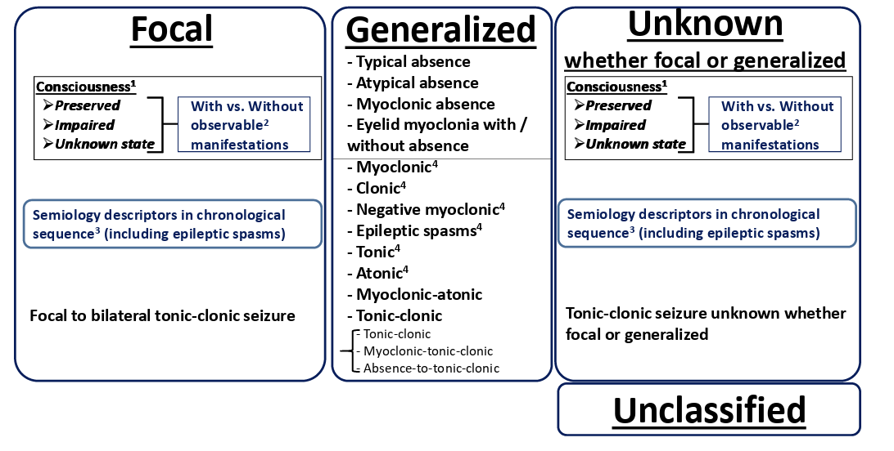

# GC81 Seizure and Loss of Consciousness, Delirium and Encephalopathy, Epilepsy, Coma and Brain death, care of unconscious patients, electrophysiology 1 Medicine Lecture

## Consciousness and it's disorders

- **Definition of consciousness** - state of awareness of self and environment, crudely differentiated into two components, arousal and awareness:
    - <u>Arousal</u> - awoken state enabled by the brainstem reticular activating system, enabling primitive set of responses (considered a preliminary condition for awareness)
    - <u>Awareness</u> - process requiring high level integration of multiple sensory inputs by the cortex
- **Disorders of consciousness** - different description of disorder of consciousness:
    - <u>Coma</u> - arbitrarily defined as GCS \<= 8
    - <u>Vegetative state</u> - a state with minimal brainstem function and cortical function, with loss of awareness of the environment, but **retained sleep-wake cycle**
    - <u>Minimally conscious state</u> - inconsistent, partial, fluctuating conscious levels implying retention of awareness and intact brainstem function
    - <u>'Locked-in' syndrome</u> - mimics disorders of consciousness with complete paralysis of the body except for eye movement, but with preserved hemispheric function and hence fully conscious
    - <u>Altered mental status/ Delirium</u> - acute change in awareness, cognition, or attention
- **Etiology of coma:**
    - **Neurological disease** - structural or functional primary neurological disease resulting in brainstem damage, or sizable cortical lesion:
        - <u>Traumatic brain injury</u> - cerebral contusion, epidural haematoma, subdural haematoma
        - <u>Cerebrovascular disease</u> - ischaemic stroke (esp. brainstem infarction), haemorrhagic stroke (e.g. ICH, SAH), cerebral venous sinus thrombosis
        - <u>CNS infections</u> - meningitis, encephalitis, brain abscess
        - <u>Inflammation</u> - autoimmune encephalitis
        - <u>Sizable mass lesion</u> - e.g. primary brain tumour or metastasis
        - <u>Seizures/ status epilepticus</u> - e.g. epilepsy
        - <u>Other causes of raised ICP</u> - e.g. hydrocephalus
    - **Non-neurological disease** - non-neurological disease causing diffuse neurological function by causing 1) encephalopathy, or 2) cerebral hypoperfusion or hypoxia:
        - **Disorders causing encephalopathy:**
            - <u>Liver failure</u> - hepatic encephalopathy
            - <u>Renal failure</u> - Uraemic encephalopathy
            - <u>Electrolyte disturbances</u> - hyponatraemia, hypercalcaemia
            - <u>Complications of DM</u> - hypoglycaemia, Hyperosmolar coma (DKA, HHS)
            - <u>Endocrine diseases</u> - Addisonian crisis, Myxoedematous coma, thyroid storm
            - <u>Systemic inflammation</u> - e.g. sepsis
            - <u>Wernicke's encephalopathy</u> - thiamin deficiency
            - <u>Toxic causes</u> - alcohol, substance abuse
        - **Disorders causing global cerebral hypoperfusion** - syncope, shock
        - **Disorders causing cerebral hypoxia** - respiratory failure
- **Salient points of Hx** - identify potential causes, e.g. trauma
- **P/E** - rapid clinical assessment:
    - <u>Resuscitation and stabilisation</u> - secure airway, breathing, and circulation
    - <u>Assessment of level of consciousness</u> - GCS
    - <u>General medical examination</u> - any **trauma**, needle sites suggestive of **drug abuse**, rashes, **fever** and focal signs of infection
    - <u>Assessment of brainstem function</u> - pupillary reflexes
    - <u>Assessment of meningism</u> - neck stiffness, Kernig sign, Brudzinski neck sign
- **Initial Ix:**
    - <u>Blood test</u> - routines (CBC, LRFT, ESR, CRP, clotting profile, TFT +/- morning cortisol), random glucose, toxicology
    - <u>Neuroimaging</u>
    - +/- LP, EEG
- **Initial Mx:**
    - <u>Resuscitation and stabilisation</u> - ABC + intubation if GCS \<= 8 (cannot protect airway)
    - <u>Rapid diagnosis of cause</u> - specific Mx depending on cause

## Seizures, Status Epilepticus, and Epilepsy

### Seizures

- **Definition** - sudden bursts of electrical activity in the brain leading to changes in movement, behavior, feeling and/or consciousness
- **Pathophysiology of seizures** - incompletely understood:
    - <u>Abnormal spread and neuronal recruitment resulting in synchronous brain activity</u> - caused by 1) increased excitatory transmission, 2) failure of inhibitory mechanism, 3) changes in intrinsic neuronal properties
- **DDx of seizures** - certain conditions mimic seizures:
    - <u>Syncope</u> - TLOC caused by global cerebral hypoperfusion may manifest as syncopal myoclonus in up to 20% patients w/ syncope
    - <u>Panic attacks and hyperventilation</u> - abrupt onset of intense feeling of dread, where abnormal movements and sensation, i.e. carpopedal spasm and perioral numbness are in fact caused by **functional hypocalcaemia due to respiratory alkalosis**
    - <u>Psychogenic non-epileptic seizures</u> - psychiatric history manifesting as out-of-phase limb movements and pelvic thrusting
    - <u>Transient global amnesia</u> - prominent anterograde amnesia with no altered consciousness or neurological deficits
    - <u>Transient ischaemic attack</u> - focal neurological S/S that are predominantly -ve Sx (no abnormal movements)
    - <u>Migraine aura</u> - characterised by headache after aura
- **Principles of classification of seizures:**
    - <u>By Provacation</u> - provoked vs unprovoked seizures:
        - **Provoked seizures** - non-epileptic seizures due to acute focal/ diffuse brain insult
        - **Unprovoked seizures** - seizures occuring w/o an acute precipitating factor (e.g. by a chronic progressive injury or a static injured site)
    - <u>By site of onset</u> - ILAE 2017 classification of seizure types (see below)
    - <u>By etiology</u> - epileptic vs non-epileptic
- **International League Against Epilepsy (ILAE) Classification of Seizure Types** - based on first whether there is focal onset, and second whether seizure conforms to one of the recognised patterns (i.e. semiology of seizures):
    - **Focal seizures** - caused by abnormal localised cortical activity
    - **Generalised seizures** - caused by abnormal generalised cortical activity
    - **Seizures of unknown whether focal or generalised**
    - **Unclassified**

  
  
- **Focal seizures** - seizures caused by localised lesions resulting in localised cortical awareness:
    - **Classification and clinical features:**
        - **Focal aware seizures** (simple partial seizures) - Sx depend on the location involved, and may be aura if followed by focal impaired awareness seizures or generalised seizures:
            - <u>Frontal lobe</u> - focal motor seizure (focal abnormal movements), expressive aphasia, olfactory hallucinations, hyperkinetic seizures
            - <u>Parietal lobe</u> - focal somatosensory seizures, visual illusions
            - <u>Temporal lobe</u>:
                - Autonomic Sx - epigastric 'rising' sensation
                - Cognitive and psychiatric Sx - deja/ jamais vu, depersonalisation, specific emotions (e.g. fear)
                - Sensory Sx - gustatory and olfactory Sx, visual and auditory hallucinations, visual distortions
            - <u>Occipital lobe</u> - visual seizures (e.g. flashes, multicolored shapes, visual field defects)
        - **Focal impaired awareness seizures** (complex partial seizures) - impaired awareness, with altered moveent and automatism due to spread of activity to ipsilateral temporal lobe
        - **Focal to bilateral tonic-clonic seizures** - spread of activity to contralateral hemisphere resulting in secondary generalization
- **Generalized seizures** - seizures caused by abnormal diffuse cortical activity:
    - **Tonic-clonic seizures** - increased rigidity (tonic-phase) and LOC followed by jerking movements (clonic-phase)
    - **Absence seizures** - brief loss of awareness (classically often mistaken for daydreaming or poor concentration in school)
    - **Myoclonic seizures** - brief, single jerks, predominating in the arm
    - **Atonic seizures** - brief loss of muscle tones
    - **Tonic seizures** - generalised increased tone in association w/ LOC
    - **Clonic seizures** - jerky movements but without preceding tonic phase
    - **Myoclonic absence seizures**
    - **Eyelid myoclonia**

### Epilepsy

- **Definition** - brain disorder that causes recurring, unprovoked seizures (defined by \>= 2 unprovoked seizures occuring \> 24h apart)
- **Epidemiology:**
    - <u>Prevalence</u> - ~1% in adults, 2-6% in \>= 65y
    - <u>Incidence</u> - bimodal distribution with age:
        - Childhood - typically idiopathic, genetics, polygenic
        - Elderly - structural neurological disease
- **Classification of epilepsy types and epilepsy syndromes:**
- **Epilepsy syndromes** - defined by specific patterns depending on seizure types, age of onset, and treatment responsiveness

### Epilepsy Syndrome

- **Mesial temporal lobe epilepsy with hippocampal sclerosis:**
    - **Definition** - a electroclinical epilepsy disorder a/w characteristic focal temporal seizures a/w acquired abnormality of the hippocampus
    - **Epideiology** - onset typically in adolescents/ young adults
    - **Etiology** - acquired abnorality in the hippocampus in incompletely understood mechanisms:
        - Genetic
        - Structural
        - Immune
    - **Clinical features** - one of the most common cause of temporal lobe seizures:
        - <u>Seizure types</u> - focal temporal seizures (aware or impaired aware) w/ or w/o secondary generalisation
        - <u>Treatment responsiveness</u> - usually drug-resistant
    - **Ix:**
        - <u>EEG</u> - anterior-to-mid temporal epileptiform discharges
        - <u>MRI</u> - hippocampal sclerosis
    - **Mx** - appropriate ASM (lamotrigine monotherapy to start but usually drug-resistant)
- **Juvenile myoclonic epilepsy:**
    - **Definition** - common idiopathic generalized epilepsy syndrome a/w a history of myoclonic jerks and subsequent development of GTCS
    - **Epidemiology** - characteristically seen in those w/ normal development and cognition:
        - <u>Age of onset</u> - 10-24y
        - <u>Sex</u> - female preponderance
    - **Etiology** - idiopathic (polygenic implications)
    - **Clinical features** - various seizure types progressing from focal to GTCS:
        - <u>Initial manifestations</u> - myoclonic seizures usually within first hour of waking up, which may not present, but is usually identified on Hx taking
        - <u>Manifestation resulting in clinical presentation</u> - GTCS
    - **Ix:**
        - <u>EEG</u> - 3-3.5Hz spike wave discharge
        - <u>MRI</u> - normal
    - **Mx** - ASM:
        - <u>First-line medication</u> - valprolate (lemotrigine and levetiracetam for women of child bearing age)
        - <u>Other ASMs</u> - phenytoin or carbamazepine may worsen myoclonus
- **Epilepsy of generalized tonic-clonic seizures alone:**
    - **Definition** - previously known as epilepsy with grand mal seizures
    - **Epidemiology:**
        - Onset typically 10-25y
        - Normal development and cognition
    - **Etiology** - idiopathic (polygenic implications)
    - **Clinical features** - GTCS that is precipitated by:
        - Fatigue
        - Sleep deprivation
        - Alcohol
    - **Ix:**
        - <u>EEG</u> - 3-3.5 Hz spike-wave discharge
        - <u>MRI</u> - normal
    - **Mx** - valprolate (lemotrigine/ levetiracetam for women of child-bearing ages)

### Management of Epilepsy

- **Driving regulations in HK:**
    - Report to transport department
    - Usually cannot drive indefinitely, as no specific regulations wto when patients w/ epilepsy can drive
- **Risk of sudden unexpected death w/ epilepsy:**
    - ~ 1/1000
    - Risk reduced w/ better control of epilepsy
- **Avoid activities a/w increased risk of injury if seizure occurs:**
    - Opperation of high-risk equipment
    - Working at heights
    - Hiking alone
    - Swimming alone
    - Cooking over fire
    - Driving
- **Classification of anti-seizure medications by MOA** - often multiple MOA other than the primary pathway:
    - <u>Effects on Na channel</u> - carbamazepine, lamptrigine, phenytoin
    - <u>Effects on Ca current</u> - ethosuximide
    - <u>Effects of GABA activity</u> - benzodiazepine, phenobarbital
    - <u>Effects on glutamate receptors</u> - topiramate
    - <u>Effects on synaptic vesicle proteins</u> - levatiracetam
- **Classification based on spectrum:**
    - <u>Broad-spectrum ASM</u> - works for both focal and generalised epilepsies:
        - Valproate
        - Lamotrigine
        - Levetiracetam
        - Topiramate
        - Clobazam
    - <u>Narrow-spectrum ASM</u> - works for selected focal onset epilepsies (older drugs):
        - Carbamazepine/ Oxycarbazepine
        - Phenytoin
        - Phenobarbitone
        - Lacosamide
        - Gabapentin/ pregabalin
- **Carbamazepine:**
    - <u>MOA</u> - blockade of voltage-dependent sodium channels:
        - Effective for partial or generalised seizures
        - Aggravate absence or myoclonic seizures
    - <u>Pharmacokinetics</u> - hepatic metabolism:
        - CYP450 inducer - lowers dose of itself, other ASM, **warfarin**, **DOAC**, anti-TB drugs, prednisolone, and **OC pills**
        - Requires increased dose after 1st mo due to inducing own metabolism
    - <u>Caution</u> - check HLAB1502 (+ve a/w increased risk of SJS/TEN)
    - <u>S/E</u>:
        - Somnolence
        - Dizziness
        - Hyponatraemia
        - Cardiac arrhythmia
- **Phenytoin:**
    - <u>Indications</u> - 1L medication for status epilepticus
    - <u>MOA</u> - blockade of voltage-dependent sodium channels:
        - Effective for partial or generalised seizures
        - Aggravate absence or myoclonic seizures
    - <u>Pharmacokinetics</u> - hepatic metabolism:
        - CYP450 inducer - lowers dose of other ASM, **warfarin**, **DOAC**, anti-TB drugs, prednisolone, and **OC pills**
        - Hepatic metabolism limited by CYP450, such that accumulation occurs when enzyme system at saturation ppoint (small change in dose can result in dramatic changes in drug concentration)
        - Protein bound (hypoalbuminaemia can change concentration of unbound)
        - Rapid onset (most common 1L drug for status)
    - <u>S/E</u>:
        - Gingival hyperplasia and coarsening of facial features
        - Hirsutism
        - Hepatotoxiciy
        - Neurotoxicity
        - Dizziness and somnolence
        - Hypocalcaemia
- **Valproate:**
    - <u>MOA</u> - multiple mechanisms:
        - Voltage-depdent Na channels
        - GABA activity
        - Calcium current
    - <u>Pharmacokinetics</u>:
        - CYP enzyme inhibitor - increases dose of other ASM, warfarin, DOAC
        - Highly protein bound
    - <u>S/E</u>:
        - Weight gain
        - Hepatitis
        - Tremors
        - Dizziness and somnolence
- **Lamotrigine:**
    - <u>MOA</u> - blockade of voltage-dependent sodium channels
    - <u>Pharmacokinetics</u>:
        - Hepatic metabolism
        - Urinary excretion
        - Contraceptive failure w/ OC pills
        - Slow in action
    - <u>S/E</u>:
        - Rash and SJS (stop ASAP and seek medical advice if rash occurs)
        - Dizziness and somnolence
- **Levatiracem:**
    - <u>MOA</u> - effects on synaptic vesicle protein
    - <u>Pharmacokinetics</u>:
        - Urinary excretion
        - Metabolism by hydrolysis and not CYP (favoured in patient w/ liver impairment)
    - <u>S/E</u>:
        - Mood manifestations
        - Dizziness and somnolence
