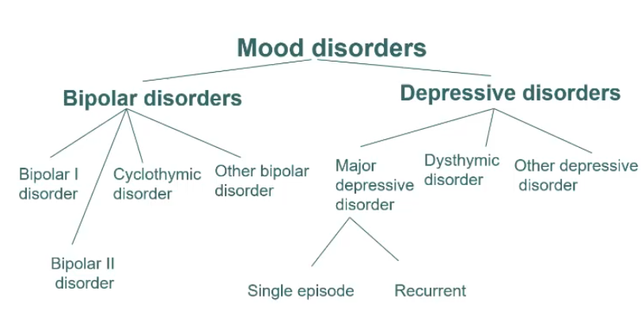
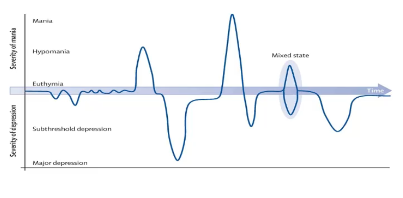

# GC163 I am Superman; Bipolar Disorder Lecture

- **Mood vs Mood disorders:**
    - <u>Normal mood</u> - normal mood is a/w fluctuations, however, highs and lows relative to usual mood are not perasive and do not persist
    - <u>Abnormal state</u> - refers to <u>pervasively</u> high or low mood that differs from the usual mood
    - <u>Mood disorders</u> - abnormal mood states with other associated features resulting in <u>distress</u> and <u>functional impairment</u>

  
  
- **Mood disorder are episodic** - hence diagnosis of mood disorders requires <u>identification of said episode</u>: 

- **DSM-V criteria for manic episode:**
    - A. A distinct period of abnormally and **persistently elevated, expansive or irritable mood** and abnormally and persistently **increased goal-directed activity or energy**, lasting at least **1 week** and present for most of the day nearly every day (or any duration if hospitalisation is necessary)
    - B. During the period of mood disturbance and increased energy or activity, **three or more of the following symptoms** (four if the mood is only irritable) are present to significant degree and **represent a noticeable change from usual behaviour**:
        - Inflated self-esteem or grandiosity
        - Decreased need for sleep (e.g., feels rested after only 3 hours of sleep)
        - More talkative than usual or pressure to keep talking
        - Flight of ideas or subjective experience that thoughts are racing
        - Distractibility (i.e., attention too easily drawn to unimportant or irrelevant external stimuli), as reported or observed
        - Increase in goal-directed activity (either socially, at work or school, or sexually) or psychomotor agitation (i.e., purposeless non-goal-directed activity)
        - Excessive involvement in activities that have a high potential for painful consequences (e.g., engaging in unrestrained buying sprees, sexual indiscretions, or foolish business investments)
    - C. The mood disturbance is sufficiently severe to cause **marked impairment in social or occupational functioning** or to **necessitate hospitalization** to prevent harm to self or others, or there are **psychotic features**
    - D. The episode is not attributable to the physiological effects of a substance (e.g., a drug of abuse, a medication, other treatment) or to another medical condition
- **DSM-V criteria for hypomanic episode:**
    - A. A distinct period of abnormally and persistently **elevated, expansive, or irritable mood** and abnormally and **persistently increased activity or energy**, lasting at least **4 consecutive days** and present most of the day, nearly every day
    - B. During the period of mood disturbance and increased energy or activity, **three or more of the following symptoms** (four if the mood is only irritable) are present to significant degree and **represent a noticeable change from usual behaviour**:
        - Inflated self-esteem or grandiosity
        - Decreased need for sleep (e.g., feels rested after only 3 hours of sleep)
        - More talkative than usual or pressure to keep talking
        - Flight of ideas or subjective experience that thoughts are racing
        - Distractibility (i.e., attention too easily drawn to unimportant or irrelevant external stimuli), as reported or observed
        - Increase in goal-directed activity (either socially, at work or school, or sexually) or psychomotor agitation (i.e., purposeless non-goal-directed activity)
        - Excessive involvement in activities that have a high potential for painful consequences (e.g., engaging in unrestrained buying sprees, sexual indiscretions, or foolish business investments)
    - C. The episode is associated with an **unequivocal change in functioning** that is uncharacteristic of the individual when not symptomatic
    - D. The disturbance in mood and the change in functioning are **observable by others**
    - E. The episode is **not severe enough to cause marked impairment in social or occupational functioning** or to necessitate hospitalization. If there are psychotic features, the episode is, by definition, manic
    - F. The episode is not attributable to the physiological effects of a substance (e.g., a drug of abuse, a medication, other treatment)
- Drugs that cause manic Sx:
    - Steroids
    - L-dopa
    - Stimulants
    - Antidepressants
    - ECT (in those with bipolar spectrum disorders)
    - Cocaine and amphetamine
- Medical conditions cause manic Sx:
    - Frontal lobe lesions
    - Hyperthyroidism
    - Cushing's Syndrome
- Dx - Hx, collateral Hx from family and frields, screening instruments (Mood Disorder Questionaire, HCL-32)
- What is severe manic episode - manic episode where:
    - Requires hospitalisation
    - Psychotic symptoms - mood congruent or mood incongruent
    - Severe overactivity
    - Bizarre behavior
    - Excessive spending
    - Incoherent speech
    - Disorganized thinking
    - Mixed episode
- Assess severity of mania and hypomania - young mania rating scale (YMRS)
- Psychiatric comorbidity of bipolar disorder - see slides on studies
- Etiology - multifactorial:
    - Biological and genetic
    - Environmental
- **Natural Hx of bipolar disorders** - episodic with recovery in between episodes:
    - **Nature of episodes** - individual patients have a predominant polarity
    - **Recovery from mood Sx** - most typically recover:
        - <u>Manic episodes</u> - manic episodes will resolve w/ or w/o treatment (median duration 4-6mo if untreated), although may already result in catastrophic consequence (e.g. financial difficulties)
        - <u>Depressive episodes</u> - will eventually recover, but residual symptoms are more common
    - **Functional recovery** - functional recovery lags substantially behind recovery from symptoms, especially w/ respect to occupational recovery (30% show severe impairment in work role function in between episodes)
    - **Risk of relapse** - 40% relapse within 2y despite Tx:
        - <u>Rate of relapse</u> - average 4 major episodes in first 10 years, and subsequently increasing frequency to around 1 episode per year (note rapid cyclers \>= 4 episodes/y)
        - <u>Poor prognostic factors</u>:
            - Mixed episodes
            - Rapid cyclers
            - Previous relapse
- Conception of staging:
    - Neuroprogressive theory - worse prognosis with frequent relapse, increased risk of future <u>dementia</u>
    - Stage 1 vs 2 vs 3
- **Principles of Mx:**
    - <u>General measures</u> - correct Dx, illness acceptance and Tx adherance, familial psychoeducation, pharmacological and psychosocial Tx
    - <u>Phase-specific Tx</u> - dependent on most recent episodes:
        - Mx of acute mania
        - Mx of acute depressive episode
        - Mx of stable bipolar
        - Maintenance and prophylactic Tx
        - Tx in special situations - e.g. pregnancy, child and adolescent, elderly
    - <u>Mx of comorbidities</u> - including psychiatric and medical
- **Mx of acute mania** - CANMAT guideline:
    - **Selection:**
        - <u>Mood stabilisers</u> - lithium, valproate
        - <u>Atypical antipsychotic</u> - quetiapine, risperidone, aripiprazole, palliperidone, asenspine
    - **Approach:**
        - <u>Initial therapy</u> - montherapy on mood stabilisers
        - <u>Subsequent therapy</u> - mood stabiliser + atypical antipsychotic
        - <u>Role of electroconvulsive therapy</u> - only if in need of rapid response (e.g. high violence risk)
- **Mx of acute bipolar I depression:**
    - **Caution:**
        - Risk of mood switch to manic episode if put on SSRI
        - Increased suicidal risk
    - **Selection:**
        - Lithium (0.8-1.2 mEq/L)
        - Lamotrigine (200 mg/d)
        - Quetiapine (300 mg/d)
        - Lurasidone
        - Mood stabilisers + Lurasidone
    - **Approach:**
        - <u>Initial therapy</u> - monotherapy w/ lithium, lamotrigine, or quetiapine
        - <u>Subsequent therapy</u> - combination therapy or add on SSRI to monotherapy
        - <u>Role of electroconvulsive therapy</u> - for patients w/ high suicidal risk
- **Mx of acute bipolar II depression:**
    - **Selection:**
        - <u>First line</u> - quetiapine
        - <u>Second line</u> - lamotrigine, lithium, antidepressants (e.g. setraline, venlafaxine)
        - <u>Third line</u> - valproate
- **Prophylactic Tx for stable bipolar** - reduced recurrence rate:
    - <u>Indications</u> - generally high recurrence rate:
        - Established bipolar disorder w/ recurrent mood episodes
        - Single severe episodes w/ suicidal attempts, psychotic episodes and significant functional impairments
    - <u>Prophylaxis for bipolar I</u> - lithium, valpropate or quetiapine
    - <u>Prophylaxis for bipolar II</u> - quetiapine, lithium, or lamotrigine

# GC170 Schizophrenia and related psychosis Lecture

- Principles of psychosis:
    - Psychosis - out of reality, hallmark of severe mental disorders (cf neurosis)
    - Syndrome characterized by the following symptoms:
        - Delusions
        - Hallucination
        - Disorganization
        - Lack of insight
- **Schizophrenia-spectrum and other non-affective psychoses:**
    - <u>Schizophrenia spectrum</u> - includes schizophrenia, schizoaffective disorders, or schizotypal personality disorders
    - <u>Other non-affective psychosis</u> - brief psychotic disorders, or acute and transient psychotic disorders
    - <u>Delusional disorders</u> - classic definition of systematised, likely single-theme delusion that is non-bizzare in nature, w/ no other features of psychosis
- **Epidemiology of schizophrenia and related psychotic disorders:**
    - **Prevalence** - 2-3% of population have psychotic disorders (lifetime risk of schizophrenia ~1% classically, likely lower)
    - **Incidence** - 15.2/100,000/y (varied geographically, some socio-environmental factors e.g. urbanicity higher risk, migrants of ethnic minorities)
    - **Demographic** - onset at late adolesence and early adulthood for schizophrenia (may be later for non-schizophrenic psychosis), male preponderance (1.4:1), men have earlier onset:
        - <u>Age</u> - onset of schizophrenia usually occurs in late adolescence and early adulthood (may be later for non-schizophrenic psychosis):
            - Men typically have earlier onset of psychosis than F (bimodal distribution)
            - Estrorgen may have mild anti-psychotic effect by dopamine blockade
        - <u>Sex</u> - slight male preponderance (M:F = 1.4:1)
    - **Burden** - one of leading disabilities worldwide (despite low incidence):
        - <u>Early onset</u> - late adolescence and early adulthood, causing profound irreversible disruption in individual's personality development, relationships, scholistic and vocational trajectories
        - <u>Chronic course</u> - relapse and remitting nature resulting in increasing DALY
        - <u>Functional limitation</u> - rather severe functional impact
        - <u>Direct and indirect cost to society</u> :
            - Direct cost due to hospitalisation, medication cost
            - Indirect cost from loss of productivity from patient and caregivers, and disability allowance
- **Development and course of psychotic disorders:**
    - **Premorbid phase** - normal functioning in a predisposed individuals
    - **Prodrome** - an identifiable phase often only in retrospective analysis although no role of early interventions as most do not progress into overt psychosis (15-20% over 3y):
        - <u>At-risk mental state</u> (ARMS) - a condition itself w/ mild psychotic symptoms that results in increased risk of developing into a psychotic disorder
        - <u>Clinically high-risk</u> (CHR) - state that is identified through structural assessment tools
    - **First psychotic episode** (FEP) - overt psychosis manifesting as a psychotic disorder, where <u>early identification and intervention</u> is demonstrated to have better short and median outcomes, such as shorter duration of psychosis \[DUP\]
    - **Subsequent lognitudinal course of illness** - single episode or may take a relapsing and remitting course, resulting in <u>varying degree of functional deficits</u>

  
  
- **Historical overview of schizophrenia and psychotic disorders:**
    - <u>Kraepelin's dementia praecox</u> - subset of psychotic disorders that is a/w dementia in the long run (cf bipolar disorders/ manic-depressive insanity w/ psychotic features)
    - <u>Brueler and schizophrenia</u> - term coined by Bleuler but in fact is a heterogenous disease
    - <u>Four classical subtypes of schizophrenia</u> - no longer included in DSM-5:
        - **Paranoid schizophrenia** - positive Sx (i.e. delusion and hallucinations) are prominent
        - **Hebephrenic schizophrenia** - considered primarily a formal thought disorder with younger onset and poorer prognosis
        - **Catatonic schizophrenia** - clinical picture dominated by abnormal motor behaviour (e.g. posturing, waxy flexibility, mutism)
        - **Simple schizophrenia** - absence of +ve Sx, and prominent negative Sx with gradual functional decline
- **Risk factors of schizophrenia:**
    - **Genetics** - high-degree of heritability as demonstrated by 50% monozygotic concordance rates, and increased incidence if +ve Hx in first-degree relatives (10-15%)
    - **Environmental factors:**
        - <u>Distal perinatal factors</u> - e.g. advanced paternal age at conception, maternal infections, obstetric complications
        - <u>Proximal social factors</u> - migration, urbanicity, substance abuse
- **Pathophysiology of schizophrenia:**
    - **Dopamine hypothesis** - increased pre-synaptic dopamine synthesis in the striatum resulting in <u>hyperdopaminergic transmission</u>, manifesting as psychosis:
        - <u>Active mesolimbic dopamine pathway</u> - attributed to positive Sx such as dellusions and hallucinations
        - <u>Active mesocortical dopamine pathway</u> - attributed to -ve Sx and cognitive impairments
    - **Neurological abnormalities** - as evident by normal and functional MRI:
        - <u>Reduced Gray matter volume</u> - cortical thinning, and reduction in volumes particularly in the prefrontal cortex, temporal lobes, thalamus and anterior cingulate gyruses w/ associated increased ventricular volume
        - <u>Altered resting state in neuronal connectivity</u> - white matter disruption, reduced plasticity, and hippocampal dysgenesis

    
    
- **Symptom domains of schizophrenia:**
    - Dellusions
    - Hallucinations
    - Negative symptoms
    - Disorganised thinking
    - Grossly disorganized or catatonic behaviour
- **Additional Sx domains of schizophrenia spectrum:**
    - Mood episodes
    - Cognitive impairment
- **Schizophrenia first-rank Sx** - coined by Kurt Schnider as being specific for schizophrenia, but subsequent literature demonstrates lack of PPV:
    - <u>Hallucination</u>:
        - Third person AVH with voices conversing w/ each other
        - AVH in the form of running commentary
        - AVH with voice repeating one's own thoughts aloud (thought echo)
        - Somatic hallucination
    - <u>Bizzare delusion</u>:
        - Thought alineation - thought insertion, withdrawal and broadcasting
        - Passivity or delusion of control - e.g. feelings, actions or impulses experienced as made or influenced by external agents
        - Delusional perception
- **Cognitive impairment in Schizophrenia** - not a diagnostic feature in Schizophrenia but considered core and a key determinent in functional outcomes:
    - In general, 1-2SD below normal healthy controls, with healthy first-degree relatives of patients also demonstrating deficits in cognition although to a lesser extent
    - Impaired social cognition observed in deficits in theory of mind, lack of emotional recognition
- **Suicidal and non-sucidal mortality** - reduced 10-15y in lifespan (SMR 2-3):
    - **Suicide risk** - quoted at 5.6% lifetime risk:
        - 20% have suicide attempt on one or more occassions and many more have significant suicidal ideations
        - Rates highest in the first year after FEP, but risk remains high
        - Causes of suicide may include command by hallucinations, or depressed mood
    - **Non-suicidal mortality** - due to additional medical and psychiatric comorbidities:
        - <u>Lifestyle factors</u> - e.g. sedentary lifestyle and lack of exercise (avolition), poor nutrition
        - <u>Exposure</u> - cigarette smoking, substance or alcohol abuse
        - <u>Medical comorbidities</u> - metabolic syndrome
        - <u>S/E of Tx</u> - second generation antipsychotics
