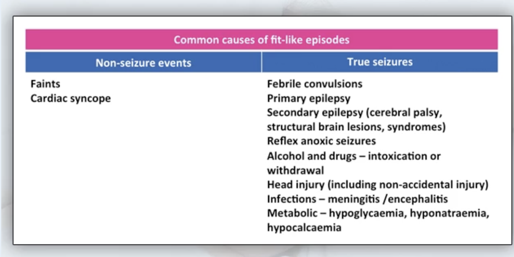
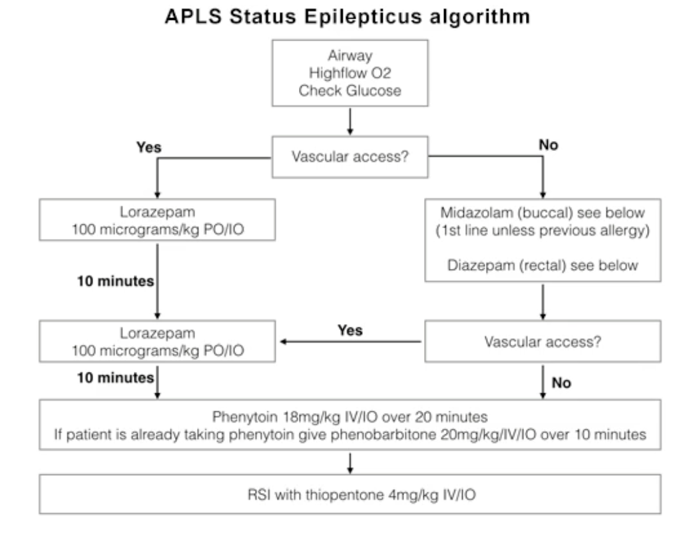

# GC Paediatrics E-Learning Module - Spotting the sick child Lecture

## Assessment of a sick child

- **3 minute toolkit:**
    - Vague presentation irrespective of cause
    - General impression - acutely ill children may look deceptively well, thorough PE is needed
    - Vital signs may be only manifestation
    - top to toe and physiology:
        - Airway - secretion, stridor, FB
        - Breathing - RR, accessory muscle use, oxygen saturation, auscultation
        - Circulation - colour, HR, refill, peripheral temperature
        - Disability - pupils, limb tone ad movement, consciousness (AVPU/GCS)
        - Exposure - top to toe examination for:
            - Rashes - viral exanthems, ID rashes, non-blanching septicaemic rash
            - Evidence of injury/ trauma
            - Bruises - think non-accidental injury in the non-mobile child
        - ENT - ear, nose and throat examination
        - T - temperature
        - T - tummy:
            - Tenderness + bowel sounds
            - Consider testicular torsion in boys
            - Urinalysis
        - DEFG (glucose) if drowsy or very unwell
- **Airway assessment:**
    - Secretions - think bronchiolitis
    - Stridor - think croup and other upper airway obstruction
    - FB
    - Unprotected airway - decreased GC? most important by checking gag reflex using oropharyngeal airway
        - If able to tolerate oropharyngeal airway, suggests unable to protect airway –\> maintain jaw thrust to keep airway open before anaes arrives
- **Breathing assessment:**
    - Respiratory rate - reflects both respiratory or systemic manifestation
        - Count over 30s and x2 - best done when calm

    
    
    - Recession and Accessory muscle use - see difficulty in breathing session
    - Pulse oximetry - note that babies and toddlers appear deceptively well despite poor oxygenation and near decompensation (consider O2-dissociation curve)
        - Smaller probe for smaller children
        - Babies use forefoot or whole hand
        - Check wave form - require sufficient amplitude to pick up signal
        - Threshold for suspicion of sick child:
            - \< 94% suggests hypoxaemia
            - \< 90% is extremely worrying in a child
    - Auscultation - less value than in adults as small chest such that upper airway noises are better transmitted:
        - Most important to check wheezing
        - Crepitations in bronchiolitis
        - Bronchial breathing
- **Circulation assessment:**
    - Colour:
        - pale, ask parent to compare with healthy times and take note if even parent agrees if pale
        - Mottled - over arms or legs (some children are mottled quite frequently, ask parents if unusual)
    - HR - best if calm, crying increases HRL
        - Radial pulse in older children, brachial pulse in babies
        - Best if measure from pulse oximetry or cardiac monitor
        - Remember normal values
    - Cap refill - measure peripherally and then centrally:
        - Check caprefill by pressing 5 sec over any area (toe, feet, fingers or hands, or sternum)
        - Normal \< 2 sec
        - Comprimise - 3-4 sec
        - Requiring urgent resuscitation - \> 5 sec
    - Peripheral temperature - relative to trunk (cooler if comprimised circulation leading to peripheral vasoconstriction)
    - BP - typically not worth measuring unless extremely sick:
        - Children may cry when cuff gets too tight and affect measurement
        - BP typically compensated until very late in the process - often normal in a sick child due to strong peripheral vasoconstriction
- **Disability:**
    - Pupils - nearly always normal in awake and oriented children:
        - Changing pupil sizes - seizures, fit, and also drug overdose
        - Asymetry - SOL in brain (think TBI)
    - Limb tone and movement - if worried of SOL in brain (compare L and R) –\> think need for CT brain
    - AVPU score and GCS - especially if head injury
    - Irritability and drowsiness are less specific but may be early signs:
        - Irritability - by definition unconsolable, different than being miserable (can be consolled by parrents) and reflect raised ICP or meningitis
- **ENT assessment** - for all w/ fever (best left at end for young children):
    - Best to ask parent to hold child securely, moving child may result in injury by otoscope
    - Assessment of ear - TM may be pink in children w/ fever, and does not indicate OM
    - Assessment of throat - red and large tonsils not tonsilitis, which often a/w exudates
- **Temperature** - tympanic, or axillary (paper strips vs electrolic device)
    - Axillary recommended for babies who have small ears - too small for tympanic temperature
- **Tummy assessment** - see parts w/ children w/ abdominal pain
    - Perform on parents lap if cannot lie on bed
    - Gain child trust through superficial palpation, relax the tummy
    - Deeper palpation after relaxed - for masses, tenderness or peritonism
    - Examination of testis in boys
    - Examination of groin for hernias
    - Urinalysis - UTI or DKA
- **Blood glucose** - H'stix (N 3-5 mmol/L)
    - Hypogly - IEM, alcohol intake, starvation after 1-2d, ?sepsis
    - DKA - work out other signs of DKA
- 

## Difficulty in Breathing

- **Typically infectious in origin** - viral and bacterial can hit hard as in extremes of age
- **Most common organisms in first 3 years of life:**
    - S. pneumoniae
    - H. influenzae
    - Pertussis
    - Mycoplasma
    - Influenza virus
- Commonest cause of breathlessness in children:
    - Asthma
    - Bronchiolitis
    - Pneumoia
    - Croup
- Asthma - most common cause of breathlessnessin child
    - Epidemiology - 10% in UK
    - Clinical features - productive cough + wheeze + SOB
    - Key facts:
        - Viral infections in babies and toddlers may bring on few days of wheezing, but does not imply will develop asthma in childhood
    - Triggers:
        - Infection
        - Smoke
        - Exercise
        - Excitement
        - Dust
        - Pollen
        - Animal dander
    - \< 1y do not have typical asthma so beta-agonist are less effective
- Croup - viral infection of upper airway resulting in upper airway obstruction and difficulty in breathing
    - Epidemiology - commonest in toddlers
    - Clinical features:
        - Miserable (?but not irritable)
        - Fever
        - Barking cough and hoarse voice
        - Stridor - may be inspiratory or expiratory:
            - Increased when upper airway narrowing increased
            - Increased when respiratory efforts increase (i.e. more turbulent flow)
        - Signs of airway obstruction:
            - Intercostal recession
            - Subcostal recession
            - Sternal recession
            - Tracheal tug
    - Complications - T2RF as exhaustion to breath through obstruction (do not upset children w/ croup and cause crying)
    - Mx - steroids or adrenaline nebuliser:
        - Steroids - oral dexamethasone, prednisolone, budesonide
        - Adrenaline nebuliser (buys time for steroids) - 5ml of 1:1000 and observe for clinical improvement (may require repeated dosing)
- Bronchiolitis:
    - Epidemiology - 1mo-1y (winter in UK, what about HK)
    - Clinical features:
        - SOB
        - Wheezing
        - Cough wet sounding
        - Runny nose
        - mild temerature
        - Poor feeding due to fatigue - may require feeding support
    - Viral infections - RSV
    - Signs:
        - Wet crepitations
        - Wheezing
    - Mx - supportive (O2, feeding, respiratory)
- Pneumonia - esp bacterial hits hard:
    - Clinical signs are subtle - always need CXR if suspecting sepsis
    - More lethargic, higher temperature (\> 38.5), irritable and refuse food and drink
    - Cough less reliable Sx or even absent in some cases
    - Auscultation less reliable - focal signs difficult to detect in small chests as sounds are transmitted everywhere
    - i.e. perform 3 minute assessment for signs and perform CXR to confirm:
        - Tachypnoea and respiratory distress etc.
        - HR out of proportion to fever suggestive of sepsis
- Salient points of Hx:
    - Age - clue to diagnosis and risk assessment (easier for RF esp \< 3mo)
    - Red flags:
        - Apnoea
    - AN - premature babies or cardiopulmonary disease (lower threshold for admission)
    - Associated Sx:
        - Cough - cough so much can vomiting
        - Noisy breathing - need compare w/ prior in young babies (\< 6mo can have physiological noisy breathing)
        - Poor feeding - )
        - Ability to sleep w/o distirbance
        - Dehydrations - check circulation
        - Fatigue - ask about whether child becomes quiet or clingy
        - Temperature
        - Wheeze
    - If wheeze - assessment for asthma:
        - HPI - pattern, variability w/ time, exposure etc.
        - FHx of atopy
    - PMH - prior admission to ICU or use of steroids
- Children w/ hx of bronchiolitis will develop cough and wheeze triggered by viral infection (these are not asthma)
- Criteria for admission:
    - Poor oxygenation - require O2 support
    - Tiring
    - Poor feeding
    - ?Dehydration
- P/E:
    - General impression - alertness, posture, ability to speak:
        - Alert - good guide to severity, but toddlers may be deceptively well until examination (note that lethargic children may look calm as well)
        - Posture:
            - Difficulty of breathing more likely upright
        - Speech - broken sentence, in words, does not speak
    - Respiratory Examination - avoid upsetting child as this increase distress and makes them more tired:
        - Noisy breathing:
            - Note many babies are naturally snuffly - ask parents if unusual
            - Note snuffly breathing and runny nose in child w/ respiratory distress suggestive of bronchiolitis
            - Wheezing - bronchiolitis, asthma, and viral infections
            - Stridor - croup, FB aspiration, anaphylaxis, epiglotitis, bacterial tracheitis more corse sounding
            - Grunting - closed glottis to generate +ve expiratory pressure to prevent actelactesis (see in excessive secretion in bronchiolitis)
        - RR - best if chest exposed but possible through clothing
        - Work of breathing:
            - Recession of ribs - insucking of chest wall in younger children more likely as it is soft (older child requires greater degree of distress to observe recession):
                - Tracheal tug
                - Supraclavicular indrawing
                - Sternal recession
                - Intercostal recession
                - Subcostal recession
            - Use of accessory muscles - e.g. SCM causing head bobbing, abdominal breathing
        - Accessory muscles:
            - Abdominal breathing - caused by forced contraction of diaphragm
            - Head bobbing - due to contraction of SCM
            - +/- nasal flarring
        - O2 and HR from pulse oximeter - deceptively well when moderately ill
        - Auscultation of chest:
            - Wheeze - may not require stethoscope to be audible (does not correlate w/ severity)
            - Likely transmitted noise - difficult to distinguish between between local and diffuse pathology
        - Peak flow measurement:
            - Use is guarded in young children - likely unco-operative unless used to PEFR
            - Need to compared to predicted PEFR based on height, and practically by the best PEFR documented in prior visits
- Red flags:
    - Choking - difficult for family to differentiate between whether it is stuck in airway or esophagus:
        - Sites:
            - Stuck in airway - either coughed up, removed by Heilich manoevere or small enough to descend through the bronchi (and causes SOB and wheezing, chest infection), or persistent choking resulting in hypoxic, apnoea, unconscious or in cardiac arrest
            - Stuck in esophagus (globus) - able to talk or cry very unlikely to have emergency airway problem
            - Retrieve FB by McGill's forceps and laryngoscope if child unconscious
        - Approach:
            - Bang on the back + chest thrust
            - Standard Heimlich
            - Keep distance of child to not scare him - call for help from anaesthetist or ENT
        - P/E:
            - Sitting upright, still, distress
            - Stridor and signs of upper airway obstruction (recession as above)
        - If descends to the bronchi - can present up to 1-2mo after event as wheeze or chest infection:
            - Localised wheezing in P/E - difficult to ascertain in small children
            - Unilateral hyperinflated lung (due to ball valve effect)
    - Apnoea - pause in breathing:
        - Must be referred to hospital
        - 1-4 mo old - may manifest as apnoea in systemic conditions
        - Salient Hx - usually difficult for parents to identify:
            - Episodes of floppiness, and cyanosis (ALTEs, BRUEs)
    - Status asthmaticus:
        - Asthma attacks classified into moderate, severe or life-threatening
        - Urent admission for nebulisers or IV treatment for severe or life-threatening
        - Assess speech
        - Silent chest if breathing is extremely restricted

## Fever

- Common presenting complaint, and extremely worrying (esp \< 2y)
- Epidemiology:
    - 2nd most presenting complaint in paediatrics just SOB
    - up to 8 febrile illnesses by 18 mo
- Etiology can be classifed by:
    - Infective - viral or bacterial
    - Non-infective - e.g. JIA, Kawasaki disease
- Serious bacterial infection - highest risk in \< 3mo and \< 2y
- Differentiation between minor and major infections:
    - Non-differentiating features - high temp, lethargy, poor appetite and dehydration
    - Serious bacterial infections often present w/ non-specific Sx
    - Hence primary assessment to find source of infection
    - See NICE guidelines for fever in children \< 5y
- Differentiation between localised infection vs septicaemia:
    - Septic shock
- Salient points of Hx:
    - HPI - onset and duration, degree of fever:
        - Duration \> 5d usually worrying - consider UTI or Kawasaki disease
        - Degree:
            - \> 39.5 worrying
            - \> 38 in neonates (\< 3mo)
    - Associated Sx - identify focus (note UTI and meningitis have minimal S/S than in adults):
        - Resp - cough, wheeze, SOB, runny nose
        - GI Sx?
        - UTI - consider foul smelling urine, haematuria (reduced UO for shock)
    - ICE is important - something triggers
    - Behaviour and colour:
        - Feeding - good feeding suggests mild disease, but high Sn, low Sp (mild illness may present w/ poor feeding as well
        - Drowsy or irritability - consider how child behaves after antipyretic (up and down pattern is reassuring, but worrying if persistantly irritable)
        - Clingly or miserable in older
        - Pale - ask parent to compare
    - PMH - birth Hx, prematurity cerebral palsy, incomplete vacination
- Approach to P/E - use 3 min toolkit
- P/E:
    - Vitals, primary assessment in 3 min toolkit:
        - ABC - to detect septicaemia esp cap refill and periphery temperatures, mottling
        - Disability - assessment to GC
        - Behaviour of child (in Hx)
        - Temperature (HR + 10 per degree) - can cause rise in HR/RR, but disproportionate rise of HR/RR relative to temp is extremely indicative of septicaemia (or review 30 min after antipyretic, persistent tachycardia and tachypnoea suggestive of sepsis):
            - Degree of fever not the best predictor of severity of illness (weak correlation)
            - Role of antipyretic to assess physiological response (HR, RR) and improvements of behaviour
        - Look for rash
        - Meningitis - no meningeal signs, except for buldging fontanelles
        - URTI - ENT (note eardrums may be red due to temperature rather than OM) and runny nose
        - Chest examination - should be examined in primary assessment
        - Tummy - splenomegaly
        - Urinalysis for UTI
    - Re-assess risk based on NICE guidelines (read up)
- 

## Fits

- Convulsions/ seizures/ fits

- Epilepsy - recurring ?unprovoked

- Commonest cause:

    - High temperature - febrile convulsions (tends to occur in toddler age group)

  
  

    - note age difference:
        - Vasovagal - \>7y
        - Breath-holding attacks in younger (1-3 age groups) patients +/- brief asysole - resulting in reflex anoxic seizures
        - Hypogly common in poor feeding infants or if children T1DM

- Principles of Mx:

    - place child in recovery position
    - wait 5 min before calling ambulance or initiating medical Tx
    - NP airway and O2
    - Medication APLS guidelines?
    - Haemstix
    - Give paracetamol after fit - headache and temp
    - 3 minute assessment - identify cause and complications:
        - ABCD-ENT-TT approach:
            - A - check GCS whether can protect airway due to drowsiness
            - B - due to drugs causing depressed respiration
            - C - excessive sweating during fit, septicaemia causing shock
            - D - AVPU usually P or U, + GCS serially post-ictal, pupils symmetrical (+ full neuro once awake)
            - ENT - if febrile
            - T - above average due to muscular activity
        - blood glucose

- \> 30 min for brain damage

- Salient points of Hx - require eye witness accounts:

    - HPI:
        - type of fit
        - any warning signs - usually no
        - aware of surrounding
        - appearance of child during event (abnormal movement, eye position, colour, tone, incontinence of urine, tongue biting or injury)
        - Duration - around 1-2 min
        - Duration of recovery
        - Post-event headache
    - Any precipents:
        - Associated Sx:
            - Fever and rigors
        - Fit pattern - nature and timing

- DDx:

    - Febrile convulsions (1-3y) - usually generalised tonic-clonic and few minutes w/ full recovery, 50% chance to recur
    - Non-febrile convulsions in known epilepsy

- After fit:

    - Convusion/ drowsiness
    - Agitation
    - Headache

- Fits in babies - appears different from fits in older children:

    - Not usually inocent and require full workup
    - Less aggressive limb movements
    - Eyes staring rather than closed or rolling up

- Aspiration - can occur during a fit:

    - Hence why keep children in recovery position in post-ictal phase

- Hypoglycaemia:

    - Important cause of fits, esp in infants w/ poor feeding
    - If not corrected, itself causes brain damage w/o inducing fits
    - Signs of hypoglycaemia:
        - Jitteriness of limb?
    - Rapid Tx:
        - IV dextrose
        - Glucogel
    - DDx:
        - Poor feeding
        - Systemic condition - e.g. sepsis by causing poor feeding
        - Alcohol abuse
        - T1DM
        - IEM

- Status epilepticus - \> 30 min or no full recovery between fits:

    - Risk of brain damage
    - Prevention:
        - Medication before 30 min by APLS or EPLS status epilepticus algorithm
        - Good information of duration
    - Correlates w/ severity of disease - consider epilepsy or severe systemic cause

  
  

- Pseudoseizures - rare in children, can be common in mid teens

## Dehydration

- Most commonly caused is GE
- Causes of vomiting: 

- Rehydration by ORS w/o IV if no signs dehydration
- Read up on oral fluid challenge - and ask parents to keep I/O
- Salient points of Hx:
    - Know whats going in and whats going out - is it typical GE
    - HPI - quantify (few or more loose stools), any dysentery (consider intussusception)
    - Associated Sx:
        - Cough
        - Difficulty fever
        - Fever
        - Sore throat
        - Urinary difficulties
        - Abdominal pain (caution) - consider surgical cause (IO or appendicitis)
        - Recent weight - see weight loss
    - Contact
    - How much eating and drinking
    - Urine output - any changes in nappies in past few hours (worry if no wet nappies in 12h)
- P/E:
    - General observation:
        - General activity and playfulness
        - Drowsy
        - Jittery in small infants caused by hypoglycaemia (poor feeding due to vomiting)
    - Signs of dehydration:
        - Mild - ORS, vs severe - IV/ NG tube
        - Sunken eyes (ask parent to confirm)
        - Sunken fontanelle in infants
        - Dry mucous membranes (lips, tongue and eyes)
        - Skin turgor
        - Peripheral temperature, appearance (pale or mottling), cap refill, BP/P
        - Read NICE guidelines on charitisation on degree of dehydration (diarrhoea and vomiting)
- Pyloric stenosis - 4-6 week age group:
    - Projectile vomiting at end of or just after feed
    - USG diagnostic
- Hypernatraemic dehydration - imbalance between sodium and water reabsorption due to immature kidneys:
    - Na especially high in 160
    - Further causes drowsiness, but prevents sunken eyes, fontanelles and skin turgor appears normal (child more dehydrated than clinically appears)
- DKA

## Abdominal pain

- Etiology - abdominal vs extra-abdominal (e.g. URTI, migraine) 

