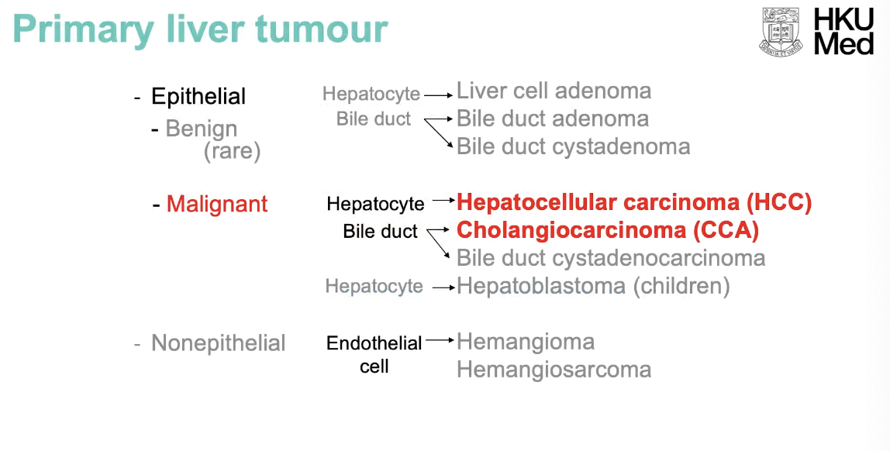
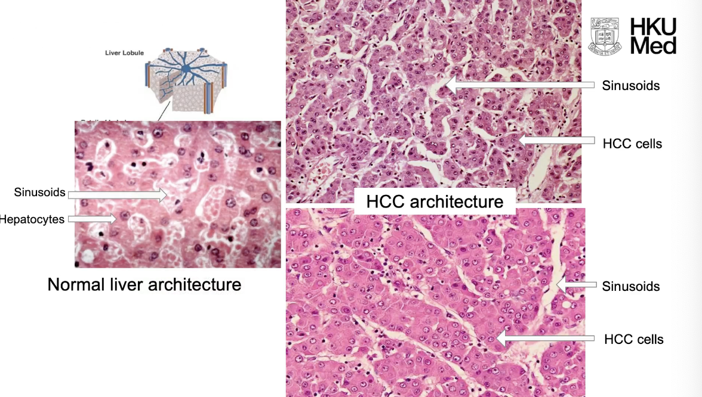
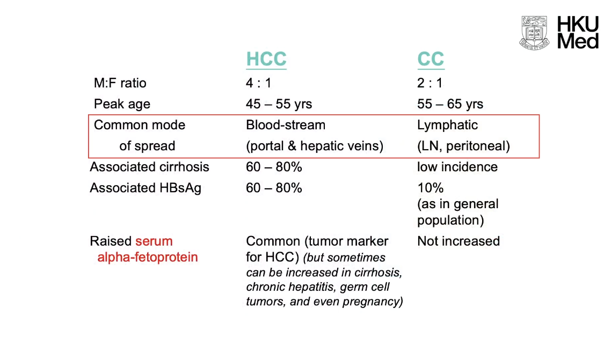
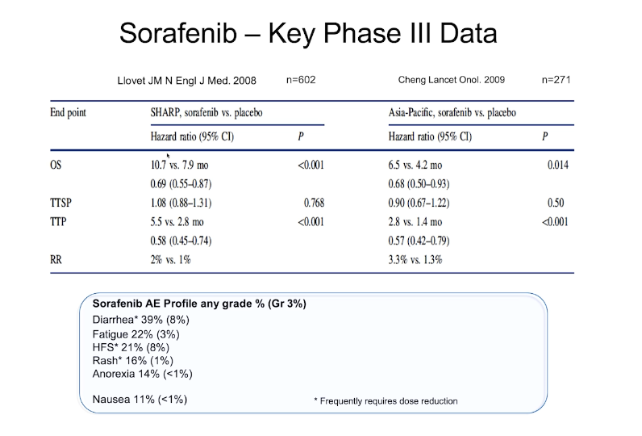
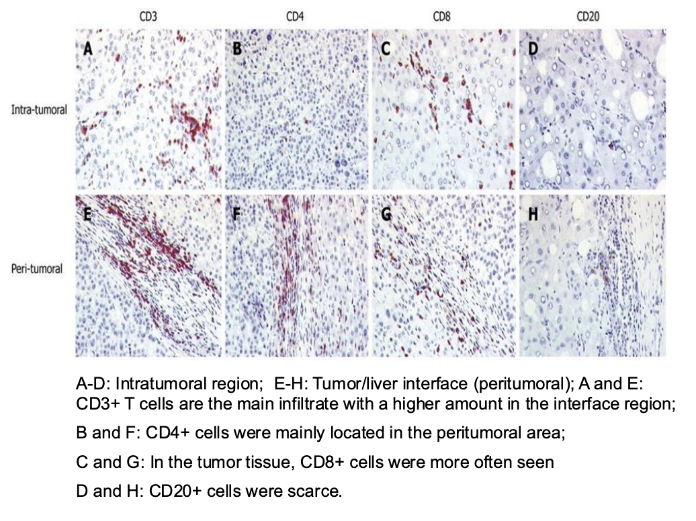

# GC Cancer Block Week 4: Liver Cancer Lecture

## Epidemiology of Liver Cancer

## Different imaging modalities and their role in diagnosis and management of HCC

## Pathology of liver cancers

- **Primary liver tumours** - classified into epithelial vs non-epithelial, benign vs malignant: 

- **Epidemiology of HCC:**

    - Global incidence - 500,000-1,000,000 anually (55% new cases occur in China)
    - 3rd most common cancer in HK
    - Demographic - male predominant (M:F 4:1)
    - Crude death rate at 20.4/100,000/y
    - Median survival in weeks once locally symptomatic

- **Risk factors of HCC:**

    - Chronic viral hepatitis - HBV (80% of HCC in HK), HCV
    - Chronic alcoholism (via cirrhosis, ?rather than related to chronic alcoholism itself)
    - MAFLD (metabolically associated fatty liver disease)
    - Cirrhosis (60-80% of HCC cases have a background of cirrhosis)
    - Aflatoxin
    - Metabolic disorders (related to cirrhosis)

- **Pathology of HCC:**

    - Hypervascular - w/ areas of haemorrhage and necrosis
    - High vascularity and minimal supportive stroma - prone to haemorrhage, easy to rupture resulting in haemoperitoneum
    - Nodular HCC (multiple nodules of HCC)

- **Histopathology of HCC:**

    - Normal liver parenchyma - Hepatocytes arranged in cords, w/ sinusoids in between w/ blood flow from both hepatic artery and portal vein
    - HCC histological architecture - resemblence w/ normal liver parenchyma w/ HCC cells aranged in broadened/ thickened cords w/ sinusoids in between

  
  

    - May produce bile if well-differentiated (recognition of bile production reveals Dx of metastatic HCC, i.e. if histologically shows accumulation of bile, suggestive of HCC)
    - Clear cell in HCC - due to accumulation of glycogen, and hence can occasionally presenting w/ hypoglycaemia:
        - Replacement of liver by tumour - deminished glycogen storage within liver
        - Clear cell type of HCC w/ excessive glycogen storage within tumour
        - Secretion of insulin-like peptides

- **Route of metastasis** - primarily from venous invasion:

    - Invasion into portal vein branches - results in intrahepatic metastasis
    - Invasion into hepatic vein branches - results in lung and bone metastasis

- Note incidence HCC vs intrahepatic CC is 6-7:1

- **Risk factors of CC:**

    - Large duct iCCA:
        - Chronic inflammatory biliary disease - e.g. liver flukes, hepatolithiasis (RPC), PSC
        - Biliary malformation - carolis disease, congenital hepatic fibrosis, polycystic liver disease
    - Small duct iCCA:
        - HCC risk factors (chronic advanced, non-biliary liver disease)

- **Pathology of HCC:**

    - Site:
        - Central or hilar - left, right or Klatskin tumour (early presentation)
        - Peripheral tumours - asymptomatic and late presentation
    - Whitish and firm due to excessive fibrosis

- **Histopathology:**

    - Adenocarcinoma - glandular pattern
    - Fibrosis

- **Distinction between HCC and CC:** 

## Treatment of localised liver cancer

- **LOs:**
    - Undestand modalities of Tx of localised HCC
    - Understand patient selection
- **Patient selection** - based on BCLC and HKLC guidelines: 

    - **Stag dependent on:**
        - Tumour factor - tumour size, number of tumor nodule, macrovascular invasion, and extra-hepatic spread
        - Non-tumour factor - liver function (CP score), performance status of patient
    - Note that in BCLC staging, liver function and performance status are used initially to differentiate between different stages prior to tumour factors (i.e. CP C cirrhosis w/ small solitary HCC is already terminal stage)
    - Patient selection:
        - Local-regional Tx - indiated for 0,A,B
        - Systemic Tx, or supportive care - indicated for C and D
- **Overview of loco-regional Tx:**
    - Surgical - liver resection and liver transplantation
    - Non-surgical - ablation, trans-arterial therapy, external beam radiation
- **Resection** - gold standard curative Tx, but only suitable for 20-30% of HCC patients:
    - Primary objective - to remove the tumour w/ adequate margin while preserving as much functional liver parenchyma as possible
- **LT** - best Tx of HCC a/w best survival
    - Patient selection:
        - Milan criteria
        - UCSF criteria
    - Forms - LDLT vs DDLT
- **Ablative Tx** - RFA and MVA:
    - RFA - electrical current in RF range is delivered through a needle electrode under imaging or surgical guidance (heat-based thermal cytotoxicity)
    - MWA - electromagnetic energy in absence of current flow and causing subsequent coagulation necrosis
    - Indications:
        - Suitable w/ tumours \< 3cm and \<3 tumours (early stage or very early stage)
        - W/ medical co-morbidity not fit for surgery
    - Heat sink effect:
        - If tumour is too close to major vessel (\< 1cm)
        - Blood flowing will have cooling effect and limit efficacy
- **Trans-arterial therapy:**
    - Indications:
        - Multinodular, larger tumour beyond limit of resection, ablation and LT not indicated
        - Require well preserved liver function
    - Modalities:
        - TACE - catheter into feeding arterial branch:
            - High concentration dose of chemotherapy
            - Followed by embolization of the tumor microcirculation
        - TARE (Selective internal radiation therapy \[SIRT\]):
            - Release of microspheres loaded w/ radioactive compound which has embolisation effect, and delivery of high dose radiation to the tumour
    - Stereotactic body radiotherapy:
        - Suitable patient w/ unresectable HCC w/ well-preserved liver function
        - Delivered in 1-5 fractions (cf conventional RT)

## Treatment of advanced liver cancer

- **Challenges in Mx of HCC** - one patient w/ two diseases:
    - Highly malignant tumour - rapid growth (tumour volume doubling 3 mo) and high propensity for venous invasion
    - Associated cirrhosis (80% of HCC cases):
        - Multicentric hepatocarcinogenesis
        - Impaired lvier function
- **Screening:**
    - **Importance of screening:**
        - Poor 5y survival - 22% overall, 3.5% w/ metastatic
        - Asymptomatic in early stage disease
    - See NCCN guideline for screening indications (in slides)
    - USG + AFP
- BCLC staging system is too conservation in european predominantly HCV infections:
    - Role of surgical resection to intermediate or locally advanced HCC w/ intrahepatic venous invasion
    - Role of ablation can extend to 3-5cm
    - Transarterial therapy can be extended to locally advanced HCC w/ intrahepatic venous invasion
- HKLC staging system - read up again:
    - Improved OS if using HKLC scheme vs BCLC
    - Identify subset of BCLC intermediate and advanced stage patients in BCLC paradigm for more aggressive Tx
- Systemic therapy:
    - Targeted therapy - Sorafenib:

        - Targets angiogenesis and tumour cell proliferation

    
    

        - Sharp study and asia-pacific
        - Increased significant of G3 AE:
            - Diarhoea
            - Fatigue
            - HFS and rash

    - Lenvatinib demonstrated in REFLECT trial:

        - Similar efficacy in terms of OS and PFS
        - But much improved AE profile

    - Role of immunotherapy:

        - HCC is an immunogenic tumour:

            - lymphocytic infiltration of HCC, particularly CD8+ cells infiltration intramurally, and CD4 T cell in peritumoral interface region

      
      

            - Role of T cell immunity

        - CHECKMATE 040 - demonstrate efficacy of nivolumab in HCC:

            - Demonstrates tumour shrinkage

        - CHECKMATE 459:

            - Nivolumab vs sorafenib - showed numerically numerically longer median OS than sorafenib, but not statisti ally significant

        - IMbrave - atezolizumab + bevacizumab vs sorafenib:

            - ORR (RECIST 1.1) - 30% vs 11%
            - Improved median OS and PFS, both statistically significant

        - HIUMALAYA:

            - Durvalumab (Anti-PD1) + Tremelimumab (Anti-CDLA4) vs Sorafenib vs Durvalumab alone
            - Dual immuno has best OS and PFS
            - ORR 20%

    - Read all safety profile of all regimen

    - NCCN guideline:

        - First line - is immunotherapy based combination (atezolizumab + bevacizumab), or duravalumab and tremelimumab
        - Second line:
            - Other targeted therapy - e.g. regorafenib, cabozanitinib, ramucirumab
            - Nivo + Ipi

# GC153 Biochemical Investigations of Hypertension Lecture

- **Aims of these Ix:**
    - Locate a secondary causes (e.g. HyperAld, and Phaeo)
    - Screen for complcations
    - Detect and Tx of comorbidities
- **Types of complications:**
    - Renal complications - e.g. proteinuria, renal insufficiency
    - Cardiac complications
    - Cerebrovascular complications
- **Detect and Tx of co-morbidities:**
    - DM - FBG, A1c
    - Dyslipidaemia - lipid profile
- **Indications for screeninf of secondary HTN** - when, who and how to screenL
    - N.B. reference review article on Secondary arterial hypertension: when, who and how to screen?
- **Secondary causes:**
    - MR excess syndrome - primary aldosteronism, cushing syndrome
    - Hyperthyroidism
    - Phaeochromocytoma
    - Renal parenchymal disease
    - OSA
    - Coarctation of aorta
- **Physiology of minerocorticoid effects of cortisol:**
    - Cortisol \>\>\> Aldosterone
    - Normally via inactivation of cortisol on 11-beta HSD, however deficient state causes excess cortisol MR receptor stimulation
- **Mineralcorticoid excess:**
    - Clinically important MR - aldosterone, cortisone, deoxycorticosterone
    - Defining feature - Hypokalaemic HTN, Metabolic Alkalosis, LV hypertrophy (due to prolonged effects of Ald on cardiac remodelling)
    - DDx - grouped together as "low-renin HTN":
        - Mineralcorticoid excess:
            - Primary hyperaldosteronism (adenoma vs hyperplasia, familial vs sporadic)
            - Cushing syndrome - including glucocorticoid resistance
            - Deoxycorticosterone - rare CAH (11-hydroxylase deficiency, 17-hydroxylase deficiency)
        - Receptor problem - e.g. activating mutation, apparent mineralcorticoid excess (i.e. 11 beta-hydroxysteroid dehydrogenase insuficiency), Liquorice (inhibitor of 11-beta HSD)
        - Signalling protein - Gordon syndrome (note presents w/ hyperkalaemia and metabolic acidosis)
        - Defective channels - e.g. Liddle syndrome (overactive ENaC)
    - Glucocorticoid remediable aldosteronism:
        - Clinically identical yo primary aldosteronism, with the exception that it runs in the family in an autosomal dominant manner
        - Genetics and pathophysiology:
            - Fusion of two genes - 5' of 11-beta hydroxylase (under regulation of ACTH), and 3' of aldosterone synthase (regulated by AngII)
            - Aldosterone synthesis under diurnal ACTH stimulation
        - Ix and Dx:
            - Dexamethasone suppression test (but measure aldosterone rather than cortisol) - read up on values
            - Measurement of hyprid steroids 18-hydroxycortisol or 18-oxycortisol
            - Genetic testing by long-range PCR
    - Measuring minerocorticoid activity:
        - Aldosterone
        - Cortisol
        - Deoxycortisterone
        - Transtubular potassium gradient (TTKG) - reflects minerocorticoid osmolarity:
            - Gradient between tubular K and serum K, adjusted by osmolarity?
            - Normally 4-10
            - If hypoK, TTKG high, reflects excess action
            - Assumptions:
                - Urine Osm \> serum Osm
                - Urine Na \> 40
                - No K supplementation
- **Primary hyperaldosteronism** - refer to JCEN guidelines published in 2016:
    - High prevalence - 8-12% (appears to same worldwide)
    - One study in HK study - suggest 0.1% (?underdiagnosis)
    - See biochemical definition:
        - A group of disorder, where aldosterone production is inappropriately high for sodium status
        - Relatively autonomous of the major regulators of aldosterone secretion (primarily AngII, K)
        - Non-suppressible by sodium loading
        - ARR increased (analogues to primary hyperthyroidism):
            - Aldosterone increased (autonomous synthesis and secretion)
            - Renin reduced (due to negative feedback)
    - Forms:
        - Familial - 3types
            - FH-1 - glucocorticoid remediable aldosteronism
            - FH-II (AD) CLCN2 might be causative gene
            - FH-III - KCNJ5 - increased sodium conductance and depolarisation increaseing K secretion
    - **Considerations for PA:**
        - Severe HTN, Drug-resistance HTN
        - Spontaneous or diuretic-related hypokalaemia
        - Early onset HTN or CVA at young age
        - +ve FHx
    - **Diagnostic algorithm:**
        - Screening - Aldosterone-renin ratio (ARR)
        - Confirmation - one or more of the four confirmation
        - Subtyping - postural test, CT scan +/- venous samling
    - ARR:
        - Increased ratio suggestive of hyperald
        - Patient preparation:
            - Out of bed for \>= 2h
            - Seated for 5-15 minutes before blood taking
            - Liberal salkt intake
            - Current practice is not to withold drugs (this is different from endocrine lecture), but MR diuretics and licorice must be withdrawn for at least 4 weeks
        - Measurement of renin:
            - PRA - method of choice under HA, measured by mass spectrometry ways
            - DRC - direct renin concentration, but not performed in HA
        - Measurement of aldosterone - measured by MS
        - Cutoffs = guideline suggestive of 750 but no gold standard
        - Effects of drugs - most drugs had more significant effect on renin than aldosterone (see table in article):
            - Beta-blockeres
            - All diuretics, ACEi, ARB
        - Effects of K - K significant regulator of aldosterone secretion, but but not renin –\> slight effect on ARR:
            - Simply perform assay after K correction (i.e. only interpreble if normokalaemic, guidelines suggestive of 4.0)
        - Effects of sodium - sodium loading inhibits aldotsterone
        - Other factors:
            - Old age
            - Pre-menopausal
            - **Pregnancy** - very high renin and aldosterone (simply overactivated during pregnancy, ?a form of secondary hyperaldosteronism)
            - Malignant HTN
            - Renovascular HTN (RAS)
    - On screening if low K, Aldosterone \>= 550pmol/L, and undetectable renin –\> extremely suggestive of PA and no need confirmatory test
    - Four confirmatory test - saline infusion test is preferred:
        - Oral sodium loading test
        - Saline infusion test
        - Fludrocortisone suppression test
        - Captopril challenge test
    - Postural test / Balance study (see slides) - while textbook says adenoma does not respond to AngII, they still respond too (colours interpretation)
    - Frusemide stimulation test (little used) - read up role, bit different from balance study
    - Adrenal venous sampling measure cortisol-corrected aldosterone ratio to confirm localisation (see slides for more detail)
- **Phaeochromocytoma:**
    - Inherited syndromes - VHL, MEN2, NF1
