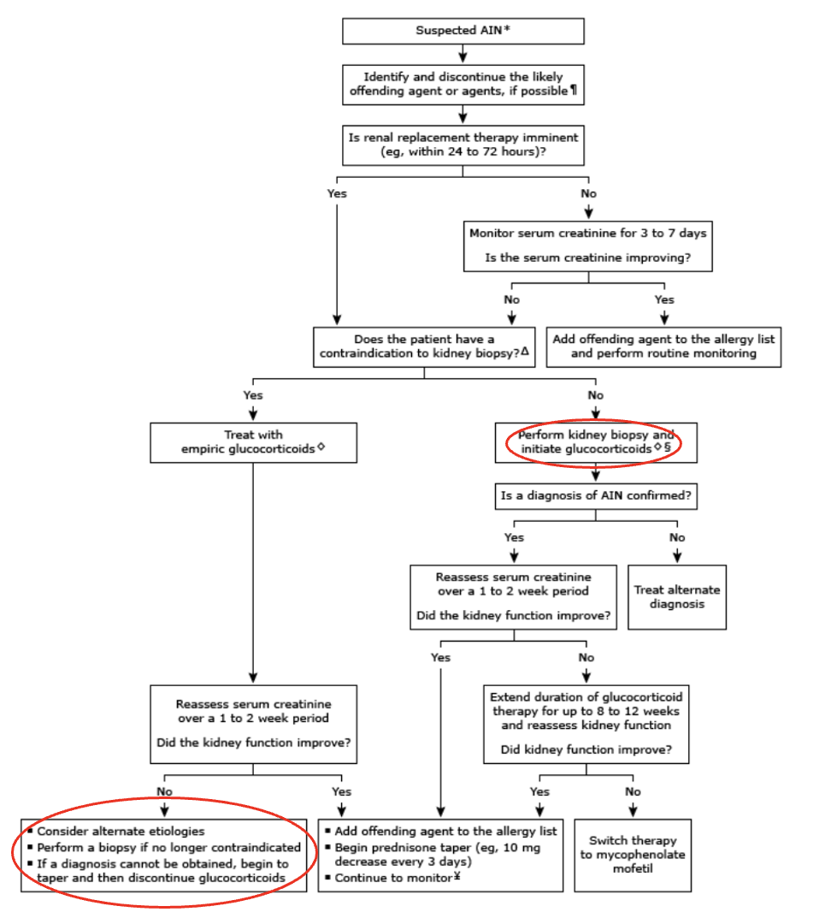

# GC37 Common neurological problems in older patients Lecture

## Overview of neurological assessment

## Acute neurological emergencies

## Cognitive impairment

- **Definitions and terminology** (DSM-V) - defined in the context in the absence of active delirium:
    - Dementia - a) significant cognitive decline from a previous level of performance in \>= 1 cognitive areas (memory, language, attention, executive function, perceptual motor and social recognition), and b) interference with independence in everyday activities
    - Mild cognitive impairment (MCI) - a) and no impairment in everyday activities
- **DDx of dementia:**
    - Alzheimeres disease
    - Vascular dementia
    - AD and vascular dementia
    - Frontotemporal dementia
    - Lewy body dementia
    - PD dementia
    - Secondary (e.g. head trauma, tumour, NPH)
- **Approach to suspected cognitive impairment:**
- **Hx:**
    - HPI - temporal pattern of cognitive disorder
    - Cognitive domains to characterise cognitive function:
        - Attention
        - Executive function
        - Learning and memory
        - Language
        - Perceptual-motor function
        - Social cognition
- **Objective cognitive assessment** - requires a sufficient level of alertness and attention for successful completion (hearing and visual impairment should be taken into account):
    - MMSE
    - MoCA
- **Ix:**
    - TFT, B12, folate, VDRL
    - Plain CT
    - MRI brain
    - EEG
    - CSF examination
    - Functional/ pathological imaging
- Read up AD

## Gait and balance disorders

# Drugs and the Kidney, Acute Interstitial Nephritis - Literature Search on UpToDate Reference

- **Reference:**
    - [UpToDate: Clinical manifestations and diagnosis of acute interstitial nephritis](https://www.uptodate.com.eproxy.lib.hku.hk/contents/clinical-manifestations-and-diagnosis-of-acute-interstitial-nephritis?search=acute%20interstitial%20nephritis&source=search_result&selectedTitle=1~88&usage_type=default&display_rank=1)
    - [UpToDate: Treatment of Acute Interstitial Nephritis](https://www.uptodate.com.eproxy.lib.hku.hk/contents/treatment-of-acute-interstitial-nephritis?search=acute+interstitial+nephritis&topicRef=7234&source=see_link)

## Clinical manifestation and diagnosis of acute interstitial nephritis

- **Definition** - a kidney lesion that causes an acute decline in renal function, and is characterised by an inflammatory infiltrate in the renal interstitium
- **Epidemiology** - 1-3% of all kidney Bx (up to 13-19% when restricted to setting of AKI):
    - Underestimated as confirmatory kidney biopsy is often not done if not indicated in old and frail patients
    - Prevalence of AIN caused by PPIs, 5-aminosalicylates and NSAIDs is expected to rise with increasing use, but present less traditionally (less likely to present with rash and eosinophilia than ABx-induced AIN)
- **Etiology of AIN** - traditionally most commonly caused by methicillin, which has subsequently been withdrawn from market:
    - **Drug-induced AIN** (50-75%) - virtually all drugs can cause AIN, but 30-50% cases are caused by ABx:
        - <u>NSAIDs</u> - including selective COX-2 inhibitors
        - <u>Antibiotics</u>:
            - Beta-lactams (penicillin, cephalosporin)
            - Sulphonamides (including trimethroprim-sulfamethoxazole)
            - Quninolones (particularly cirofloxacin)
            - Anti-TB medications (particularly rifampicin)
        - <u>PPIs</u> - e.g. omeprazole, lansoprazole
        - <u>H2 antagonists</u> - particularly cimetidine
        - <u>Immunotherapy</u> - particularly ICIs (nivolumab, ipilimumab, pembrolizumab, atezolizumab)
        - <u>Others described</u> - allopurinol, 5-aminosalicylates, diuretics
    - **Non-infectious systemic disease** (10-20%):
        - SLE (often an acccompanying glomerular disease)
        - ANCA-associated vasculitis (often an accompanying glomerular disease)
        - Sjogren's disease
        - Tubulointerstitial nephritis and uveitis (TINU) syndrome
        - IgG4 related disease
        - Sarcoidosis (commonest cause in the West)
    - **Infections** (4-10%) - may be attributed to the infection or the medications for the infection:
        - <u>Bacterial infections</u> - Legionella, leptospira, Streptococcus, Diptheriae, Yersinia, enterococcus
        - <u>Viral infections</u> - CMV, EBV etc.
    - **Others** (\< 5%) - rare causes include:
        - Idiopathic hypocomplementemic tubulointerstitial nephritis
        - Antitubular basement membrane (TBM) Ab
        - Interestitial infiltration by IgM-positive plasma cells
        - Antibrush border antibody (ABBA) disease
- **Pathology of AIN:**
    - <u>Characteristic findings</u>:
        - Tubulitis - inflammatory cell invade the tubular basemement membrane
        - Marked interstitial infiltrates consisting of primarily T cells and monocytes, while eosinophils, plasma cells and neutrophils may be found
        - Marked interstitial oedema
    - <u>Pathological findings may suggest cause</u> - e.g. granuloma formation, IgG4 +ve plasma cells etc.
- **Clinical features of AIN** - timing of onset is variable (median 10d), but onset after subsequent exposure is more rapid than initial exposure:
    - **Clinical features of renal dysfunction** - many are asymptomatic:
        - <u>Non-specific Sx</u> - e.g. malaise, N/V due to uraemia
        - <u>Oliguria or anuria</u> - most patients may present when non-oliguric, but will eventually become oliguric (51%) as condition progresses
        - <u>Significant proteinuria</u> - only occurs in the context of co-exisitng glomerular disease, especially if a/w NSAID (NSAID-related MCD/ MN) or autoimmune disease (SLE)
    - **Clinical features related to drug allergy** - classically a triad 10% of <u>fever</u> (27%), <u>rash</u> (15%) and <u>eosinophilia</u> (23%) observed in ABx-induced AIN is less and less observed:
    - **Clinical features of the underlying systemic illness** - extremely variable abd dependent on underlying disease
- **Ix:**
    - **Urine** - dipstick, urine microscopy, quantification of proteinuria, and aditional urinalysis:
        - <u>Dipstick</u> - may reveal varying haematuria, proteinuria or sterile pyuria
        - <u>Microscopy</u> - characteristic urine sedinents with:
            - White cells or white cell casts
            - Red cells
            - Eosinophiluria may be possible
        - <u>Quantification of proteinuria</u> (ACR, PCR) - typically minimal accounting for tubular proteinuria, but may have nephrotic range if concurrent glomerular disease (e.g. NSAID, autoimmune disease)
        - <u>Fractional Na excretion</u> (FENa) - \> 1% particularly indicative of tubular damage
    - **Routine bloods** - CBC, RFT:
        - <u>CBC</u> - eosinophilia in 25-35% of AIN (presence raises suspicion of AIN when no other apparent cause of AKI)
        - <u>RFT</u> - raised SCr
    - **Renal Bx** - definitive Dx required histological confirmation of AIN, indicated only if:
        - Patients w/ characteristic urinalysis and bloods for AIN but no culprit drug identified
        - Patients w/ suspected drug-induced AIN but not recovering after cessation of suspected offending agent
        - Patients w/ no contraindications for AIN contemplating glucocorticoid therapy

    
    
- **Mx:**
    - **Principles of Mx:**
        - <u>Dependent on underlying etiology</u> - differentiation between drug-induced allergic AIN or others
        - <u>Supportive Mx</u> - supportive Mx for AKI, and consideration for imminent need for dialysis as this may affect decision for renal Bx
        - <u>Monitoring of patient therapy</u> - renal function expected to improve within 1-2 weeks if early intervention for drug-induced AIN
    - **Mx of drug-induced allergic AIN:**
        - **Discontinuation of offending agent** - may be single or multiple (sequential or simultaneous discontinuation depending on severity):
            - Consider avoidance of entire class of drugs and related classes (e.g. penicillin and cephalosporin)
            - Do not discontinue potentially offending drug if it is crucial to treatment of a severe disease process, especially if no alternatives, and diagnosis is uncertain
        - **Glucocorticoids** - no RCTs, but usage supported by retrospective studies and biological plausibility; should be <u>initiated promptly</u> to limit the extent of damage and improve chances of recovery:
            - <u>Regimen</u>:
                - IV methylprednisolone 500-1000 mg for 3d followed by oral prednisolone 1mg/kg
                - Oral prednisolone 1mg/kg from the start
            - <u>Timing</u>:
                - Started empirically and promptly if renal Bx not considered as C/I
                - Started after histological confirmation if renal Bx is to be performed (lower risk of bleeding complications)
        - **Rescue immunosuppressive therapy** - MMF 1-2g PO in patients w/ Bx-proven AIN and documented failure to respond to glucocorticoids\* Cognitive Impairment and Dementia - Literature Search on UpToDate :Reference:

<!-- -->

- **Reference:**
    - [UpToDate: Evaluation of Cognitive Impairment and Dementia](https://www.uptodate.com.eproxy.lib.hku.hk/contents/evaluation-of-cognitive-impairment-and-dementia?search=dementia&source=search_result&selectedTitle=1~150&usage_type=default&display_rank=1)
    - [UpToDate: Clinical Features and Diagnosis of Alzheimer Disease](https://www.uptodate.com.eproxy.lib.hku.hk/contents/clinical-features-and-diagnosis-of-alzheimer-disease?search=dementia&topicRef=5083&source=see_link)

## Evaluation of Cognitive Impairment and Dementia

- **Definition and terminology** - DSM-V critieria only requires substantial decline in one single cognitive domain, rather than decline in at leaat two cognitive domains for defining neurocognitive disorders:
    - <u>Dementia</u> - acquired disorder that is characterized by decline in cognition involving \>= 1 cognitive domains severe enough to interfere with daily function and independence
    - <u>Mild cognitive impairment</u> - state between normal cognition and dementia where there are objective cognitive impairments in \>= 1 domain, but no decline in overall level of function
- **Domains of cognition:**
    - Attention
    - Executive function
    - Learning and memory
    - Language
    - Perceptual-motor function
    - Social cognition
- **Etiology of dementia** - most common cause in AD in older adults (60-80%):
    - **Neurodegenerative disorders:**
        - <u>Common conditions</u> - Alzheimer disease (AD), Lewy body dementia (LBD), Frontotemporal dementia (FTD), Parkinson disease dementia (PDD)
        - <u>Less common conditions</u> - progressive supranuclear palsy (PSP), corticobasal degeneration (CBD), multisystem atrophy, Hungtingtons disease
    - **Non-neurodegenerative disorder** - may be resversible, progression may be slowed or halted if underlying cause is identified and adequately treated:
        - <u>Vascular</u> - Vascular dementia
        - <u>Infective</u> - Neurosyphillis, HIV-associated neurocognitive disorders, Creutzfeldt-Jakob disease
        - <u>Metabolic</u> - B12 deficiency, folate deficiency, chronic alcohol use
        - <u>Traumatic</u> - chronic subdural haematoma, chronic traumatic encephalopathy
        - <u>Hydrocephalus</u> - normal pressure hydrocephalus
- **Clinical presentation of dementia or MCI:**
    - **Demential syndromes** - gradual and progressive cognitive impairment from baseline, but the different causes of dementia present w/ <u>different pattern of cognitive impairment</u> (see below):
        - <u>Memory difficulty</u> - difficulty in retaining new information (e.g. remembering upcoming events), in terms of short-term and long-term memory
        - <u>Declined executive function and attention</u> - e.g. difficulty in handling complex tasks, and reasoning
        - <u>Decline in language function</u> - may manifest as word finding in conversations
        - <u>Perceptuo-motor and soscial dysfunction</u> - dysfunction of spatial ability and orientation (e.g. getting lost in original places) and odd behaviour
    - **Nature of clinical presentation** - often associated w/ poor insight, hence informant-reported memory loss is a much better predictor for dementia than self-reported memory loss
- **DDx of dementia or MCI** - dementia mimics:
    - Delirium
    - Depression
- **Salient points of Hx** - derived from an informant:
    - **HPI** - onset, progression, brief assessment of different domains of cognition, establishment of baseline:
        - <u>Onset</u> - oftain uncertain as osnset is insiduous (note when informant first notice memory loss)
        - <u>Progression</u> - ask infornant to detail progression of cognition/ memory loss since it was first noticed
        - <u>Assessment of different cognitive domains</u> - brief, formal assessment when performing cognitive testing
        - <u>Daily functions</u> - e.g. managing finances, driving
        - <u>Baseline</u> - through Hx of patients daily activity, and from work and education history
    - **Associated Sx** - focal neurological Sx to determine DDx:
        - <u>Tremors</u> - suggestive of parkinsonism if unilateral fine rest tremors
        - <u>Poor balance and falls</u> - suggestive of a extrapyramidal disorder
        - <u>Personality and behavioural changes</u> - suggestive of frontal lobe dysfunction, particularly mesial frontal degeneration causes patient to become increasingly withdrawn, unresponsive and mute
        - <u>Sleep disturbances</u> - abnormal REM sleep suggestive of LBD; insomia suggestive of depression
        - <u>Visual hallucinations or loss of vision</u> - ?lewy body dementia
        - <u>Difficulty in walking</u> - gait disturbances reflective of frontal lesion or is a classical feature of NPH
        - <u>Urinary incontinence</u> - mesial frontal dysfunction or NPH
    - **PMH** - note medical and psychiatric Hx
    - **Drug Hx** - detailed to identify drugs that can impair cognition:
        - Analgesics (esp. opioids)
        - Anticholinergic
        - Psychotrophic agents
        - Sedative-hypnotics
    - **Social Hx** - particularly excessive alcohol use
    - **FHx** - dementia
- **P/E** - neurological examination:
    - Focal neurological deficits may be consistent w/ prior strokes
    - Signs of parkinsonism - e.g. tremors, cogwheel rigidity, bradykinesia, shuffling gait
- **Cognitive testing** - varying levels of rigor, but requires correlation with the severity of complaint:
    - <u>Screening tools</u> - Mini-Mental State Examination (MMSE), Montreal Cognitive Assessment (MOCA)
    - <u>Detailed mental status assessment</u> - exended mental state examination (incorporation of mood and thought content as they have strong impact on cognitive function)
    - <u>Neuropsychiatric assessment</u> - additional psychometric batteries required only for selected patients
- **Ix:**
    - **Routine bloods** - CBC, B12, folate, TFT, VDRL:
        - <u>CBC, B12, folate</u> - r/o hemantic deficiency as a cause of reversible dementia
        - <u>TFT</u> - screen for hypothyroidism
        - <u>VDRL</u> - screen for neurosyphillis
    - **Neuroimaging** - required in some patients to r/o non-neurodegenerative causes:
        - <u>Indications</u> - routine use is controversial, but recommeded by AAN as may pick up some patients w/ treatable causes (e.g. NPH, subdural haematoma):
            - Acute onset cognitive impairment or rapid neurological deterioration
            - Presence of focal neurological S/S on hx or P/E suggestive of subdural haematoma, stroke or other SOL
        - <u>Preferred modality</u> - MRI or CT:
            - NCCT - if uncooperative patient or MRI contraindicated (e.g. pacemaker)
            - MRI - usually preferred as more Sn and less ionizing radiation
        - <u>Common findings on neuroimaging</u>:
            - **Cerebral atrophy** - focal or generalised widening of sulci, narrowing of gyri with thinning of grey matter and dimished white matter volume often seen in neurodegenerative dementia but also in normal aging 
            
            - **Ventriculomegaly** - ventricular enlargement due to neurodegeneration (proportional to sulci dilatation), but may laso be a/w NPH 
            
            - **Ischaemic cerebrovascular disease** - neuroimaging findings are required for diagnosis of vascular dementia (e.g. NINDS-AIREN criteria)
            - **Microhaemorrhages** - due to vascular anomalies like cerebral amyloid angiopathy (in AD) or hypertensive microangiopathy
- **Dx criteria for dementia** - centrality of memory dysfunction has been de-emphaisized in DSM-5 which all six cognitive domains given equal weight:
    - A. Evidence from Hx and clinical assessment that indicates significant cognitive impairment in at least one of the following congitive domains:
        - Learning and memory
        - Language
        - Executive function
        - Complex attention
        - Perceptual-motor function
        - Social cognition
    - B. The impairment must be acquired and represent a significant decline from a previous level of functioning
    - C. The cognitive deficits must interfere with independence in everyday activities
    - D. The disturbances are not occuring exclusively during the course of delirium
    - E. The disturbances are not better accounted for by another mental disorder (e.g. MDD, Schizophrenia)

  
  
- **Dx of underlying cause** - <u>presumptive diagnosis of AD and vascular cases</u> if absence of other compelling anormalities such as:
    - <u>Presence of parkisonism</u> - sugestive of PDD, LBD, PSP, CBD, or MSA
    - <u>Presence of visual hallucinations and sleep disturbances</u> - early feature of LBD
    - <u>Behavioural abnormalities and personality changes</u> - suggestive of behaviourial variant of FTD
    - <u>Aphasia out of proportion to memory impairment</u> - suggestive of primary progressive aphasia in frontotemporal dementia
    - <u>Gait impairment and urinary incontinence preceeding memory dysfunction</u> - classical of NPH
    - <u>Rapidly progressive dementia</u> - consider CJD
