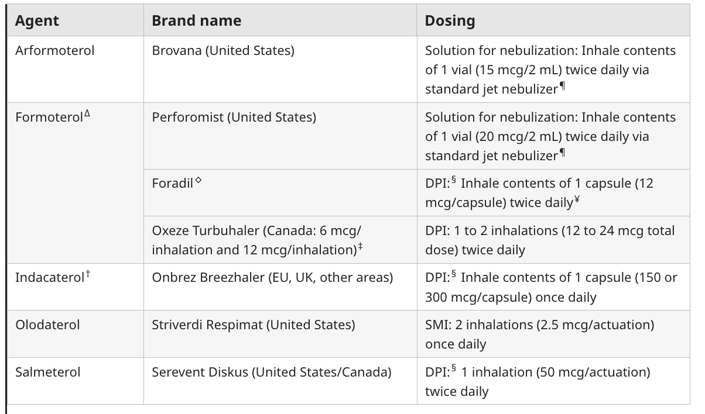
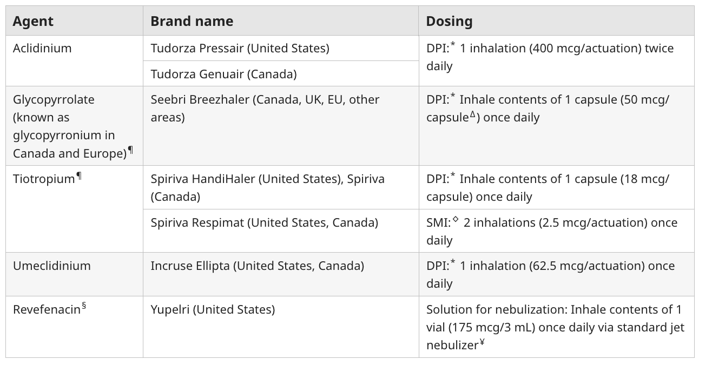

# Chronic Obstructive Pulmonary Disease - Literature Search on UpToDate Reference

- **References:**
    - [UpToDate: Chronic obstructive pulmonary disease: Diagnosis and staging](https://www.uptodate.com.eproxy.lib.hku.hk/contents/chronic-obstructive-pulmonary-disease-diagnosis-and-staging?search=chronic%20obstructive%20pulmonary%20disease&source=search_result&selectedTitle=2~150&usage_type=default&display_rank=2)
    - [UpToDate: Chronic obstructive pulmonary disease: Prognostic factors and comorbid conditions](https://www.uptodate.com.eproxy.lib.hku.hk/contents/chronic-obstructive-pulmonary-disease-prognostic-factors-and-comorbid-conditions?search=chronic+obstructive+pulmonary+disease&topicRef=1455&source=see_link)
    - [UpToDate: Stable COPD: Overview of management](https://www.uptodate.com.eproxy.lib.hku.hk/contents/stable-copd-overview-of-management?search=chronic+obstructive+pulmonary+disease&topicRef=1439&source=see_link)
    - [UpToDate: Stable COPD: Initial pharmacological management](https://www.uptodate.com.eproxy.lib.hku.hk/contents/stable-copd-initial-pharmacologic-management?search=chronic+obstructive+pulmonary+disease&topicRef=120326&source=see_link)
    - [UpToDate: COPD exacerbations: Clinical manifestation and evaluation](https://www.uptodate.com.eproxy.lib.hku.hk/contents/copd-exacerbations-clinical-manifestations-and-evaluation?search=chronic+obstructive+pulmonary+disease&topicRef=1455&source=see_link)
    - [UpToDate: COPD exacerbations: Management](https://www.uptodate.com.eproxy.lib.hku.hk/contents/copd-exacerbations-management?search=chronic+obstructive+pulmonary+disease&topicRef=122144&source=see_link)

## Stable COPD: Overview of management

- **General measures:**
    - <u>Patient education</u> - explain clinical course of COPD, and explain role of smoking cessation and maintenance therapy, and educate on inhaler technique
    - <u>Smoking cessation</u> - explain single most important factor in reducing rate of decline in lung function
    - <u>Pulmonary rehabilitation</u> - participation in comprehensive pulmonary rehabilitation program that includes exercise, healthy behaviours, and psychological support demonstrated to improve ET, and QoL
    - <u>Vaccination</u> - pneumococcal, annual influenza, COVID-19 +/- RSV to prevent exacerbation
- **Pharmacological therapy** - rescue therapy +/- escalation of maintenance therapy by GOLD groups
- **Non-pharmacological therapy:**
    - **Long-term O2** - demonstrable benefit in settings of chronic hypoxaemia and exertional hypoxaemia
    - **Surgical Mx:**
        - Lung volume reduction study
        - Lung transplantation

## Stable COPD: Initial pharmacological management

- **Assessing disease pattern and severity** - GOLD Grade group defined by 1) symptomatology on objective scale (e.g. mMRC, CAT), and 2) risk of exacerbation:
    - **Assessment:**
        - <u>Symptomatology</u> - use of validated instruments such as modified MRC dyspneoa scale or COPD assessment test (CAT)
        - <u>Risk of exacerbation</u> - determined based on patient's history of exacerbation and their severity in the past year (an exacerbation is defined as the clinical need to initiate systemic corticosteroids +/- hospitalisation)
    - **GOLD-grade groups** - note GOLD-grade groups are arbitrarily defined on <u>retrospective data</u>:
        - <u>Group A</u> - less symptomatic (mMRC 0-1), and low risk of exacerbation (\<= 1 exacerbation with no hospitalisation)
        - <u>Group B</u> - more symptomatic (mMRC \>= 2), and low risk of exacerbation (\<= 1 exacerbation with no hospitalisation)
        - <u>Groupe E</u> - high risk of future exacerbations (\>= 2 exacerbations or \>= 1 exacerbation leading to hospitalisation)
- **Principles of Mx:**
    - **Goals of therapy:**
        - Symptom improvement
        - Improve prognosis and reduce disease exacerbation
        - Improve patient function and QoL
    - **Optimise inhaled technique** - improve Tx efficacy by education of inhalation technique and improve adherence
- **Rescue bronchodilators** - as-needed therapy for all patients:
    - <u>Selection</u> - dependent on drug used for maintenance therapy:
        - SABA alone - e.g. albuterol, levalbuterol
        - SAMA alone - e.g. ipratropium, tiotropium
        - SABA-SAMA - e.g. ipratropium-albuterol
    - <u>Approach to selection of rescue bronchodilators</u> - dependent on maintenance therapy:
        - **Patient on LAMA** (LAMA alone or w/ LABA) - SABA recommended (SAMA avoided due to cumulative colinergic S/E)
        - **Patients on LABA alone** - SAMA alone or combination of SABA/SAMA
- **Initial maintenance therapy for GOLD Group A** - single long-acting bronchodilator:
    - <u>Selection</u> - LAMA prefererd but choice dependent on Sx, comorbidities and medication S/E:
        - LAMA (preferred) - e.g. tiotropium
        - LABA - e.g. salmeterol, formoterol, indacaterol
    - <u>Comparative efficacy</u> - LAMA preferred due to potential benefits in reducing exacerbation risks in a Cochrane Meta-Analysis:
        - No significant difference in reported symptomatic relief
        - Tiotropium a/w significant reduction in exacerbations (OR 0.86) but does not translate to reduced hospitalisation or mortality
- **Initial maintenance therapy for GOLD Group B** - dual bronchodilator therapy (LAMA-LABA therapy) may provided adequate relief for severe breathlessness
- **Initial maintenance therapy for GOLD Group E** - dual bronchodilator therapy +/- ICS:
    - <u>Rationale for dual bronchodilator therapy</u>:
        - Meta-analysis reveals a reduction of moderate-to-severe exacerbations with dual bronchodilator therapy compared w/ LABA or LAMA alone
    - <u>Rationales for ICS therapy</u> - indicated only if Eos \> 300/mL, where LABA-LAMA-ICS therapy demonstrate 1) reduction in exacerbation, 2) reduction in mortality, and 3) improved lung functions
- **LABA:**
    - <u>Selection and dosing</u>: 
    
    - <u>S/E</u>:
        - Tachyarrhythmias (minimal risk)
        - Tremors
        - Hypokalaemia (typically only if repeated use of SABA)
- **LAMA:**
    - <u>Selection and dosing</u>: 
    
    - <u>S/E</u> - local irritation and anti-cholinergic effects:
        - Dry mouth
        - Pharyngitis and URTI
        - Cataracts
        - Blurry vision
        - Urinary retention
        - AF/ SVT

## COPD exacerbations: Clinical manifestation and evaluation

- **Definition** (GOLD Definition) - an event characterised by dyspnoea and/or cough and sputum that worsens over \<= 14 d, which may be accompanied by tachypnoea and/or tachycardia, and is often associated w/ increased local and systemic inflammation caused by airway infection, pollution, or other insult to the airways
- **Clinical identification of AECOPD** - acute increases in one or more of the cardinal Sx:
    - Cough
    - Sputum production
    - Dyspnoea
- **Risk factors and of AECOPD** - GOLD guidelines suggest that <u>Hx of previous exacerbations</u> is the single best predictor of exacerbations <u>irrespective of severity of airflow limitations</u> as noted in the ECLIPSE study:
    - **Patient factors** - advanced age
    - **Disease factors** - Hx of exacerbations, longer duration of COPD, more severe Sx, higher Eos
    - **Comorbidities** - Hx of ischaemic heart disease, DM, heart failure, concomitant asthma, GERD
- **Triggers for AECOPD:**
    - <u>Respiratory tract infections</u> (70%) - most commonly viral (e.g. rhinovirus) or community-acquired pneumonia (rarely atypical bacteria)
    - <u>Environmental triggers</u> - cold temperature, environmental pollution
    - <u>Other medical conditions</u> - e.g. secondary spontaneous pneumothorax, pulmonary embolism, heart failure, myocardial ischaemia
- **P/E:**
    - **Primary assessment:**
        - <u>Airway</u> - wheezing, difficulty to speak due to dyspnoea
        - <u>Breathing</u> - low SpO2, respiratory distress, use of accessory respiratory muscles, paradoxical chest wall and abdomen movement
        - <u>Circulation</u> - tachycardia +/- hypotension (+/- new onset AF)
        - <u>Disability</u> - decreased GC could reflect hypoxemia or hypercapnia; asterixis could indicated hypercapnia
    - **General examination:**
        - <u>Temperature</u> - fever suggests an infective cause
        - <u>JVP</u> - raised, suggestive
        - <u>LL oedema</u> - increased LL oedema can be a result of 1) fluid retention by the hypoxic, hypercapnic kidney, 2) venous congestion by right heart failure
    - **Chest examination** - hyperresonant chest, wheeze, focal areas of crackles and increased focal resonance (silent chest in very severe airflow limitations)
    - **Cardiovascular examination** - assessment of RHF (e.g. parasternal heave)
- **Ix** - <u>septic workup</u> if pyrexic; other Ix mainly to r/o other causes of acute SOB and respiratory S/S:
    - **Routine bloods** - CBC, LRFT, CRP, RBG +/- ABG, troponin, NT-proBNP:
        - **CBC:**
            - <u>Hb and HCT</u> - detection of secondary polycythaemia
            - <u>WBC and differentials</u> - neutrophilic leukocytosis suggestive of a bacterial infection (N.B. neutropenia is poor prognostic factor in CAP)
        - **LFT** - hypoalbuminaemia as APR to bacterial infection (N.B. in the context of pneumonia)
        - **RFT:**
            - <u>K</u> - avoid excessive use of SABA if already hypoK before replacement
            - <u>HCO3</u> (best if comparing w/ prior results) - persistently elevated HCO3 suggestive of compensation for chronci respiratory acidosis
        - **CRP** - non-specifically elevated due to systemic inflammation
        - **RBG** - stress hyperglycaemia
        - **ABG** - obtained if low SpO2 or suspected acute-on-chronic respiratory acidosis suspected
        - **Troponin** - r/o myocardial ischaemia
        - **NT-proBNP** - r/o concomitent HF
    - **CXR** - single most important Ix to r/o other DDx:
        - <u>Key DDx to be ruled out on CXR</u>:
            - Pneumothorax (i.e. secondary spontaneous pneumothorax in a COPD patients)
            - Pneumonia
            - Pleural effusion
            - Pulmonary oedema
    - **ECG** - for evaluation of arrhythmias (e.g. AF) or ongoing myocardial ischaemia (ST/T changes)
    - **Echocardiogam** - for evaluation of MI or HF if cannot be r/o on routine bloods, CXR, ECG
    - **Microbiology:**
        - <u>Nasopharyngeal swab</u> - for respiratory viral testing
        - <u>Sputum culture</u> - Gram stain and C/ST if suspecting bacterial infections
        - <u>Blood culture</u> - esp. if pyrexic

## COPD exacerbations: Management

- **Principles of Mx:**
    - **Tx setting** - identification of patients that require higher level of care:
        - <u>Out-patient setting</u> - for mild Sx with absence of life-threatening clinical features and are to visit AED if Sx worsens
        - <u>In-patient setting</u> - always consider if life-threatening or suspected need for ventilatory support (e.g. altered mental status, morning headache, peripheral oedema)
    - **Approach to Mx:**
        - <u>Rule out other causes of acute SOB or respiratory Sx</u> - consider DDx that requires additional Mx (e.g. pneumothorax, pneumonia, heart failure, MI, pulmonary embolism)
        - <u>Initial therapies for Sx relief</u> - appropriate O2 therapy, nebulised bronchodilators, systemic corticosteroids
        - <u>Identification and Tx of underlying cause</u> - e.g. Tx of underlying pneumonia or viral infections
        - <u>Discharge planning</u> - consider whether patient can be discharged, site of disposition, and consider preventitive measures, as to 1) improve prognosis, and 2) prevent rehospitalisation
- **Assessment of exacerbation severity in primary care setting** - Rome classification criteria for COPD exacerbation severity: 

- **Routine monitoring:**
    - <u>Respiratory status</u> - RR, respiratory efforts, wheezing, SpO2 (+/- serial ABG to assess respiratory acidosis)
    - <u>Circulatory status</u> - BP/P, rhythm, volume status
- **Short acting bronchodilators as reliever therapy:**
    - <u>Route of administration</u> - nebulised over MDI technique due to difficulty to co-ordinate inhalation in setitng of exacerbation
    - <u>Selection:</u>
        - SAMA-SABA combination therapy - ipratropium and albutarol
        - SABA alone - albutarol
- **O2 therapy** - low-flow O2 to avoid risking worsening hypercapnia:
    - <u>Target SpO2</u> - 88-92% (i.e. PaO2 60-70 mmHg)
- **Systemic glucocorticoids:**
    - <u>RoA</u> - IV or oral
    - <u>Dosing</u> - no known optimal dose, where duration by range from 5-14d:
        - Non-critically ill patients - prednisolone 40 mg od for 5d
        - Critically ill patients - methylprednisolone 60 mg bid w/ tapering after 48-72h
    - <u>Clinical efficacy</u> - meta-analysis shows reduced risk of Tx failure (OR 0.48) and reduced risk of relapse at 30d (0.78)
- **IV ABx** - on clinical suspicion of pneumonia:
    - <u>Indications</u>:
        - Clinical suspicion of pneumonia (e.g. fever, suggestive P/E, suggestive CXR)
        - Empircally characterised by increase in \>= 2/3 of the cardinal Sx
    - <u>Selection</u>:
        - Augmentin + macrolide
        - 3rd-generation Cephalosporin
        - Tasozin (if high-risk of Pseudomonal infections)
