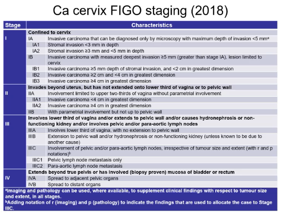

# GC Obstetrics Tutorial: Post-Partum Haemorrhage Lecture

- **Definition and terminology** - defined as \> 500 ml blood loss in vaginal delivery or \> 1000 ml blood loss in Caesarean section constituting major cause of direct maternal death:
    - <u>Primary post-partum haemorrhage</u> - PPH occuring \<= 24h of delivery (90% are primary PPH)
    - <u>Secondary post-partum haemorrhage</u> - PPH occuring \> 24h after delivery
- **Etiology of primary PPH** - 4 T's:
    - <u>Tone</u> - uterine atony (70% primary PPH):
        - Uterus fails to contract follow the delivery of the placenta, where uterine tone is often an inital mechanism of stopping torential bleeding
        - Uterus is soft on palpation and uterine massage can increase tone
    - <u>Tissue</u> - retained products of gestation (10%):
        - Failure of placenta to be delivered within 30 min after delivery of fetus, with no signs of placentea separation or retained cotyledon or seccenturiate lobe
    - <u>Trauma</u> - uterine tract trauma (20%):
        - Lacerations of the cervix, vagina or perineum
        - Extensions of lacerations from Caesarean section
        - Uterine rupture
    - <u>Thrombin</u> - coagulopathy:
        - Pre-existing coagulopathy
        - DIC
- **Risk factors of PPH:**
- **Prevention** - active Mx at 3rd stage of labour to prevent PPH:
    - <u>Cord management</u> - early clamping of umbilical cord with controlled cord traction of delivery of placenta
    - <u>Use of uterotonics</u>:
        - Syntometrine 1ml IM for low-risk delivery and uncomplicated instrumental deliveries
        - Syntocinon 5U bolus followed by infusion of 40U in high risk cases
- **Mx:**
    - **Principles of Mx:**
        - **Immediate measures** - primary assessment, establish monitoring and resuscitation, initial Ix and determining cause
        - **Mx of uterine atony:**
            - <u>Uterine massage</u> - trial of uterine massage as uterine atony is the most common cause of primary PPH
            - <u>Uterotonics</u> - consider empircal trial of uterotonics if suspecting uterine atony
        - **Mx of RPOG** - examination of placenta and exploration under GA arranged immediately if suspected
        - **Mx of genital tract trauma** - assessment of lower genital tract and repair w/ exploration under GA if suspected trauma
        - **Other therapies:**
            - <u>Fibrinolytics</u> - initiate IV tranexamic acid irrespective of cause
            - <u>Bakri balloon</u> - temporary tamponade of the uterus
            - <u>Radiological Mx</u> - embolisation of uterine artery
            - <u>Surgical Mx</u> - repair of rupture, ligation of internal iliac arteries or hysterectomy

# Cervical Cancer, HPV infection, and Cervical Intraepithelial Neoplasia - Literature Search on UpToDate Reference

## Cervical Cancer

- **Reference:**
    - [UpToDate: Invasive cervical cancer: Epidemiology, risk factors, clinical manifestations, and diagnosis](https://www.uptodate.com.eproxy.lib.hku.hk/contents/invasive-cervical-cancer-epidemiology-risk-factors-clinical-manifestations-and-diagnosis?search=cervical%20cancer&source=search_result&selectedTitle=1~150&usage_type=default&display_rank=1)
    - [UpToDate: Invasive cervical cancer: Staging and evaluation of lymph nodes](https://www.uptodate.com.eproxy.lib.hku.hk/contents/invasive-cervical-cancer-staging-and-evaluation-of-lymph-nodes?search=cervical+cancer&topicRef=3179&source=see_link)
    - [UpToDate: Management of early-stage cervical cancer](https://www.uptodate.com.eproxy.lib.hku.hk/contents/management-of-early-stage-cervical-cancer?search=cervical+cancer&topicRef=3179&source=see_link)
    - [UpToDate: Management of locally advanced cervical cancer](https://www.uptodate.com.eproxy.lib.hku.hk/contents/management-of-locally-advanced-cervical-cancer?search=cervical+cancer&topicRef=3179&source=see_link)

### Invasive cervical cancer: Epidemiology, risk factors, clnical manifestations, and diagnosis

- **Definition** - cancer of the uterine cervix, often associated with chronic human papillomavirus (HPV) infection
- **Epidemiology** - 3rd most common gynaecological cancer, and cause of death among gynaecological cancers in resource abundant regions w/ cervical cancer screening
- **Risk factors of cervical cancer** - shared risk factors between SCC and AD:
    - **HPV related** - 1) increased risk of HPV infection, and 2) inability to clear HPV infection:
        - <u>Increased risk of acquiring HPV infection</u>:
            - Early onset of sexual activity
            - Multiple sexual partners
            - High-risk sexual partners
            - Hx of STIs
        - <u>Reduced capacity of clearing the infection</u> - smoking (RR 1.50), various cause of immunosuppression (DM, HIV infections)
    - **Other risk factors:**
        - <u>Lower socioeconomic status</u> - likely due to limited access to healthcare and screening programmes
        - <u>Estrogen</u> - exogenous esttrogen exposure via OC pills is a/w higher risk of invasive cervical cancer (RR 1.9 for \>= use), and increases w/ duration of use
        - <u>+ve FHx</u> - possibly via genetics (possibily through inability to clear HPV infection) or rarely shared environmental exposures
- **Pathogenesis of cervical cancer** - HPV infection is necessary, but does not fully acount for 99.7% of cervical cancer:
    - <u>Oncogenic HPV infection</u> - infections of high-risk HPV (e.g. genotype 16 or 18 accounts for 70% of all cases) at the metaplastic epithelium in the cervical transformation zone
    - <u>Persistence of HPV infections</u> - persistence of HPV infections in individuals who are unable to clear the infection, resulting in formation of pre-cancer lesions
    - <u>Progression of pre-cancer lesions</u> - progression from LSIL to HSIL to frank invasive carcinoma classically over a course of 15-20 years
- **Histopathology of cervical cancer** - most common histological subtypes include 1) SCC, and 2) AD, both of which can be either 1) HPV-associated, or 2) HPV-independent: 

- **Clinical features of cervical cancer** - frequently asymptomatic in areas where screening is prevelant:
    - **Asymptomatic** - incidental finding of pre-malignant or malignant lesions on pap smear or gynaecological examination for a different indication
    - **Features of early disease:**
        - **Abnormal uterine bleeding** - most common clinical presentation where pattern of bleeding includes:
            - <u>Post-coital bleeding</u> - usually as a result of contact bleeding during intercourse
            - <u>Irregular or heavy menstrual bleeding</u> - raised suspicion in a pre-menopausal patient, but is more likely a result of other benign etiologies
            - <u>Post-menopausal bleeding</u> - suspected to be malignancy (endometrial or cervical) in a post-menopausal women
        - **Abnormal vaginal discharge** - increased vaginal discharge which may be watery, mucoid, purulent and malodourous, which may be mistakened for gynaecological infections
    - **Features of locally-advanced disease** - as a result of local invasion of the tumour:
        - <u>Pelvic pain</u> - chronic pelvic pain w/ or w/o radiation to the back and the legs
        - <u>Bowel Sx</u> - e.g. haematochezia, tenesmus, vaginal passage of stool due to bowel involvement of disease
        - <u>Urinary Sx</u> - haematuria, urinary frequency and urgency, as a result of bowel involvement of bladder
- **Signs:**
    - **General examination** - pallor, cachexia, palpation of LN (left SCN, groin LN)
    - **Abdominal examination** - detection of any abdominal mass
    - **Examination of the external genitalia:**
        - <u>Speculum examination</u> - visible cervical lesion, and Bx (even if previously -ve pap smear and HPV results):
            - Exophytic ulcerative lesion of the exocervix
            - Infiltrative growth of th endocervix which causes enlargement and induration of the cervix (barrel-shaped cervix)
        - <u>Bimanual examination</u> - assessment of local uterine size, mobility, and presence of adnexal/ parametria involvement
- **PR examination** - assessment of POD for complete assessment of parametria
- **Ix:**
    - **Bx on speculum examination** - direct Bx of visible lesion on speculum examination to confirm histological diagnosis
    - **Colposcopy and cervical Bx** - for those asymptomatic, abormal cervical cytology without a visible lesion for direct Bx
- **Dx** - histological diagnosis

### Invasive cervical cancer: Staging and evaluation of lymph nodes

- **Route of spread of cervical cancer:**
    - **Direct invasion** - into adjacent structures, primarily:
        - The uterine corpus and vagina
        - The parametria
        - The lateral pelvic wall
        - The peritoneum
        - The bladder or ureters (capable of causing hydronephrosis)
        - The rectum
    - **Lymphatic spread** - spread towards contiguously along pelvic side wall to pelvic (obturator, external iliac, common iliac) and para-aortic LN
    - **Haematogenous spread** - to lungs, liver bones, bowel, adrenal glands, spleen and brain
- **Principles of staging** - staging can be performed 1) clinically, 2) radiologically, and 3) surgically:
    - <u>Clinical stage</u> - initial impression of disease extent from P/E and simple, easily accessible investigations, such that staging can be performed in resource-limitted setting
    - <u>Radiological staging</u> - detailed staging by combining clinical information with cross-sectional imaging (e.g. MRI abdomen and pelvis)
    - <u>Surgicopathological staging</u> - typically only pursued in clinically early disease (e.g. \<= stage IB disease)
- **Staging system** - 2018 FIGO staging: 

- **Initial clinical staging by physical examination** - PV examination, rectal examination and systems review:
    - <u>Assessment of local tumour extent</u>:
        - Tumour size assessed on speculum examination
        - Vaginal examination on palpation for induration on vaginal wall
        - Parametrial involvement by rectovaginal examination
    - <u>Assessment of distant metastasis</u>:
        - Left SCN LN and groin LN
        - Palpate for hepatomegaly
- **Approach to staging Ix** - dependent on whether patient is suspected to have <u>early disease</u> or <u>advanced disease</u>:
    - <u>Early stage disease</u> (IA, IB1, IB2) - locoregional staging by MRI abdomen to determine resectability followed by surgical staging
    - <u>Advanced stage disease</u> (IB3 and above) - full staging for LN and distant metastasis prior to chemoirradiation
- **Staging Ix:**
    - **Routine bloods** - CBC, LRFT, tumour markers (SCC, CA-125)
    - **MRI abdomen and pelvis** (w/ or w/o contrast) - assess 1) tumour size, and 2) evaluation of local spread:
        - <u>Evaluation of tumour size</u> - assess size of tumour to determine whether they are viable for surgical resection (\< 4cm) or chemoradiation
        - <u>Evaluation of local spread</u> - for example:
            - Evaluation of vaginal extension
            - Evaluation of parametrial involvement
            - LN involvement
            - Spread to pelvic wall
            - Involvement of bladder, ureters, rectum etc
    - **CXR and CT T+A+P** - screen distant metastasis
    - **18-FDG PET/CT** - detection of distant metastasis indicated if suspected advanced disease clinically or upon MRI
    - **Additional Ix** - if local invasion into adjacent organs suspected:
        - Cystoscopy - if suspected bladder invasion
        - Renal USG, IV urogram or CT urogram - if suspected hydronephrosis
        - Sigmoidoscopy - if suspected rectal involvement
- **Sentinel LN biopsy:**
    - <u>Indications</u> - early-stage cervical cancer w/ intent of curative Tx via surgery (except for 1A disease w/o evidence of LVSI)
- **Lymphadenectomy** - for staging for failed sentinal LN or in those w/ suspicious grossly enlarged LN

### Management of early-stage cervical cancer

- **Definition of early-stage cervical cancer** - early cervical cancer refers to stage IA, IB1 and IB2 disease:
    - **Stage IA** - invasive carcinoma diagnoised only by microscopy, with maximum depth of invasion \< 5mm:
        - <u>IA1</u> - measured stromal invasion \<= 3mm in depth
        - <u>IA2</u> - measured stromal invasion \> 3mm and \<= 5mm in depth
    - **Stage IB** - invasive carcinoma with measured deepest invasion \>5mm, but lesion limited to the cervix uteri:
        - <u>IB1</u> - invasive carcinoma \> 5mm depth of stromal invasion, and \<= 2cm in greatest diameter
        - <u>IB2</u> - invasive carcinoma \> 2cm and \<= 4cm in greatest dimension
- **Principles of Mx:**
    - <u>Surgery</u> - surgical Mx preferred for most patients w/ early stage cervical cancer
    - <u>RT</u> -
    - <u>Adjuvant therapy</u> - adjuvant chemoradiation with evidence of high-risk features after surgery
- **Surgery:**
    - **Surgery vs RT:**
        - <u>Ovarian failure</u> - premature ovarian insufficiency is a common complication of pelic RT due to doses for curative-intent therapy
        - <u>Other complications of RT</u> - QoL of RT is poorer e.g. bowel dysfunction, urinary incontinence, sexual dysfunction, and pelvic pain
    - **Type of surgery:**
        - <u>Cone hysterectomy</u> - for selected stage Ia1 disease w/ no evidence of LVSI on the conization specimen
        - <u>Simple hysterectomy plus lymphadenectomy</u> - reserved for disease w/ limited stromal invasion, i.e. stage IA2 and IB1 disease
        - <u>Modified radical hysterectomy plus lymphadenectomy</u> - for patients with stage IB2 disease
    - **Cone hysterectomy** - for selected patients w/ extremely low risk of local recurrence:
        - <u>Indications</u> - curative Tx for stage 1A1 with no evidence of lymphovascular space invasion (LVSI)
        - <u>Subsequent Mx after hysterectomy</u>:
            - **Patients w/ -ve margins** - no subsequent Mx required
            - **Patients w/ +ve margins** - consider repeat cone biopsy (if fertility a concern) or simple hysterectomy
    - **Simple hysterectomy:**
        - <u>Principles</u> - removal of the uterus and cervix, but not the parametria or more than the upper margin of the vagina
        - <u>Indications</u>:
            - Cone hysterectomy w/ +ve margins
            - Stage 1A2 and 1B1 disease (1B2 a/w too high risk of recurrence)
    - **Radical hysterectomy:**
        - <u>Principles</u> - removal of uterus, cervix and upper part of the vagina
        - <u>Indications</u> - IB2 disease
    - **Trachelectomy:**
        - <u>Principles</u> - removal of the cervix and upper part of the vagina for fertility preservation:
        - <u>Indications</u> - selected low-risk early disease:
            - Lesion \<= 2cm
            - No LN metastasis
- **Adjuvant therapy:**
    - **Indications** - adjuvant chemoradiation if final pathological findings suggest intermmediate-to-high risk of recurrence:
        - <u>Intermediate risk of reccurence</u> (Sedlis criteria) - up to 30% risk of recurrence w/ surgery alone:
            - Presence of LVSI + deep one-third cervical stromal invasion + tumour of any size
            - Presence of LVSI + middle one-third cervical stromal invasion + tumour size \> 2cm
            - Presence of LVSI + superficial one-third of cervical stromal invasion + tumour size \> 5cm
            - Absence of LVSI but deep or middle one-third stromal invasion + tumour size \> 4cm
        - <u>High-risk of recurrence</u> (Peters criteria) - up to 40% risk of recurrence and 50% risk of death w/ surgery alone:
            - Positive surgical margins
            - Pathologically confirmed involvement of pelvic LN
            - Microscopic involvement of the parametrium
    - **Adjuvant RT** - as adjuvant RT alone (if no definite indication for adjuvant chemoradiation) or as part of chemoradiation:
        - **Principles of RT** - requires targetting soft tissue at risk (e.g. parametrium, vagina) and all locoregionally draining lymphatics, from obturator to common iliac LN (+/- para-aortic LN if sufficiently high risk):
        - **RT techniques:**
            - <u>Conventional 2DRT</u> - traditionally performed w/ 4-field technique:
                - Superior field border at the L4-5 disc space
                - Inferior field border at 3-4 below lower extent of disease or to the bottom of obturator foramen
                - Lateral margin set 1.5-2cm lateral to pelvic brim
            - <u>Contemporary 3D conformal RT</u> - e.g. IMRT a/w similar survival benefits but with a much improved toxicity profile
    - **Adjuvant chemotherapy** - chemotherapy as <u>radiosensitizing agent</u> to increase therapeutic window of RT

### Management of locally advanced cervical cancer

- **Definition** - locally advanced cervical cancer is defined as stage IB3, II or III or IVA disease:
    - <u>Stage IB3 disease</u> - macroscopic tumour confined to the cervix \> 4cm in greatest dimension
    - <u>Stage II disease</u> - invasion beyond the uterus into the parametria, but has not extended to the lower third of the pelvic side wall
    - <u>Stage III disease</u> - tumour that 1) invades to pelvic side wall, 2) causes hydronephrosis, 3) invades to lower third of the vagina, or 4) involves pelvic or para-aortic LN
    - <u>Stage IVA disease</u> - tumour that invades the mucosa of the bladder or adjacent pelvic organs
- **Principles of Mx:**
    - <u>Chemoradiation</u> - chemoradiation w/ cisplatin remains the backbone of Tx
    - <u>Role of immunotherapy</u> - pembrolizumab may be incorporated into Tx of locally advanced cervical cancer for stage III disease or above

## Cervical Intraepithelial Neoplasia

- **Reference:**
    - [UpToDate: Cervical intraepithelial neoplasia: Terminology, incidence, pathogenesis, and prevention](https://www.uptodate.com.eproxy.lib.hku.hk/contents/cervical-intraepithelial-neoplasia-terminology-incidence-pathogenesis-and-prevention?search=cervical%20epithelial%20neoplasia&source=search_result&selectedTitle=2~150&usage_type=default&display_rank=2)
    - [UpToDate: Cervical intraepithelial neoplasia: Management](https://www.uptodate.com.eproxy.lib.hku.hk/contents/cervical-intraepithelial-neoplasia-management?search=cervical+epithelial+neoplasia&topicRef=3216&source=see_link)
    - [UpToDate: Cervical intraepithelial neoplasia: Choosing excision versus ablation, and prognosis and follow-up after treatment](https://www.uptodate.com.eproxy.lib.hku.hk/contents/cervical-intraepithelial-neoplasia-choosing-excision-versus-ablation-and-prognosis-and-follow-up-after-treatment?search=cervical%20epithelial%20neoplasia&topicRef=3215&source=see_link#H2219543527)
    - [UpToDate: Cervical intraepithelial neoplasia: Diagnostic excisional procedures](https://www.uptodate.com.eproxy.lib.hku.hk/contents/cervical-intraepithelial-neoplasia-diagnostic-excisional-procedures?sectionName=COMPLICATIONS&search=cervical%20epithelial%20neoplasia&topicRef=89208&anchor=H8&source=see_link#H18)

### Cervical intraepithelial neoplasia: Terminology, incidence, pathogenesis, and prevention

- **Definition and terminology** - in the Bethesda system, different terminology are used for cytological (Pap smear), and histological (on biopsy) findings:
    - <u>Cervical intraepithelial neoplasia</u> (CIN) - defined histologically as a pre-malignant condition of the uterine cervix w/ squamous abnormalities, to be differentiated from atypical glandular cells on cervical smear, or cervical adenocarcinoma in situ
    - <u>Squamous intraepithelial lesion</u> (SIL) - defined cytologically as the presence of dysplastic cells on pap smear

  
  
- **Epidemiology:**
    - <u>Incidence</u> (US data from screening) - 4% are CIN1 (LSIL), 5% are CIN2-3 (HSIL)
- **Pathogenesis of cervical intra-epithelial neoplasia:**
    - **Human papillomavirus infection** - major etiological <u>agent necessary, but not insufficient for carcinogenesis</u>; association is so strong, that most other behavioral, sexual, and socieoeconomic co-variables are <u>found to be dependent on HPV</u> and do not hold up as independent risk factors:
        - <u>Low-risk genotypes</u> (HPV 6 and 11) - infection by low-risk genotypes do not integrate into the host genome, and only cause condyloma acuminatum (accounts for 90% of genital warts), and CIN1 (10% of LSIL on cytology)
        - <u>High-risk genotypes</u> (HPV 16, 18, and many more) - strongly associated in development of high-grade lesions and invasive carcinomas, accounting for 25% of CIN1, 50-60% of CIN2-3, and 70% of cervical cancers
    - **Persistence of HPV infections** - persistence of infections is necessary for development of CIN, with the likelihood of persistence being related to:
        - <u>Older age</u> - 50% of those w/ high-risk HPV persist in patients \> 55y compared w/ 20% in those \< 25y
        - <u>Duration of infection</u> - a strong predictor of persistence and time necessary to clear
        - <u>HPV subtype</u> - high-risk HPV subtypes are more likely to persist than low-risk HPV subtypes
    - **Co-factors of pathogenesis:**
        - <u>Immunosuppression</u> - increased risk of CIN likely due to inability to clear the infection
        - <u>Cigarette smoking</u> - appears to have a synergistic effect w/ HPV infections in development of CIN and carcinoma
- **Prevention:**
    - <u>Primary prevention</u> - prophylactic vaccination against oncogenic HPV infections
    - <u>Secondary prevention</u> - pap smear aimed at cervical cancer rather than CIN

### Cervical intraepithelial neoplasia: Management

- **Principles of Mx:**
    - **General appraoches to Mx** - observation vs definitive Mx:
        - <u>Observation</u> - close observation w/ repeated cervical cytology, HPV testing +/- colposcopy as indicated
        - <u>Definitive Tx</u> - excisional or ablative Tx of the cervical transformation zone
    - **Considerations for appropriate Mx** - dependent on 1) risk for progression to cancer, 2) treatment-related morbidity, 3) likelihood of compliance:
        - <u>Risk of cancer progression</u>:
            - Age - \< 25y typically have a lower risk of developing cervical cancer than patients \> 25y (although it is rare for histological confirmation of CIN as cytology not performed)
            - CIN grade - CIN1 is low-grade and has high potential for regression, while CIN2-3 is high-grade and has high potential for progression to malignancy
        - <u>Treatment-related morbidities</u> - major S/E includes adverse pregnancy outcomes, and plans for pregnancy must be balanced w/ risk of progression
        - <u>Likelihood of compliance</u> - patients unable to comply to repeated cytology, HPV testing and colposcopy should be referred to definitive Tx
    - **Mx of CIN1:**
        - <u>Observation</u> - observation with HPV co-testing q1y if preceeding cytology is LSIL or less (i.e. LSIL, ASC-US, NILM)
    - **Mx of CIN2,3** - definitive Tx is preferred

### Cervical intraepithelial neoplasia: Choosing excision versus ablation, and prognosis and follow-up after treatment

- **Excision vs eblation** - loop electrosurgical excision procedure (LEEP) has largely replaced practice of ablation as it provides histological specimen for review; considerations include:
    - <u>Efficacy of Tx</u> - excision is a/w lower rates of treatment failure, lower rates of disease persistence in meta-analyses
    - <u>Necessity of histological specimen</u> - often required for high-risk lesions, high risk of invasive disease, or when there is diagnostic uncertainty
    - <u>Pregnancy-associated morbidity</u> - patients planning future pregnancy may choose to avoid excision as associated w/ increased risk of adverse obstetric outcomes
