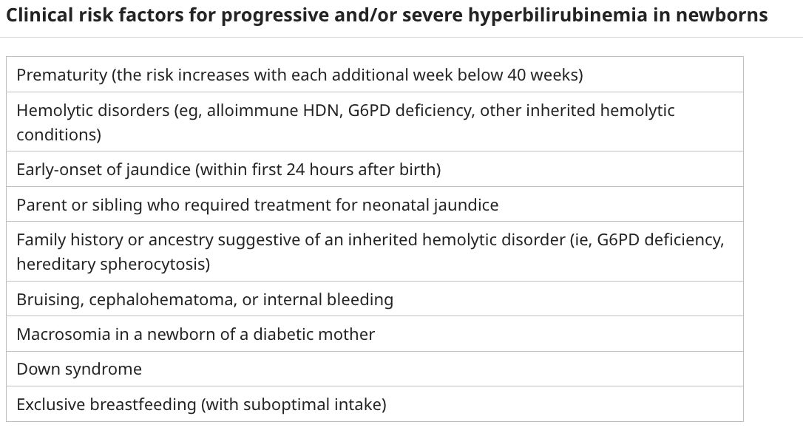
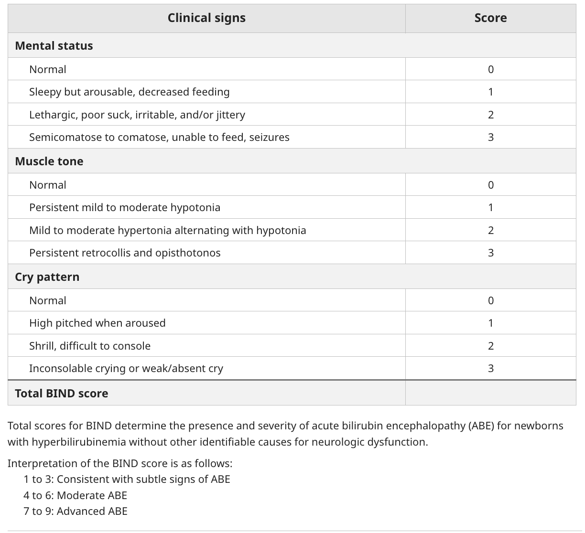

# Neonatal jaundice - Literature Search on UpToDate Reference

- **Reference:**
    - [UpToDate: Unconjugated hyperbilirubinaemia in neonates: Etiology and pathogenesis](https://www.uptodate.com.eproxy.lib.hku.hk/contents/unconjugated-hyperbilirubinemia-in-neonates-etiology-and-pathogenesis?search=neonatal+jaundice&topicRef=5063&source=see_link)
    - [UpToDate: Unconjugated hyperbilirubinaemia in neonates: Risk factors, clinical manifestations, and neurological complications](https://www.uptodate.com.eproxy.lib.hku.hk/contents/unconjugated-hyperbilirubinemia-in-neonates-risk-factors-clinical-manifestations-and-neurologic-complications?search=neonatal%20jaundice&source=search_result&selectedTitle=3~89&usage_type=default&display_rank=3)
    - [UpToDate: Unconjugated hyperbilirubinaemia in term and late preterm newborns: Initial management](https://www.uptodate.com.eproxy.lib.hku.hk/contents/unconjugated-hyperbilirubinemia-in-term-and-late-preterm-newborns-initial-management?search=neonatal%20jaundice&source=search_result&selectedTitle=2~89&usage_type=default&display_rank=2)
    - [UpToDate: Causes of cholestasis in neonates and young infants](https://www.uptodate.com.eproxy.lib.hku.hk/contents/causes-of-cholestasis-in-neonates-and-young-infants?search=neonatal+jaundice&topicRef=4994&source=see_link)

## Unconjugated hyperbilirubinaemia in neonates: Etiology and pathogenesis

- **Definitions and terminology:**
    - <u>Benign neonatal hyperbilirubinaemia</u> - is a transient and normal increase in total serum or plasma bilirubin level occuring in nearly all newborn infants, also referred as physiological jaundice
    - <u>Severe neonatal hyperbilirubinaemia</u> - defined as TSB \> 428 mmol/L which is associated w/ increased risk of bilirubin-induced neurotoxicity
- **Benign neonatal hyperbilirubinaemia** (physiological NNJ) 0 a transitional phenomenon where turnover of fetal RBCs and increased enterohepatic circulation outpaces hepatic bilirubin clearance:
    - **Pathophysiology** - a transitional phenomenon where bilirubin load outpaces hepatic bilirubin clearance:
        - **Increased bilirubin load:**
            - <u>Increased Hb load</u> - newborns have more RBC (HCT 50-60%) and fetal RBCs have a shorter half-life, where turnover of fetal RBCs results in **increased production of bilirubin**
            - <u>Increased enterohepatic circulation</u> - limited bacterial conversion of conjugated bilirubin to urobilin, enabling de-conjugation and reabsorption
        - **Immature bilirubin clerance** - lack of expression of UGTA1 for conjugation of bilirubin, which only reaches adult level by 14 weeks of age
    - **Natural Hx of bilirubin** - impacted by 1) gestational age, 2) feeding (breastfeed jaundice), and ethnicity due to differences in bilirubin metabolism:
        - <u>Progression of TSB</u>:
            - No jaundice within first 24h
            - Clinically apparent in 2-3d
            - Peaks at around 3-5d
            - Resolves at around 10-14d
        - <u>Peak TSB</u> - typically ranges from 120-240 mmol/L (8-14 mg/dL)
- **DDx of clinically significant unconjugated neonatal hyperbilirubinaemia** - pathological conditions caused by exaggerations of mechanisms of physiological NNJ:
    - **Increased bilirubin production:**
        - <u>Isoimmune-mediated haemolysis</u> - e.g. RhD incompatibility, ABO incompatibility
        - <u>Inherited haemolytic anaemia</u> - enzymopathies (e.g. G6PD, PK), membranopathies (hereditary spherocytosis)
        - <u>Neonatal sepsis</u> - increased oxidative stress resulting in intravascular haemolysis
        - <u>Birth complications</u>:
            - e.g. Birth asphyxiation resulting in transient polycythaemia
            - Birth trauma resulting in extravastation of blood (cephalohaematoma or intraventricular haemorrhage)
        - <u>Macrosomia of diabetic mothers</u> - increased bilirubin production due to polycythaemia or ineffective haematopoesis
    - **Decreased bilirubin clearance** - various genetic defects resulting in impaired uptake or conjugation:
        - <u>Crigler-Najjar syndrome</u>:
            - Crigler-Najjar syndrome type I (CN-I) - a/w complete absence of UGTA1 enzyme activity resulting in severe hyperbilirubinaemia and neccessity of life-long phototherapy to avoid BIND
            - Crigler-Najjar syndrome type II (CN-II) - a/w reduced UGT1A1 activity and hyperbilirubinaemia response to phenobarbital
        - <u>Gilbert syndrome</u> - reduced expression of UGTA1 activity, but often postulated that it alone cannot result in neonatal jaundice
    - **Increased enterohepatic circulation of bilirubin:**
        - <u>Breastmilk jaundice</u> - mild, but prolonged hyperbilirubinaemia as a result of bresatfeeding (but not in formula-fed infants) attributed to high-concentrations of beta-glucuronidase in breast milke
        - <u>Intestinal obstruction</u> - ileus or mechanical IO results in increased enterohepatic circulation
    - **Breastfeed jaundice** (inadequate milk intake) - as a result of hypovolaemia, slower bilirubmin elimination and increased interohepatic circulation

## Unconjugated hyperbilirubinaemia in neonates: Risk factors, clinical manifestations, and neurological complication

- **Epidemiology:**
- **Risk factors for severe unconjugated hyperbilirubinaemia:**
    - <u>Prematurity</u> - risk increases each additional week earlier than 40 weeks of gestation
    - <u>Early-onset jaundice</u> - within 24h of birth which is always pathological and should be worked up
    - <u>+ve FHx</u> - family history of inherited haemolytic disorders, or a sibling who require phototherapy or exchange transfusion as newborn
    - <u>Birth trauma</u> - cephalohematoma or other significant bruising at birth
    - <u>LGA</u> - of a pregnant mother w/ diabetes

  
  
- **Clinical manifestations:**
    - <u>Jaundice</u> - yellow-green discoluration of the skin, as well as conjunctival, buccal or gingival mucosa, progrssing in a **cephalocaudal direction**, or upon detection by transcutaneous bilirubin device via screening
- **Bilirubin-induced neurological disorder** - spectrum of neurotoxic injuries collectively referred as BIND:
    - <u>Pathogenesis</u> - unconjugated bilirubin crosses BBB and caues cytological injuries, particularly affecting the **basal ganglia** and **brainstem nuclei for occulomotor and auditory functions**
    - <u>Classical threshold for increased risk of BIND</u> - 428 mmol/L (25 mg/dL)
    - <u>Clinical spectrum</u> - ranges from acute bilirubin encephalitis (ABE) to chronic bilirubin encephalitis (kernicterus):
        - Disorders of the visuocortical pathway
        - Sensorineural hearing loss
        - Movement disorders
        - Abnormal proprioception
        - Speech and language disabilities
        - Cognitive delays
- **Acute bilirubin encephalopathy** - acute S/S accounting for bilirubin neurotoxicity in a newborn with severe persistent hyperbilirubinaemia:
    - **Clinical features:**
        - <u>Early features</u> - drowsiness, mild hyppotonia and high-pitched cry
        - <u>Intermediate features</u> - febrile and lethargy, poor feeding, hypertonia w/ retrocollis and opisthotonos
        - <u>Advanced features</u> - seizure, respiratory arrest, coma
    - **BIND score:** 
    
    - **Mx** - emergency exchange transfusion
- **Chronic bilirubin encephalopathy** (Kernicterus) - permanent post-ecteric brain injury charaacterised by choreoathetoid cerebral palsy and other chronic neurological impairments:
    - **Risk related to severity of hyperbilirubinaemia** - classical threshold of 428 mmol/L (a/w 5% risk)
    - **Clinical features:**
        - Choreathetoid cerebral palsy (chorea, ballismus, tremor, dystonia)
        - Sensorineural hearing loss
        - Upward gaze palsies

## Unconjugated hyperbilirubinaemia in term and late preterm newborns: Initial management

- **Pretreatment Ix:**
    - **Routine bloods** - CBC, reticulocyte count, DAT, G6PD, confirmatory direct- and indirect-bilirubin
- **Principles of Mx:**
    - <u>Prevention of severe hyperbilirubinaemia</u> - avoiding severe hyperbilirubinaemia is a/w reduced risk of BIND
    - <u>Avoid interference to initiation of breast feeding and carer bonding</u> - as newborn will have to spend time away from mother if phototherapy is necessary
- **Indications for Tx:**
    - <u>Symptomatic patients</u> - all w/ ABE should immediately excalate care and undergo exchange transfusions
    - <u>Asymptomatic patients</u> - indication for phototherapy dependent on 1) gestational agem and 2) other risk factors for neurotoxicity

## Causes of cholestasis in neonates and young infants

# Stroke - Literature Search on UpToDate Reference

- **References:**
    - [UpToDate: Stroke: Etiology, Classification, and Epidemiology](https://www.uptodate.com.eproxy.lib.hku.hk/contents/stroke-etiology-classification-and-epidemiology?search=stroke&source=search_result&selectedTitle=4~150&usage_type=default&display_rank=4)

## Stroke: Etiology, Classification and Epidemiology

- **Definition** - rapid onset of neuroloical S/S that arises from a pathological process of vascular origin (ischaemia or haemorrhage)
- **Etiology of ischaemic stroke:**
    - **Thrombosis** - local in-situ obstruction of the artery, as a result of thrombus formation in an artery by 1) reducing distal blood flow or 2) artery-to-artery embolism:
        - **Large-vessel disease** - different pathological processes may affect extracranial vessels and intracranial vessels, although atherosclerosis is the most common cause:
            - <u>Extracranial vessel disease</u> (common carotid, internal carotid, veretebral) - pathologies affecting large vessels include, 1) atherosclerosis, 2) dissection, 3) Takayasu arteritis, 4) Giant cell arteritis, and 5) fibromuscular dysplasia
            - <u>Intracranial vessel disease</u> (Circle of Willis and proximal branches) - pathologies affecting intracranial vessels include, 1) atherosclerosis, 2) dissection, 3) vasculitis/ non-inflammatory vasculopathies, 4) Moyamoya syndrome, 5) vasoconstriction
        - **Small vessel disease** - pathological process affecting the intracerebral arterial system (most commonly lacunar stroke), as a result of caused by 1) lipohyalinosis (medial hypertrophy), and 2) atheroma formation in feeding parent artery
    - **Embolism** - classified based on the likely source of embolism:
        - <u>Cardiac origin</u> - Hx compatible w/ cardioembolism with an identifiable 'high-risk' cardiac source
        - <u>Aortic origin</u> - Hx compatible w/ embolism from aortic atherosclerotic lesion, although often confounded by the presence of concomittent large vessel lesions
        - <u>Possible cardiac or aortic origin</u> - Hx compatible w/ embolism, although TTE/TOE reveals embolism may be of cardiac or aortic source
        - <u>Cryptogenic embolic stroke</u> - Hx compatible w/ embolism, although tests for all embolic sources are negative (may be due to subclinical AF)
    - **Systemic hypoperfusion** - global hypoperfusion (i.e. shock) resulting in diffuse ischaemia where 'watershed zones' are affected most, characterised by cortical blindness and weakness of shoulder and thighs w/ sparing of face, hands and feet
    - **Blood disorders** - uncommon cause of stroke and TIA, but should be considered in patients \< 45y, and in patients w/ cryptogenic stroke:
        - <u>Inherited thrombophilia</u> - Antithrombin deficiency, Protein C/S deficiency, factor V leiden
        - <u>Acquired pro-thrombotic states</u> - e.g. Anti-phospholipid syndrome, thrombotic thrombocytopenic purpura, heparin-induced thrombocytopenia
        - <u>Myeloproliferative neoplasms</u> - polycythaemia vera, essential thrombocytosis
        - <u>Other blood disorders</u> - e.g. sickle cell anaemia
- **High-risk cardiac source of embolic stroke and TIA:**
    - <u>Arrhythmia</u> - AF, pAF, sick sinus syndrome, Sustained AFlu
    - <u>Valvular heart disease</u>:
        - Infective endocarditis
        - Rheumatic heart disease (esp. w/ MS or aortic valve involvement)
        - Sterile endocarditis a/w lupus (i.e. Libman-Sacks endocarditis), APLS, and cancer (marantic endocarditis)
        - Bioprosthetic and mechanical heart valves
    - <u>Ischaemic heart disease</u>:
        - Recent MI (within 1mo)
        - Old MI a/w HFpEF and LVEF \< 28%
        - Recent coronary artery bypass graft (CABG) surgery
    - <u>Visible source of emboli</u>:
        - Atrial or ventricular thrombus
        - Left atrial myxoma
        - Papillary fibroelastoma
    - <u>Others</u> - DCM, symptomatic congestive heart failure w/ LVEF \< 30%
- **Classification systems for ischaemic stroke** - historically TOAST classification (1990) to determine most-likely cause of stroke, while CCS was subseuquently devised for stroke subtyping: 

## Ischaemic stroke

- **References:**
    - [UpToDate: Definition, etiology, and clinical manifestations of transient ischemic attack](https://www.uptodate.com.eproxy.lib.hku.hk/contents/definition-etiology-and-clinical-manifestations-of-transient-ischemic-attack?search=stroke&topicRef=1123&source=see_link)
    - [UpToDate: Overview of the evaluation of stroke](https://www.uptodate.com.eproxy.lib.hku.hk/contents/overview-of-the-evaluation-of-stroke?search=stroke&topicRef=1089&source=see_link)
    - [UpToDate: Neuroimaging of acute stroke](https://www.uptodate.com.eproxy.lib.hku.hk/contents/neuroimaging-of-acute-stroke?search=stroke&topicRef=1126&source=see_link)
    - [UpToDate: Clinical diagnosis of stroke subtypes](https://www.uptodate.com.eproxy.lib.hku.hk/contents/clinical-diagnosis-of-stroke-subtypes?search=stroke&topicRef=1089&source=see_link)
    - [UpToDate: Differential diagnosis of transient ischemic attack and acute stroke](https://www.uptodate.com.eproxy.lib.hku.hk/contents/differential-diagnosis-of-transient-ischemic-attack-and-acute-stroke?search=stroke&topicRef=1123&source=see_link)
    - [UpToDate: Initial assessment and management of acute stroke](https://www.uptodate.com.eproxy.lib.hku.hk/contents/initial-assessment-and-management-of-acute-stroke?search=stroke&topicRef=1083&source=see_link)
    - [UpToDate: Initial evaluation and management of transient ischaemic attack and minor ischaemic stroke](https://www.uptodate.com.eproxy.lib.hku.hk/contents/initial-evaluation-and-management-of-transient-ischemic-attack-and-minor-ischemic-stroke?search=stroke&topicRef=1088&source=see_link)
    - [UpToDate: Early antithrombotic treatment of acute ischaemic stroke and transient ischaemic attack](https://www.uptodate.com.eproxy.lib.hku.hk/contents/early-antithrombotic-treatment-of-acute-ischemic-stroke-and-transient-ischemic-attack?sectionName=Efficacy+of+aspirin&search=stroke&topicRef=1126&anchor=H26300194&source=see_link#H26300194)

### Definition, etiology, and clinical manifestations of transient ischaemic attack

- **Definition and terminology** - historically two definitions of TIA:
    - <u>Classic time-based definition</u> - sudden onset of focal neurological S/S lasting \< 24h, that is likely brought on by a transient decrease in blood flow to a specific vascular territory and rendering the brain or retina ischaemic (arbitrary time cut-off w/ no biological explanation, where MRI demonstrates infarction could occur even w/ focal neurological S/S \< 1h)
    - <u>Tissue-based definition</u> - transient episode of focal neurological S/S caused by focal brain or retinal ischaemia w/o evidence of acute infarction in neuroimaging/ clinical evidence (i.e. no persistence of S/S)
- **No reliable correlation between symptom duration and infarction:**
    - Non-absolute association between increasing duration of classically-defined TIA and probability of infarction on DWI
    - Classically defined TIA w/ symptom lasting for as little as few minutes can be a/w infarction on DWI
    - Spells that lasts for many hours may show non signs of infarction on DWI
    - Furthermore, most patients seek medical attention once symptoms has resolved, not at the height of their symptoms
- **Etiology of TIA** - classified into 1) embolic TIA, 2) lacunar or small vessel TIA, and 3) low-flow TIA:
- **Risk of recurrence stroke** - risk of disabling stroke especially in the immediate days following the event, and also over subsequent years:
    - **Factors affecting stroke risk:**
        - <u>Time from index event</u> - greatest risk within the first 48h after TIA (1.5-3.5%), making up approximately 40% of 90d stroke risk
        - <u>Etiology of TIA</u> - higher risk if if TIA caused by vascular pathologies (e.g. large artery atherosclerosis and small vessel disease), compared w/ cardioembolism
    - **ABCD2 score** (applicable in primary care and emergency departments for urgency of specialist evaluation) - takes into account of Age, BP, Clinical Features, Duration of Symptoms and Diabetes to predict risk of ischaemic stroke in first 2 days after TIA: 
    
        - **Interpretation** - clinically use a cut-off of \</\>= 4 to guide secondary stroke prevention:
            - <u>Score 0-3</u> - low two-day stroke risk (1%)
            - <u>Score 4-5</u> - moderate two-day stroke risk (4%)
            - <u>Score 6-7</u> - high two-day stroke risk (7%)
        - **Limitations** - poor performance in identifying patients in need of urgent intervention (including carotid stenosis and AF):
            - A meta-analysis (Wardlaw et al 2015) (Sanders et al (demonstrated that ABCD2 score) (Sanders et al (does not reliably discriminate) (Sanders et al (those at low and) high risk of early recurrent stroke, where 1 in 5 patients have a treatable vascular pathology such as carotid stenosis or AF
            - Another meta-analysis (Sanders et al 2012) showed that score performance was poor in setting of low baseline stroke risk
            - The clinical features included in the scoring system do not adequately assess patients w/ posterior circulation symptoms, such as ataxia, or visual field deficits

### Overview of the evaluation of stroke

- **Classification:**
    - <u>Transient brain ischaemia</u> - defined as a transient episode of neurological dysfunction caused by focal brain, spinal cord, or retinal ischaemia without infarction (tissue-based definition abolishes arbitrary time cut-off of 24h)
    - <u>Intracerebral haemorrhage</u> - bleeding within brain matter derived from arterioles or small arteries, spreading along white matter tract
    - <u>Subarachnoid haemorrhage</u> - rupture of arterial aneurysms within the subarachnoid space causing rapid rise of ICP
- **Approach to suspected stroke:**
    - <u>Initial assessment</u> - primary assessment (ABC), temperature
    - <u>Targeted Hx and P/E</u> - 1) r/o stroke mimics, 2) differentiation between ischaemic stroke and haemorrhagic stroke, and 3) determine whether patient is candidate for reperfusion
    - <u>Initial Ix</u> - routines, neuroimaging, and cardiac evaluation (+/- hypercoagulable studies)
- **Salient points of Hx:**
    - **HPI** - last known well, characterisation of clinical course, including onset, progression, provacation, previous episodes:
        - <u>Last known well</u> - eligibility criteria of TPA and mechanical thrombectomy
        - <u>Onset</u> - immediate onset to maximal intensity of Sx a/w SAH and embolic stroke; gradual onset is a/w ischaemic stroke and occasionally ICH
        - <u>Progression of Sx</u> - each stroke subtype has a characteristic clinical course:
            - **Thrombotic stroke** - gradual onset of Sx that fluctuates between normal and abnormal, <u>progressing in a step-wise, stuttering, fashion</u>, with the duration of Sx evolution being longer for large vessel occlusions
            - **Embolic stroke** - sudden onset to maximal intensity, also often a/w rapid recovery
            - **Intracerebral haemorrhage** - sudden onset and progresses gradually over minutes or a few hours
            - **Subarachnoid haemorrhage** - immediate onset to maximal intensity, usually presenting w/ 'thunderclap headache', while focal neurological Sx is less common

      
      
        - <u>Provacation</u> - note the activity at the onset or just before the stroke:
            - **Spotaneous haemorrhagic stroke** - sometimes can be precipitated by sex or other physical activities
            - **Ischaemic stroke** - typically sudden onset
            - **Embolic stroke** - of interest is a/w getting up at night to urinate (a matutinal embolus)
        - **Previous episodes** - history of TIA:
            - History over same territory favours presence of local vascular lesion
            - History of TIA over more than vascular territory suggest extra-cranial embolisation
    - **Associated Sx:**
        - <u>Fever</u> - consider IE causing embolic stroke, or intercurrent infection predisposing to thrombosis
        - <u>Headache</u> - usually dominant features of haemorrhagic stroke, but may precede thrombotic stroke
        - <u>Nausea and vomiting</u> - reflects either 1) raised ICP secondary to haemorrhagic stroke, or 2) disorientation from vertigo as a result of posterior circulation stroke
        - <u>Altered states of consciousness</u> - favours the presence of haemorrhage, where presence of focal S/S suggestives ICH, while absence suggests SAH
    - **PMH:**
        - <u>Diabetes mellitus</u> - increased likelihood of large and small vesel occlusive disease
        - <u>HTN</u> - increased risk of both ischaemic and haemorrhagic stroke
        - <u>Hyperlipidaemia</u> - increased risk of thrombotic stroke
        - <u>Other atherosclerotic disease</u> - Hx of PAD or CCS a/w increased likelihood of ischaemic stroke
        - <u>Cardiovascular disease</u> (e.g. atrial fibrillation, valvular heart disease, prior MI) - increased probability of cardioembolism
        - <u>Known bleeding tendancy</u> - a/w increased risk of haemorrhagic stroke
    - **Drug Hx** - antiplatelet, anticoagulant
    - **Relevant FHx and SHx** - smoking and alcohol intake
- **P/E:**
    - **Initial general assessment** - primary assessment and temperature:
        - <u>Airway</u> - ensure airway is patent, especially if N/V due to raised ICP
        - <u>Breathing</u> - Hypoventilation may complicate certain strokes (e.g. vertibrobasilar ischaemia, or those w/ raised ICP) that reduces respiratory drive, where increased in PaCO2 results in cerebral vasodilation and worsens ICP
        - <u>Circulation</u> - BP elevated, which may reflect 1) chronic hypertension, or 2) an acute elevation in BP to maintain cerebral perfusion
        - <u>Temperature</u> - concurrent fever can be related to underlying disease (e.g. infective endocarditis), and can worsen ischaemia (hence normothermia should be maintained)
    - **Neurological examination** - clinical stroke localisation: 
    
- **Ix:**
    - **Routine bloods** - RBG, CBC, LRFT, clotting profile, lipid profile, A1c, ESR/CRP:
        - <u>RBG</u> - r/o hypoglycaemia (esp. in elderly) as stroke mimic
        - <u>CBC</u> - detection of anaemia, leukocytosis or severe thrombocytopenia
        - <u>RFT</u> - hydration status, and electrolyte abnormalities
        - <u>Clotting profile</u> - abnormal clotting profile raises suspicion of haemorrhagic stroke
        - <u>Lipid profile</u> - detect dyslipidaemia as atherosclerotic risk factor
        - <u>A1c</u> - determine glycaemic control
        - <u>ESR/CRP</u> - underlying inflammatory disease
    - **Neuroimaging** - CT or MRI brain to distinguish between stroke subtypes
    - **Cardiac evaluation** - 12-lead ECG, 24-48h cardiac monitoring, echocardiogram, ambulatory cardiac event monitoring:
        - <u>12-lead ECG</u> - detection of concurrent myocardial ischaemia and atrial fibrillation
        - <u>24-48h cardiac monitoring</u> - for detection of subclinical AF
        - <u>Echocardiogram</u> - to identify a source of embolism from the heart or aorta
        - <u>Ambulatory cardiac event monitoring</u> - increased detection rates of subclinical AF in those who presents w/ cryptogenic ischaemic stroke or TIA to prevent recurrent stroke (EMBRACE trial)

### Neuroimaging of acute stroke

### Clinical diagnosis of stroke subtypes

### Differential diagnosis of transient ischemic attack and acute stroke

- **DDx of stroke** - non-vascular causes of acute onset of focal neurological S/S:
    - **Persistent neurological deficits:**
        - <u>Traumatic brain injury</u> - head trauma resulting in subdural or epidural haematoma
        - <u>Focal brain SOL</u> (e.g. brain tumour) - can cause abrupt onset or worsening, particularly when it reaches critical mass or intra-tumoral haemorrhage occurs
        - <u>CNS infections</u> - encephalitis or brain abscesses
        - <u>Neuroinflammatory disorders</u> - esp. MS, where Hx f prior attacks is important in identification of the disease
        - <u>Non-ketotic hyperglycaemic stupor</u> (HHS) - considered in diabetic patients
    - **Transient neurological deficits:**
        - <u>Seizures</u> - focal seizures typically results in +ve Sx, although paralysis may occur after an event (Todd's paresis)
        - <u>Migraine aura</u> - complex focal neurological S/S often accompanies migraine headache
        - <u>Hypoglycaemia</u> - important cause of focal neurological S/S of the elderly

### Initial assessment and management of acute stroke

### Early antithrombotic treatment of acute ischaemic stroke and transient ischaemic attack

- **Diagnosis and triage** - diagnosis is clinical based upon a dtermination that the Sx of tattack are more likely caused by brain ischaemia than other causes
- **Importance of early evaluation of Tx** - neurological emergency despite transient, non-disabling Sx as habours an increased risk of infarction in the immediate period after the index event:
- **Immediate antiplatelet therapy:**
    - <u>Dual antiplatelet therapy</u> - indicated for patients w/ high-risk TIA (ABCD2 \>= 4)or minor ischaemic stroke
    - <u>Aspirin monotherapy</u> - for low-risk TIA (ABCD2 \< 4)
- **Ix:**
    - **Neuroimaging** - CT/ MRI brain indicated \<= 24h:
        - **Brain MRI w/ DWI** - preferred study as greatest Sn for detection of small infarcts
        - **CT** - suboptimal alternative but effective in r/o of stroke mimics
    - **Vascular imaging** - to assess TI subtype by determining whether TIA is of vascular origin:
        - **CT angiography** - widely assessible and higher Sn for detection of intracranial stenosis and occlusions compared w/ MRA
        - **Carotid duplex usltrasonography** - for evaluation of carotid stenosis
    - **Cardiac evaluation** - to detect cardioembolic TIA:
        - <u>12-lead ECG</u> - detection of ongoing AF
        - <u>Cardiac monitoring</u> - observation unit telemetry or Holter monitor for at least 24h for detection of subclinical AF if initial 12-lead and neuroimaging does not reveal a clear etiology
        - <u>Echocardiography</u> - detection of other non-arrhythmogenic sources of embolism within the heart and aorta
- **Subsequent targeted therapy for secondary prevention:**
    - <u>Large-vessel disease</u> - optimal medical therapy +/- vascular interventions (e.g. endarterectomy and stenting) if indencated
    - <u>Small vessel disease</u> - optimal medical therapy, where selection of immediate anti-thrombotic therapy depends on ABCD2 risk score
    - <u>Atrial fibrillation</u> - anticoagulation (w/ DOAC or warfarin), and stopping antiplatelet therapy
    - <u>Cryptogenic stroke</u> - empirical antiplatelet therapy based on ABCD2 risk score and optimal medical therapy wand consideration for extended cardiac monitoring

### Initial evaluation and management of transient ischaemic attack and minor ischaemic stroke

### Early antithrombotic treatment of acute ischaemic stroke and transient ischaemic attack

- **Treatment on presentation:**
    - **Evaluation for reperfusion therapy** - all patients w/ ischaemic stroke should be evaluated for elligibility for reperfusion therapy w/ intravenous thrombolysis or mechanical thrombectomy
    - **Initiation of anti-platelets** - should be initiated as soon as possible even before evaluation o ischaemic mechanism is complete:
        - **Contraindications:**
            - Risk of haemorrhagic transformation
            - Systemic bleeding
            - Known cardiac source that requires anticoagulation
        - **Aspirin alone:**
            - <u>Indications</u> - for selected patients where a cardioembolic source has been ruled out:
                - Low-risk TIA - as defined by an ABCD2 score \< 4
                - Ischaemic stroke of moderate or greater severity - as defined as NIHSS score \> 5
            - <u>Rationale</u> - two landmark trials (International Stroke Trial \[IST\] and Chinese Acute Stroke Trial \[CAST\]) and subsequent meta-analysis demonstrates:
                - Reduction of risk of early recurrent stroke
        - **Dual-anti-platelet therapy** (DAPT) - should be considered for a short duration to maximise reduction of reccurrent stroke while minimising risk of haemorrhagic transformation:
            - <u>Indications</u> - for selected patients where a cardioembolic source has been ruled out:
                - High-risk TIA - as defined by an ABCD2 score \>= 4
                - Minor ischaemic stroke - as defined as NIHSS \<= 5
            - <u>Duration of DAPT</u> - short course (21d) as benefits in the short-term only:
                - RCT (MATCH) demonstrates that prolonged DAPT did not offer greater benefit for stroke prevention, but substantially increased risk of bleeding complications
                - This may be explained by the fact that recurrent ischaemic strokes following TIAs most commonly occur within 2-7d after the index event, with risk declinining
            - <u>Efficacy of DAPT</u>:
                - 2018 meta-analysis, mainly from data pulled from two major trials (POINT and CHANCE) demonstrates that in setting of high-risk TIA and minor ischaemic stroke DAPT reduced risk of nonfatal recurrent strokes compared w/ aspirin alone (RR 0.70), at the risk of non-significant increase in risk of major bleeding (RR 1.27 \[95% CI 0.73-2.23\])
                - 2021 meta-analysis based on POINT, CHANCE and THALES trials demonstreates in setting of acute ischaemic stroke or TIA, DAPT reduced risk of nonfatal strokes compared w/ aspirin alone (RR 0.76) but is associated with significantly increased risk of major bleeding (RR 2.22)
    - **Initiation of anticoagulation** - no role of early anticoagulation in unselected patients w/ acute ischaemic stroke as it is a/w an increased risk of bleeding complications:
        - Anticoagulants reduced the odds of recurrent ischaemic stroke (OR 0.75) but a/w unacceptable increased risk of symptomatic intracrnaial haemorrhage (OR 2.99)
        - <u>Indications</u>:
            - TIA w/ documented cardioembolic source
- **Modification of anti-thrombotic Tx by ischaemic mechanism:**
    - **Ischaemic stroke or TIA by cardioembolism** (primarily AF) - consider switch to anti-coagulant therapy:
        - <u>Regimen</u> - DOAC or warfarin (no role of IV heparin in acute period)
        - <u>Timing of ischaemic stroke</u> - dependent on size of infarct, risk of haemorrhagic transformation, and poorly uncontrolled HTN:
            - Immediate anticoagulation (within 24-96h) - considered for patients w/ TIA due to AF
            - Delayed anticoagulation (w/h for 4-7d) - for patients w/ large infarctions, symptomatic haemorrhagic transformation or poorly controlled HTN
        - <u>Efficacy</u> - no effects of deaths or mortality:
            - Reduction in recurrent ischaemic stroke within 7-14d (OR 0.68)
            - Increased symptomatic ICH (OR 2.89)
    - **Ischaemic stroke that is non-cardioembolic in origin:**
        - <u>Continuation of anti-thrombotic therapy</u> - continue as in evaluation:
        - <u>Additional modifications based on particular ischaemic mechanism</u>:
            - Carotid artery stenosis - generally benefit from carotid revascularisation
            - Intracranial large artery atherosclerosis - some role of DAPT up to 90d by expert opinion
            - Other ischaemic mechanism - e.g. management of blood disorders (e.g. cytoreduction for MPN) if applicable
            - Cryptogenic stroke - continue antiplatelet therapy and consider long-term cardiac monitoring to look for atrial fibrillation

## Subarachnoid Haemorrhage

- **References:**
    - [UpToDate: Aneurysmal subarachnoid hemorrhage: Epidemiology, pathogenesis, and risk factors](https://www.uptodate.com.eproxy.lib.hku.hk/contents/aneurysmal-subarachnoid-hemorrhage-epidemiology-pathogenesis-and-risk-factors?search=Subarachnoid%20haemorrhage&source=search_result&selectedTitle=4~150&usage_type=default&display_rank=4)
    - [UpToDate: Aneurysmal subarachnoid hemorrhage: Clinical manifestations and diagnosis](https://www.uptodate.com.eproxy.lib.hku.hk/contents/aneurysmal-subarachnoid-hemorrhage-clinical-manifestations-and-diagnosis?search=Subarachnoid+haemorrhage&topicRef=90075&source=see_link)
    - [UpToDate: Aneurysmal subarachnoid hemorrhage: Treatment and prognosis](https://www.uptodate.com.eproxy.lib.hku.hk/contents/aneurysmal-subarachnoid-hemorrhage-treatment-and-prognosis?search=Subarachnoid+haemorrhage&topicRef=1130&source=see_link)

### Aneurysmal subarachnoid haemorrhage: Epidemiology, pathogenesis, and risk factors

### Aneurysmal subarachnoid haemorrhage: Clinical manifestations and diagnosis

- **Clinical features of SAH** - acute onset of severe headache described as the "worst headache of my life":
    - **Headache** - also referred as "thunderclap headache", sudden onset, severe headache described as the "worst headache of my life":
        - <u>Site</u> - classically felt in occipital region, but is not of use as can be <u>localised or generalised</u>
        - <u>Onset</u> - classically sudden onset to maximal intensity (however do not r/o based on description deviating from classical teaching as highly dependent on patient percept)
        - <u>Progression</u> - typically pain to maximal intensity, w/ progression of other Sx (e.g. meningism, consciousness), developing over time
        - <u>Quality</u> - explosive and un-expected (like a clap of thunder)
        - <u>Severity</u> - extremely severe
        - <u>Timing</u> - unexpected, although classically associated w/ physical exertion, Valsalva maneuver, or intercourse
    - **Nausea and vomiting** (75%) - often a marked complaint, w/ projectile vomiting as a result raised ICP
    - **Neck pain and meningism** (61%) - onset of neck pain, photophobia may suddenly develop <u>several hours after the headache</u>, as a result of breakdown of blood products within the subarachnoid space resulting in **aseptic meningitis**
    - **Altered states of consciousness** - decreased GC and sensorium is often observed as a result of raised ICP, although coma is unusual
    - **Seizure** (\< 10%) - may occur as a result of acute brain injury, and is an independent predictor of poor-outcome
- **Signs of SAH:**
    - **Assessment of conscioussness** - assessed by GCS/ AVPU score
    - **Assessment for meningism** - Kernig's sign, Brudzinski sign
    - **Neurological examination:**
        - <u>Surgical 3rd nerve palsy</u> - ptosis w/ fixed dilated pupils sparing EOM usually associated w/ an expanding, unruptured PCoA aneurysm comperssing to where CN III exits the brain stem
        - <u>Focal neurological S/S</u> - any neurological sign may be present depending on site of haemorrhage (or ischaemia)
- **Clinical suspicion of SAH** - <u>Ottawa Subarachnoid Haemorrhage Rule</u> suggests in neurologically intact patients w/ acute non-traumatic headache, presence of any of the following features has a pooled Sn of 100% and Sp of 15% for SAH:
    - Characteristic thunderclap headache
    - Onset at exertion
    - Witnessed lost of consciousness
    - Limited neck flexion on examination
    - Neck pain or stiffness
    - Age \>= 40y
- **Assessment of severity** - multiple grading system but general principles are that <u>assessment at nadir or after neurological resuscitation</u> is more predictive of outcome:
    - **Hunt and Hess Grading System:** 
    
    - **World Federation of Neurological Surgeons** (WFNS): 
    
- **Dx of SAH:**
    - <u>Urgent NCCT brain</u> - may reveal findings diagnostic of SAH (normal CT does not r/o SAH)
    - <u>LP</u> - if NCCT brain non-diagnostic to r/o SAH
    - <u>CT/MR Angiography</u> - to localise the source of bleeding if initial Ix +ve
- **Non-contrast CT brain** - urgent CT for all w/ characteristic headaches:
    - <u>Test properties</u> - time-dependent and size-dependent:
        - Up to 100% Sn if evaluated within first 6h of SAH
        - Progressive declines over time (58 percent at 5d) due to physiological lysis of RBCs and clearance from CSF
        - Sn also affected by low-volume bleeds
    - <u>Findings of SAH</u> - although distribution of blood is poor predictor of source of bleeding:
        - Hyperdense lesions in the basal cisterns (diagnostic finding), ocassionally in the sylvian fissures, interhemispheric fissures, and other areas
        - Intracerebral extension of haemorrhage (20-40%)
        - Intraventricular blood (15-35%)

    
    
- **Lumbar puncture** - to exclude SAH for patient w/ normal head CT:
    - **Timing** - 12h after onset
    - **Findings:**
        - <u>Appearence</u> - presence of blood or xanthochromasia that is persistent during collection (from tube 1 to tube 4)
        - <u>RBC</u> - presence of RBC in CSF, with inadequate clearing of blood (i.e. persistent RBC counts in successive collection tubes) but does not r/o a traumatic tap
        - <u>Xanthochromasia</u> - pink or yellow tinge due to presence of bilirubin (detected visually or by spectrophotometry)
- **Angiography** - CT/ MR angiography (or DSA) to identify the source of aneurysmal bleeding

### Aneurysmal subarachnoid haemorrhage: Treatment and prognosis

- **Acute complications of SAH** - medical and neurological complications are common after SAH and contribute substantially to morbidity and mortality:
    - **Rebleeding** - up to 4-14% risk of early rebleeding in first 24h, often manifestating as an acute deterioration of neurological status (w/ evidence of haemorrhage on repeat CT), and can only be addressed by aneurysmal treatment
    - **Vasospasm and delayed cerebral ischaemia** - occurs in up to 30% of patients w/ aneurysmal SAH with peak incidence on D7-8 after SAH; attributes to significant proportion of morbidity and mortality
    - **Elevated ICP** - often an acute complication as a result of haemorrhage volume, or acute hydrocephalus often suspected on acute neurological deterioration:
        - <u>Haemorrhagic volume</u> - due to local mass effect
        - <u>Hydrocephalus</u> - often due to 1) obstruction of CSF flow by blood products (i.e. non-communicating hydrocephalus), or 2) reduced reabsorption of CSF due to adhesions (i.e. communicating hydrocephalus)
    - **Hyponatraemia** - may occur as a result of 1) SIADH (euvolaemic) or 2) cerebral salt wasting syndrome (hypovolaemic)
    - **Seizures** - presents in 8-15% of patients w/ SAH and may require ASM (usually levatiracetam)
    - **Anaemia** - 18% of those w/ SAH, although a restrictive transfusion strategy is still pursued
    - **Cardiopulmonary complications** - ECG abnormalities, LV dysfunction possibly due to HF or MI
    - **Ventilator-associated pneumonia** - for patients requiring initial ET intubation (may require prophylactic ABx)
    - **Other complications** - e.g. stress hyperglycaemia, fever, hypothalamic-pituitary dysfunction
- **Principles of Mx:**
    - <u>General measures</u> - Primary assessment, general care, neurological monitoring, antithrombocic reversal, BP control, ICP control, fluid balance, vasospasm prevention, seizure prophylaxis
    - <u>Neurosurgical interventions</u> - aneurysmal repair
    - <u>Monitoring and Mx of acute complications</u>
- **BP control** - optimal therapy of HTN in SAH unclear but in general permissive HTN is allowed to maintain cerebral perfusion pressure:
    - **Rationale** - balance between rebleeding risk and risk of infarction:
        - Gradual reduction of severely elevated BP may decrease a risk of bleeding
        - Reduction of BP may result in reduction of CPP, resulting in higher incidence of infarction
    - **Indications for BP lowering** - dependent on whether there is ICP measurement:
        - In absence of ICP measurement, anti-HTN indicated in a patient w/ severe HTN (SBP \> 180 mmHg, MAP \> 120 mmHg) if retained GC to SBP \< 160 mmHg, MAP \< 110 mmHg
        - In presence of ICP measurement, target CPP of 70 mmHg
- **Neurosurgical monitoring:**
    - <u>Frequent neurological examination</u> (q1-2h) - assessment of GC, new focal neurological deficits to identify patients w/ rebleeding, cerebral infarction or hydrocephalus
    - <u>Transcranial doppler</u> (TCD) - monitoring and detecting for vasospasm in setting of SAH, evident by **velocit changes** that precede clinical sequelae of vasospasms
    - <u>Continuous EEG</u> - to detect subclinical seizures or non-convulsive status epilepticus, especially for patients w/ poor-grade SAH who develop unexplained neurological deterioration or fail to improve
- **Nimodipine** - vasospasm prevention:
    - <u>MOA</u> - CCB:
        - Vasodilatory effects on cerebral vessels to combat post-SAH vasospasm
        - Prevents morbidity and mortality attributed to acute or delayed cerebral ischaemia
    - <u>Dosing and regimen</u> - PO/ enteral Nimodipine 60 mg q4h starting within 48h of Sx onset for 21d (never given IV due to A/E)
    - <u>Clinical efficacy</u> - multiple meta-analyses have demonstrated **effiacy of prophylactic nimlodopine in improving patient outcome**:
        - Lower overal mortality (OR 0.73 \[95% CI 0.53-1.00\])
        - Reduced rate of delayed cerebral ischaemia (OR 0.53 \[95% CI 0.39-0.72\])
        - However, no convincing evidence that nimodipine actually reduces incidence of angiographic-detected vasospasms, such that it is postulated that it improves outcomes by additional MOA (e.g. reduced Ca-mediated excitotoxicity)
    - <u>S/E</u>:
        - Hypotension (BP monitoring is essential to avoid hypotension, as it results in reduced CPP and paradoxical cerebral ischaemia)
