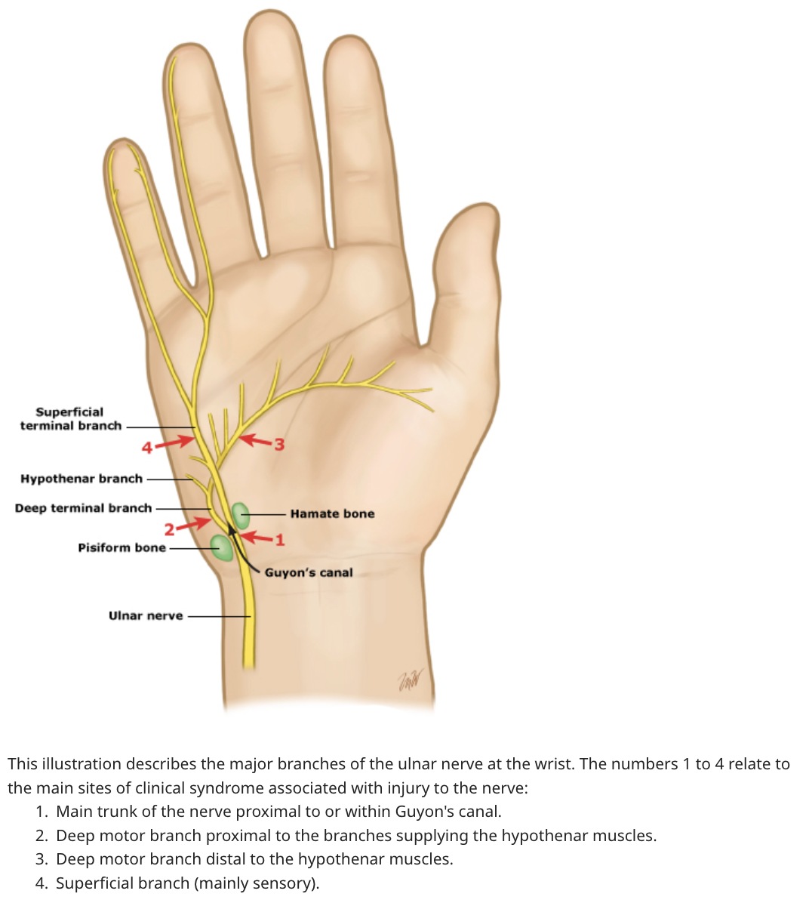

# Upper Extremity Peripheral Nerve Syndromes - Literature Search on UpToDate Reference

- **References:**
    - [UpToDate: Overview of upper extremity peripheral nerve syndromes](https://www.uptodate.com.eproxy.lib.hku.hk/contents/overview-of-upper-extremity-peripheral-nerve-syndromes?search=Upper%20limb%20peripheral%20nerve%20syndrome&source=search_result&selectedTitle=2~150&usage_type=default&display_rank=2)
    - [UpToDate: Carpal tunnel syndrome: Pathophysiology and risk factors](https://www.uptodate.com.eproxy.lib.hku.hk/contents/carpal-tunnel-syndrome-pathophysiology-and-risk-factors?search=Upper+limb+peripheral+nerve+syndrome&topicRef=5288&source=see_link)
    - [UpToDate: Carpal tunnel syndrome: Clinical manifestations and diagnosis](https://www.uptodate.com.eproxy.lib.hku.hk/contents/carpal-tunnel-syndrome-clinical-manifestations-and-diagnosis?search=Upper%20limb%20peripheral%20nerve%20syndrome&topicRef=5282&source=see_link#H2)
    - [UpToDate: Carpal tunnel syndrome: Treatment and prognosis](https://www.uptodate.com.eproxy.lib.hku.hk/contents/carpal-tunnel-syndrome-treatment-and-prognosis?search=Upper+limb+peripheral+nerve+syndrome&topicRef=5288&source=see_link)
    - [UpToDate: Ulnar neuropathy at the elbow and wrist](https://www.uptodate.com.eproxy.lib.hku.hk/contents/ulnar-neuropathy-at-the-elbow-and-wrist?search=Upper%20limb%20peripheral%20nerve%20syndrome&topicRef=5282&source=see_link#H170956430)

## Overview of Upper Extremity Peripheral Nerve Syndromes

- **Anatomy of the brachial plexus** - plexus derived from nerve roots emerging <u>from C5 to T1</u>:
    - **Organisation into trunks and cords:**
        - **Nerve trunks:**
            - <u>Upper trunk</u> - C5-C6 nerve roots, contributes to the lateral cord, and posterior cord
            - <u>Middle trunk</u> - C7 nerve roots, contributes to the posterior cord, and lateral cord
            - <u>Lower trunk</u> - C8-T1 nerve roots, contributes to the medial cord, and posterior cord
        - **Cords:**
            - <u>Lateral cord</u> - contributed by the upper trunk after it gives off pbranches that contribute to the posterior cord, as well as branches of the posterior trunk
            - <u>Medial cord</u> - contributed by the lower trunk after it gives off branches that contribute to the posterior cord
            - <u>Posterior cord</u> - contributed by the middle trunk, and branches of the upper and middle trunk

    
    
    - **Branches from the brachial plexus:**
        - **Branches from nerve roots:**
            - <u>Long thoracic nerve</u> - derived from small branches from C5-T1 level, provides motor innervation to the serratus anterior muscle
        - **Branches from lateral region of the plexus** - from proximal to distal:
            - <u>Dorsal scapular nerve</u> (C5) - motor innervation to levator scapulae, and rhomboids
            - <u>Suprascapular nerve</u> (C5-6) - motor innervation to the supraspinatus and infraspinatus, sensory innervation to the glenohumoral joint
        - **Branches from posterior region of the plexus:**
            - <u>Superior and inferior subscapular nerve</u> (C5-6) - motor innervation to the subscapularis
            - <u>Thoracodorsal nerve</u> (C6-8) - motor innervation to the Latissimus dorsi
            - <u>Axillary nerve</u> (C5-6) - motor innervation to teres minor and deltoid, and small area of skin on lateral side of the arm
        - **3 major terminal branches of the plexus:**
            - <u>Ulnar nerve</u> - major nerve arising from the medial cord of the plexus
            - <u>Radial nerve</u> - major nerve arising from the posterior cord of the plexus
            - <u>Median nerve</u> - major nerve arising from the lateral cord of the plexus
- **Etiologies of upper extremity peripheral nerve syndromes** - different pathological processes in mononeuropathy compared w/ polyneuropathy:
    - **Compression** (most common) - nerve entrapment at a point results in neurapraxia and axonotmesis resulting in variable loss of function in distal nerve segments
    - **Transection** - neurotmesis as a result of acute, severe trauma to the upper limb, resulting in complete loss of function in distal segments
    - **Ischaemia** - arises from vasculitic, and occasionally atherosclerotic disease (e.g. diabetic neuropathy), resulting in axonal injury
    - **Radiation-induced injury** - typically w/ a Hx of brachial plexus irradiation resulting in serious late-delayed brachial plexopathy
    - **Degeneration** - may be initial manifestation of a neurodegenerative motor neuron disorder, most concerning being <u>Hirayama disease</u>, or an early manifestation of <u>amyotrophic lateral sclerosis</u>
    - **Metabolic** - rarely causes focal nerve lesions instead of polyneuropathy, but ocassionally seen in DM (diabetic mononeuritis complex), and hypothyroidism (nerve entrapment due to myxoedema)
- **Epidemiology** - Carpal tunnel syndrome being the most common upper limb mononeuropathy
- **Ix** - dependent on the suspected site of lesion:
    - **Electrophysiological studies** - NCS and EMG
    - **Imaging:**
        - <u>Plain radiographs</u> - cervical spine films for radicular pain, CXR (if suspected plexopathy byt lesion), plain films of arms and hand if concomittent trauma
        - <u>MRI of cervical spine</u> - to defined the pathological process resulting in radiculopathy when considering surgical option
    - **Additional Ix:**
        - <u>TFT</u> - hypothyroidism in patients w/ carpal tunnel syndrome
        - <u>A1c</u> - DM control, especially if mild polyneuropathy is also present
- **Median nerve syndromes:**
    - **Carpal tunnel syndrome:**
        - <u>Definition</u> - compression of the median nerve due to to increased pressure within the carpal tunnel, the anatomical tunnel formed by the transverse carpal ligament and the carpal bones
        - <u>Clinical features</u>:
            - **Sensory Sx** - painful parasthesia in the distribution of median nerve territory, over the radial 3.5 digits:
                - <u>Sites</u> - first three digits and radial half of the fourth digit, with characteristic sparing of the thenar eminence (cutaneous branch does not pass through the carpal tunnel)
                - <u>Onset and progression</u> - insiduous in onset, and progresses as the entrapment on median nerve becomes more severe
                - <u>Quality</u> - painful parasthesia
                - <u>Radiation</u> - typically localised to the hand, but may radiate proximally to the forearm
                - <u>Timing</u>:
                    - Worse at night and characteristically awakens patient from sleep
                    - Provoked by activities that involve sustained flexion of the wrist
            - **Motor Sx** - weakness of the thenar eminence (particularly thumb oposition and abduction) resulting in lost of dexterity in fine hand movements
        - <u>Mx</u>:
            - Wrist splinting during sleep or activities that exacerbate Sx
            - Steroid injections
            - Surgical release of flexor retinaculum
    - **Pronator teres syndrome:**
        - <u>Definition</u> - entrapment of the median nerve in the proximal forearm as the nerve passes through the pronator teres muscles
        - <u>Associations</u> - professional bycicle riders
        - <u>Clinical features</u>:
            - **Sensory Sx** - painful parasthesia in the distribution of median nerve territory, over the radial 3.5 digits, and the palmar surface of the thenar eminence:
                - <u>Sites</u> - first three digits and radial half of the fourth digit, with characteristic involvement of the thenar eminence
                - <u>Onset and progression</u> - insiduous in onset, and progresses as the entrapment on median nerve becomes more severe
                - <u>Quality</u> - painful parasthesia
                - <u>Timing</u> - exacerbated by use of pronator teres (e.g. pronation)
            - **Motor Sx** - weakness of the thenar eminence (particularly thumb oposition and abduction) resulting in lost of dexterity in fine hand movements (+/- mild impairment of FCR)
        - <u>Mx</u>:
            - Reduction in symptom promoting activity
            - Local injection of corticosteroids and anasthetics to tender sites of pronator muscles
            - Surgical decompression
    - **Anterior interosseous neuropathy:**
        - <u>Definition</u> - injury to the anterior interosseous nerve that provides innervation of extrinsic flexors of the hands (e.g. FPL, FDP)
- **Ulnar nerve syndromes** - N.B. high ulnar neuropathy vs low ulnar neuropathy (Guyon canal)
- **Radial nerve syndromes:**
    - **Saturday night palsy:**
        - <u>Definition</u> - compressive injury of the radial nerve due to prolonged pressure pressure on the nerve in the spiral groove
        - <u>Etiology</u>:
            - Crutch palsy
            - Inebriated individuals after abnormal positioning during sleep
        - <u>Clinical features</u>:
            - **Motor Sx** - weakness of the extensor compartments of the forearm, and brachioradialis:
                - <u>Weakness of ECU, ECR</u> - results in weakness in wrist extension, rsulting in '<u>wrist drop</u>'
                - <u>Weakness of extrinsic extensors of fingers</u> - as identified on P/E
                - <u>Weakness of brachioradialis</u> - evident when examining by asking patient to flex the elbow with forearm midway between pronation and supination (banging on table position)
                - <u>Weakness of intrinsic hand muscles</u> - associated weakness in ulnar innervation of hand muscles likely related to difficulties in performing the action in absence of stabilizing influence of finger extensors
                - <u>Weakness in thumb abduction</u> - due to weakness of abductor pollicus longus
            - **Sensory Sx** - dorsum of the hand, extending up to the posterior forearm
        - <u>Mx</u> - conservative Mx for one-time compression injury (a/w good prognosis) by PT, splinting (to maintain function of intrinsic muscles) and pain Mx
- **Proximal neuropathies:**
    - **Suprascapular neuropathy:**
    - **Long thoracic neuropathy:**
    - **Axillary neuropathy:**
        - <u>Definition</u> - neuropathy involving the axillary nerve, a terminal branch of the posterior cord of the brachial plexus
        - <u>Etiology</u>:
            - Traumatic - from humeral fracture of shoulder dislocation
            - Entrapment - typicaly due to proloned prone position w/ arms raised above the head
        - <u>Clinical features</u>:
            - **Motor Sx:**
                - <u>Weakness in shoulder abduction</u> - due to weakness of deltoid muscle
                - <u>Weakness in shoulder external rotation</u> - due to weakness of teres minor
            - **Sensory Sx** - sharply defined loss of sensation over the lateral shoulder
        - <u>Mx</u>:
            - Conservative Mx by PT and exercise
            - Nerve grafting if transection due to trauma or failed recovery on conservative Mx

## Carpal tunnel syndrome: Pathophysiology and risk factors

- **Risk factors for CTS:**
    - **Non-modifiable risk factor:**
        - <u>Female sex</u> - anatomically smaller carpal tunnel in females than in males
        - <u>Genetic predisposition</u> - those w/ bilateral CTS are more likely to have a FHx of CTS than those w/ unilateral or no disease, which may reflect an inherited liability for nerve injury, anatomical variability in carpal tunnel, or familial predisposition to other medical conditions
    - **Modifiable risk factors:**
        - **Medical conditions and medications** - causing increased soft tissue deposition or oedema within the carpal tunnel:
            - <u>Diabetes mellitus</u> - mechanism unclear but is more prevalent in sub-population w/ underlying diabetic polyneuropathy
            - <u>Arhtritis</u> - osteoarthritis of wrist and rheumatoid arthritis may lead to anatomical compression of the carpal tunnel
            - <u>Hypothyroidism</u> - due to myxoedema within the carpal tunnel
            - <u>Pregnancy</u> - due to fluid retention within the carpal tunnel, typically presents in the 3rd trimester
            - <u>Previous trauma</u> - e.g. crush injury of the hand, and radius or carpal bone fractures, presenting in a delayed fashion
            - <u>Amyloidosis</u> - deposition of amyloid or Ig proteins within the carpal tunnel
        - **Environmental, workplace or ergonomic factors:**
            - Repetitive hand and wrist use
            - Forceful hand and wrist use
            - Work with vibrating tools
            - Sustained wrist or palm pressure
            - Prolonged wrist extesnsion and flexion

## Carpal tunnel syndrome: Clinical manifestations and diagnosis

- **Definition** - complex of S/S brought on by compression of the median nerve as it travels through the carpal tunnel
- **Clinical features of CTS** - sensory Sx are generally more prominent than motor Sx:
    - **Sensory Sx** - painful parasthesia and numbness felt over the median territory, particularly over the <u>radial 3.5 digits</u>, and sparing of the thenar eminence:
        - <u>Site</u> - first 3 digits, and the radial half of the 4th digit, with characteristic sparing of the thenar eminence (N.B. sensory cutaneous nerve arises proximal and does not pass throught the carpal tunnel)
        - <u>Onset and progression</u> - insiduous onset, initially noticeable during sleep, and subsequently becomes more persistent (ocassionally progresses to sensory loss)
        - <u>Quality</u> - painful, numbness, parasthesia (complete sensory loss in severe cases)
        - <u>Radiation</u> - typically limited to the digits, but may radiate proximally to the forearm
        - <u>Severity</u> - variable, but can be as severe as complete sensory loss
        - <u>Timing</u> - provocated by:
            - Sleep, which can awaken patient from sleep
            - Sustained flexion or extension hand position
            - Repetitive actions of the hand or wrist
    - **Motor Sx** - results in reduced dexterity of the hands in late CTS:
        - <u>Weakness of thenar muscles</u> - results in characteristic thenar wasting, weakness of thumb abduction and thumb opposition
- **Signs of CTS:**
    - **Sensory examination** - sensory impairment in median-innervated fingers but w/ <u>characteristic sparing of the thenar eminence</u>
    - **Motor examination:**
        - <u>Thumb opposition</u> - weakness in thumb opposition
        - <u>Thumb abduction</u> - weakness in thumb abduction
    - **Provocation maneuvers:**
        - **Phalen maneuver:**
            - <u>Technique</u> - bring dorsal surfaces of the hands against each other to bring about <u>hyperflexion of the wrists</u>, while the elbows remain flexed, and maintain for 1 min
            - <u>Interpretation</u> - +ve result defined as increased pain and/or parsthesia in the median-innervated fingers
            - <u>Test properties</u> - moderate accuracy (68% Sn, 73% Sp)
        - **Tinel test:**
            - <u>Technique</u> - percussion performed over the course of the median nerve on top of carpal tunnel
            - <u>Interpretation</u> - +ve result defined as increased pain and/or parasthesia in the median-innervated finger during percussion
            - <u>Test properties</u> - less Sn (50% Sn) but similar Sp (77% Sp) as Phalen test
        - **Durkan test** (manual compression test):
            - <u>TEchnique</u> - applying pressure over transverse carpal ligament for 30s
            - <u>Interpretation</u> - +ve result defined as increased pain and/or parasthesia in the median-innervated finger
            - <u>Test properties</u> - moderate accuracy (64% Sn, 83% Sp)
        - **Hand-elevation tests:**
            - <u>Technique</u> - raising hand above head for 1 min
            - <u>Interpretation</u> - +ve result defined as increased pain and/or parasthesia in the median-innervated finger
            - <u>Test properties</u> - most Sp test

     
    
- **Ix** - NCS and EMG for Dx and evaluation of severity

## Carpal tunnel syndrome: Treatment and prognosis

## Ulnar neuropathy at the elbow and wrist

- **Definition** - entrapment neuropathy involving the ulnar nerve at the elbow or the wrist
- **Anatomy of the ulnar nerve** - terminal branch of the <u>medial cord</u> w/ contributions from <u>C8-T1</u>:
    - **Clinical course:**
        - **Upper forearm** - in close proximity with brachial artery, and provides no sensory and motor innervation above the elbow
        - **Midhumoral region** - pierces the medial intermuscular septum and passes posteriorly lying close to the medial head of the triceps brachii, passing posteromedial to the medial epicondyle of the humerus, and through the aponeurosis of the FCU
        - **Cubital tunnel** - passes between the two heads of the FCU and runs between the tendons between the medial forearm to wrists
        - **Forearm** - gives off motor and sensory branches:
            - <u>Motor innervation</u> - to the FCU, the ulnar-innervated portion of FDU (4th and 5th digit)
            - <u>Sensory innervation</u>:
                - Palmar cutaneous branch arises at mid forearm and runs distally over the volar aspect of the forearm and wrist without passing through the Guyon canal, supplying ulnar portion of the palm
                - Dorsal utaneous branch arises more distally and supplies the ulnar portion of the dorsum
        - **Guyon canal and within the hand** - courses w/ ulnar artery, the roof of the Guyon canal being the palmar fascia, and the floor being the transverse carpal ligament and pisohamate ligament to supply most of the intrinsic hand muscles
- **Etiology of high ulnar nerve palsy:**
    - <u>Trauma</u> - distal humeral fracture, nerve laceration or perioperative injury
    - <u>Nerve compression/ traction</u> - from prolonged elbow flexion, or leaning on the elbow (rarely from joint pathologies e.g. osteophytes, or other mass lesions)
- **Etiology of low ulnar nerve palsy:**
    - <u>Intrinsic causes</u> - ganglia of the wrist joint or intraneural ganglia
    - <u>Extrinsic causes</u> - fracture of the hook of hallmate
- **Epidemiology** - high ulnar nerve palsy is the second most common upper limb peripheral nerve syndrome following Carpal tunnel syndrome
- **Clinical features of high ulnar nerve palsy:**
    - **Sensory Sx** - pain, numbness or parasthesia over the ulnar 1.5 digits and ulnar aspect of the palm:
        - <u>Site</u> - over palmar and dorsal cutaneous territory
        - <u>Quality</u> - pain, numbness, parasthesia
        - <u>Timing</u>:
            - Exacerbated by sustained elbow flexion (e.g. talking over the phone) causing nerve traction
            - Exacerbated by leaning on the elbow
    - **Motor Sx** - clumsiness caused by weakness of the intrinsic hand muscles resulting in general muscle wasting and '<u>ulnar claw deformity</u>'
- **Clinical features of low ulnar nerve palsy** - characteristically causing more <u>marked ulnar claw</u> as a result of sparing of the ulnar-innervated proportion of the FDP, and weakness of the 3rd and 4th lumbricals: 

# Lower Extremity Peripheral Nerve Syndromes - Literature Search on UpToDate Reference
