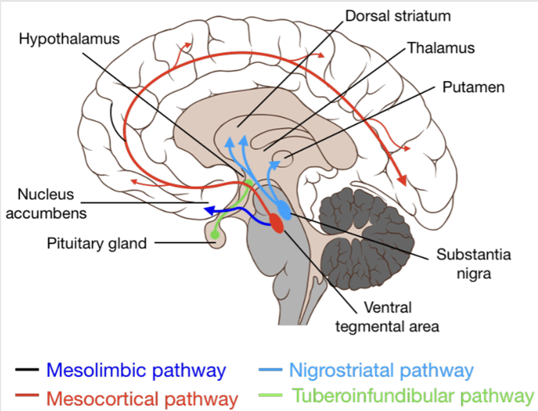
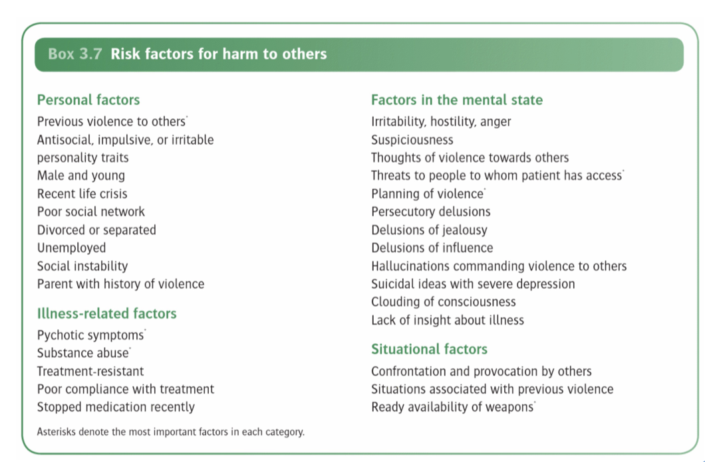

# Neurobiology of Psychotic Disorders

- **Overview:**
    - Psychotic disorders - affective vs schizophrenia
    - The following only applies to schizophrenia, schizoaffective disorder, schizophreniform disorder
    - Does not really affect brief psyhcotic disorder or delusional disorder (characteristically not the same epidemiology and possibly different mechanisms), or mood disorders w/ psychotic featuers
- **Primary vs secondary negative Sx:**
    - Primary negative Sx from disease itself
    - Secondary negative Sx from secondary sources (e.g. antipsychotic S/E, depression, +ve Sx)
    - N.B. 2nd generation antipsychotic thought initially thought to improve negative Sx, however this is because control arm is high dose first gen antipsychotic where S/E mimics negativs Sx
- **Key difference between 1st and 2nd generation antipsychotic and S/E profile:**
    - Propensity to stimulate extrapyramidal S/E (TD, parkisonism, acute dystonia, akathesia) (myth)
    - Hyperprolactinaemia also linked weakly to osteoporosis and malignancy nowadays
    - Some are more prolactin sparing, some are more prolactin inducing (sulparide, paliperidol, respiridone amisulparide)
- **Levels of neurological dysfunction** - the observed behaviour by the clinician and the phenomenological experience of the individual is postulated to have a neurobiological basis:
    - Neurochemical (dopamine; glutamate, cholinergic)
    - Neuroanatomical and neuroconnectivity abnormalities
    - Neuropathological abnormalities
    - Neurodevelopmental (overarching) and neuroprogressive hypothesis
- **Dopaminergic neurtransmission dysregulation** - 4 major dopamine pathways:
    - <u>Mesolimbic pathway</u> (reward and motivation, positive Sx) - DA from tegmental area (VTA) to ventral striatum
    - <u>Mesocortical pathway</u> (cognition, -ve Sx, disorganisation, cognitive impairment) - DA from VTA to prefrontal cortex
    - <u>Nigrostriatal pathway</u> (movement, extramyramidal S/E) - DA from substantia nigra to the caudate nucleus/ putamen
    - <u>Tuberoinfundibular</u> (neuroendocrine control, hyperprolactinaemia) - DA from the hypothalamus to the pituitary gland

  
  
- **Dopamine hypothesis** - neurochemically, "dopamine isthe wind of psychotic fire":
    - Initially based on observation that <u>post-synaptic D2 blockade with conventional antipsychotics</u> reduces positive symptoms
    - <u>PET studies</u> subsequently showed increased <u>striatal pre-synaptic dopamine synthesis</u> in schizophrenia (theoretically this is the best drug target \[target all pathways\] but no such drug available yet)
    - The theory is limited in <u>Tx-resistance schizophrenia</u>, PET studies show that they <u>do not have excessive dopamine synthesis</u> (and hence do not respond well), although the mechanism remains unknown
    - Attractiveness of dopamine hypothesis lies in complementary neurocognitve models such as <u>aberrant salience attribution</u> (see below)
    - Various hypothesis of the upstream process attributing increased striatal dopamine synthesis, such as "NMDA hypofunction" and "increased cholinergic drives"
- **Aberrant salience model** (salience misattribution hypothesis):
    - Delusions defined by content but mechanism may differ between different delusions
    - The aberrant salience model generally applies to delusions of reference, but does not fit well to explain all sorts of delusions (e.g. delusions of passivity cannot be explained)
    - A mental state ("psychosis as a state condition") that predisposes to delusion formation which is biochemically explained by <u>stimulus-independent activation of the mesocortical pathway</u> occurs prior to construct, giving rise to:
        - Delusional perception ("**perplexity**") - state of hyper-awareness of the world surrounding the individual, which requires cognition to weave together an explanation
        - Delusional mood - a constant feeling of **foreboding** that some as yet unindentified sinister event is going to take place
    - Persistent pschotic state culminates following development of delusions that "explains all observations" ("**insight-relief**"), giving rise to the <u>primary delusion</u> (usually a delusion of reference) that serves as a guiding cognitive schema for further thoughts an action
    - Conviction of the new insght ascends to delusional intensity likely due to a <u>faulty top-down process of reality testing</u>, e.g. searching for only confirmatory evidence and disregarding disconfirmatory evidence
    - <u>Secondary systematisation</u> likely accounts for other delusions (e.g. delusions of percusation, delusions of jealousy, delusions of grandiosity), which is weaved into a "delusional system"
    - My notes: when attributing whether a piece of information is important… we do not really determine it logically, we are in fact using logic to explain why we felt it is salient:
        - Insight relief and serves as guiding cognitive schema for further thoughts and actions
        - Top-down process, conviction of belief by driving finding further confirmatory evidence/ and immune to disconfirmatory evidence
    - However based on this models, antipsychotics do not "break down the already constructed delusional systems", requires patient reality testing and insight, CBT to accelerate the process
- **Neurobiology of -ve Sx** - 5A (avolition and asociality both related to motivation):
    - All explained by reduced motivation via mesocortical pathway, hence reduced motivation to goal-directed behaviour and social events
    - Reward learning system, loss of reinforcement learning system
    - Effort-cost balancing
    - ?Not too inline with Sass 2003…
- **Upstream hypothesis to explain dopamine synthesis:**
    - Glutamatergic neurotransmission dysfunction (NMDA hypofunction hypothesis)
    - Cholinergic hypothesis
- **Glutamatergic (NMDA) neurotransmission dysfunction:**
    - Built from observations that NMDA antagonists (e.g. ketamine, phencyclidine) can mimic positive, negative Sx, disorganiasation and cognitive impairments (schizophrenia may result in NMDA hypofunctioning)
    - Known neurobiological mechanisms - NMDA is presynaptic and regulates excitatory Glu synthesis
    - Excitation, inhibition imbalance (Glu \> GABA) - upstream hypothesis of excessive dopamine synthesis
    - See slide 12 for mechanism of NMDA receptor hypofunction hypothesis (cortical Glu neurons, stimulate GABA neurons, which increases inhibitory tone on downstream glutamate, and inhibit downstream dopamine synthesis; lessened upstream cortical Glu effects)
- **New cholinergic system hypothesis for schizophrenia:**
    - This is very strong
    - Accrural of evidence points towards a cholinergic driven processess and could have major therapeutic implications w/ anticholinergics (e.g. less EPS/ PRL S/E)
    - Kraplein is possibly right to regard cognitive impairment as a prominent feature of schizophrenia ("dementia praecox")
- **Neuroanatomical abnormalities:**
    - <u>Ventricular volume</u> - increased size
    - <u>Gray matter volume</u> - reduced, primarily over frontal, temporal cortical, and subcortical levels, w/ **reduced cortical thickness**
    - <u>Gyrification index</u> - lower GI in fronto-temporal regions (reduced surface area)
    - <u>Connectivity</u> - loss of structural and functional connectivity (hypoconnectivity), particularly of interest:
        - Salience network
        - DMN
        - CCN
        - TN
        - AN
- **Neuropathological findings do not support Kraplein in terms of neurodegeneration as explaination of dementia praecox:**
    - Although in long run, overall increased risk of dementia (only in some observation studies)
    - No neurodegenration in all pathological series
    - However now suggesting it is reduced synaptic conduction - "excessive synaptic pruning":
        - Synaptic pruning as a normal physiological process of removal of "unecessary connections" to preserve energy, becomes excessive in schizophrenia
        - Mediated by immune process and neuroinflammation
        - Post-mortal findings and PET studies aline with this
        - Peak period overlaps w/ typical age of onset w/ schizophrenia
        - Possibly explains the cognitive impact of schizophrenia rather than neurodegeneration
- **Neuroinflammation and synaptic pruning:**
    - Microglial cell-,ediated synaptic pruning
    - Environmental risk factors, GWAS a/w MHC suggesting immune-mediated mechanisms
- **Neurodevelopmental hypothesis:**
    - Ties it all together where genetic factors/ environmental risk factors during pre- or postnatal period
    - <u>Cognitive deviation is key</u> - tracing of academic reports show poorer schooling, and gradually deviation as time goes on (e.g. initially perform well, then further gets worse)… at ARMS still continue to have cognitive decline
    - After onset of illness, cognitive decline ceases, cognition remains static (they may not improve or worsen)
    - Possinly ties into excexsive synaptic pruning, and explains association w/ very proximal environmental risk factors (e.g. perinatal insults)
    - PET studies shows lower levels of synaptic protein and mRNA levels in SCZ patients
    - Post-mortem studies also confer lower levels of synaptic proteins in SCZ patients
    - Lab models of induced pluripotent stem cells shows elevated complement-dependent elimination of synaptic structure
- **Neuroprogressive hypothesis:**
    - Some still have deterioration cognitive functioning (cf neurodevelopmental hypothesis)
    - Only seen in subset of patients correlating with worse prognosis
    - Neurodevelopmental influence in early life does not preclude neuroprogressive process
- **Kraplein is partially right regarding the concept of cognitive impairment in dementia praecox:**
    - Although neuroanatomical evidence of reduced brain volume, cortical thinking and reduced GI, histopathological findings do not confer a neurodegenerative process
    - However, cholinergic hypothesis emerges to support a cognitive impairment in schizophrenia
    - Neurodevelopemtal hypothesis, particularly w/ excessive synaptic pruning may underlying what is phenomenologically experienced as cognitive impairment

# Clinical Skills Session: Schizophrenia and Related Psychosis

- **Core Sx of schizophrenia** - at least one is 1-3:
    - 1\) Delusion
    - 2\) Hallucination
    - 3\) Disorganized speech
    - 4\) Grossly disorganized or catatonic behaviour
    - 5\) Negative Sx
- **Core delusional themes of psychosis:**
    - Reference (usually the primary)
    - Persecution
    - Jealousy
    - Grandiose
    - Guilt
    - Control
    - Erotomania
    - Nihlistic
- **How to characterise a duration:**
    - Content
    - When the belief form, and can it be explained by the person's education/ cultural/ religious background, alternative explanation
    - Extent of conviction, and response to contrary evidence
    - Try to shake their beliefs
    - Mood congruent
    - Bizzarre
    - Always link the dellusion to more common themes, reveal a delusional system (from reference to others)
    - Impact, other collateral informations
- **How to characterise hallucination:**
    - Ensure hallucination
    - Sense modality and nature (external and elementary/ complex, 2nd/3rd voices, vividness)
    - Content
    - Impact
- **Formal thought disorder is very good indicator of psychotic disorder:**
- **Assessment of negative Sx:**
- **Violence risk assessment:**
    - 4Ps
    - Personal factors, illness-related factors, situational factors 
    
- **Organic disease causing psychosis:**
    - Temporal lobe epilepsy
    - Wilson's disease
    - Autoimmune encephalitis
- Incongruence affect is observed:
    - e.g. laughing randomly, random tearfulness
    - But ocassionally blunted
- **Notes:**
    - In fact in the long history of humanity, we have often tried to explain seemingly unexplainable phenomenons. In the past, prior explanations that draw on diety, the divine seems absurd to us now.
    - It is thus believable that those with psychosis will make similar connections to explain their aberrant salience and hallucinations.

# Use of Antipsychotics in the Treatment of Psychosis

- Know clozapine which differs from others
- Classification based on S/E profile, primarily motor S/E profile - however still different:
    - FGA (conventional, but more extrapyramidal S/E such as rigidity, tested by forcing rate to hold onto bar)
    - SGA (atypical, less extrapyramidal S/E)
- SGA:
    - Selection (not exhaustive):
        - Risperidone, olanzapine, quetiapine, amisulpiride, paliperidone, ariperidole
        - Clozapiine (Tx-resistance schizophrenia)
    - Increasing use due to extrapyramidal S/E, but more S/E (due to different binding profiles to D1-5)
- ROA:
    - Oral
    - Long-acting preparations (depots, usually FGA cause cheaper, but some SGA available though expensive)
- **S/E:**
    - Sedation (but some w/ insomnia)
    - Metabolic (e.g. weight gain, more common in SGA)
    - Extrapyramidal
    - Anticholinergic (e.g. dry mouth)
    - Hypotension
    - Hyperprolactinaemia
- **Choosing antipsychotics based on S/E profile:**
    - e.g. less sedating
    - Weight problem
- **Respiridone:**
    - Benefits primarily negative Sx and cognition
    - Hyperprolactinaemia is common, less tolerated by F
- **Olanzapine:**
    - Less hyperprolactinaemia, but significant weight changes
    - Considered second most effective after clozapine
- **Quetiapine:**
    - Fewer side effect, prolactin and extrapyramidal S/E, more prone to sedation, and anticholinergic/ peripheral S/E
- **Ziprasidone:**
    - Favourable S/E compared to above
    - Main problem is prolonged QTc
    - Others S/E including sedation and others
- **Ariprazole** - partial agonist w/ antagonistic effect at therapeutic dose
- **Clozapine** (for Tx resistence schizophrenia):
    - First synthesized w/ ability to block amphetamine-induced locomotor activity w/o producing catalepsy
    - Major S/E being agranulocytosis (1-3% usually in 4-18 weeks) was subsequently withdrawn, but re-introduced due to effective in Tx resistance schizophrenia
    - The best effect being cognitive improvement
    - Indication mainly Tx resistance (failed 2x antipsychotic)
    - Minor S/E:
        - Anticholinergic
        - Sedation (nocturnal eneuresis)
    - High dose a/w major S/E:
        - Seizure
        - Hepatic failure
        - Pancreatitis
        - IO
        - Cardiac S/E (chest pain)
        - Agranulocytosis
    - Monitor CBC q1w for 18w then q4w
- **Extrapyramidal S/E:**
    - Dystonia (oculgyric crisis)
    - Parkinsonism
    - Akathisia (subjective sensation to restlessness \[inner restlessness\])
    - Tardive dyskinesia
- **Approach to S/E:**
- **Neuroleptic malignant syndrome as common S/E** (read up mechanism)
