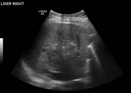
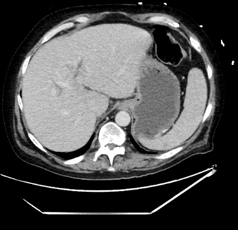
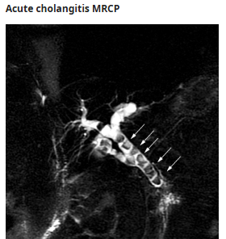
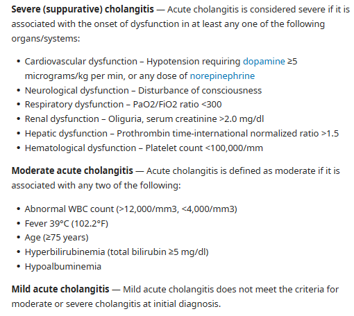

# Acute Cholangitis

- **Definition** - clinical syndrome characterized by fever, jaundice, and abdominal pain that develops from stasis and infection in the CBD
- **Etiology of acute cholangitis** - stones, strictures, malignancies, and post-ERCP:
    - Gallstones (28-70%)
    - Benign biliary strictures (5-28%)
    - Malignant biliary obstruction (10-57%)
    - Post-ERCP with biliary stenting (0.5-1.7%)
    - Other rare causes - Mirizzi syndrome, Lemmel syndrome (periampullary diverticulum), clots, parasitic infection, recurent pyogenic cholangitis
- **Clinical features of acute cholangitis:**
    - **Charcot's triad** (complete in 50-75%) - fever, jaundice, and abdominal pain:
        - <u>Fever</u> (\> 80%) - often high-swinging unremitting fever
        - <u>Jaundice</u> (60-70%) - **obstructive jaundice** characterised by tea colour urine, pale stools, and icterus
        - <u>Abdominal pain</u> (\> 80%) - RUQ or epigastric pain
    - **Reynaud's pentad** - confusion and shock (as a result of septicaemia)
- **DDx of acute cholangitis:**
    - <u>Acute cholecystitis</u> - consider if no evidence of biliary obstruction (jaundice or cholestatic pattern LFT)
    - <u>Acute pancreatitis</u> - epigastric pain with elevated amylaes \> 3x ULN
    - <u>Liver abscess</u> - different imaging findings w/ acute cholangitis
- **Ix and Dx** - Dx is clinical if clinical presentation is classical (i.e. Charcot's Triad):
    - **Principles of Dx in absence of full Charcot's triad** - Dx made if:
        - Evidence of systemic inflammation - fever (+/- rigors and chills), or laboratory evidence
        - Evidence of cholestasis - jaundice, cholestatic pattern of LFT, or imaging of biliary obstruction
    - **Routine bloods:**
        - <u>CBC</u> - neutrophilic leukocytosis
        - <u>LFT</u> - cholangiohepatitis pattern (v. early) followed by cholestatic pattern
        - <u>RFT</u> - contrast CT
        - <u>Clotting profile</u> - bleeding tendancy due to cholestasis
        - <u>Amylase</u> - r/o pancreatitis
    - **Imaging:**
        - <u>Transabdominal US</u> (38% Sn, 94% Sp) - demonstrate dilatation of biliary system w/ presence of gallstones (may miss small or distal stones) 
        
        - <u>Abdominal CT</u> - demonstrate bile duct dilatation and cause of obstruction (MBO, stenosis etc.) 
        
        - <u>MRCP</u> (diagnostic) - indicated when intervention is not necessarily mandatory, but typically larger role in choledocholithiasis w/o cholangitis (e.g. no sepsis)
            - **Findings** - dilated bile ducts with stones represented as filling defects

      
      
    - **ERCP** - lessen role for diagnostic, but role in therapeutic
- **Assessment of disease severity:** 

- **Mx:**
    - **Principles of Mx:**
        - Supportive care - bed rest, pain relief, IV fluid administration and correct electrolytes
        - IV ABx - indicated for all ABx
        - Billiary drainage - ERCP, percutaneous drainage, surgical drainage
        - Mx of underlying cause - e.g. gallstones, strictures, MBO
    - **Medical Tx:**
        - **General measures** - bed rest, pain relief, fluid and electrolyte balance, close monitoring for sepsis
        - **IV ABx**
    - **Biliary drainage:**
        - **Timing** - based on severity:
            - Mild-to-moderate cholangitis responding well to ABx - 24-48h
            - Severe cholangitis or disease progression despite ABx - \< 24h (urgent biliary decompression)
        - **ERCP** - side-view endoscopic drainage by papillotomy and stone extraction, or biliary stenting:
            - <u>Indications</u> - standard of care unless contraindicated
            - <u>C/I</u> - 1) altered GI anatomy (e.g. Whipple's, Roux-en-Y anastamosis), 2) high risk of complications following ERCP, 3) peri-ampullary obstruction (e.g. tumour)
            - <u>Complications</u> - 1) Perforation, 2) Bleeding from Papillotomy, 3) Pancreatitis
        - **Percutaneous transhepatic biliary drainage** (PTBD) - PTC with transhepatic insertion of needle into bile duct, and therapeutic drainage
            - <u>Indications</u> - 1) failed ERCP, 2) ERCP contraindicated
        - **Surgical drainage** - open or laproscopic exploration of CBD (ECBD)
    - **Mx of underlying cause:**
        - <u>Gallstones</u> - elective cholecystectomy after resolution of cholangitis
        - <u>Benign biliary strictures</u> - endoscopic therapy, surgical repair
        - <u>MBO</u> - workup accordingly
