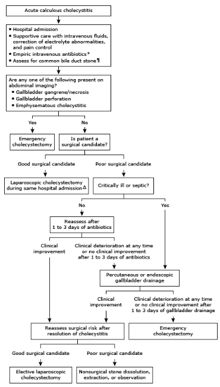

# Acute Cholecystitis

- **Definition** - inflammation of the gallbladder following prolonged obstruction of the gallbladder neck or cystic duct
- **Etiology of acute cholecystitis:**
    - Acute calcaneous cholecystitis - gallstones (most common)
    - Acalcaneous cholecystitis (5-10%) - intensive care or critically ill setting resulting in gallbladder ileus and ischaemia
- **Pathophysiology of acute cholecystitis** - related to prolonged cystic duct obstruction:
    - <u>Chemical irritation of gall bladder</u> - results in release of phospholipase, converting lecithin to lysolecithin (mucosal toxin)
    - <u>Subsequent infection of gallbladder</u> - especially in elderly patients and DM
- **Clinical features of acute cholecystitis:**
    - **Persistent biliary colic** - persistant (\> 4-6h) RUQ or epigastric pain that was precipitated by fatty food ingestion after one hour:
        - <u>Site</u> - RUQ or epigastrium
        - <u>Onset</u> - acute onset, but persistent and not relieved within 4-6h
        - <u>Character</u> - sharp, well-localised constant pain (parietal inflammation)
        - <u>Radiation</u> - interscapular region or right scapular tip
        - <u>Associated Sx</u> - N/V, with **marked systemic Sx** (fever, tachycardia)
        - <u>Exacerbating and relieving factors</u> - typically precipitated by Hx of fatty meal 1h prior to onset of pain, **aggravated by movement** (peritoneal irritation)
        - <u>Severity</u> - typically quite severe
    - **Fever** - distinguishes from simple biliary colic w/ acute cholecystitis
    - **Nausea and vomiting**
    - **Leukocytosis**
- **Signs of acute cholecystitis:**
    - **General apperarence** - ill-appearing, often lying still due to localised peritonitis
    - **Vital signs** - febrile (rigors unusual), tachycardic
    - **Abdominal examination:**
        - <u>RUQ tenderness and guarding</u> - due to presence with parietal peritoneal inflammation
        - <u>Murphy's sign</u> (97% Sn, 48% Sp) - pain or cessation of inspiratory efforts elicited on deep inspiration as the inflammed gallbladder descends and presses against palpating fingers
        - \+*- <u>Jaundice</u> (\< 10%) - may be suggestive of choledolithiasis (+*- cholangitis) or Mirizzi's syndrome
        - +/- <u>Features of complications</u> - e.g. sepsis, abdominal crepitus, generalised peritonitis, SBO
- **DDx of acute cholecystitis:**
    - **Common DDx:**
        - <u>Biliary colic</u> - typically self-limiting episodes of RUQ pain (\< 4-6h) with absence of systemic Sx
        - <u>Appendicitis</u> - typically characterised by RLQ pain instead of RUQ pain
        - <u>Perforated peptic ulcer</u> - sudden onset of severe epigastric pain that may be associated w/ prior NSAID use (free gas under diaphragm on erect CXR)
        - <u>Acute cholangitis</u> - typically presents additionally w/ obstructive jaundice (cf Charcot's triad), with laboratory and radiological evidence of cholestasis
        - <u>Acute pancreatitis</u> - severe epigastric pain characterised by raised amylase
    - **Rare DDx** - acute pyelonephritis, myocardial infarction, pneumonia (RLL)
- **Ix and Dx** - suspected on Hx, P/E, and Ix to r/o other DDx, diagnosis is achieved through transabdominal US:
    - **Routine bloods:**
        - <u>CBC</u> - leukocytosis (common except in elderly patients)
        - <u>LFT</u> - non-specific elevation of transaminase (cholestatic pattern and hyperbilirubinaemia suggestive of choledolithiasis or Mirizzi's syndrome)
        - <u>Amylase</u> - minor increase (r/o acute pancreatitis)
    - **Transabdominal ultrasound** - demonstrate gallstones, and sonographic evidence of cholecystitis:
        - <u>Imaging findings of gallstones</u> - echoic stones w/ acoustic shadowing
        - <u>Sonographic evidence of cholecystitis</u>:
            - 1\. GB wall thickening (\> 4-5mm)
            - 2\. Pericholecystic fluid or oedema (double wall sign)
            - 3\. Stone at GB neck
            - 4\. Sonographic Murphy's sign (similar to clinical Murphy's sign)
    - **Cholescintigraphy** (Hepatic iminodiacetic acid \[HIDA\] scan) - indicated in diagnostic uncertainty after ultrasound:
        - <u>Principles</u> - IV injection of radiotracers (Tc-labelled HIDA) is selectively taken up by hepatocytes and released into bile, **inability to fill GB by contrast implies cystic duct obstruction**
        - <u>+ve result</u> - no contrast within GB after 1h
        - <u>Test properties</u> - 90-87% Sn, 71-90% Sp
    - +/- Additional evaluations:
        - **MRCP or EUS** - if suspected CBD stone with ascending cholangitis based on bloods and US findings
        - **CT** - if suspected complications of acute cholecystitis (Empyema, perforation)
- **Complications of acute cholecystitis:**
    - <u>Mucocele of gallbladder</u> - accumulation of mucus in gallbladder
    - <u>Empyema of gallbladder</u> - secondaru infection of mucocele
    - <u>Gangrenous cholecystitis</u> (20%) - typically a septic picture along w/ Sx of cholecystitis
    - <u>Perforation of GB</u> (10%) - occurs after development of gangrene, resulting in generalised peritonitis
    - <u>Emphysematous cholecystitis</u> - caused by secondary infection of gas producing organisms (abdominal crepitus and abnormal LFTs, US findings)
    - <u>Liver abscess</u> - typically caused by perforation into liver bed
    - <u>Cholecystoenteric fistula</u> - typically caused by perforation into intestinal lumen
    - <u>Gallstone ileus</u> - descent of stone into the SB via the cholecystoenteric fistula (typically obstructing at 2ft proximal to IC valve, which is narrowest)

## Management of acute cholecystitis

- **Principles of Mx:**
    - Medical Tx (initial supportive Tx) - bed rest, pain relief, IV fluid adminstraion, and ABx
    - Surgical Tx (definitive Tx) - cholecystectomy (emergency, early or late), gallbladder drainage

  
  
- **Medical Mx** - Sx typically subsides w/ best medical treatment (90%):
    - <u>General measures</u>:
        - NPO - nil by mouth as to rest the gallbladder
        - IV fluids and administration and correction of electrolytes
        - Pain relief - adminstration of analgesics
        - NG tube decompression (severe vomiting)
    - IV ABx - cephalosporin or piperacillin/tazobactam
- **Cholecystectomy** - indicated for all surgical candidates:
    - <u>Emergency cholecystectomy</u> - for complicated cholecystitis, disease progression despite medical Tx
    - <u>Timing of cholecystectomy w/o emergency indications</u> - general consesnsus that early cholecystectomy (\< 5d onset of Sx) is superior:
        - **Advantages of early cholecystectomy** - avoid urgent operation (clinical deterioration), avoid recurrent Sx, avoid readmission, shorter hospital stay
        - **Advantages of delayed cholecystectomy** (interval procedure) - avoid misdiagnosis, less septic complications
- **Gallbladder drainage:**
    - <u>Indications</u> - as bridge to definitive Tx for non-surgical candidates w/ disease progression (e.g. critically ill or septic) w/o compelling indication for urgent surgery
    - <u>Approach</u>:
        - Percutaneous (transhepatic) cholecystostomy (PC)
        - Endoscopic approachs - transmural vs transpapillary
