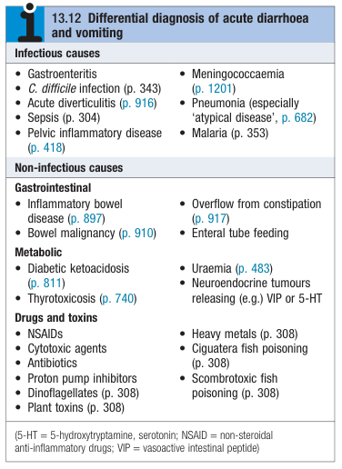
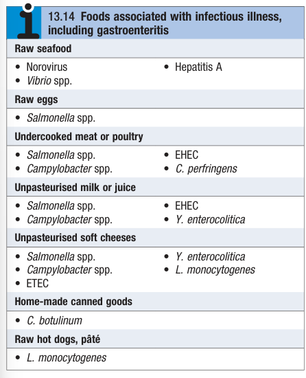

# Acute Diarrhoea and Vomiting

- **Definition** - typical clinical presentation of infective diarrhoea, but may be a symptom of other infective, or non-infective cause (including stress)
- **Epidemiology:**
    - <u>Prevalence</u> - \> 1000 million cases/y in developing countries
    - <u>Burden</u> - 3-4 million deathes (one of the leading cause of death in childrens)
- **Etiology of acute diarrhoea and vomiting** - infectious gastroenteritis is the most common cause: 

    - **Infectious causes:**
        - <u>Infective gastroenteritis</u> - toxin in food, viral, bacterial or protozoal disease
        - <u>C. difficile colitis</u> - a/w previous ABx use
        - <u>Acute diverticulitis</u> - superimposed infection in diverticular disease due to faecolith
        - <u>Acute hepatitis</u> - Hepatitis A and hepatitis C
        - <u>Meningococcaemia</u> - a/w fever, rash, neck stiffness and decreasing consciousness
        - <u>Pneumonia</u> - especially atypical pneumonia
        - <u>Pelvic inflammatory disease</u> - assess gynaecological risk factors
        - <u>Others</u> - sepsis or pneumonia
    - **Non-infectious causes:**
        - <u>Gastrointestinal disease</u> - coeliac disease, IBD, Lower GI malignancy, Overflow from constipation, Enteral tube feeding
        - <u>Metabolic disease</u> - DKA, thyrotoxicosis, uraemia, NET
        - <u>Drugs</u> - NSAID, ABx, PPIs, Cytotoxic agents
        - <u>Toxins</u> - Dinoflagellates, plant toxins, heavy metals, Ciquatera fish poisoning, scombrotoxic food poisoning
        - <u>Psychological</u> - stress and anxiety
- **Salient points of Hx:**
    - **HPI** - onset, duration, quality, severity, timing:
        - <u>Onset and duration</u> - most infective GE resolve \< 10d
        - <u>Quality</u> - watery (a/w non-invasive SB process), with mucus or bloody (a/w invasive, colitic and dysenteric process), or w/ stearrhoea
        - <u>Severity</u> - frequency of diarrhoea and vomiting (+/- urine output)
        - <u>Timing</u> - incubation period suggests underlying etiology:
            - \< 18h - toxin-mediated food poisoning
            - 1-3d - bacterial or viral GE
            - \> 5d - protozoal or helminth infection
    - **Associated Sx:**
        - <u>Fever</u> - suggestive of an infective process
        - <u>Abdominal pain</u> - cramping peri-umbilical or lower abdominal pain depending on site of infection
        - <u>Stearrhoea</u> - malabsorptive process
        - <u>Tenesmus</u> - diarrhoea may be related to overflow from constipation
        - <u>Weight loss</u> - recent weight loss is a red flag Sx
    - **TOCC Hx** - if fever and diarrhoea
    - **Dietary Hx** - address food ingested: 
    
- **P/E:**
    - <u>Vital signs</u> - BP/P (assess degree of fluid loss)
    - <u>General examination</u> - hydration status (skin turgor, tongue) +/- monitoring of urine output and ongoing stool loss
- **Ix:**
    - **Microbiology** - blood and urine cultures (+/- CXR)
    - **Routine bloods** - CBC, RFT:
        - <u>CBC</u> - leukocytosis for degree of inflammation
        - <u>RFT</u> - degree of dehydration and electrolyte abnormalities (e.g. Na, K, HCO3)
    - **Stool** - for microscopy, cuture, and C diff. antigen assay
- **Mx:**
    - **Principles of Mx:**
        - <u>Minimising transmission</u> - avoid person-to-person spread (+/- public health measures if suggestive of food-borne source to establish whether linked cases exist)
        - <u>Supportive measures</u> - fluid replacement by ORS or IV infusion necessary to maintain fluid balance (+/- K replacement), little rhole of antidiarrhoeal agents
        - <u>ABx therapy</u> - dependent on underlying etiology\*\*\* Infections acquired in the tropics
    - **Fluid replacement** - replacement of fluid loss in all diarrhoeal illness is crucial and may be life-saving:
        - **Type of fluid replacements:**
            - <u>Oral rehydration solutions</u> - hypo-osmolar solutions containing water, electrolytes and glucose
            - <u>IV infusion</u> - normal saline (0.9% NaCl)
        - **Principles of fluid replacement** - 1) rapid replacement of established deficit, 2) replacement of ongoing losses, and 3) replacement of normal daily requirements:
            - **Rapid replacement of of estimated fluid deficit** - within <u>2-4 h of presentation</u>:
                - <u>Estimation of fluid loss clinically</u> - as % of clinically by vital signs
                - <u>Estimation of fluid loss by symptomatology</u>:
                    - 48 h of moderate diarrhoea (6-10 stools per day) is a/w 2-4 L of fluid loss
                    - Vomiting compounds due to additional fluid loss and inability for oral rehydration
            - **Replacement of ongoing fluid loss** - immediate replacement after each episode of diarrhoea orally:
                - <u>Assumption</u> - average adult's diarrhoeal stool accounts for 200 ml of isotonic fluids
                - <u>Replacement</u> - One sachet per diarrhoeal stool, as 1 sachet of comercially available rehydration sachets conveniently provide 200 ml of ORS (an appropriate estimate of supplementary replacement requirements)
            - **Replacement of normal daily requirement** - as a function of body weight by 4-2-1 rule (generally 1-1.5 L/d):
                - <u>4-2-1 rule</u>:
                    - First 10 kg - 4 ml/kg/h
                    - Next 10kg - 2 ml/kg/h
                    - Each additional kg above 20 kg - 1 ml/kg/h
                - <u>Special considerations</u>:
                    - Increased in febrile disease
                    - Increased in excessive sweating (e.g. hot environment)
    - **Antimicrobial agents** - generally not considered even if suspected bacterial infection as benefits (shorten Sx for around 1d in an illness lasting 1-3d) are outweigh by the risks (ABx resistance, S/E)
        - <u>Considerations or indications for antimicrobials in diarrhoeal disease</u>:
            - Systemic infections (Septic presentation)
            - Immunocompromised host or significant comorbidity
            - Invasive, inflammatory GI (e.g. Shigella, salmonellosis)
            - Chorea outbreaks (simply to reduce infectivity and control spread of infection)
        - <u>C/I of antimicrobials</u>:
            - Suspected EHEC infections - increased risk of haemolytic uraemic syndrome
    - **Antidiarrhoeal, antimotility, and antisecretory agents** - generally not recommended:
        - Antisecretory agents (e.g. bismuth, chlorpromazine) - may be effective but can cause significant sedation
        - Antimotility agents (e.g. loperamide) - potentially dangerous in dysentery
        - Adsorbants (e.g. kaolin, charcoal) - no effect
