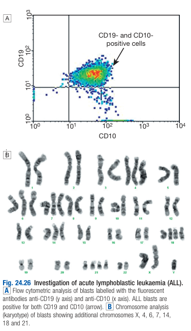
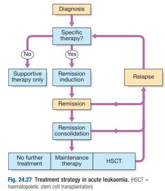
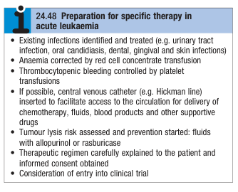
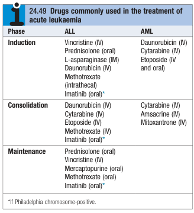
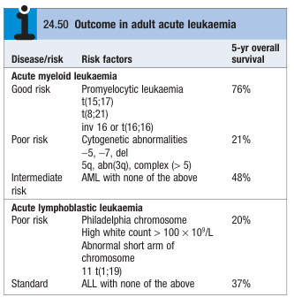

# Acute Leukaemias

- **Definition** - increased proliferation and <u>failure of cell maturation</u> of haematopoeitic stem cells, leading to <u>accumulation of primitative cells</u> which takes up more and more marrow space <u>at the expense of normal haematopoietic components</u>
- **Epidemiology:**
    - <u>Adults</u> - AML 4x more common than ALL
    - <u>Children</u> - ALL 4x more common than AML
- **Clinical features of acute leukaemia** - those of bone marrow failure (anaemia, bleeding or infection)
- **Ix:**
    - **CBC with differentials:**
        - <u>Hb and MCV</u> - anaemia with normal or raised MCV
        - <u>WBC</u> - vary from leukopenia (as low as 1 x 109/L) or marked leukocytosis (as high as 500 x 109/L), typically **elevated but \< 100 x 109/L**
        - <u>PLT</u> - severe thrombocytopenia is usual but not invariable
    - **Peripheral blood smear** - presence of circulating blasts, but sometimes infrequent or absent (esp. during early stages)
    - **BM examination:**
        - Hypercellular marrow
        - Leukaemic blast proportion \> 20% of the cells - i.e. replacement of normal haematopoeitic stem cells with leukaemic blasts
    - **Karyotyping, immunophenotyping and molecular analysis** - for further classification and prognostication 
    
- **Mx:**
    - **Principles of Mx:**
        - <u>Decision regarding Tx</u> - isolated supportive therapy and witholding specific Tx which are aggressive and have numerous S/E, in the very elderly or patients w/ serious comorbidities
        - <u>Preparation for specific Tx</u> - optimise condition of patient and preparation of supportive Tx before attempting aggressive Mx of acute leukaemia
        - <u>Specific Tx</u> - tri-phasic Tx (induction, consolidation, +/- maintenace) aimed at destroying leukaemic clones within marrow while preserving residual normal HSC compartments from which repopulation of HSC can occur
        - <u>Supportive Tx</u> - indicated for all patients whether undergoing specific Tx or not
        - <u>Haematopoietic stem cell transplantation</u> - indicated for selected patients that could benefit prognostically

    
    
    - **Preparation for specific Tx in acute leukaemia:**
        - <u>Optimise clinical condition</u>:
            - RBC transfusion for anaemia
            - Platelet and FFP transfusion for thrombocytopenic bleeding
            - Identification and Tx of existing infections (e.g. UTI, oral candidiasis, dental, gingival, and skin infections)
        - <u>Pre-Tx investigations</u>:
            - Serology for HBV, HCV and HIV
            - G6PD deficiency - assess risk of haemolysis with co-trimoxazole
            - CXR - for infections and Tx complications
            - Echo - assess cardiac function before initiation of anthracycline (e.g. daunorubicin)
        - <u>Assessment of tumour lysis risk and prevention</u> - fluid resuscitation with allopurinol or rasburicase
        - <u>Central venous catheter insertion</u> (e.g. Hickman line) - facilitate access to circulation for delivery of chemotherapy, fluids, blood products and other supportive drugs
        - <u>Other important preparations</u>:
            - Patient education - therapeutic regimen carefully explained to the patient and informed consent obtained
            - HLA typing for patients w/ high risk disease and are candidates for HSCT
            - Consider enrollment into clinical trial

    
    
    - **Supportive therapy** - aggressive and potentially curative specific therapy involves periods of <u>severe bone marrow failure</u>, and would not be possible w/o appropriate supportive care:
        - **Anaemia** - Tx by red cell concentrate transfusions
        - **Bleeding:**
            - Prophylactic platelet transfusion target PLT \> 10 x 109/L to avoid life-threatening bleeding
            - Early detection and Tx of coagulopathies (e.g. FFP transfusion in massive transfusion protocol, Tx of DIC)
        - **Infection** - presistent fever (\> 38°C) lasting for \> 1h in neutropenic patients indicates <u>neutropenic sepsis</u>:
            - **Initiation of empirical broad-spectrum ABx therapy in suspected neutropenic sepsis** - based on local bateriorological resistance patterns
            - **Common organisms in neutropenic sepsis:**
                - <u>Bacterial</u>:
                    - G+ bacteria (e.g. S. aureus, S. epidermidis) - present in skin and gains access to blood via central venous catheters
                    - G- bacteria (e.g. E. coli, Pseudomonas, Klebsiella) - present in GI tract and gains access to blood via chemotherapy-induced mucositis
                - <u>Fungal</u>:
                    - Pneumocystis jirovecci pneumonia - especially common in patients in ALL requiring prophylaxis with co-trimoxazole (high-dose IV/ oral if breakthrough infection)
                    - Local candidiasis - Tx with fluconazole and for prophylaxis against systemic candidiaemia
                    - Systemic fungal infections (e..g aspergillus or Candidiaemia) - prophylaxis with intraconazole or posaconazole (high dose IV liposomal amphotericin B or voriconazole required if established infection)
                - <u>Viral infections</u> - acyclovir (as prophylaxis or Tx) for HSV or HZV infection
        - **Metabolic problems** - frequent monitoring for frequent fluid balance, renal, liver and haemostatic functions
        - **Psychological problems** - multidisciplinary approach to patient care
    - **Specific therapy** - aimed at destroying leukaemic clones within BM while preserving normal HSC components from which repopulation can occur:
        - **Triphasic specific therapy:**
            - <u>Remission induction</u> - combination chemotherapy destroys bulk of tumour and patient goes through severe bone marrow hypoplasia requring intense in-patient supportive care
            - <u>Remission consolidation</u> - multiple courses of chemotherapy to attack residual disease
            - <u>Remission maintenance</u> - repeating cycle of drug administration extending up to 3y in ALL 
            
        - **CNS prophylaxis in ALL:**
            - Cranial irradiation
            - Intrathecal methotrexate chemotherapy
            - High dose methotrexate (crosses BBB)
        - **Palliative chemotherapy** (e.g. hydroxycarbamide, mercaptopurine) - not designed to achieve remmission but used to curb excessive leukocyte proliferation
- **Prognosis of acute leukaemia** - median survival \< 5 weeks w/o Tx:
    - **Prognostic factors of acute leukaemia:**
        - <u>Remission rate</u> - better outlook for patients who achieve remission w/ specific therapy, but is often age dependent (80% achieve remission if \< 60y)
        - <u>Cytogenetic and genetic features</u> - note that APL is a good-risk AML since the advent of ATRA therapy 
        
    - **Further strategies to improve prognosis:**
        - <u>Targeted therapy</u> - anti-CD33 Mab and FLT3 inhibitors to improve survival in standard or poor-risk disease
