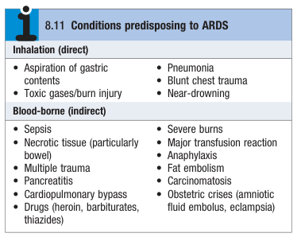
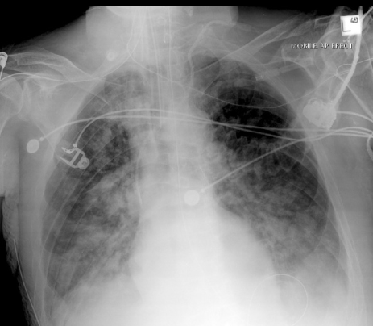
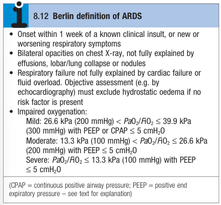

# Acute Lung Injury and Acute Respiratory Distress Syndrome

- **Definitions and terminology:**
    - <u>Acute lung injury</u> (ALI) - diffuse acute inflammatory process of the lungs resulting from direct, or indirect causes
    - <u>Acute respiratory distress syndrome</u> (ARDS) - severe acute lung injury resulting in type 1 respiratory failure (hyoxaemia without hypercapnia)
- **Etiology of ALI and ARDS:** 

- **Pathophysiology of ALI and ARDS:**
    - **Diffuse inflammatory process of the lung** - inflammation occurs throughout the lungs affecting both endothelial and epithelial cells, with damage to type I and II alveolar cells:
        - <u>Exudation</u> - sequestration of activated neutrophils into alveoli and accumulation of protein-rich cellular fluid within alveoli results in formation of the pathologically characteristic <u>'hyaline membranes'</u>
        - <u>Loss of surfactant and impaired surfactant production</u> - as a result of widespread damage to type II alveolar cells
    - **Physiological effects of widespread inflammation:**
        - <u>Consolidation</u> - due to accumulation of exudates
        - <u>Reduced lung compliance</u> - from loss of surfactant resulting in impaired ventilation and increased work of breathing
        - <u>Alveolar collapse</u> - from loss of surfactant resulting n increased VQ mismatch, increased pulmonary shunt, and hypoxaemia
- **Ix of ALI and ARDS:**
    - **CXR** - non-specific and difficult to distinguish from APO or cardiac failure:
        - Bilateral coalescent infiltrates
        - Absence of effusions, lung collapse or nodules explaining opacities

    
    
- **Dx of ARDS** - Berlin definition of ARDS:
    - <u>Time course</u> - within 1 week of known clinical insult, or new or worsening respiratory symptoms
    - <u>Radiographic features</u> - bilateral opacities, not fully explained by effusions, collapse or nodules
    - <u>Not attributable to heart failure</u> - patient not in fluid overload and objective assessment by echocardiography to exclude hydrostatic oedema
    - <u>Impaired oxygenation</u> - attributable to VQ mismatch as defined by VF ratio

  
  
