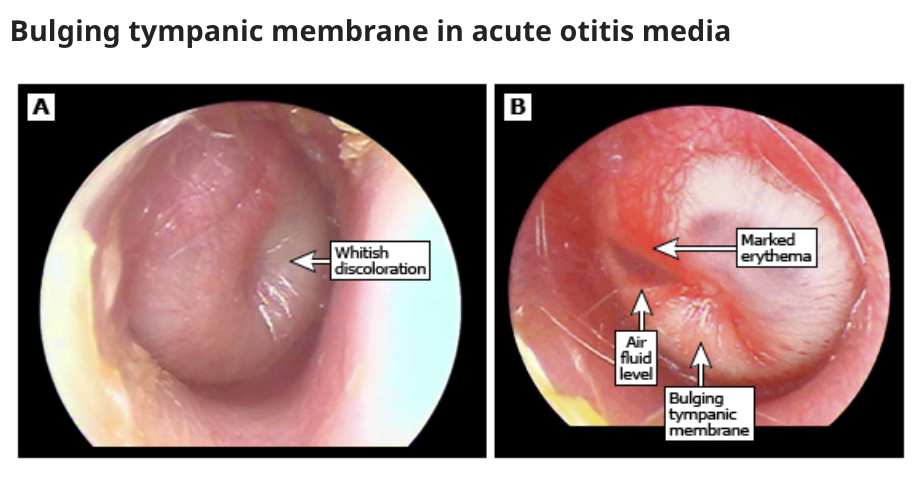

# Acute Otitis Media

- **Definition** - acute, infectious process in the middle ear characterised by infected middle ear fluid and inflammation
- **Epidemiology** - disease of the young
- **Microbiology of acute otitis media** - initially viral, but becomes bacterial:
    - Miscellaneous viral infections - URTI causing eustachian tube infections
    - Bacterial infections - 1) Streptococcus pneumoniae, 2) Haemophilus influenzae, 3) Moraxella catarrhalis
- **Patient risk factors:**
    - <u>Eustachian tube dysfunction</u> - dysfunction of the eustachian tube in equalising pressure in middle ear (e.g. cleft palate, post-irradiation fibrosis)
    - <u>Eustachian tube obstruction</u> - external compression or obstruction of the eustachian tube, e.g. tonsilitis, malignancy (e.g. NPC, lymphoma)
- **Clinical features of AOM** - typically unilateral with prior URTI or exacerbation of rhinitis preceeding onset:
    - <u>Otalgia</u> - ear pain which may be mild, moderate or severe
    - <u>Hearing loss</u> - transient conductive hearing loss due to presence of middle lear fluid, resulting in decreased, muffled hearing
    - <u>Otorrhoea</u> - occurs in setting of perforated eardrums, which is purulent, and a/w a sudden relief of pain
    - <u>Constitutional Sx</u>
- **Signs on otoscopy** - diagnostic:
    - <u>Buldging tympanic membrane</u>
    - <u>Partial or complete opacification of tympanic membrane</u> (loss of translucency)
    - <u>Erythema of tympanic membrane</u>
    - <u>Reduced mobility of tympanic membrane</u> when pneumatic pressure applied 
    
- **DDx of acute otitis media:**
    - Otitis media with effusion - presence of middle ear dysfunction without signs of bacterial infection or illness
    - Chronic suppurative otitis media
    - Bullous myringitis
    - Otitis externa
    - Herpes zoster
    - Deep space head and neck infections
- **Mx of acute otitis media:**
    - **Principles of Mx:**
    - <u>Supportive Mx</u> - pain relief (e.g. NSAID)
    - <u>Oral ABx</u> - based on local antibiogram (ABx against G+ bacteria)
    - <u>Lack of initial response</u> - 2nd line ABx therapy or **drainage myringotomy**
    - **1st line ABx regimen:**
    - <u>Selection</u> - Amoxicillin-clavulanate, erythromycin, cotrimoxazole, cefuroxime
    - <u>Duration</u> - 7-10d
    - **Mx of perforated eardrums in otitis media** - most will heal spontaneously and do not require additional Mx:
    - <u>Appropriate water precautions</u> - no swimming or diving, avoid getting affected ear wet when showering
