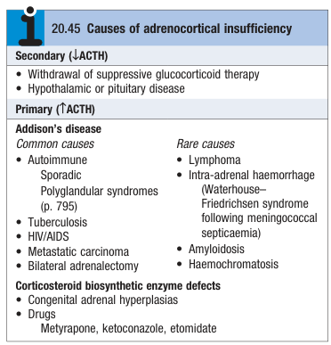
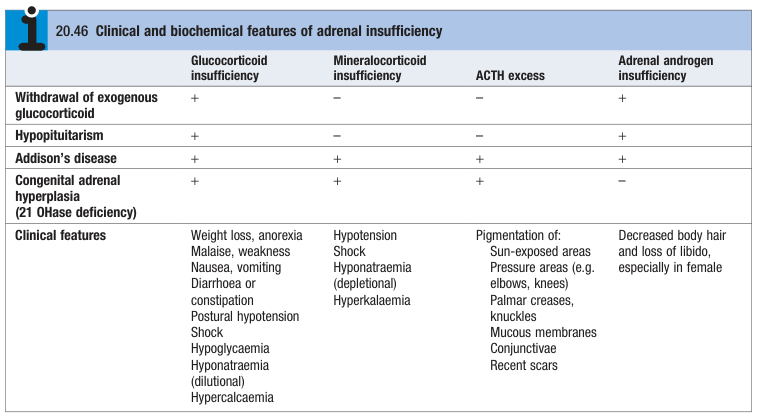
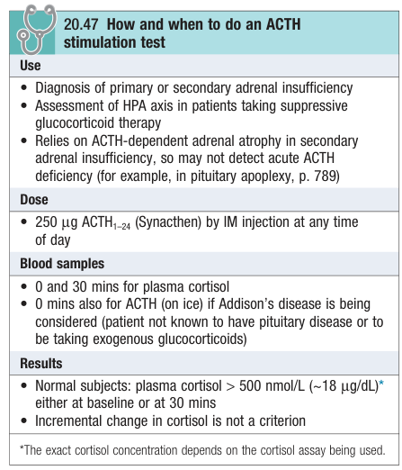
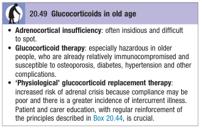
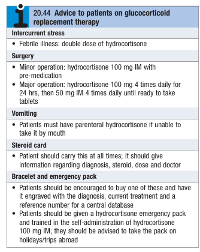

# Adrenal Insufficiency

- **Definition** - fatal condition of adrenal hypo-function resulting from inadequate secretion of cortisol and/or aldosterone
- **Etiology of adrenal insufficiency** - commonly secondary (e.g. inappropriate withdrawal of glucocorticoid therapy): 

    - **Primary adrenal insufficiency** - rare:
        - **Addison's disease** - damage or dysfunction of adrenal glands:
            - <u>Autoimmune</u> - sporadic addison's disease, polyendocrine syndromes
            - <u>Infection</u> - TB adrenalitis, HIV/ AIDS, intra-adrenal haemorrhage following meningococcaemia (Waterhouse-Friedrichsen syndrome)
            - <u>Neoplastic</u> - metastatic carcinoma, lymphoma
            - <u>Iatrogenic</u> - Bilateral adrenalectomy
            - <u>Infiltrative</u> - amyoidosis, haemochromatosis
        - **Corticosteroid biosynthetic enzyme defects:**
            - <u>Congenital</u> - congenital adrenal hyperplasia (CAH)
            - <u>Drug-induced</u> - ketoconazole, etomidate, metyrapone
    - **Secondary adrenal insufficiency** - common:
        - Inappropriate withdrawal of chronic glucocorticoid therapy
        - Hypothalamic pituitary disease
- **Associated conditions of autoimmune adrenal insufficiency** - requires screening if diagnosed:
    - Autoimmune thyroid disease
    - Pernicious anaemia
    - T1DM
- **Clinical features of adrenal insufficiency** - notoriously variable in presentation and <u>characteristic hyperpigmentation is usually not present as most are secondary adrenal insufficiency</u>:
    - **Features of glucocorticoid deficiency** - typically chronic presentation if isolated glucocorticoid deficiency:
        - <u>Non-specific Sx</u> - fatigue, weight loss, anorexia which may be wrongly diagnosed as depression
        - <u>Non-specific GI Sx</u> - nausea and vomiting, diarrhoea or constipation
        - <u>Vascular comprimise</u> - loss of **permissive effects of cortisol on catacholamine functions**:
            - **Postural hypotension or shock** - due to peripheral vasodilation
            - **Dilutional hyponatraemia** - peripheral vasodilation results in relative hypovolaemia and <u>arterial underfilling</u>, resulting in stimulation of ADH axis and free water retention
        - <u>Hypoglycaemia</u> - due to **loss of cortisol-mediated insulin resistance**
        - <u>Hypercalcaemia</u> - likely due to reduced eGFR due to reduced renal perfusion pressure
    - **Features of minerocorticoid insufficiency** - capable of precipitating hypovolaemic shock:
        - <u>Hypovolaemic hyponatraemia</u> - loss of Na and water retention mediated by aldosterone
        - <u>Hyperkalaemia</u> - los of distal tubular K secretion mediated by aldosterone
        - <u>Hypovolaemic shock</u> - due renal Na loss
    - **Hyperpigmentation** - only occurs in primary adrenal insufficiency resulting in ACTH excess
    - **Vitiligo** - occurs in 10-20% of patients w/ autoimmune Addison's disease

  
  
- **Clinical suspicion of adrenal insufficiency** - considered when presenting w/ 1) fatigue, 2) hyponatraemia, and 3) hypotension
- **Ix** - should not delay Mx of Addisonian crisis (save blood before administering hydrocortisone):
    - **Routine bloods** - RFT, RBG, Ca:
        - **RFT** - Na, K:
            - <u>Na</u> - typically hypoNa (may be euvolaemic in isolated cortisol deficiency, or hypovolaemic in aldosterone deficiency)
            - <u>K</u> - typically hyperK if MR deficiency (but not universal)
        - **RBG** - hypoglycaemia
        - **Ca** - hyperCa may be present
    - **Assessment of glucocorticoid:**
        - <u>Random cortisol level</u> - usually low, or inappropriately low for a seriously ill patient (non-diagnostic, but <u>\> 500 nmol/L excludes Dx</u>)
        - <u>ACTH stimulation test</u> (short Synacthen test) - demonstrate failed stimulation of cortisol secretion by exogenous ACTH: 
        
        - <u>Serum ACTH</u> - distinguish between primary or secondary adrenal insufficiency:
            - **Primary adrenal insufficiency** - ACTH high
            - **Secondary adrenal insufficiency** - ACTH low
    - **Assessment of minerocorticoids:**
        - <u>Plasma renin activity and aldosterone levels</u> (measured in supine position to avoid postural stimulation of AngII) - high PRA, and low/ low-normal aldosterone
    - **Assessment of adrenal androgens** - not necessary in men (test dehydroepiandrosterone and androstenedione in women)
    - **Establish of underlying cause** - dependent for primary and secondary adrenal insufficiency:
        - <u>Secondary adrenal insufficiecny</u> - workup for **hypopituitarism** if not explained by glucocorticoid withdrawal
        - <u>Primary adrenal insufficiency</u> - adrenal auto-Ab, CT/ MRI adrenal etc.
- **Mx:**
    - **Principles of Mx:**
        - <u>Treat Addisonian crisis</u> - see elsewhere on Addisonian crisis
        - <u>Replacement of adrenocortical hormones</u> - glucocorticoid is standard, while minerocorticoid and androgen replacement may or may not be required
    - **Glucocorticoid replacement:**
        - <u>Regimen</u> - oral hydrocortisone (cortisol) 15-20 mg daily in divided doses to mimic circadian rhythm:
            - 10 mg on waking
            - 5 mg at around 1500 hr
        - <u>S/E</u> - usually not present due to physiological replacement

     
    
    - **Minerocorticoid replacement** - if evident hypoaldosteronism:
        - <u>Regimen</u> - fludrogortisone 0.05-0.15 mg daily
    - **Androgen replacement** - DHEA 50 mg/d in women with primary adrenal insufficiency w/ S/S of androgen insufficiency
