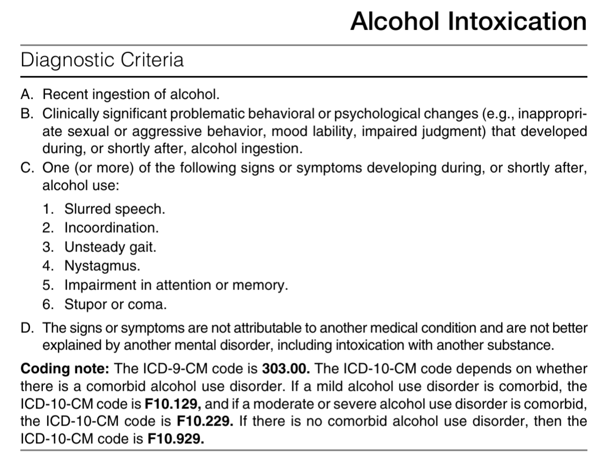
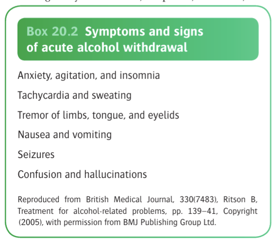
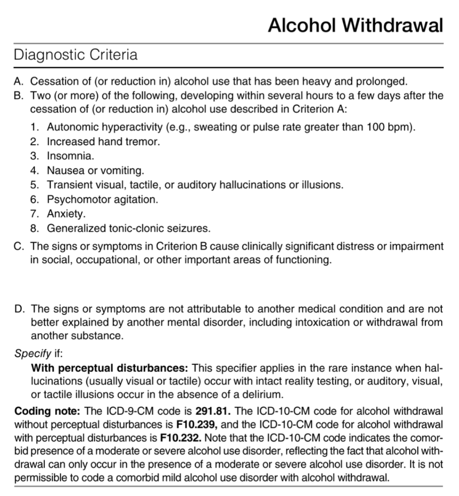

# Alcohol Intoxication and Alcohol Withdrawal

- **DSM-5 criteria of alcohol intoxication:** 
	
	
- **Alcohol withdrawal syndrome** - wtihdrawal symptoms vary across a spectrum of severity from mild anxiety and sleep disturbances to dilerium tremens and GTCS:
	- The symptoms usually occur after high level of alcohol intake persistent, and follow a **drop in blood alcohol concentration**, characteristically **appearing in the morning**
	- **Methods to stave off withdrawal symptoms:**
		- <u>Early-morning drinking</u> is diagnostic of denendency, as dependent drinkers often take a drink upon waking to stave off withdrawal symptoms
		- Another diagnostic feature of dependency is to <u>hide bottles</u>, or <u>carry them in pockets</u> (in a secretive manner), which reflects an increased need to stave off withdrawal symptoms
		- A _change in repertoire_, such as use of rough cider, cheap strong beers often and regularly as to obtain the most units of alcohol for the cheapest cost
	- **Pathophysiological processes during alcohol withdrawal:**
		- Autonomic overactivity (tremors, tachycardia, sweating)
		- CNS over-activity (insomnia, anxiety, disorders of percept, lowered seizure threshold, DT)
	- **Clinical features of alcohol withdrawal** - are easily relieved by a drink, otherwise will last a few days:
	    - <u>Acute tremulousness</u> ('the shakes') - earliest and commonest features of alcohol withdrawal affecting the hands, legs, and trunk, and the suffering are unable to sit still, hold a cup steady or fasten buttons
	    - <u>Agitation</u> - often very anxious, agitated and easily startled
	    - <u>Nausea, retching and vomiting</u> - often frequent
	    - <u>Palpitations</u> - as a result of tachycardia
	    - <u>Sweating</u> - often common, due to autonomic disturbances
	    - <u>Insomnia</u> - often common and related to the general state of withdrawal
	    - <u>Misperceptions and hallucinations</u> - may occur as withdrawal progresses but are usually brief, where objects appear distorted in shape or sizes (**lilliputian hallucinosis**), or shadows appear to move, w/ distorted voices, shouting, snatches of music occur
	    - <u>Generalised tonic clonic seizures</u> - may eventually occur w/ time
	    - <u>Delirium tremens</u> - the final manifestation, characteristically occurs **48h after the last drink**
	    
	    
	- **DSM-5 criteria of alcohol withdrawal:** 
		
		
	- **Delirium tremens** - medical emergency a/w high mortality if poorly treated:
		- **Onset and course:**
			- Usually occurs in people whose history of alcohol misuse extends over few years
			- Often an abrupt onset of reduced GC and delirium, characteristically occuring 48h after the last drink
			- Delirium lasts for 3-4 days
			- Ends w/ deep prolonged sleep from which the patient awakens asymptomatic w/ no recollection from the period of delirium
		- **Clinical features of delirium tremens** - defined as 1) delirium, 2) truncal ataxia, and 3) hallucinations:
			- <u>Delirium</u> - disorganised mental activity, clouding of consciousness, impaired memory, and disorientation to time, space and person
			- <u>Ataxia and tremulousness</u> - hands are grously tremulous w/ **truncal ataxia**
			- <u>Altered perceptual experiences</u> - with misinterpretation of sensory stimuli to brief visual hallucinations (e.g. grasp for imaginary objects, or lilliputian hallucinosis)
			- <u>Agitation</u> - severe agitation, w/ restlessness, shouting and evident fear (cf GABA effects of alcohol)
			- <u>Autonomic disturbances</u> - fever, tachycardia, raised BP, sweating, dilatation of pupils
			- <u>Othe laboratory features</u> - dehydration, electrolyte disturbances, leukocytosis, impaired LFT
		- **Mx** - benzodiazepine to stave off withdrawal
- **Mx of alcohol withdrawal:**
	- **Principles of Mx:**
	    - <u>Setting of Tx</u> - residential deotoxification vs in-patient detoxification dependent on severity of alcohol dependence and other comorbidities
	    - <u>General measures</u> - hydration, and general safety concerns
	    - <u>Medical Tx</u> - reducing course of benzodiazepine over 5-7d (carbamazepine also demonstrated to be affective)
	    - <u>Other nutritional factors</u> - vitamin supplements esp. thiamine
	- **Setting of Tx** - factors to consider includes:
	    - High SADQ score \> 30 (marker of severe dependence)
		- Very high alcohol consumption (e.g. \> 30 units per day)
	    - Concomitant benzodiazepine misuse
	    - Significant medical or physical comorbidities
	- **Pharmacological treatment** - aimed at preventing major complications of withdrawal including seizures or delirium tremens:
	    - **Benzodiazepine:**
			- <u>Selection</u> - longer acting BZD (e.g. chlordiazepoxide \[Librium\], lorazepam \[Ativan\]) preferred due to smoother course of withdrawal and better relief of Sx (but at risk of oversedation)
			- <u>Regimens</u> - decreasing dose regimen (e.g. 20-30 mg qid reducing dose over 5-7d)
			- <u>ROA</u> - initially IV followed by oral
			- <u>S/E</u> - oversedation
	- **Other pharmacological options:**
		- Carbamazepine (although not commonly used)
		- Clomethiazone (no longer used due to toxicity when combined w/ alcohol)
	- **Other supplements** - parenteral thiamine for those at high risks
