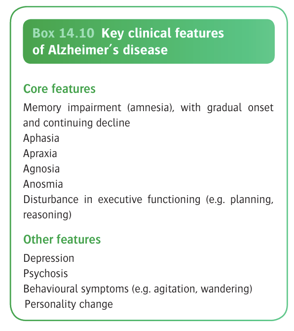

# Alzheimer's Disease

- **Definition** - a distinct neurodegenerative disorder constituting a unique neuropathological entity, being the most common cause of dementia
- **Epidemiology** - most common cause of presenile and senile dementia:
    - <u>Pravelence</u> - affects 5-7% of \>= 60y
- **Clinical features of dementia of Alzheimer's type** - minor forgetfulness as the initial presenting feature, followed by increasing memory disturbances and lack of spontaneity: 

    - **Global cognitive impairment** - primarily difficulties w/ 1) memory, 2) language, and 3) visuospatial skills:
        - **Disturbances of memory:**
                - Minor forgetfulness often mistakened as a normal ageing process, progressing over the initial 2-4y
                - Memory is lost for recent events first
        - **Disturbances of language** - usually affected early on:
                - Difficulty in finding words or naming objects (Dysphasia)
                - Impairments in the ability to construct fluent and informative sentences
        - **Perceptual-motor disturbances** (e.g. visuospatial skills):
                - Finding difficulties such as copying pictures on cognitive assessments
                - Practically affects difficulties in <u>making way around unfamiliar environments</u>
            - **Depression** - relationship complex, where depression can be a risk factor, differential diagnosis or a component of Alzheimer's disease:
                - Major depressive episodes occur in 10% of the case
                - Depressive symptoms not to the severity of a MDE occurs in up to 50% of cases
            - **Psychotic symptoms** - delusions and hallucinations occur in a significant minority of patients at some stages of illness (although studies on prevalence do not differentiate between AD and LBD):
                - <u>Delusions</u> (10-50%) - usually are (persecutory\*, esp. concerning theft, **originating from the forgetfulness of the patients** (hence unsure of whether to define as true delusions)
                - <u>Hallucinations</u> (10-25%) -
            - **Changes in behaviour** - often common, and are particularly concerning to carers:
                - **Changes in sleep-wake cycle** - progressive disorganisation of sleep-wake cycle:
                        - <u>Disorientation at night</u> - patient appears restless, disoriented and perplexed and may wake at night
                        - <u>Sundowning</u> - phenomenon where motor activity may increase in the evening
                - **Aggression** - physical and verbal agression common, often taking form of <u>resistance to help with personal care</u>, although unprovoked violence to others are rare
                - **Changes in activity level** - increases and decreases of daily activity level and self care which involves <u>varying degrees of purposefulness</u>:
                        - <u>Wandering</u> - can be variety of different activities putting themselves at risk by going to unsafe environments
                        - <u>Changes in eating</u> - undereat or overeat in the absence of carer support, resulting in weight changes and nutritional states
                        - <u>Changes in sexual behaviour</u> - usually loss of libido, although sexual disinhibition ocassionally occurs
                        - <u>Self care</u> - usually decline in self care progressively from IADLs to basic ADLs
                        - <u>Social behaviour</u> - often ersults in decreased social behaviours, but social facade can be maintained if carer able to assist w/ these functions
- **Clinical course of Alzheimer's disease** - relentlessly progressive over 5-8y:
        - <u>Early stage</u> - memory impairments is the most common presenting features but are heavily **modified by premorbid personality and functioning** (traits tend to be exagerated)
        - <u>Middle and lager stages</u>:
                - Global cognitive impairments more prominent
                - Presentation w/ more behavioural and psychiatric manifestations
                - Incidental physical illness may cause superimposed deterioration
- **Neuropathology of Alzheimer's disease:**
        - <u>Gross pathology</u>:
                - Grossly shrunken brain w/ widened sulci (wulcal effacements) that is proportional to enlarged ventricles
                - Total brain weight is reduced
        - <u>Histopathology</u>:
                - **Diagnostic features** - 1) neurofibrillary tangles and 2) amyloid plaques, histopathological Dx based on abundance and distribution (CREAD criteria)
                - **Other non-diagnostic features:**
                        - Gliosis, loss of neurons in hippocampus and enterohinal cortex, loss of synapses (most correlate w/ cognitive impairment)
                        - Cerebral amyloid angiopathy
                        - Hirano bodies (intracellular crystaliline deposits)
                        - Granulovacuolar accumulations (vacuoles within neurons)
        - <u>Progression of neuropathology</u> - neuropathological processes occur long before the onset of symptomatology and are the basis of predictive biomarkers:
                - Disease **begins in the entorhinal cortex** (interface between medial temporal lobe and neocortex), and spreads to 1) hippocampus, 2) associated areas of the parietal lobe, and 3) subcortical nuclei and 4) cortico-cortical projections (effective disconnection between affected areas)
                - Braak stages include 6 stages based on beta-amyloid deposition, and correlates w/ clinical severity
        - <u>Amylod plaques</u> - extracellular deposits of misfolded amyloid-beta proteins (central to genetic etiology), w/ denegrating neutrites and glia:
                - **Neuritic plaques** - dense-staining core on silver stain, pathologically more significant
                - **Diffuse plaques** - liken to cotton wool, pathologically less significant
        - <u>Neurofibrillary tangles</u> - intracellular aggregates of hyperphosphorylated tau in pyramidal cells of cortex and hippocampus:
                - Tau normally functions in **axonal transport**, and **maintenance to neuronal cytoskeletion**
                - Hyperphosphorlyated tau is insoluble, resulting in **neuronal dysfunction**, and **neuronal cell death**
- **Etiology and pathogenesis of Alzheimer's disease:** 
	
	
    - **Genetics** (Gotate 2015):
        - **Causative mutations** - Amyloid precursor protein (APP on Ch21), Presenilin 1 (PSEN1, Ch14), and Presenilin 2 (PSEN2, Ch1) accounts for most familial disorders (autosomal dominant pattern): 
        
        - **Apolipoprotein E gene** (Caselli et al 2009) - polymorphism in ApoE gene (ApoE4 is pathognomic as compared to the normal ApoE3 variant) accounts for sporadic and familial cases of Alzheimer's disease:
            - ApoE4 variant accounts for <u>50% of vulnerability</u> for late-onset AD
            - ApoE4 heterozygotes have 3x risk while homozygotes have 8x lifetime risk of AD, but to note that <u>most ApoE4 homozygotes do not develop the disease</u>
            - May be a/w different forms of neuropathology than ApoE4-negative cases
            - Postulated interactions between cholesterol metabolism and beta-amyloid metabolism and clearance
    - **Environmental factors:**
        - <u>Medical comorbidities and vascular health</u> - e.g. DM, indices of vascular health present at or before middle age predicts onset of dementia esp. AD
        - <u>Cognitive reserve</u> - 'use it or lose it' hypothesis:
            - Higher educational level and cognitive activity protective against AD
            - Mental inactivity predicts dementia and AD
        - <u>Drugs</u> - use of NSAIDs, statins, and HRTs have a decreased rate of dementia and AD, w/ plausible biological mechanisms, but prospective trials unable to demonstrate efficacy
    - **The amyloid cascade hypothesis** (Hardy and Higgens 1992):
        - **Increased formation and deposition of beta-amyloid** - particularly the 42-a.a. variant, which is insoluble and directly neurotoxic:
            - <u>Normal processing of amyloid proteins</u> - expression of APP as transmembrane protein, where normal alpha-secretase activity predominates over beta/gamma-secretase activity, **preventing beta-amyloid formation**
            - <u>Increased beta-/ gamma-secretase activity</u> - increased processing to beta-amyloids
        - **Decreased removal of beta-amyloids** - also contributes to the disease
        - **Limitations:**
            - PET studies reveal that cognitively healthy elderly individuals also have high amyloid deposition
            - Recent controversies w/ the "amyloid mafia"
            - Current synthesis believes beta-amyloid is not the central pathogenic mechanism, but a component of a more complex, non-linear process, possibly w/ tau (Jack et al 2013)
    - **Inflammatory mechanisms** - microglial activiation:
        - Initially thought to be a response to the ongoing neurodegenerative process
        - Now thought to be important part of disease process itself (e.g. TREM2, a risk gene is a microglial receptors for beta-amyloid clearance \[Heppner et al 2015)
    - **The cholinergic hypothesis** - historical view in the 1970s, able to explain Sx, but not the central cause
- **Genetic testing for Alzheimer's disease** - indicated for familial early-onset Alzheimer's disease for ApoE gene and APP, PSEN1/2 genes
- **Prognosis:**
    - <u>Survival</u> - median suvival from Dx is 5-7y
    - <u>Poor prognostic factors</u>:
        - Male
        - Older age of onset
        - Rapid rate of cognitive decline
