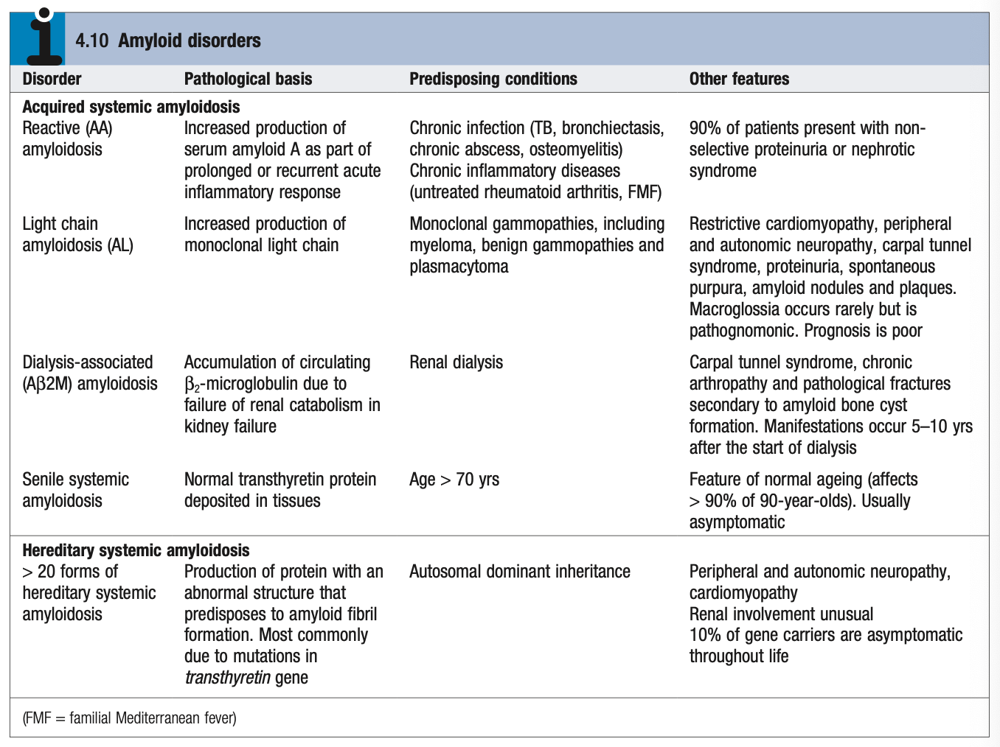

# Amyloidosis

- **Definition** - heterogenous group of acquired and hereditary disorders characterised by extracellular deposition of insoluble proteins
- **Forms of amyloidosis:** 

    - **Acquired systemic amyloidosis:**
        - <u>Reactive amyloidosis</u> (AA) - increased production of serum amyloid A as a part of a prolonged or recurrent acute inflammatory response (e.g. TB, CTD, FMF), primarily affects the kidneys
        - <u>Light chain amyloidosis</u> (AL) - increased production of monoclonal light chains due to plasma cell dyscrasia and related disorders, known to deposit in the heart, nerves, kidneys, and soft tissue (macroglossia pathognomonic)
        - <u>Dialysis-associated amyloidosis</u> (A-beta-2M) - increased deposition of beta-2 microglobulin due to failure of renal catabolism in kidney failure, known to cause carpal tunnel syndrome and pone deposition
        - <u>Senile systemic amyloidosis</u> - deposition of normal transthyretin protein, usually asymptomatic and increases in incidence w/ age (\>90% of 90y)
    - **Hereditary systemic amyloidosis** - heterogenous group of disorders resulting in abnormal protein production predisposing to amyloid formation, known to affect the nerves and heart, although renal involvement is unusual
- **Pathophysiology of amyloidosis:**
    - \_<u>PProduction of specific proteins</u> - nature of protein depends on underlying cause
    - <u>Extracellular complex deposits</u> - often forming fibrils of the specific protein involved, linked to GAGs, PGs, and serum amyloid P; ultimately resulting in organ dysfunction
- **End-organ damage in amyloid disorders:**
    - <u>Cardiac</u> - restrictive or dilated CM
    - <u>Renal</u> - nephrotic syndrome, tubulointerstitial disease (CIN, RTA)
    - <u>Peripheral nerves</u> - peripheral neuropathy
    - <u>Endocrinopathies</u> - thyroid, adrenal
    - <u>GI</u> - ?xerostomia, motility disorders (gastroparesis, chronic intestinal pseudoobstruction)
- **Clinical suspicion of amyloidosis** - should be considered in all cases of unexplained:
    - 1\. Nephrotic syndrome
    - 2\. Cardiomyopathy
    - 3\. Peripheral neuropathy
- **Dx** - histological Dx based on Bx of an affected organ, rectum, or subcutaneous rfat:
    - Presence of <u>apple-green birefringence</u> of amyloid deposits on <u>Congo red dye</u> under polarised light is pathognomonic
    - Quantitative scintigraphy w/ <u>radio-labelled serum amyloid P</u> to determine over load and distribution
- **Mx:**
    - **Principles of Mx:**
        - <u>Supportive care</u> - best medical Tx to support the function of affected organs
        - <u>Tx of underlying cause</u> - in acquired disorders, capable of reducing amyloid deposition aand possibly regression of existing amyloid deposits
        - <u>Tx of hereditary aTTr amyloidosis</u> - LT as the only definitive Tx
