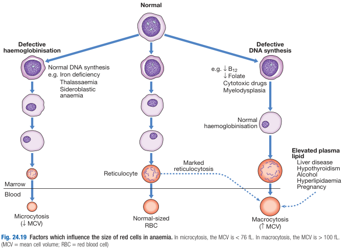
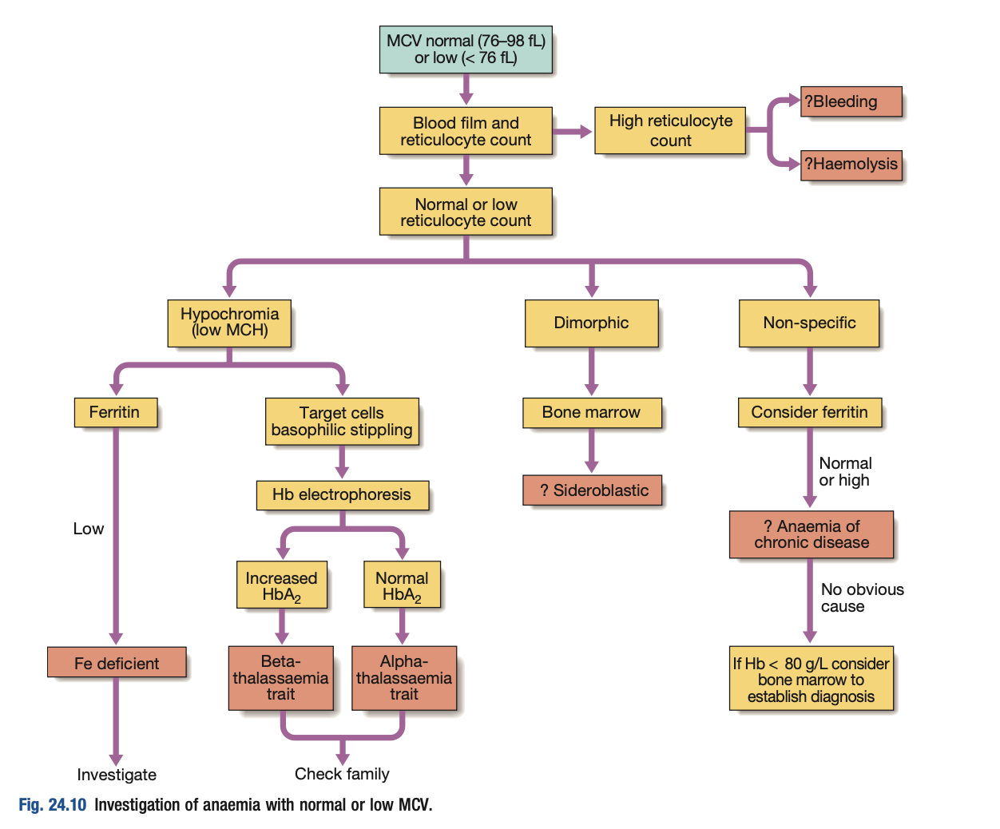
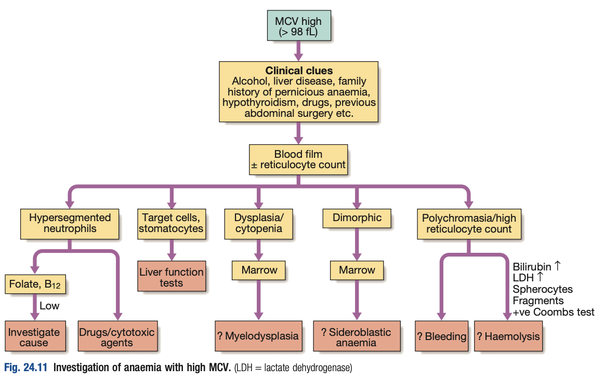

# Anaemia

- **Definition** - state in which level of haemoglobin blood is below reference ragnge appropriate for age and sex
- **Haemoglobin levels** (Hb) is dependent on:
    - 1\. Total haemoglobin mass
    - 2\. Total effective circulatory volume
- **Epidemiology** - around 30% of total world population is anaemic (50% caused by iron-deficiency anaemia)
- **Pathophysiological classification of anaemia**
    - Decreased RBC production (Anaemia of deminished erythropoiesis)
        - Bone marrow disorders - Aplastic anaemia, Pure red cell aplasia, marrow infiltration
        - Bone marrow suppression
        - Nutritional deficiencies - e.g. Iron-deficient anaemia, B12-deficient anaemia, folate-deficient anaemia
        - Reduced erythropoietin stimulation - Insuficient erythropoietin stimulation (Anaemia of chronic kidney disease), hypothyroidism
        - Anaemia of chronic disease
    - **Increased RBC destruction (haemolytic anaemia)**
        - Inherited - Membrane, Haemglobin, Enzyme defects
        - Acquired - Intrinsic vs Extrinsic
    - **Haemodilution** - e.g. pregnancy, fluid overload staets
- **Clinical classification of anaemia** - based on mean corpuscular volume (MCV):
    - Microcytic anaemia - <u>failed haemoglobinization</u> causes excessive rounds of cell division than normal before released to blood
    - Macrocytic anaemia - caused by 1) <u>Failed DNA synthesis</u> (Megaloblastic anaemia, cytotoxic agents), 2) Reticulocytosis, or 3) raised blood lipid levels resulting increased cell membrane surface area, or 4) myelodysplasia

  
  
- **Clinical features of anaemia:**
    - **Clinical presentation** - depends on 1) rate of onset, 2) severity of anaemia, 3) cardiopulmonary reserve:
        - <u>Acute and severe anaemia</u> (few g/L within days) - SOBOE, palpitation, dizziness or syncope, precipitating factors of myocardial ischaemia and related symptoms
        - <u>Chronic and insidious</u> (Menorrhagia, GI malignancy etc.) - Fatigue, decreased exercise tolerance, pale-looking
    - **Symptoms related to cause of anaemia** - e.g. Upper GI bleed, menorrhagia, bone pain (MM), hypovolaemia
    - **Complications:**
        - Cardiac ischaemia
        - Thrombocytopenic bleeding
        - Mortality
- **Considerations when approaching anaemia:**
    - Demographic - age, sex, ethnic background
    - Iron-deficiency anaemia and anaemia of chronic disease remains the most common cause of anaemia
- **Salient points of Hx:**
    - <u>Assessment of blood loss</u>:
        - Thorough GI Hx - UGIB, LGIB, abdominal pain, prior investigations and scopes
        - Menstrual Hx - look for menorrhagia
    - <u>Assessment of diet</u> - vegetarian diet predisposes to B12 deficiency anaemia
    - <u>PMH</u> - identify certain chronic inflammatory disease, or prior GI surgery:
        - Chronic inflammatory diseases - e.g. rheumatoid arthritis (ACD)
        - Prior surgery - Gastrectomy, resection of terminal ileum
        - Gallstone disease - suspicious of haemolytic anaemia
    - <u>Drug Hx</u> - look for drugs that cause blood loss, haemolysis, or aplasia:
        - Drugs causing GI bleeding - Aspirin, other NSAIDs
        - Drugs causing haemolysis - sulphonamide, methyldopa
        - Drugs causing aplasia - chloramphenicol
    - <u>FHx</u> - for inherited haemolytic anaemia and other familial anaemias
- **Signs:**
    - Pallor of conjunctiva, and palmar creases
    - Signs reflecting underlying cause:
        - Shock/ tachycardia - acute blood loss
        - Uraemic look - CKD
        - Jaundice - Haemolysis
        - Early greying and glossitis and neurological signs - pernicious anaemia
        - Lymphadenopathy and hepatosplenomegaly - haematological malignancies/ solid organ tumour
        - Isolated splenomegaly - hypersplenism
        - RLQ mass - caecal carcinoma
- **Ix** - dependent on type of anaemias:
    - <u>Differentiation of anaemia based on MCV</u>:
        - Microcytic (hypochromic) anaemia - indicative of abnormal haemaglobinisation (Fe-Deficiency Anaemia, Thalassaemia)
        - Normocytic anaemia - anaemia of chronic disease, acute blood loss
        - Macrocytic anaemia - indicative of reticulocytosis (haemolysis, acute blood loss), megaloblastic anaemia, and myelodysplasia
    - <u>Other cell counts</u>:
        - WBC - differentiation bewtween isolated anaemia vs pancytopenia
        - PLT:
            - Reactive thrombocytosis - acute blood loss, Iron deficiency anaemia, haemolytic anaemia
            - Thrombocytopenia - Red cell fragmentation syndrome (MAHA)
    - **Workup for microcytic or normocytic anaemia** - reticulocyte count, PBS +/- iron profile: 
    
    - **Workup for macrocytic anaemia** - PBS, B12, folate, and haemolytic workup: 
    
