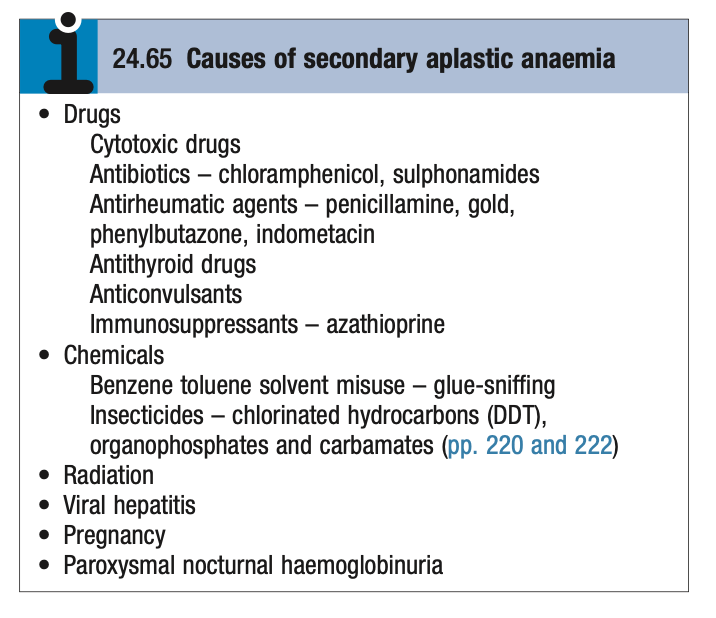
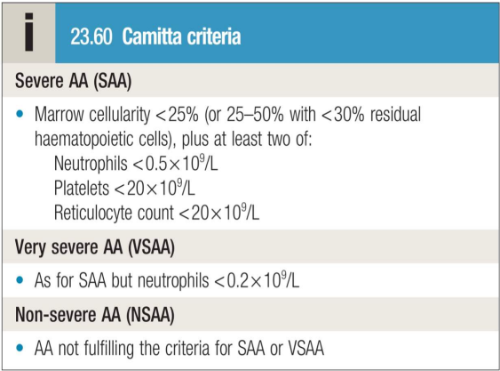

# Aplaastic Anaemia

- **Definition** - failure of the pluripotent haematopoietic stem cells resulting in bone marrow hypoplasia with pancytopenia in the blood
- **Etiology of aplastic anaemia:**
    - <u>Primary aplastic anaemia</u>:
        - Idiopathic (autoimmune basis)
        - Congenital bone marrow failure syndrome - e.g. Fanconi anaemia, Schwachan-Diamond syndrome, Dyskeratosis congenita, pure red cell aplasia
    - <u>Secondary aplastic anaemia</u>:
        - **Drugs** - cytotoxic therapy, ABx, DMARDs, anti-thyroid drugs, anti-convulsants, immunosuppressants:
            - ABx - chloramphenicol, sulphonamides
            - NSAIDs - indomethacin, diclofenic acid
            - Antithyroid agents - carbimazole, methimazole,propylthiouracine
            - Anti-convulsants - phenytoin, carbamazepine
        - **Chemicals** - glue, organophosphatates
        - **Radiation**
        - **Infection** - e.g. sero-negative viral hepatitis

    
    
- **Clinical features** - Sx of bone marrow failure:
    - <u>Anaemia</u> - manifests as fatigue, SOBOE etc.
    - <u>Neutropenia</u> - rarely presents w/ recurrent infections
    - <u>Thrombocytopenia</u> - presents as bleeding
- **Ix:**
    - **CBC** - reveals pancytopenia:
        - <u>Hb and MCV</u> - mildly macrocytic anaemia
        - <u>WBC and differentials</u> - leucopenia (severity defined by degree of neutropenia)
        - <u>PLT</u> - thrombocytopenia
    - **PBS:**
        - Pancytopenia
        - Low reticulocyte count
        - Macrocytosis
    - **BM examination** - reveals hypocellular marrow (\< 25%)
- **Dx criteria for AA:** 

- **Mx:**
    - **Principles of Mx:**
        - <u>Supportive Mx</u> - packed cells transfusion, platelet transfusion and aggressive Mx of infections
        - <u>Allogenic HSCT</u> - Tx of curative intent in young, fit patients and if there is an available donor
        - <u>Medical therapy</u> - medical Tx in those w/ severe aplastic anaemia
    - **Medical therapy** - indicated for sAA:
        - <u>Thrombopoietic receptor agonists</u> - high dose eltrombopag
        - <u>Immunosuppressive therapy</u> - cyclosporin and anti-thymocyte globulin
- **Prognosis** - extermely poor prognosis if on supportive Tx alone (50% die in first year):
    - <u>Mortality</u> - 75% 5y survival w/ active medical Tx
    - <u>Disease progression</u> - risk of disease relapse, or development clonal disorders (e.g. PNH, MDS, AML)
