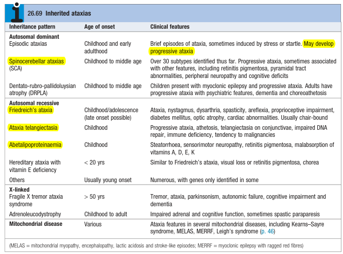
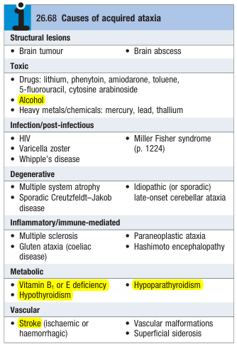

# Ataxia

- **Definition** - heterogenous group of inherited and acquired disorders, presenting either with pure ataxia or in association w/ other neurological or non-neurological features
- **DDx of ataxia** - significant proportion of cases remain idiopathic despite investigation:
    - **Inherited ataxia** - inherited disorders in which <u>degenerative changes</u> occur to varying extents in 1) cerebellum, 2) brainstem, 3) pyramidal tracts, 3) spinocerebellar tracts, and 5) optic and peripheral nerve: 
    
    - **Acquired ataxia:** 
    
