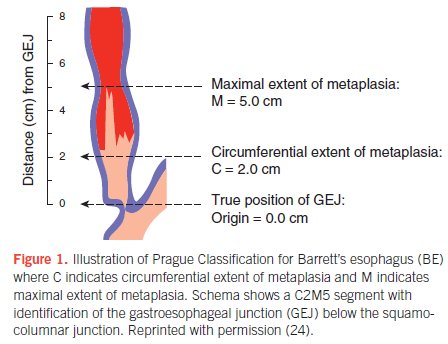

# Barrett's Esophagus

- **Definition** - a pre-malignant lesion in which <u>metaplastic columnar epithelium</u> that has both gastri an intestinal features replaces normal stratified squamous epithelium as a <u>consequence of chronic GERD</u> and predisposes to <u>development of AD of esophagus</u>
- **Epidemiology** - large majority of cases go undiagnosed and present only when symptomatic carcinoma develops
- **Risk factors of Barrett's esophagus:**
    - <u>Gastroesophageal reflux disease</u> (GERD) - usually in symptomatic GERD, where **errosive esophagitis** is an independent risk factor for Barrett's esophagus (RRR 5.2)
    - <u>Central obesity</u> - likely through development of GERD
    - <u>Smoking</u> - synergistic effect with GERD in increasing the risk of Barett's esophagus
    - <u>FHx</u> - some descriptions of family aggregation, but is unclear whether it is due to genetic predisposition or common environmental exposures
- **Cancer risk of Barrett's esophagus:**
    - <u>Cancer incidence</u> - relative risk is increased by 40-120x but the <u>absolute risk remains low</u> (0.1-0.5%)
    - <u>Cancer mortality</u> - mortality in patients with Barrett's esophagus is often unrelated fo CA esophagus, likely due to older age, obesity and other risk factors for more common diseases (e.g. CAD)
    - <u>Baseline dysplasia as a potential marker of risk</u> - some evidence show baseline dysplasia is related to risk of malignant transformation
- **Pathophysiology of Barrett's esophagus** - incompletely understood:
    - **Esophageal injury** - chronic inflammation caused by GERD, bile, and nitroso compounds
    - **Development of Barrett's metaplasia** - favourable adaptation to chronic reflux as the columnar epithelium is more resistant to acid-reflux
    - **Malignant transformation** - initially thought to be a gradual step-wise accumulation of mutations, but studies show a <u>'genome-doubled pathway'</u> where tp53 mutation is acquired first, <u>implying malignancy can develop rapidly</u>
- **Clinical features of Barrett's esophagus** - CLO does not typically cause any symptoms directly:
    - <u>Asymptomatic</u> - most patients typically present with GERD-like symptoms (e.g. heartburn, regurgitation), and was subsequently discovered to have Barrett's esophagus on OGD when it is indicated (e.g. Dysphagia, UGIB or anaemia, weight loss)
- **Ix of Barrett's esophagus:**
    - **OGD and biopsy:**
        - <u>Endoscopc findings suspicious of Barrett's esophagus</u> - salmon-pink patches creeping up the esophagus, objectively defined as **squamocolumnar junction \>= 1 cm proximal to the gastroesophageal junction (OGJ)**:
            - **Squamocolumnar junction** (Z-line) - visible junction between pale colour of squamous epithelium, and columnar epithelium of the stomach
            - **Gastroesophageal junction** (OGJ) - arbitrarily defined as the level of the most proximal extent of the gastric longitudinal folds (<u>avoid excessive inssuflation of stomach as it flattens folds</u>)
        - <u>Prague criteria</u> - grading extent of GERD based on depth of endoscopic insertion at OGJ: 
        
        - <u>Biopsy</u> - only performed if endoscopic suspicion for Barrett's (4 biopsies obtained for every 2cm of suspected Barrett's)
    - **Histological examination** - 3 types of CLO have been described:
        - <u>Gastric cardia type mucosa</u> - pitted surface and glands lined exclusively by mucus secreting cells, with tortuous, tubular glands
        - <u>Atrophic gastric fundic-type epithelium</u> - foveolar surface lined by mucus-secreting cells, with deepier glands containing chief cells and parietal cells
        - <u>Intestinal metaplasia</u> - defined by an increased number of goblet cells and other intestinal columnar cells
    - **Other methods:**
        - <u>Novel endoscopic techniques</u> - e.g. endomicroscopy, chromoendoscopy, NBI, autofluorescence endoscopy
        - <u>Non-endoscopic technigue</u> - e.g. capsule sponge (collection of cells from the esophageal lumen)
- **Dx evaluation of Barett's esophagus** - Dx chiefly made on endoscopy and biopsy:
    - 1, Columnar epithelium \>= 1cm of the OGJ (see above)
    - 2\. Histological examination of biopsy reveals intestinal metaplasia (BSG also allows gastric-type columnar epithelium)
- **Classification of Barrett's esophagus** - by extent:
    - Long-segment Barrett's - Barrett's esophagus \>= 3cm
    - Short-segment Barrett's - Barrett's esophagus \< 3cm
- **Mx of Barrett's esophagus:**
    - **Principles of Mx:**
        - <u>Medical therapy</u> - acid suppression and other chemoprotection
        - <u>Surveillance</u> - interval endoscopic surveillance for dysplasia and esophageal adenocarcinoma
        - <u>Subsequent Mx of dysplasia and intramucosal carcinoma</u> - esophagectomy or endoscopic Tx ('organ-preserving' therapy)
    - **Acid suppression therapy** (PPI) - little evidence in cancer prevention, but still prescribed as most patients have symptomatic GERD or complications (e.g. strictures):
        - <u>Selection</u> - low-dose omeprazole (20mg/d), pantoprazole (40mg/d)
        - <u>MOA</u> - acid suppression theoretically reduces chronic inflammation, which predisposes to cancer development
        - <u>Evidence</u> - little evidence that acid suppression prevents progression or causes regression of Barrett's esophagus, and prevents cancer development
    - **Endoscopic surveillance** - surveillance intervals dependent on 1) degree of dysplasia, and 2) extent of Barrett's esophagus:
        - **Non-dysplastic Barrett's esophagus:**
            - <u>Long-segment Barrett's</u> - repeat OGD q3y
            - <u>Short-segment Barrett's</u> - repeat OGD q5y
        - **Low-grade dysplasia** - endoscopic mucosal dissection and RFA preferred, but continue surveillance q6mo is also proposed
        - **high-grade dysplasia or intramucosal carcinoma** - endoscopic eradication therapy or esophagectomy
