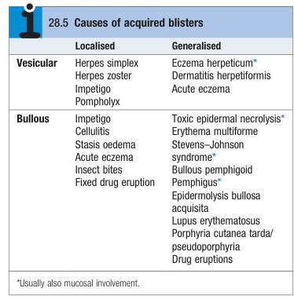

# Blisters

- **Definition** - clinical presentation that is variable but reflects underlying loss of cell-cell adhesion within the epidermis or sub-epidermal region
- **Clinical presentation of blisters** - dependent on site or level of blistering within the skin:
    - **High in the epidermis** (just below stratum cornuem) - e.g. pemphigus follaceus, SSSS, bullous impetigo:
        - Intact blisters are <u>not seen</u> as the split is small and high
        - Rupture of the fragile blister roof results in formation of <u>erosions</u>
    - **Lower in the epidermis** - e.g. pemphigus vulgaris, SJS/TEN:
        - Intact <u>flaccid blisters</u> form as the roof is sufficiently thick
        - Rupture of the fragile blisters results in formation of erosions
    - **Presence in the subepidermal layer** - e.g. bullous pemphigoid, pidermolysis bullosa acquisita, porphyria cutanea tarda:
        - Intact <u>tense-roofed blisters form</u> which typically do not rupture
    - **Foci of separation at different levels** - e.g. dermatitis:
        - Formation of <u>multillocular bullae</u> (made of coalescing vesicles across layers)
- **DDx of blisters** - classified by 1) layer involvement, 2) site and size: 

- **Salient points of Hx:**
    - **HPI** - site, onset, progression, mucosal involvement:
    - **Associated Sx** - mainly for systemic Sx
    - **Drug Hx** - detailed to r/o SJS/TEN
- **P/E:**
    - Primary Assessment and vital signs
    - Assessment of the distribution, extent, morphology of the rash
    - Nikolsky sign - +ve Nikolsky sign (i.e. sliding pressure from a finger on normal looking epidermis dislodges epidermis) suggestive of intraepithelial defect (e.g. Pemphigus, SSSS, TEN)
- **Systemic approach to Dx of blisters:**
    - <u>Exclusion of infections</u> - skin scrapings for HSV, VZV, S. areus related skin infection
    - <u>Consider abnormal presentation of common skin disorders</u> - e.g. severe peripheral oedema, cellulitis, contact dermatitis, eczema
    - <u>Consider drug erruptions</u> - e.g. fixed drug erruptions, erythema multiforme, vasculitis, TEN
    - <u>Consider immunobullous disease</u> - age of the patient is informative (see section on immunobullous disorders)
- **Ix:**
    - <u>Skin biopsy</u> - r/o infections and allow histology and direct IMF
