# Bronchial Carcinoma

- **Definition** - primary neoplasia arising from the bronchial epithelium
- **Epidemiology:**
    - <u>Incidence</u> - increased dramatically in 20th century as a direct result of tobacco epidemic
    - <u>Mortality</u> - mortality rates continue to increase especially in F (more wommen die of lung cancer than breast cancer in US, UK and HK)
- **Pathology of bronchial carcinoma** - arises from bronchial epithelium or mucous glands:
    - **Histological subtype of bronchial carcinoma** - SCLC vs NSCLC:
        - <u>Squamous cell carcinoma</u> (SCC) - typically arises centrally, but can arise peripherally often resulting in central necrosis and cavitation, morphologically resembling a lung abscess
        - <u>Adenocarcinoma</u> (AD) - typically arises peripherally
        - <u>Small cell carcinoma</u> (SCLC) - aggressive form of lung cancer characteristcally develop wide-spread metastatic spread even with a small primary tumour
        - <u>Large cell carcinoma</u>
    - **Location of bronchial carcinoma** - 70% seen in the upper lobe:
        - <u>Central tumours</u> - occurs in large bronchus and are often SCC, enabling earlier presentation with Sx
        - <u>Peripheral tumours</u> - occurs in peripheral bronchus, and can grow very large without producing Sx, resulting in delayed Dx
- **Mode of spread of bronchial carcinoma:**
    - **Direct invasion:**
        - <u>Pleura</u> - manifests as malignant pleural effusion and pleurisy
        - <u>Chest wall</u> - invasion into intercostal nerves manifests as musckuloskeletal pain
        - <u>Brachial plexus</u> - results in pain in the UL
        - <u>Left-recurrent laryngeal nerve</u> - results in unilateral vocal cord palsy, bovine cough, and hoarsenes
    - **Lymphatic spread** - spread to mediastinal LN, cervical and supraclavicular LN (often before Dx)
    - **Haematogenous spread** - commonly to liver, bone, brain, adrenals and skin
- **Clinical presentations of bronchial carcinoma** - reflects local, metastatic or paraneoplastic tumour effects:
    - **Features of local tumour:**
        - **Cough** (earliest Sx) - typpicaly dry but can be a/w sputum in secondary infection (bronchial obstruction), classically 'bovine cough' occurs with RLN invasion
        - **Haemoptysis** - particularly common with central bronchial tuomours that ulcerates and bleeds and should always be investigated to r/o bronchial carcinoma (rarely, massive haemoptysis occurs as a result of tumour invasion into large vessels)
        - **Breathlessness** - may be caused by 1) atelectasis, 2) pneumonia, 3) malignant pleural effusion and 4) diaphragmatic paralysis due to compression of phrenic nerve
        - **Bronchial obstruction** - partial obstruction or complete obstruction results in different presentation:
            - <u>Partial obstruction</u> - manifests as a monomorphic unilateral **wheeze** that does not clear with coughing, and also **pneumonia due to impaired mucus drainage** that is often recurrent over the same site and resistant to Tx
            - <u>Complete obstruction</u> - manifests as **atelactasis** (collapse) resulting in SOB, ipsilateral mediastinal shift, dullness to percussion and reduced breath sounds
    - **Features of direction invasion of the tumour:**
        - **Pleurisy** - sharp, well-localised pain that is exacerbated by breathing may indicate malignant pleural invasion, but may also be caused by parapneumonic effusion
        - **Nerve entrapment** - direct invasion into nerves resulting in nerve entrapment syndromes:
            - <u>Intercostal nerves</u> - direct invasion into chest wall can result in intercostal nerve entrapment manifesting as **pain in the distribution of thoracic dermatome**
            - <u>Brachial plexus</u> (**Pancoust syndrome**) - direct invasion of C8-T1 roots of the brachial plexus by apical tumour (Pancoust tumour) manifests as pain on the inner aspect of the arm (C8-T1), and intrinsic hand-muscle wasting
            - <u>Sympathetic chain ganglion</u> (**Horner's syndrome**) - direct invasion of sympathetic chain ganglion at or above the stellate ganglion results in **ipsilateral partial ptosis, endopthalmos, miosis, and hypohidrosis**
            - <u>Phrenic nerve</u> - invasion into phrenic nerve results in ipsilateral diaphragmatic paralysis and **SOB**
            - <u>Recurrent laryngeal nerve</u> - invasion into recurrent laryngeal nerves results in ipsilateral vocal cord paralysis, resulting in **hoarseness** and classical **bovine cough**
        - **Mediastinal spread** - direct invasion into mediastinal structures or due to lymphatic spread into mediastinal LN:
            - <u>Esophagus</u> - direct invasion into esophagus may cause **dysphagia**
            - <u>Pericardium</u> - invasion into pericardium may result in **arrhythmia** or **pericardial effusion** (ocassionally tamponade)
            - <u>Superior vena cava</u> - malignant nodes may result in SVC syndrome resulting in suffusion and swelling in neck and face, conjunctival, oedema, headache, and dilated veins on chest wall
    - **Features of nodal metastasis** - palpable or sonographically detected enlarged supraclavicular LN rpovides a simple means of <u>cytological Dx</u> on FNAC
    - **Features of metastatic spread** - patient presents with marked constitutional Sx such as lassitude, anorexia, and marked weight loss:
        - <u>Liver</u> - presents with hepatocellular jaundice
        - <u>Brain</u> - focal neurological deficits, epileptic seizures, personality changes etc.
        - <u>Bone</u> - bone pain and pathological fractures
        - <u>Skin</u> - skin nodules
    - **Paraneoplastic syndrome** - non-metastatic extra-pulmonary manifestations:
        - **Finger clubbing** - overgrowth of soft tissue under the nail beds, leading increased nail bed fluctuations and increased nail curvature
        - **Hypertrophic pulmonary osteoarthropathy** (HPOA) - painful peri-ostitis of the distal tibia, fibula, radius and ulna with some local tenderness and pitting oedema often seen over the shin
        - **Membranous nephropathy** - presenting w/ severe oedema in association w/ nephrotic syndrome, especially in the absence of Anti-PLA2R
        - **Endocrine manifestations** - SIADH and ectopic ACTH production are characteristic for SCLC:
            - <u>SIADH</u> - manifestation as euvolemic hyponatraemia
            - <u>Ectopic ACTH production</u> - manifests acutely as Cushing's syndrome, but electrolyte changes such as hyperK is much more marked than metabolic changes (as these are influenced by the cachexic effect of tumour)
            - <u>HyperCa of malignancy</u> - may be attributable to bone metastasis, and ocassionally due to secretion ot PTH-related peptides
        - **Neurological manifestations** - polyneuropathy, myelopathy, cerebellar degeneration, myasthenia (Lambert-Eaton syndrome)
            - <u>Lambert-Eaton myasthenic syndrome</u> - Ab against pre-synaptic Ca channels resulting in muscle weakness, but return of power w/ repeated utilisation of the muscle
            - <u>Immune-mediated myositis</u> - proximal myopathy w/ or w/o cutaneous manifestations (photosensitivity)

    
    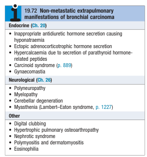
- **Ix** - histological Dx and define the extent of disease:
    - **CXR** - various radiological presentations conisistent with presentation of pulmonary nodule but are non-diagnostic:
        - **Pulmonary nodule or nass:**
            - <u>Unilateral hilar enhargement</u> - typically represents a central tumour arising from large bronchi, but peripheral tumour on the apical segment of lower lobe can appear as **enlarged hilar shadow**
            - <u>Unilateral pulmonary nodule or mass</u> - as an irregular, but well-circumscribed mass +/- cavitations
        - **Lung, lobar or segmental collapse** - caused by <u>complete bronchial obstruction</u>:
            - 1\. Opacification of lung fields (+/- lost of vascular markings)
            - 2\. Ipsilateral mediastinal shift
            - 3\. Ipsilateral elevation of hemidiaphragm
            - 4\. Compensatory emphysema of the contralateral lung
        - **Ipsilateral pleural effusion** - blunting of costophrenic level with fluid level often indicative of pleural invasion
        - **Broadening of mediastinum** - occurs with paratracheal lymphadenopathy resulting in widening of the upper mediastinum
        - **Enlarged cardiac shadow** - with pericardial effusion
        - **Elevation of ipsilateral hemidiaphragm w/o collapse** - suggestive of phrenic nerve palsy resulting in diaphragm paralysis
        - **Rib destruction** - osteolytic lesions of the ribs caused by direct invasion of chest wall or haematogenous metastasis

    
    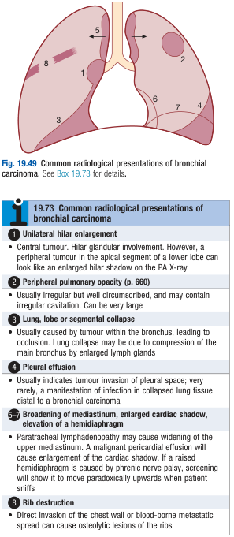
    - **CT T+A+P** - definitive staging workup necessary for all suspected bronchial carcinoma:
        - **Role of computed tomography:**
            - 1\. <u>Initial staging information</u> - reveal mediastinal or metastatic spread which precludes further staging workup
            - 2\. <u>Planning of biopsy procedure</u> - establish whether tumour is accessible by bronchoscopy or percutaneous CT-guided Bx
        - **Findings consistent with malignant nodule** - see detailed notes on incidental pulmonary nodule
    - **Cytology and histological diagnosis:**
        - **Sputum cytology** - low yield (reserved for patients unfit for invasive procedures)
        - **Diagnostic thoracocentesis and pleural Bx** - preferred investigation for those presenting w/ pleural effusion
        - **Bronchoscopy with transbronchial biopsy** (+/- bronchial washings and brushings) - 75% of primary lung tumours can be <u>directly visualised and sampled by TBB</u>:
            - <u>Bronchoscopic procedures</u> - see details on incidental pulmonary nodule
            - <u>Test properties</u> - dependent on size and location of tumour:
                - Centrally located tumour - high Sn and Sp if the tumour is directly visualised under bronchoscope
                - Peripherally located tumour - low yield for blind bronchial washings and brushings for peripheral tumours too peripheral to be accessible by bronchoscope
        - **Percutaneous needle Bx** - more reliable for patients w/ peripheral tumours
        - **Needle aspiration or Bx of distant metastasis** - e.g. SCLN, skin lesions, liver, bone marrow
- **Dx** - definitive Dx requires <u>cytological/ histological Dx</u> from either primary tumour, LN, and distant metastasis
- **Staging sytsem for bronchial carcinoma** - different staging system and prognosis for NSCLC and SCLC:
    - **TNM staging for NSCLC and prognostic groups:** 
    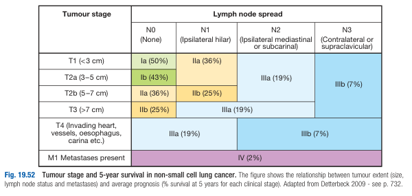
    - **Changes in AJCC 9th edition TNM staging for lung cancer:**
        - <u>Changes to T staging</u>:
            - Invasion of adjacent lobe has been added as T2a category
            - Azygous vein, thoracic nerve, and stellate ganglion involvement added as T3 category
            - Thymus, vagus nerve, supra-aortic arteries, brachiocephalic veins, subclavian vessels, vertebral body, lamina, spinal canal, cervical nerve roots, brachial plexus (ie, trunks, divisions, cords, or terminal nerves) involvement are specified as T4 category criteria
        - <u>Changes in N staging</u> - new subclassification of N2 disease into single station or multiple station mediastinal involvement:
            - The rationale for this change was a worsened overall survival for those with clinical N2b versus N2a disease (five-year estimate 31 versus 42 percent, respectively, HR 1.27), as well as pathologic N2b versus N2a disease (five-year estimate 40 versus 51 percent, HR 1.46), in analysis of the IASLC database
        - <u>Changes in M-staging</u> - subdivision of M1c into M1c1 and M1c2
        - <u>Changes in prognostic staging</u>:
            - T1 N1 M0 changed to stage IIA (previously stage IIB disease)
            - T1 N2a M0 assigned to stage IIB (T1 N2 M0 was previously stage IIIA disease)
            - T2 N2b M0 assigned to stage IIIB (T2 N2 M0 was previously stage IIIA disease)
            - T3 N2a M0 assigned to stage IIIA (T3 N2 M0 was previously stage IIIB disease)
    - **AJCC 9th edition TNM staging for lung cancer** - typically applicable to NSCLC: 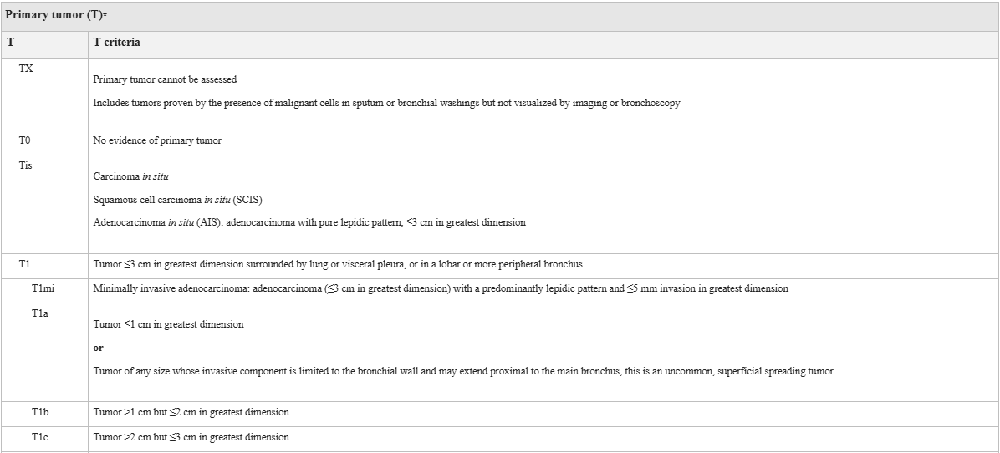 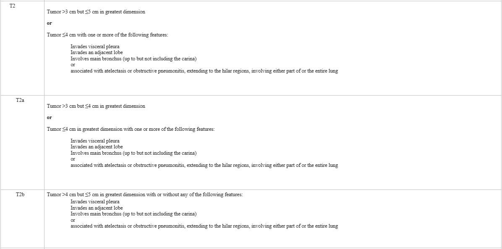 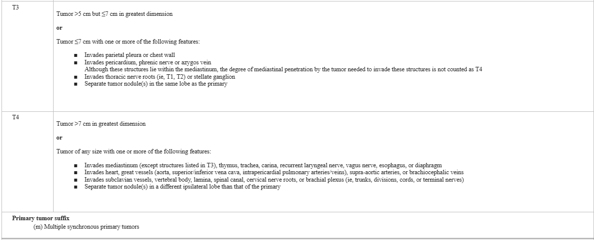 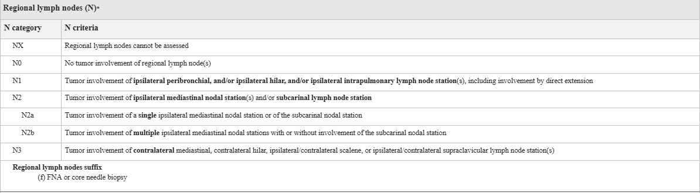 
    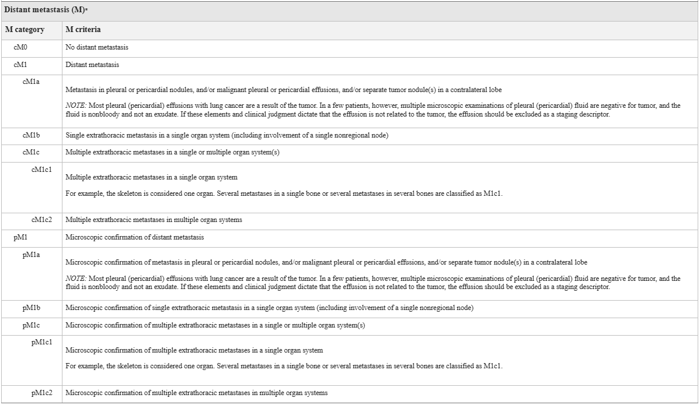
    - **AJCC 9th edition TNM prognostic staging:** 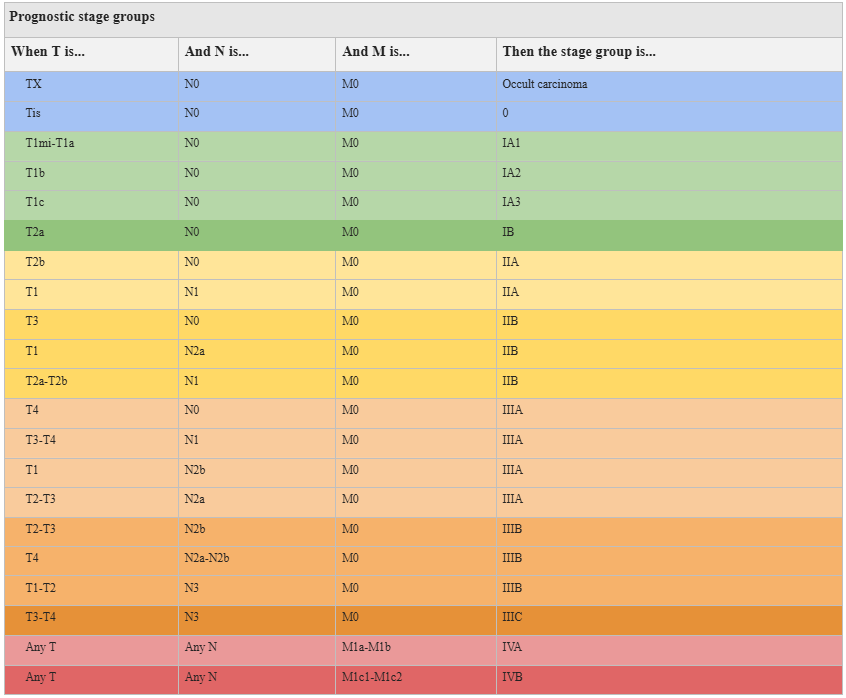 
    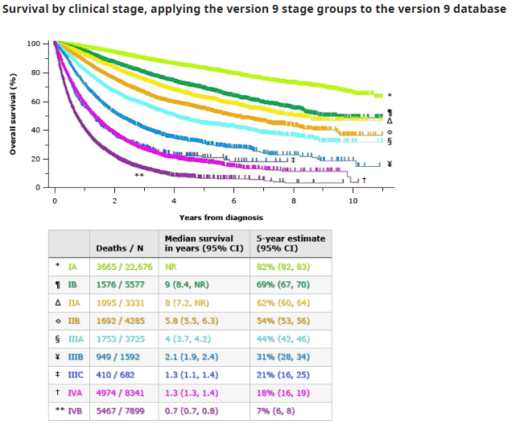
- **Principles of staging:**
    - <u>Dependent on histopathology</u>:
        - SCLC - propensity to metastasise early dictates that patient with SCLC are not suitable for surgical intervention
        - NSCLC - careful staging Ix to guide Mx
    - <u>Dependent on clinical presentation</u>:
        - Routine staging Ix - CT T+A+P, EBUS, EUS and PET-CT are performed for all patients with NSCLC
        - Specific Ix based on clinical, haematological or biochemical evidence - head C, radionuclide bone scanning, liver USG, bone marrow biopsy
- **Staging Ix:**
    - **CT T+A+P** - detection of distant metastasis and locoregional staging by detecting mediastinal nodes
    - **Locoregional staging** - sampling of suspicious LN identified on CT:
        - <u>Mediastinoscopy</u> - assessment of suspicious upper mediastinal nodes
        - <u>Bronchoscopy with radial endobronchial ultrasound</u> (R-EBUS TBB) - assessment of suspicious upper mediastinal LN
        - <u>Endoscopic USG</u> - assessment of suspicious lower mediastinal LN by sampling through the esophageal wall
    - **PET-CT** - whole body 18-FDG scans to detect metabolically active tumour metastasis
- **Mx:**
    - **Principles of Mx** - multidisciplinary approach:
        - **Goals of Mx**:
            - Treatment of curative intent - surgical resection is the only Tx of curative intent and carries the best hope of lung-term survival, but radical chemoradiation also achieves prolonged remission in some patients
            - Patiative Tx - supportive care with chemoradiation can help relieve distressing Sx
            - General Mx - Mx of complications and endocrine manifestations of bronchial carcinoma
        - **Factors affecting Mx of bronchial carcinoma:**
            - <u>Histopathology</u> - NSCLC should opt for surgical resection whenever possible, while SCLC are often disseminated at presentation but extremely responsive to chemotherapy
            - <u>Staging</u> - escalation of Tx based on prognostic stage for NSCLC
            - <u>Patient health</u> - patient's cardiopulmonary function often precludes surgery
        - **Stage-based Tx of NSCLC:**
            - <u>Stage I disease</u> (T1-2aN0) - surgical resection of tumour for all surgical candidates
            - <u>Stage II disease</u> (\<T3N1 disease) - surgical resection of tumour for all surgical candidates (+/- post-operative aduvant chemotherapy)
            - <u>Stage III disease</u> (T3N1) - radical chemoradiation +/- immunotherapy
            - <u>Stage IV disease</u> (M1) - palliative systemic therapy, immunotherapy
        - **Stage-based Tx of SCLC:**
            - <u>Limited stage SCLC</u> - combined chemoradiation (+/- surgical resection in rare cases)
            - <u>Extensive-stage SCLC</u> - chemotherapy
    - **Surgical resection:**
        - <u>Indications</u> - considered for all surgical condidates:
            - Stage I disease - N0 disease, tumour confined with visceral pleura
            - Stage II disease - ipsilateral peribronchial and hilar LN involvements resected
        - <u>Outcomes</u> - best hope for long-term survival for NSCLC:
            - Stage I disease - 75% 5y survival
            - Stage II disease - 55% 5y survival
    - **Radiotherapy** - much less effective than surgery:
        - <u>Indications for radiotherapy</u>:
            - **Indications in NSCLC:**
                - <u>Early lung cancer</u> (Stage I-II disease) - can offer long-term survival in selected patients with localised disease in whom comorbidity pre-cludes surgery
                - <u>Locally advanced lung cancer</u> (Stage III disease) - often combined with chemotherapy if LN involved
                - <u>Metastatic lung cancer with distressing local complications</u> (Stage IV disease) - e.g. SVC obstruction, recurrent haemoptysis, pain caused by chest wall invasion, skeletal metastatic deposits, large bronchial obstruction
            - **Indications in SCLC** - conjunction with chemotherapy, where prophylactic cranial irradiation is efficient in preventing development of brain metastasis in those who have complete response to chemotherapy
    - **Chemotherapy** - details added later
    - **Laser therapy and endobronchial stenting** - palliative measures to maintain airway patency:
        - <u>Laser therapy</u> - palliation of major airway obstruction through bronchoscopic laser Tx to clear tumour tissue and allow re-aeration of collapsed lung
        - <u>Endobronchial stenting</u> - maintain airway patency in face of extrinsic compression

## Management of Early NSCLC

- **Definition of early lung cancer:**
    - Stage I Disease
    - Stage II Disease
- **Principles of Mx:**
    - <u>Surgery</u> (lobectomy vs sublobar resection) - mainstay of Tx for most early lung cancer patients who are surgical candidates deemed by pre-operative assessment
    - <u>Chemotherapy</u> - adjuvant chemotherapy in selected patients (principally N+ disease), while role of neoadjuvant chemotherapy is less studied in this population
    - <u>Radiotherapy</u>:
        - Role as primary therapy if surgery is not pursued
        - Role in adjuvant and neoadjuvant setting is limited (except adjuvant if R0 resection not achieved)
    - <u>Targeted therapy</u> - role still under investigation
- **Pre-operative assessment** - indicated for patients contemplating surgery by assessing pre-operative status, and predicting post-operative status:
    - **Cardiac risk assessment** - screening by recalibrated thoracic revised cardiac risk index (RCRI):
        - **Revised cardiac risk index** - recalibrated for subpopulation w/ lung malignancies: 
        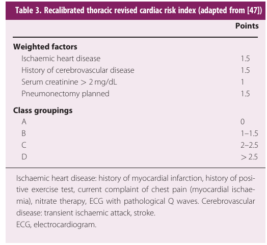
        - **Indications for cardiology consultation and formal cardiac risk assessment per AHA guidelines:**
            - RCRI \>= 3 weighted risk factors
            - Documented cardiovascular disease on medications, or suspected new cardiovascular disease
            - Unable to complete 2 FOS

      
      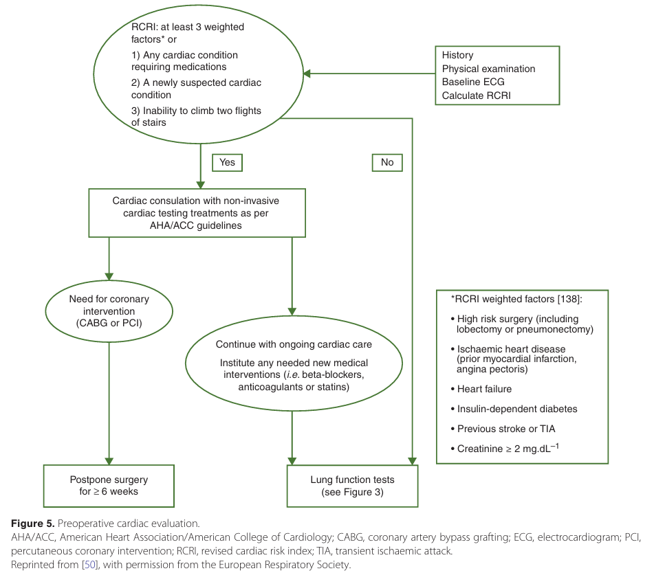
    - **Pre-operative respiratory evaluation** - FEV1, DLCO, +/- CPET to <u>determine post-operative morbidity and mortality</u>:
        - **FEV1, DLCO** - resection up to pneumonectomy if both \> 80%
        - **Predicted post-operative lung functions** - ppo calculated as pre-operative multipled by percentage of segments remaining after surgery:
            - <u>Low-risk ppo FEV1, DLCO</u> - lobectomy safe if both \> 40%, while resection up to calculated extent safe if both \> 30%
            - <u>High risk ppo FEV1, DLCO</u> - recommend additional cardiopulmonary exercise testing (CPET)
        - **CPET** - further risk stratify patients based on VO2max

    
    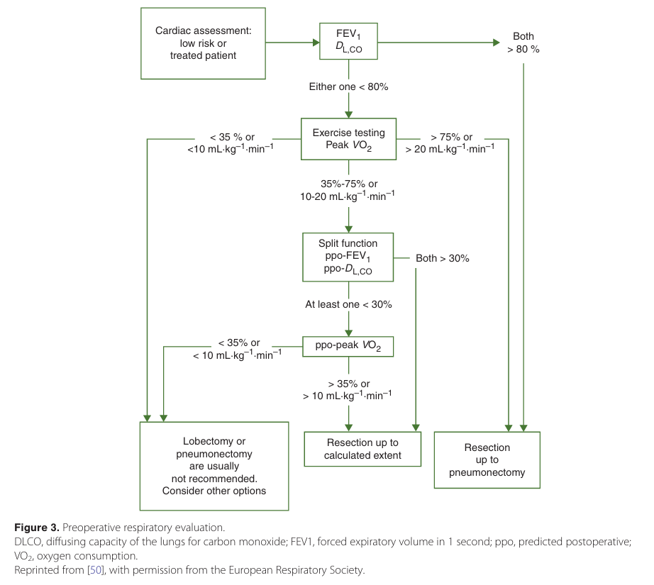
- **Surgery** - lobectomy favoured over limited resection in most cases:
    - **Indications** - offered to all patients w/ stage I-II disease who are deemed physical fit on assessment
    - **Approach** - less important from oncological perspective as both open thoracotomy and VATS approach show comparative margin clearance and nodal dissection:
        - Open thoracotomy
        - Video-assisted thoracic surgery (VATS)
    - **Lobectomy vs Limited resection:**
        - **Lobectomy** - surgical resection of a single lobe, is the gold standard procedure for most early-stage NSCLC:
            - <u>Indications</u> - almost all stage I-II NSCLC, w/ exception of some small, peripheral tumours
            - <u>Approach</u>:
                - Video-assisted thoracoscopic surgery (VATS) - demonstrable decreased surgical morbidity, perioperative pain in high-volume centers, which may enhance compliance w/ post-operative adjuvant chemotherapy
                - Robotic-assisted thoracoscopic surgery (RATS)
                - Open thoracotomy
        - **Limited sublobar resection** (segmentectomy or wedge resection):
            - <u>Indications</u>:
                - Small peripheral tumours - Stage IA (T1N0) disease \<= 2cm in diameter located in the outer one-third of the lung parenchyma
                - Older or frail patients with limited pulmonary reserve (mixed and limited evidence)
            - <u>Evidence for limited sublobar resection</u> - historically studies showed no benefit of limited resection, but increased use of LDCT screening increases detection rate of small peripheral NSCLC that has rekindled interests in role of limited resection:
                - **Lung cancer study group** (Ginsberg and Rubinstein Study) - T1N0 NSCLC demonstrated that there were 1) increased risk of local recurrence (5.4% vs 1.9%), and 2) non-statistically significant increased mortality (however the majority of these lesions are \>= 2cm): 
                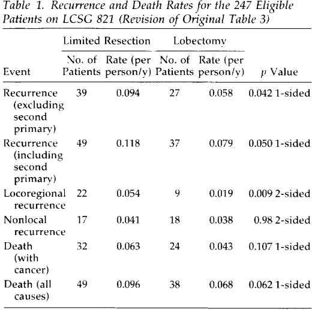
                - **JCOG0802** (2022) - Phased 3 RCT non-inferiority trial demonstrated that careful selection of stage IA tumour (\<= 2cm, \> 0.5 consolidation-to-tumour ratio, and peripherally located) demonstrated:
                    - <u>Improved 5y survival w/ segmentectomy</u> - HR 0.66 \[95% CI 0.47-0.93\]
                    - <u>Similar 5y DFS</u> - 88.0% vs 77.9% for segmentectomy vs lobectomy
                    - <u>More locoregional recurrence</u> - 11% vs 5% for segmentectomy vs lobectomy, appears to be incongruous w/ OS
                - **Altorki N et al** (2023) - similar results favouring sublobar resection in carefully selected groups of patients:
                    - <u>Similar OS</u> - HR 1.01 \[95% CI 0.83-1.24\]
                    - <u>Similar 5y survival</u> - 63.6% vs 64.1%
                    - <u>Similar 5y DFS</u> - HR 0.95 \[95% CI 0.72-1.26\]
                    - <u>Similar locoregional recurrence</u> - no statistically significant difference between two groups
                    - <u>Non-clinically meaningful improvement in lung functions</u> - FEV1 and FVC demonstrable 2% favouring sublobar resection
    - **LN dissection** - systematic LN resection (at least 6 nodal basins, including 3 mediastinal including the subcarinal station) recommended for stage II and IIIA disease but highly influenced by preoperative LN mapping (particularly -ve VAM)
- **Adjuvant chemotherapy** - cisplatin based doublets:
    - <u>Indications</u> - no role in stage IA disease:
        - N1 disease (stage II disease)
        - N2 disease (stage III disease)
        - Stage IB disease if tumour \> 4cm
    - <u>Timing</u> - traditionally limited to 6w post-op, but studies demonstrate comparable outcomes in patients treated after a longer interval post-resection
    - <u>Regimen</u> - cisplatin-based doublets:
        - Cisplati-vilnorelbine most studied
        - Other newer doublet partners e.g. docetaxel, gemcitabine, pemetrexed is acceptable although less studied
        - Bevacizumab demonstrated to be not beneficial on subset analysis
- **Neoadjuvant chemotherapy** - less studied, and no major difference in OS compared to adjuvant chemotherapy (potential role in down-staging to less extensive resection if innitially not operable)
- **Adjuvant targeted therapy** - efficacy first demonstrated in ADAURA trial:
    - <u>Indications</u> - in resected EGFR mutant NSCLC (more marked if stage II-IIIA)
    - <u>Evidence for adjuvant osimertinib</u>:
        - ADAURA trial (Wu et al 2020; Tsuboi et al 2023) demonstrated significantly prolonged DFS and OS in those receiving 3y adjuvant osimertinib compared with placebo in resected EGFR-mutated NSCLC

    
    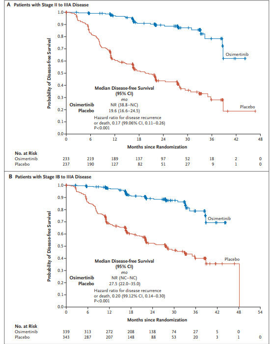
- **Peri-operative immunotherapy** - some evidence of IO in per-operative setting
- **Radiotherapy** - intent of radiotherapy is typically radical, while adjuvant RT is only reserved if R1 resection:
    - **Primary RT** - SBRT preferred over conventional RT:
        - **Stereotactic body radiotherapy** (SBRT or SABR):
            - <u>Indications</u> - considered for inoperable stage I NSCLC (role in surgical candidates currently unsure)
            - <u>Efficacy</u> - 5y local control rate up to 90% in peripheral stage I disease
            - <u>S/E profile</u> - generally tolerable, acute S/E rare, while long-term S/E include:
                - Dyspnoea
                - Rib fractures
                - Ventricular tachycardia
            - <u>Caution</u>:
                - Require reassessing patients w/ pre-existing interstitial lung fibrosis who have high risk of fotal toxicity
                - Central tumours, i.e. tumours within 2cm of critical mediastinal structures (e.g. bronchial tree, oesophagus, heart, brachial plexus, major vessels, spinal cord, phrenic nerve, and RLN) requires additional considerations
                - Ultracentral tumours (i.e. PTV overlapping trachea and bronchus) are C/I for SBRT
    - **Post-operative RT** - only considered if R1 ressection (role of adjuvant RT in N2 disease still under investigation), and detrimental effect to N0-1 disease
- **Radiofrequency ablation** - indicated if patients have C/I to both SABR and surgery

## Management of Locally-Advanced NSCLC

- **Definition of locally-advanced lung cancer** - Stage III disease (potentially operable)
- **Principles of Mx** - multimodal approach but dependent on resectability:
    - **Principle of resectability** - determined by MDT:
        - T4N0 disease where nodal disease have been excluded by invasive methods (e.g. EBUS/ mediastinoscopy) when R0 resection is deemed feasible
        - N2 disease w/ involvement of single mediastinal station (N2a), where other nodal stations have been assessed by invasive methods and proven to be benign (adjuvant ChT recommended)
        - Nodal downstaging after induction therapy
    - **Stage-dependent Mx:**
        - <u>Resectable disease</u> - induction CRT (+/- consolidation immunotherapy) followed by potential ressection
        - <u>Unresectable disease</u> - concurrent CRT (or sequential)

## Principles of Management of Metastatic NSCLC

- **Principles of Mx:**
    - **Differentiation between oncogene-addicted mNSCLC and non-oncogene-addicted mNSCLC:**
        - <u>Oncogene-addicted mNSCLC</u> - presence of a drugable driver mutation, enabling Tx with TKI
        - <u>Non-oncogene-addicted mNSCLC</u> - absence of drugable driver mutation, where Tx is is likely 1) immunotherapy alone, or 2) chemoimmunotherapy baesd on PD-L1 status
    - **Pre-treatment evaluation of advanced or metastatic NSCLC:**
        - <u>Histological subtyping</u> - differentiation between squamous and non-squamous histology
        - <u>Molecular testing</u>:
            - **EGFR and ALK status** - mandatory (category 1 consensus) prior to initial therapy for all advanced or metastatic <u>non-squamous disease</u>
            - **PD-L1 expression testing** - mandatory prior to initial therapy for all advanced or metastatic NSCLC <u>irrespective of histology</u>
            - **Additional molecular testing for other drugable mutations** (e.g. KRAS, ROS1, BRAF, NTRK, METex14 skipping, RET, HER2) - considered in both non-squamous, and squamous histology (present in 2-10%)

    
    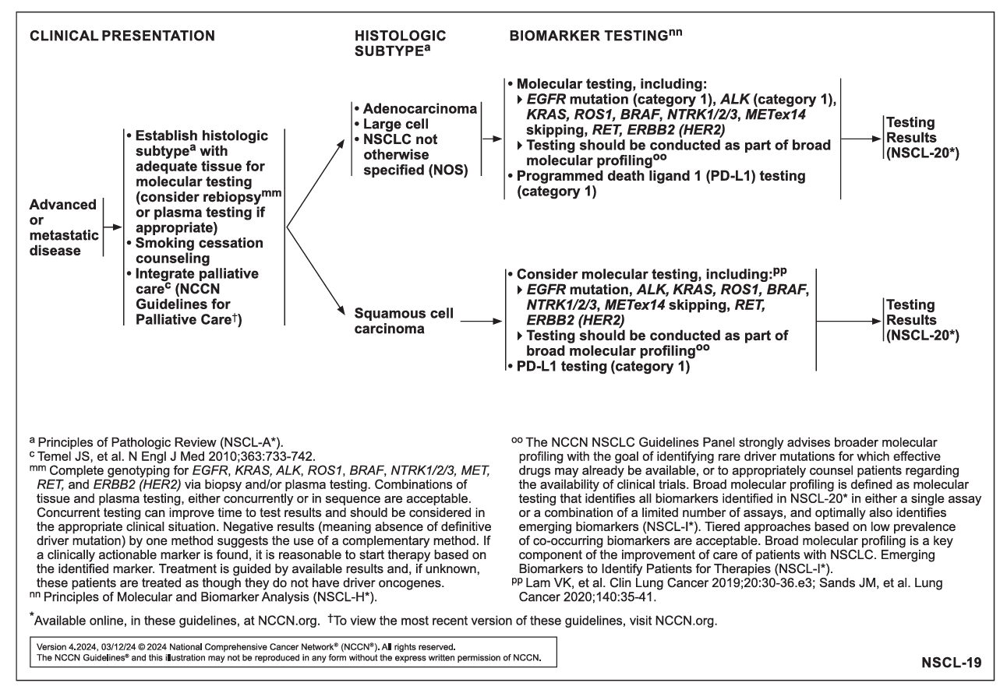
    - **Initial systemic therapy dependent on presence of driver mutation:**
        - **Oncogenic driver mutation unknown or absent** - regimen dependent on PD-L1 status, but <u>chemotherapy doublet with immunotherapy</u> remains the mainstay option based on evidence:
            - <u>High PD-L1 expression</u> (\> 50%) - chemoimmunotherapy or immunotherapy alone as an acceptable alternative
            - <u>Low PD-L1 expression</u> (\< 50%) - chemotherapy doublet with concurrent immunotherapy (e.g. pembrolizumab, nivolumab plus ipilimumab)
        - **Oncogenic driver mutation present:**
            - <u>EGFR mutation positive</u> - EGFR TKI inhibitors (e.g. erlotinib, gefitinib, osimertinib) alone preferred over chemotherapy or immunotherapy based approach
            - <u>ALK fusion oncogene positive</u> - ALK TKI (e.g. Alectinib first line) preferred over chemotherapy or immunothrapy based approaches
- **NSCLC with EGFR alterations** - EGFR are found in around 50% of Asian patients, particularly in the prototypical female never-smokers who develop AD:
    - **Common EGFR mutations and response to TKIs:**
        - <u>Exon 19 deletion or Point Exon 20 point mutation (L858R)</u> \[85-90%\] - a/w **high Sn** to TKIs
        - <u>Exon 20 insertion mutation</u> \[third most common group\] - a/w low response rate w/ early generation TKIs, but **reported variable response to newer TKIs depending on variant**
        - <u>Other less common mutations</u> (e.g. exon 20 S768I, exon 21 L861Q, exon 18G719x) \[~10%\] - **varying response** to first, second and third-generation TKIs
        - <u>Exon 20 T790M mutation</u> - often an **acquired resistance after duration of TKI therapy** and are reported in 60% of patients on TKI present w/ disease progression (primary resistance may prompt germline genetic testing)
    - **NSCLC with exon 19 deletion or L858R exon 20 mutations** - isolated TKI or TKI w/ chemotherapy doublet recommended:
        - <u>1st line therapy for mutation discovered prior to initiation of systemic therapy</u>:
            - NCCN recommends **single agent osimertinib** (FLAURA trial)
            - Other acceptable therapy includes **osimertinib w/ chemotherapy doublet** with pemetrexed and carboplatin or cisplatin (FLAURA2 trial)
            - Other acceptable alterantives include single agent erlotinib, gefitinib, afatinib etc.
        - <u>1st line therapy for mutation discovered during initiation of systemic therapy</u>:
            - NCCN recommends completion of cycle of systemic therapy and switch to osimertinib alone
            - Erlotinib w/ bevacizumab or ramucirumab are other acceptable alternatives
        - <u>Approach to disease progression for patients on first-line targeted therapy</u>:
            - Consider definitive local therapy (e.g. RT) w/ continuation of osimertinib
            - Rebiopsy lesion to r/o transformation to small cell histology (5% in EGFR TKI-resistant tumours)
    - **NSCLC with exon 20 insertion mutation** - generally not sensitive to conventional TKIs:
        - <u>1st line therapy if exon 20 insertion mutation present</u>:
            - Single-agent amivantamab-vmjw (CHRYSALIS trial)
            - Amivantamab in compbination w/ carboplatin and pemetrexed (PAPILLON trial)
- **NSCLC with ALK rearrangements** - second most common mutation after EGFR in Asian population:
    - **Common ALK inhibitors:**
        - <u>Crizotinib</u> - prototypical ALK inhibitors first to demonstrate improved outcomes compared w/ chemotherapy in metastatic NSCLC
        - <u>Alectinib</u> - ALK inhibitor demonstrated w/ improved OS, and non-significant PFS, but fewer AEs compared w/ crizotinib in metastatic NSCLC (ALEX trial)
        - <u>Brigatinib</u> - ALK inhibitor demonstrated w/ improved OS, intracranial response, and PFS compared w/ crizotinib
        - <u>Lorlatinib</u> - ALK inhibitor with exceptional intracranial response and reduced CNS progression compared w/ crizotinib (CROWN trial)
    - **NCCN guidelines:** 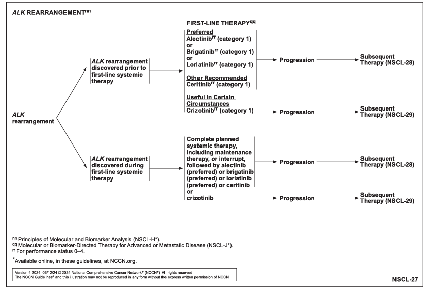 
    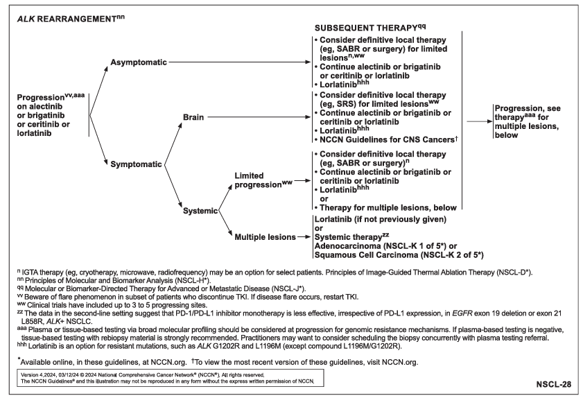
- **Chemotherapy** - platnium-based chemotherapy doublet:
    - **Platnium-based chemotherapy** - carboplatin typically preferred over cisplatin in palliative setting due to lower toxicity
    - **Doublet partner** - histology provides insight to optimal agents to be combined w/ platnium compound:
        - <u>Non-squamous histology</u> - pemtrexed preferred, but alternatives include taxanes and gemcitabine
        - <u>Squamout histology</u> - taxanes (e.g. docetaxel, paclitaxel), gemcitabine, vinorelbine, etoposide, irinotecan pair well w/ platnium
- **Immunotherapy:**
    - **Rationale of immunotherapy:**
        - Multiple trials shows that immunotherapy alone out performs chemotherapy especially in patient's with high PD-L1 expression (PD-L1 \>= 50%)
        - Added benefits of immunotherapy when added to chemotherapy even in patient's with low PD-L1 expression (PD-L1 \< 50%) may be explained by the immunogenic effect
    - **Selection of immunotherapy:**
        - Pembrolizumab alone - considered if PD-L1 \>= 50% (KN024)
        - Pembrolizumab + chemotherapy doublet - benefits irrespective of PD-L1 expression (KN189 and KN407)
        - Nivolumab + Ipililumab + chemotherapy (CM9LA)
    - **Pembrolizumab** (most extensively studied in lung cancer):
        - <u>MOA</u> - anti-PD1 inhibitor
        - <u>Implications</u>:
            - In PDL1 \>= 50% mNSCLC, pembrolizumab alone has replaced chemotherapy as 1L Tx
            - In PDL1 \< 50% mNSCLC, chemoimmunotherapy has replaced chemotherapy as 1L Tx
        - <u>Evidence for pembrolizumab alone</u> - KN024:
            - Reck et al 2016 (KN024) demonstrated that pembrolizumab alone is a/w longer OS and PFS compared to standard chemotherapy doublet in previously untreated advanced NSCLC with PD-L1 \>= 50%

      
      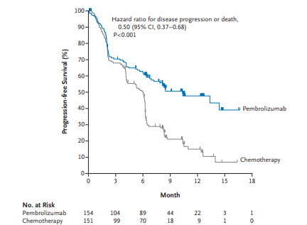
        - <u>Evidence for chemoimmunotherapy with chemotherapy doublet + pembrolizumab</u> - KN189 and KN407:
            - Gandhi et al 2018 (KN189) demonstrated chemoimmunotherapy showed improvement in PFS and OS in **metastatic non-squamous NSCLC across all PD-L1 categories** 
            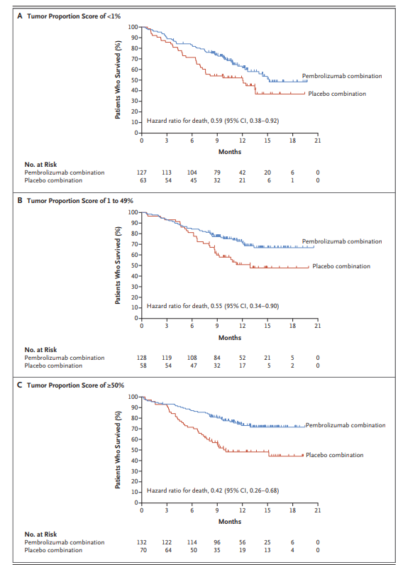
            - Novello et al 2023 (KN407) demonstrated chemoimmuntherapy showed improvement in PFS and OS in **metastatic squamous NSCLC across all PD-L1 categories**
    - **Nivolumab + ipililumab:**
        - <u>MOA</u> - dual immunotherapy:
            - Nivolumab - anti-PD1
            - Ipililumab - anti-CTLA4
        - <u>Evidence of nivolumab + ipililumab +/- 2 cycles of chemotherapy</u>: 
        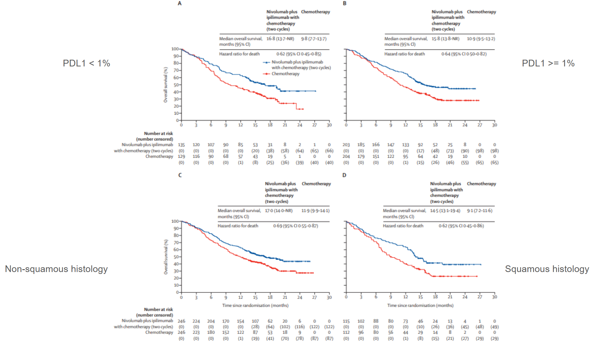
            - CheckMate 9LA trial demonstrates dual immunotherapy plus 2 cycles of chemotherapy showed improvements in PFS and OS compared with chemotherapy alone **irrespective of histology and PD1 expression**
