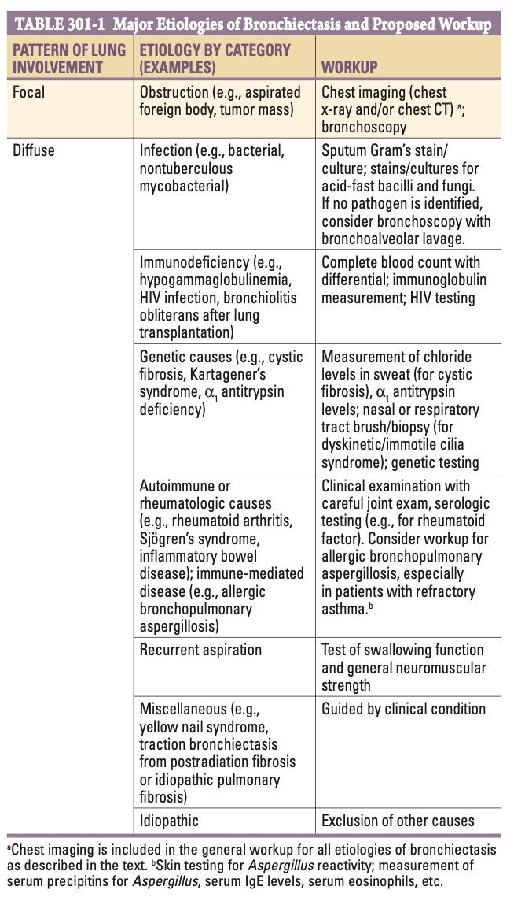
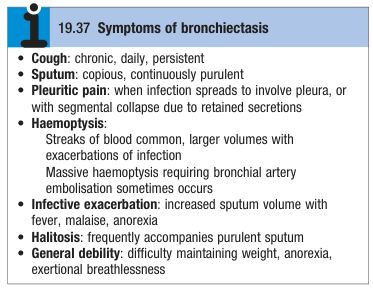
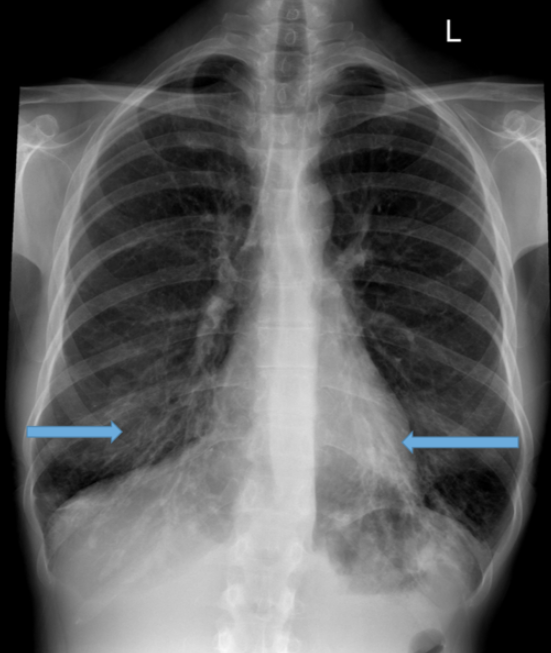
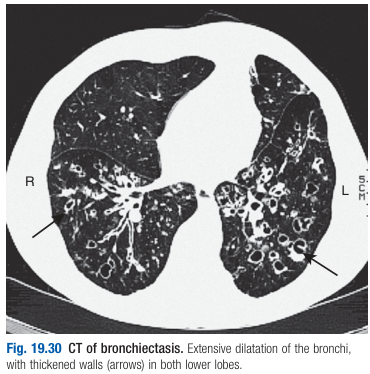

# Bronchiectasis

- **Definition** - pathologically defined as abnormal dilatation of the bronchi, where chronic suppurative airway infection, progressive scarring, and lung damage occurs
- **Etiology of bronchiectasis** - arises from infective and non-infective causes: 

    - **Focal bronchiectasis** - caused by focal obstruction of the airway:
        - <u>Congenital</u> - congenital underdevelopment of the airway
        - <u>Acquired</u> - foreign body aspiration, tumour mass
    - **Diffuse bronchiectasis** - bronchiectatic changes throughout the lungs often suggestive of an underlying systemic or infectious process:
        - **Congenital:**
            - <u>Defective airway development</u> - tracheobronchomegaly, Williams-Campbell syndrome
            - <u>Defective ion transport</u> - cystic fibrosis
            - <u>Ciliary dysfunction syndrome</u> - immobile cilia syndrome, Kartagener's syndrome (cilia defect a/w situs invertus and recurrent sinusitis)
            - <u>Defective metabolism</u> - alpha-1 anti-trypsin deficiency
            - <u>Immunodeficiency states</u> - hypogammaglobulinaemia
        - **Acquired** - up to 50% cases are have <u>idiopathic</u> disease:
            - <u>Infection</u> - bacterial infection (esp. in childhood), pulmonary tuberculosis, NTM infections (usu. MAC)
            - <u>Immunodeficiency states</u> - hypogammaglobulinaemia, HIV infection, bronchiolitis obliterans after lung transplant
            - <u>Autoimmune or immune-mediated disorders</u> - rheumatoid arthritis, Sjogren's syndrome, inflammatory bowel disease, **allergic bronchopulmonary aspergillosis**
            - <u>Recurrent aspiration</u> - caused by alcoholism, bulbar weakness etc.
            - <u>Miscellaneous</u> - yellow nail syndrome, tractional bronchiectasis from lung fibrosis
- **DDx of bronchiectasis based on pattern of involvement:**
    - <u>Upper lung field involvement</u> - cystic fibrosis, post-radiation fibrosis (if Hx of radiation to the corresponding lung region)
    - <u>Lower lung field involvement</u>:
        - Recurrent aspiration - alcoholism and recurrent pneumonia, esophageal motility disorder (e.g. scleroderma)
        - Tractional bronchiectasis - from end-stage idiopathic pulmonary fibrosis
        - Immunodeficiency states (predisposes to infection) - hypogammaglobulinaemia
    - <u>Middle lung field involvement</u>:
        - Congenital causes - dyskinetic/ immotile cilia syndrome
        - NTM infection - esp. mycobacterium avium complex (N.B. Lady Windermere syndrome)
    - <u>Central airway involvement</u>:
        - Congenital causes - tracheobronchomegaly, Williams-Campbell syndrome
        - Acquired causes - allergic bronchopulmonary aspergillosis
- **Pathophysiology of bronchiectasis:**
    - **Viscious cycle of infection and obstruction:**
        - <u>Infection</u> - destructive infection results in chronic inflammation, progressive scarring and obstruction
        - <u>Obstruction</u> - accumulation of pus beyond an obstructing lesion predisposing to infections
    - **Chronic inflammatory and fibrotic changes** - resulting in progressive destruction of normal lung parenchyma
- **Clinical features of bronchiectasis** - chronic progressive disorders a/w frequent bouts of infective exacerbation:
    - **Cough and sputum** - chronic, daily, persistent cough, w/ compious amounts of foul-smelling (a/w <u>hallitosis</u>) purulent sputum
    - **Haemoptysis** - <u>blood-streak sputum</u> commonly seen, w/ acute, large-volume haemoptysis occuring during infective exacerbations
    - **Pleuritic chest pain** - sharp, well-localised pleuritic chest pains as a result of 1) <u>segmental collapse</u> due to retained secretions, or 2) spread of infective process to involve the pleura
    - **Infective exacerbations** - suggested by increases in:
        - <u>Systemic Sx</u> - e.g. malaise, anorexia, fever
        - <u>Respiratory Sx</u> - increased cough, sputum production, purulence, haemoptysis, SOB

  
  
- **Signs of bronchiectasis** - may be focal or generalised:
    - **General examination** - weight loss, sputum mug w/ copious amounts of purulent Sx, clubbing is present
    - **Chest examination** - normal if absence of secretions and no lobar collapse:
        - <u>Coarse crackles</u> - may be heard over the affected areas
        - <u>Segmental collapse</u> - results in diminished breath sounds +/- overlying bronchial breathing (also seen in advanced disease)
- **Bronchiectasis is a/w:**
    - High risk of Pseudomonas aeruginosa infection
    - Infection by Aspergillus
    - Infection by various mycobacteria (NTM or MTB)
- **Ix:**
    - **Microbiology** - sputum microscopy, C/ST:
        - <u>Sputum culture</u> - may be susceptiable to Pseudoomonas, mycobacteria, or Aspergillus infections
    - **CXR** - usually normal unless advanced disease:
        - **Direct signs of bronchiectasis:**
            - <u>Tram-track signs</u> - thickened airway walls resulting in visualisation of dilated airways seen in horizonatal orientation (+/- cystic bronchiectic spaces)
            - <u>Tubular opacities</u> - mucous filled bronchi
            - <u>Ring opacities</u> - dilated end-on bronchi

      
      
        - **Indirect signs of bronchiectasis:**
            - <u>Lobar collapse</u> - loss of vascular markings +/- ipsilateral tracheal deviation
    - **High-resolution CT** - much more Sn and diagnostic:
        - <u>Parallel tram tracks</u> - presence of dilated tram tracks without sufficient tapering, often w/ **bronchial wall thickening**
        - <u>Signet-rign sign</u> - evidence of bronchial dilatation defined as internal bronchial diameter greater than adjacent pulmonary artery (by 1.5x)
        - <u>Lack of bronchial tapering</u> - limited diminishing in calibre as the bronchials extend to periperies
        - <u>Tree-in-bud pattern</u> - inspissated secretions
        - <u>Cystic changes</u> - as in cystic bronchiectasis, w/ cysts emancipating from dilated airways

    
    
    - **Lung function studies:**
        - <u>Role</u> - important component of functional assessment of patient
        - <u>Common findings</u> - compatible w/ obstruction pattern:
            - Slightly reduced FEV1/FVC ratio suggestive of airflow obstruction
            - Lung volumes and DLCO not typically affected
    - **Ix for underlying causes** - dependent on distribution and likely etiology: 
    
- **Mx:**
    - **Principles of Mx:**
        - <u>General measures to reverse underlying pathology</u> - ICS/ broncodilators to maintain airway patency; aggressive PT for expectoration of excessive bronchial secretions
        - <u>ABx therapy</u> - ABx therapy during acute exacerbations +/- maintenance macrolide therapy as anti-inflammatory agent to prevent exacerbations
        - <u>Surgical Tx</u> - excision of the bronchiectatic areas in selected cases of focal bronchiectasis
    - **ABx therapy for acute exacerbations:**
        - <u>Principles</u>:
            - **Coverage:**
                - Presumptive agent similar to those as in CAP (H. influenzae is cultured commonly)
                - Pseudomonas aeruginosa coverage should be considered in those previously cultured Pseudomonas spp.
                - Consideration for NTM infections (MAC) requires demonstration of active infection (not just colonisation), and the intolerance to prolonged ABx course
            - **Duration** - usually a minimum of 7-10 ays, and perhaps as long as 14 days
        - <u>Regimen</u> (IMPACT guideline 6.0):
            - Becta-lactam (ticarcillin-clavulanate, piperacillin-tazobactem, cefepime) + macrolide
            - Fluoroquinolones + aminoglycoside
- **Prognosis** - poor prognosis if a/w congenital causes
- **Prevention:**
    - **General measures:**
        - <u>Reversal of immunodeficiency state</u> - e.g. administration of gamma globulins for hypogammaglobulinaemia
        - <u>Vaccination</u> - for influenza, pneumococcal, COVID, and RSV vaccines
        - <u>Smoking cessation</u> - as a general rule to reduce the risk of chest infections
    - **ABx prophylaxis** - suppressive ABx to minimise the microbial load and reduce frequency of exacerbations for those w/ frequent recurrences (e.g. \>= 3 episodes per year):
        - <u>Principles and concerns</u>:
            - Has been associated in small studies and some RCTs that in fact reduces the risk of frequent exacerbations
            - Invariably associated w/ ABx resistance, such that "breakthrough exacerbations" may be more difficult to treat
        - <u>Proposed regimens</u>:
            - Oral ciprofloxacin daily for 1-2 weeks per month
            - Rotating schedule of oral ABx
            - Long-term macrolide for 6-12 mo (related to anti-inflammatory effect)
            - Inhalation of aerosolized ABx in rotating schedule (e.g. tobramycin inhalation solution 30 days on, 30 days off)
            - Intermittent administration of IV ABx for "clean-outs"
