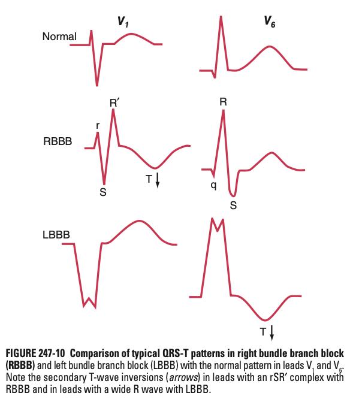

# Bundle Branch Blocks and Related Patterns on the ECG

- **Electrophysiology of bundle branch blocks:**
    - **Depolarisation abnormalities:**
        - <u>Prolongation of QRS interval</u> - QRS interval may be in the high-normal (110-120 ms as in incomplete bundle branch blocks), or frankly prolonged (\> 120 ms as in complete bundle branch blocks)
        - <u>Alterations of the ventricular vector</u> - the terminal ventricular vector will be **directed towards the pathological side**, w/ variable involvement of the small septal vector and the large main ventricular vector:
            - RBBB - terminal ventricular vector is directed towards the right and anteriorly (rSR' in V1 \[tall right bunny ear\], qRS in V6)
            - LBBB - disrupted early septal vector (now right to left), and main ventricular vector directed to the left and posteriorly (QS complex in V1, R complex \[i.e. entirely +ve\] in V6)

      
      
    - **Repolarisation abnormalities** - disconcordant QRS-T wave vectors due to altered sequence of repolarisation as a consequence of altered sequence of depolarisation:
        - T waves in bundle branch blocks are usually opposite to the last deflection of the QRS complexes (i.e. RBBB a/w TWI in V1 following rSR'; LBBB a/w TWI in V1 following R complex)
        - Presence of TWI that does not follow the previous pattern raises suspicion of primary repolarisation abnormalities (e.g. ischaemia, electrolytes, drugs)
- **Causes of RBBB:**
    - <u>Congenital heart disease</u> - ASD
    - <u>Acquired right heart disease</u> - valvular, ischaemic, RVH (e.g. cor pulmonale)
- **Causes of LBBB** - marker of one of four underlying conditions a/w increased CVS morbidity and mortality rates:
    - <u>Coronary artery disease</u> - often w/ underlying LV dysfunction
    - <u>Hypertensive heart disease</u> - often w/ substantial LV hypertrophy
    - <u>Aortic valve disease</u> - persists after transcatheter aortic valve replacement
    - <u>Cardiomyopathy</u> - due to LV dysfunction
- **Hemi-blocks** (partial blocks in the left bundle system):
    - Generally does not prolong QRS duration substantially
    - Instead associated w/ shifts in frontal plane QRS complexes (LAD for LAFB; RAD for LPFB)
