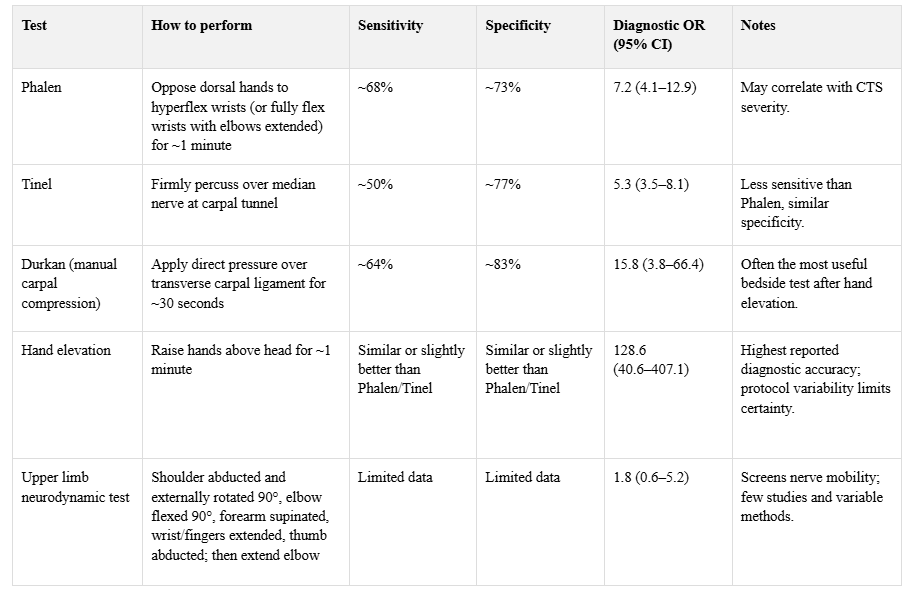
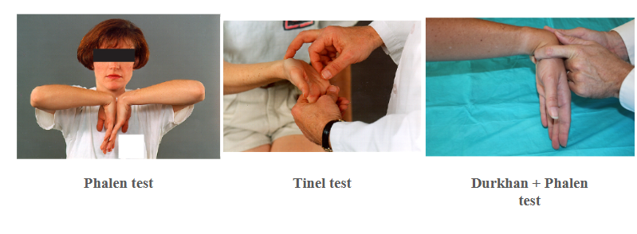

# Carpal Tunnel Syndrome

- **Definition** - complex of S/S brought on by compression of the median nerve as it travels through the carpal tunnel
- **Risk factors for CTS:**
    - **Non-modifiable risk factor:**
        - <u>Female sex</u> - anatomically smaller carpal tunnel in females than in males
        - <u>Genetic predisposition</u> - those w/ bilateral CTS are more likely to have a FHx of CTS than those w/ unilateral or no disease, which may reflect an inherited liability for nerve injury, anatomical variability in carpal tunnel, or familial predisposition to other medical conditions
    - **Modifiable risk factors:**
        - **Medical conditions and medications** - causing increased soft tissue deposition or oedema within the carpal tunnel:
            - <u>Diabetes mellitus</u> - mechanism unclear but is more prevalent in sub-population w/ underlying diabetic polyneuropathy
            - <u>Arhtritis</u> - osteoarthritis of wrist and rheumatoid arthritis may lead to anatomical compression of the carpal tunnel
            - <u>Hypothyroidism</u> - due to myxoedema within the carpal tunnel
            - <u>Pregnancy</u> - due to fluid retention within the carpal tunnel, typically presents in the 3rd trimester
            - <u>Previous trauma</u> - e.g. crush injury of the hand, and radius or carpal bone fractures, presenting in a delayed fashion
            - <u>Amyloidosis</u> - deposition of amyloid or Ig proteins within the carpal tunnel
        - **Environmental, workplace or ergonomic factors:**
            - Repetitive hand and wrist use
            - Forceful hand and wrist use
            - Work with vibrating tools
            - Sustained wrist or palm pressure
            - Prolonged wrist extesnsion and flexion
- **Clinical features of CTS** - sensory Sx are generally more prominent than motor Sx:
    - **Sensory Sx** - painful parasthesia and numbness felt over the median territory, particularly over the <u>radial 3.5 digits</u>, and sparing of the thenar eminence:
        - <u>Site</u> - first 3 digits, and the radial half of the 4th digit, with characteristic sparing of the thenar eminence (N.B. sensory cutaneous nerve arises proximal and does not pass throught the carpal tunnel)
        - <u>Onset and progression</u> - insiduous onset, initially noticeable during sleep, and subsequently becomes more persistent (ocassionally progresses to sensory loss)
        - <u>Quality</u> - painful, numbness, parasthesia (complete sensory loss in severe cases)
        - <u>Radiation</u> - typically limited to the digits, but may radiate proximally to the forearm
        - <u>Severity</u> - variable, but can be as severe as complete sensory loss
        - <u>Timing</u> - provocated by:
            - Sleep, which can awaken patient from sleep
            - Sustained flexion or extension hand position
            - Repetitive actions of the hand or wrist
    - **Motor Sx** - results in reduced dexterity of the hands in late CTS:
        - <u>Weakness of thenar muscles</u> - results in characteristic thenar wasting, weakness of thumb abduction and thumb opposition
- **Signs of CTS:**
    - **Sensory examination** - sensory impairment in median-innervated fingers but w/ <u>characteristic sparing of the thenar eminence</u>
    - **Motor examination:**
        - <u>Thumb opposition</u> - weakness in thumb opposition
        - <u>Thumb abduction</u> - weakness in thumb abduction
    - **Provocation maneuvers:**
        - **Phalen maneuver:**
            - <u>Technique</u> - bring dorsal surfaces of the hands against each other to bring about <u>hyperflexion of the wrists</u>, while the elbows remain flexed, and maintain for 1 min
            - <u>Interpretation</u> - +ve result defined as increased pain and/or parsthesia in the median-innervated fingers
            - <u>Test properties</u> - moderate accuracy (68% Sn, 73% Sp)
        - **Tinel test:**
            - <u>Technique</u> - percussion performed over the course of the median nerve on top of carpal tunnel
            - <u>Interpretation</u> - +ve result defined as increased pain and/or parasthesia in the median-innervated finger during percussion
            - <u>Test properties</u> - less Sn (50% Sn) but similar Sp (77% Sp) as Phalen test
        - **Durkan test** (manual compression test):
            - <u>TEchnique</u> - applying pressure over transverse carpal ligament for 30s
            - <u>Interpretation</u> - +ve result defined as increased pain and/or parasthesia in the median-innervated finger
            - <u>Test properties</u> - moderate accuracy (64% Sn, 83% Sp)
        - **Hand-elevation tests:**
            - <u>Technique</u> - raising hand above head for 1 min
            - <u>Interpretation</u> - +ve result defined as increased pain and/or parasthesia in the median-innervated finger
            - <u>Test properties</u> - most Sp test

     
    
- **Ix** - NCS and EMG for Dx and evaluation of severity
- **Mx:**
    - Wrist splinting during sleep or activities that exacerbate Sx
    - Steroid injections
    - Surgical release of flexor retinaculum
