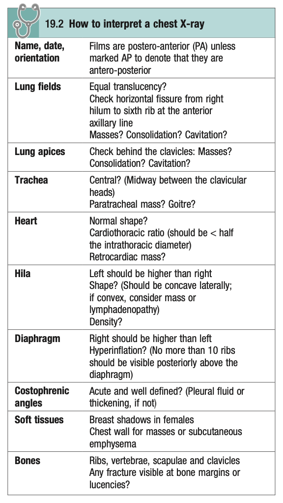
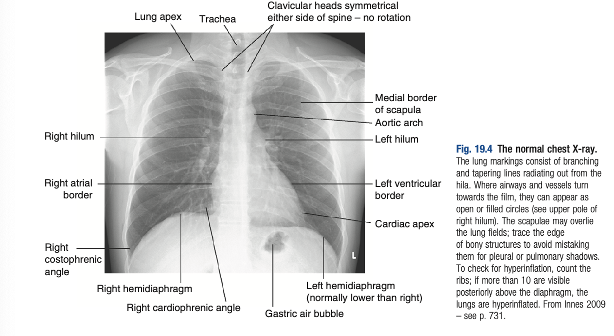
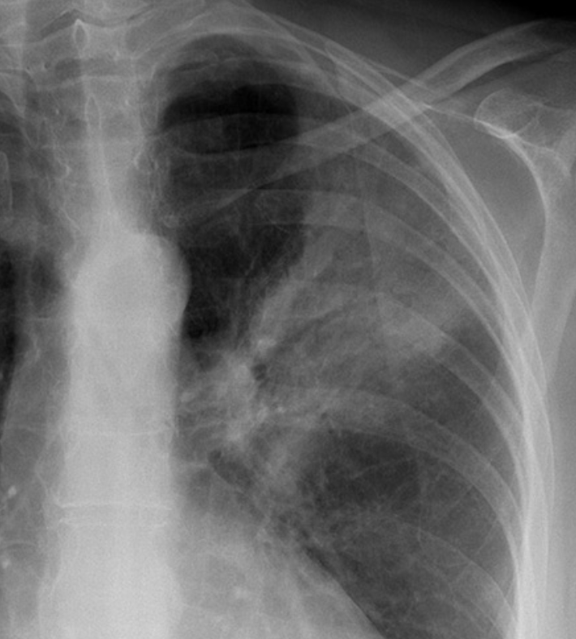

# Chest X-Ray

- **Indications** - often obtained in the majority of patients with suspected chest disease +/- suspected pneumoperitoneum
- **Views:**
    - <u>PA sitting view</u> - provides the most information on the lung fields, heart, mediastinum, vascular structure and the thoracic cage
    - <u>AP view</u> - obtained if patient in respiratory distress and cannot tolerate PA view
    - <u>Lateral view</u> - additional view obtained if pathology is suspected behind the heart shadow or deep in the diaphragmatic sulci
- **Approach to interpretation of CXR:**
    - <u>Patient particulars and orientation</u> - note name, date and orientation (PA unless denoted AP)
    - <u>Assess adequacy</u> - inspiration, penetration and rotation:
        - Inspiration - 8 anterior ribs, 10 posterior ribs
        - Penetration - spine visible behind cardiac shadow
        - Rotation - clavicular heads equidescent from the spin
    - <u>Lung fields</u>:
        - Equal translucency - e.g. pneumothorax, lung collapse
        - Nodules - note masses, consolidations, cavitations
        - Horizontal fissure - runs from right hilum to 6th rib in anterior axillary line
    - <u>Lung apices</u> - note pathology (masses, consolidation, cavitation) behind the clavicle
    - <u>Trachea</u> - central vs deviated, and any paratracheal mass (e.g. goitre)
    - <u>Heart</u>:
        - Size - assessed by cardiothoracic ratio (\< 0.5 of intrathoracic diameter)
        - Heart borders - left and right heart borders
        - Aortic knuckle - any dilatation of aorta
        - Retrocardiac mass - suspicion requires lateral view CXR to confirm
    - <u>Hilum</u>:
        - Height - left hilum should be higher than right hilum
        - Shape - typically concave laterally, convexity suggestive of mediastinal mass or lymphadenopathy
        - Density
    - <u>Diaphragm</u>:
        - Height - right hemidiaphragm should be slightly higher than left hemidiaphragm (look for elevation of hemidiaphragm)
        - Hyperinflation - no more than 10 posterior ribs visible, otherwise the diaphragm appears to be flattened
        - Free gas under diaphragm - r/o pneumoperitoneum due to perforated intra-abdominal viscus
    - <u>Costophrenic angle</u> - normally acute and well defined, otherwise consider pleural effusion or rarely pleural thickening (e.g. asbestosis)
    - <u>Soft tissue</u> - normal breast shadows in F, or chest wall pathologies
    - <u>Bones</u> - any fracture or lucencies

   
  
- **Common chest X-ray abnormalities:**
    - **Pulmonary shadowings** - reflects accumulation of fluid, lobar collapse or consolidation
    - **Pleural abnormalities** - fluid, plaques or tumour
    - **Increased translucency** - reflects pneumothorax, bullae, or relative oligaemia (PE)
    - **Hilar abnormalities** - unilateral vs bilateral hilar enlargement
    - **Other abnormalicies:**
        - Hiatal hernia
        - Surgical emphysema
- **Types of pulmonary shadowing:**
    - <u>Consolidation</u> - reflects infection, infarction, inflammation and rarely bronchoalveolar cell carcinoma
    - <u>Collapse</u> - due to tumour, extrinsic compression by LN, mucus plugging (differentiated from consolidation by P/E findings and additional features on CXR, see below)
    - <u>Solitary pulmonary nodule</u> - worrisome for lung cancer (see notes on approach to the incidental pulmonary nodule)
    - <u>Multiple nodules</u> - likely metastatic malignancy, miliary TB, rheumatoid disease, ust inhalation, healed varicella pneumonia
    - <u>Cavitating lesions</u> - tumour, abscess, infarct, Wegner's (correlate clinically)
    - <u>Reticular, nodular, reticulonodular shadows</u> - diffuse parenchymal lung disease, infections etc.
- **Differentiation between consolidation and collapse** - based on additional information clinically or radiologically:
    - <u>Salient Hx differentiating between consolidation vs collapse</u> - Hx suggestive of pneumonia, PE or sudden bronchial obstruction
    - <u>P/E findings differentiating between consolidation vs collapse</u>:
        - **Consolidation pattern** - reduced breath sounds +/- crackles, **increased vocal resonance**, **no mediastinal shift**
        - **Collapse pattern** - absent breath sounds, reduced focal resonance, **mediastinal shift to ipsilateral side**
    - <u>Radiological features differentiating between consolidation vs collapse</u>:
        - **Mediastinal shift** - tracheal deviation and mediastinal shift to ipsilateral side in collapse versus absence of such features in consolidation
        - **Air bronchograms** (non-specific) - areas of low attenuation in a background of airless lung, often suggestive of a consolidation pattern, but can occur with actelactesis 
        
- **Increased translucency** - reflects increased air relative to pulmonary circulation:
    - <u>Pneumothorax</u> - increased air in pleural cavity
    - <u>Bullae</u> - emphysematous bullae secondary to COPD
    - <u>Relative oligaemia</u> - focal increase in translucency of lung fields related to pulmonary embolism
- **Hilar abnormalities:**
    - <u>Unilateral hilar enlargement</u> - TB, bronchial carcinoma, lymphoma
    - <u>Bilateral hilar enlargement</u> - TB, lymphoma, silicosis, sarcoidosis
- **Approach to the AP/PA chest radiograph:**
    - 1\. <u>Lines and tubes</u> - e.g. ET tube, tracheostomy tube, CVC, NG tube, chest tube
    - 2\. <u>Apices and soft tissue</u> - most important being the presence of surgical emphysema (suggestive of pneumothorax or pneumomediastinum) or apical pneumothorax
    - 3\. <u>Diaphragm and costophrenic angle</u> - evaluation for:
        - Blunting of the costo-phrenic angle
        - Subpulmonic effusion and deep sulcus sign
        - Free gas under diaphragm
    - 4\. <u>Cardiac silhouette</u> - for overall size of heart, chamber enlargements etc.
    - 5\. <u>Hilar and pulmonary arteries</u> - for pulHTN and hilar adenopathy
    - 6\. <u>Large airways</u> - focal vs diffuse narrowing; tracheal deviation as added evidence of mediastinal shift (due to pneumothorax or atelectasis)
    - 7\. <u>Lung fields</u> - various radiological patterns (and distribution of abnormalities) correlate w/ various differential diagnoses:
        - Atelectasis
        - Cavitations
        - Consolidations
        - Cystic lung diseases
        - Ground glass opacifications
        - Nodular patterns
        - Reticular patterns
