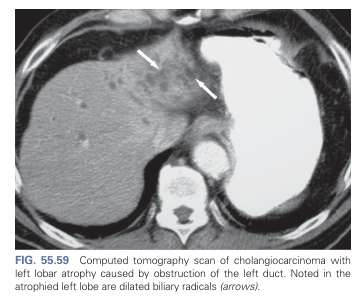
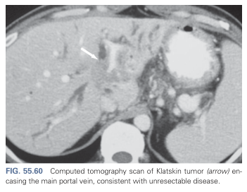
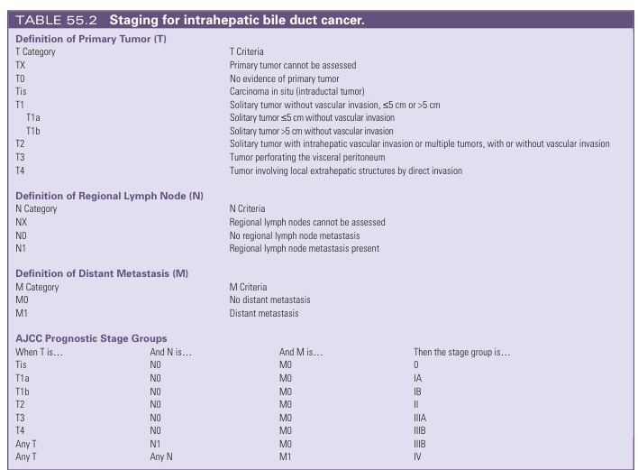
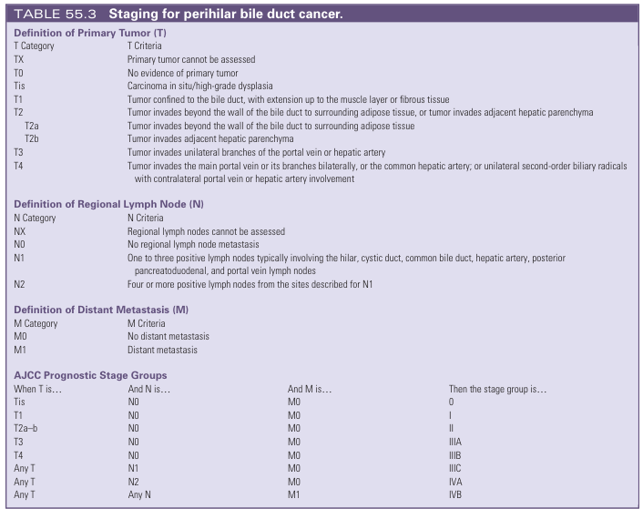
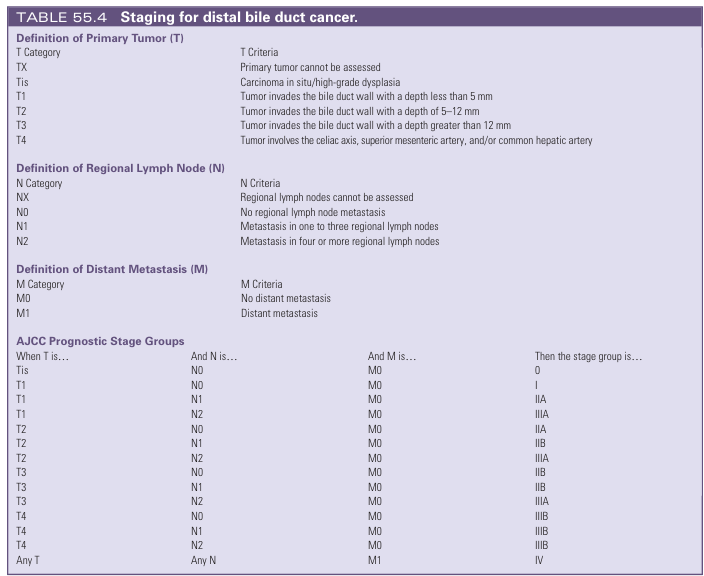
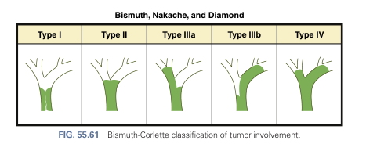

# Cholangiocarcinoma

- **Definition** - malignancy of the bile duct, accounting for the 2nd most common primary liver cancer following hepatocellular carcinoma
- **Location of cholangiocarcinoma and terminology:**
    - <u>Intrahepatic cholangiocarcinoma</u> - arising from small intra-hepatic ductules or large intrahepatic ducts, and are considered **primary liver tumours**
    - <u>Extrahepatic cholangiocarcinoma</u> - arising from the peri-hilar region (Klatskin tumor refers to CC at hepatic duct bifurcation), or the distal (per-ampullary region)
- **Risk factors of perihilar or distal cholangiocarcinoma** - most patient have no identifiable cause:
    - **Chronic biliary inflammation:**
        - <u>Choledochal cysts</u> - 10-20% risk if not resected before 20y
        - <u>Liver flukes</u> - e.g. Clonorchis sinesis and Opisthorchis viverrini infections common in SE Asia causes chronic biliary inflammation, obstruction and strictures
        - <u>Primary sclerosing cholangitis</u> (PSC) - chronic inflammation and stricturing of the intra-hepatic and extra-hepatic bile ducts, a/w an annual risk of CC of 1.5%/y, esp. high in those a/w IBD
    - **Chemical exposure** - e.g. cigarette smoke, thorotrast, oral contraceptives, asbestos etc.
    - **Cirrhosis** - important risk factor for CC with risk of 10.7% vs 0.7% in the general population
- **Risk factors for intrahepatic cholangiocarcinoma:**
    - **Risk factors for large duct iCCA:**
        - <u>Chronic biliary inflammation</u> - similar as above
        - <u>Biliary malformation</u> - Caroli's disease, congenital hepatic fibrosis, hepatic cysts, polycystic liver disease
    - **Risk factors for small duct iCCA** - similar risk factors as HCC:
        - <u>Chronic viral hepatitis</u> - HBV/ HCV (esp. if associated w/ cirrhosis)
        - <u>Cirrhosis</u> - 10.7% vs 0.7% in general population
        - <u>Alcholic liver disease</u> - independent risk factor for small duct iCCA
- **Pathological classification** - TNM staging varies slightly based on anatomical location:
    - <u>Sclerosing cholangiocarcinoma</u> - peri-ductal fibrosis in concentric pattern and circumferential duct occlusion, characteristically seen in proximal intra-hepatic duct CC
    - <u>Papillary cholangiocarcinoma</u> - polypoidal lesion growing intra-ductally with less peri-ductal fibrosis, typically seen in distal cholangiocarcinomas
    - <u>Nodular cholangiocarcinoma</u> - firm mass in intra-ductal wall typically seen in distal cholangiocarcinoma
- **Modes of clinical presentation of CC** - dependent on tumour location:
    - <u>Peri-hilar or distal CC</u> (extra-hepatic CC) - typically presents early as malignant biliary obstruction
    - <u>Intra-hepatic CC</u> - typically presents late w/ RUQ pain, hepatomegaly and weight loss, w/ absence of jaundice due to unilateral lobar atrophy and subsequent <u>contralateral lobar hypertrophy</u> for biliary secretion
- **Clinical presentation of cholangiocarcinoma:**
    - **Asymptomatic** - incidentally identified on an asymptomatic patient on routine P/E, LFTs, or imaging (esp. chronic HBV patients and cirrhosis):
        - <u>Hepatomegaly</u> - intrahepatic CC may ocassionally present as hepatomegaly
        - <u>Isolated elevated ALP and GGT</u> - intrahepatic CC may present w/ isolated elevations of ALP and GGT, while bilirubin is normal (hence non-icteric), due to **contralateral lobar hypertrophy** for biliary secretion
        - <u>Abnormal cross-sectional imaging</u> - isolated lobar biliary dilatation +/- visualisation of a mass
    - **Features of local tumour:**
        - <u>Abdominal pain</u> - a dull, constant RUQ pain typically seen in intra-hepatic cholangiocarcinoma, due to distending liver capsule, or perineural ivnasion submucosally
        - <u>Malignant biliary obstruction</u> - classically presents as painless, progressive obstructive jaundice w/ tea-coloured urine, pale stool, pruritis, stearrhoea, typically caused by Klatskin tumour or distal CC
        - <u>Biliary sepsis</u> - presentation w/ cholangitis (i.e. abdominal pain, fever \[20 %\], jaundice) is unusual but may occur w/ distal CC
    - **Systemic manifestations:**
        - <u>Weight loss</u> - due to catabolic state
        - <u>Liver failure</u> - usually from long-standing MBO that is not palliated
- **Initial Ix of cholangiocarcinoma** - diagnostic and assessment of resectability:
    - **Routine bloods** - CBC, LRFT, Clotting Profile, Tumour markers:
        - **CBC** - anaemia of chronic illness, thrombocytopenia
        - **LFT:**
            - <u>Bilirubin</u> - elavated in distal CC; paradoxically normal w/ cholestatic pattern in intrahepatic CC (see above)
            - <u>Liver enzymes</u> - characteristically presents w/ cholestatic pattern
            - <u>Albumin</u> - reflects nutritional status or a result of long-standing MBO resulting in hepatic dysfunction
        - **RFT** - viability for contrast
        - **Clotting profiles** (esp. PT) - prolonged in advanced disease due to vitamin K deficiency
        - **Tumour markers** (CA 19-9) - not Sn or diagnostic of CC, but key in assessment of Tx responsiveness and detection of recurrence
    - **Trans-abdominal USG** - demonstrate biliary obstruction but poor in localising level of obstruction:
        - <u>Locoregional Findings</u>:
            - **Intra-hepatic cholangiocarcinoma** - unilobar dilated intrahepatic bile ducts with mass lesion that lacks radiographic characteristic of primary HCC
            - **Klatskin tumour** - dilated intrahepatic bile ducts, but gallbladder and extrahepatic biliary system decompressed
            - **Distal cholangiocarcinoma** - intrahepatic and extrahepatic biliary duct dilatation and distended gallbladder
    - **Tri-phasic CT A+P** - diagnostic, and pre-liminary assessment of distant metastasis, resectability or segmental/lobar involvement:
        - **Role of CT:**
            - <u>Detection of metastatic disease</u> - 1) detection of bilobar metastasis, or 2) extra-hepatic disease
            - <u>Localisation of the tumour</u> - localisation of the proximal extent of the tumour based on a <u>change between calibre of biliary system</u> at level of obstruction
            - <u>Relationship to key vascular structures</u> - identify features that are C/I of resection:
                - Main portal vein encasement
                - Bilateral hepatic artery involvement
                - Lobar atrophy w/ involvement of contralateral portal vein or biliary radicals (?since insufficient hepatic reserve)

       
      
    - **Cholangiography** - assessment of biliary tree antomy to determine proximal extent of resection:
        - **MRCP** - asssessment of biliary tree anatomy for proximal or peri-hilar CC
        - **ERCP** - assessment of local biliary tree anatomy for distal CC:
            - <u>Roles</u>:
                - Contrast injection to delineate extent of lesion (risk of ascending cholangitis)
                - Brush or biliary cytology - may demonstrate malignant cells but unreliable (-ve results do not exclude diagnosis)
                - Therapeutic - pre-operative biliary drainage +/- stenting in seleccted cases
    - +/- **EUS w/ FNA** - tissue Dx not required before planning surgical resection, typically reserved if patient not a surgical candidate
- **Staging system** - different staging system dependeing on anatomical location:
    - **TNM for intrahepatic CC:** 
    
    - **TNM system for perihilar CC:** 
    
    - **TNM system for distal CC:** 
    
- **Principles of staging workup** (detailed findings above) - assessment of resectability:
    - **Tri-phasic CT T+A+P** - assessment of distant metastasis and local resectability (e.g. vascular encasement, intra-hepatic metastasis)
    - **Cholangiography** - delineation of biliary anatomy based on MRCP, ERCP/EUS
    - **Staging laparotomy** - indicated for surgical candidates w/ <u>potential resectable disease</u>:
        - <u>Benign diseases</u> (7-15%) - suspected to have MBO will in fact have benign disease
        - <u>C/I for resection</u> (up to 50%) - avoid non-therapeutic laparotomy for those w/ peritoneal metastasis, intra-hepatic metastses, or locally advanced lesions w/ extensive vascular involvement
- **Mx:**
    - **Principles of Mx:**
        - **Multi-modal therapy** - surgical resection +/- adjuvant chemoradiation (despite absence of supportive data):
            - <u>Surgical Mx</u> - surgical resection is the only cure
            - <u>Chemotherapy</u> - no demonstrated survival benefits for chemotherapy in the adjuvant or enoadjuvant settings
            - <u>Radiation</u> - small survival benefits for adjuvant RT
    - **Operative Mx** - dependent on site of tumour:
        - **Distal Cholangiocarcinoma** - Whipple Operation (pancreaticoduodenectomy):
            - <u>Technical details</u>:
                - En bloc resection of the GB, CBD, Duodenum,, distal stomach, regional LN, and head of pancreas Frozen section of proximal bile duct margin - esures R0 resection as tumour tends to spread submucosally (5y survival up to 50% if R0 resection in N0 disease)
                - Roux-en-Y reconstruction - triple bypass:
                    - Gastrojejunostomy
                    - Hepaticojejunostomy
                    - Pancreaticojejunostomy
        - **Klatskin tumour** - en bloc CBD and gallbladder resection and regiona LN dissection +/- hepatic parenchyma resection based on <u>Bismuth-Corlette classification</u>:
            - **Bismuth-Corlette classification of Klatskin tumours** - assessment of involvement of biliary radicals: 
            
                - <u>Type I</u> - tumour below the confluence of the L and R hepatic ducts
                - <u>Type II</u> - tumour at the confluence of the L and R hepatic duct
                - <u>Type III</u> - tumour at the CHD and involves either hepatic ducts
                - <u>Type IV</u> - tumour at the CHD extending into both L and R hepatic ducts
            - **Approach to resection of Klatskin tumour:**
                - <u>Type I tumour</u> - CBD resection, cholecystectomy with 5-10mm resection margins + regional LN disection, hepaticojejunostomy
                - <u>Type II tumour</u> - Above +/- caudate lobe resection
                - <u>Type III tumour</u> - Above + lobectomy or trisectionectomy
                - <u>Type IV tumours</u> - Above + multiple hepatic segmentectomy +/- vasculature resection and reconstruction
        - **Intrahepatic tumour** - hepatectomy
    - **Palliative Tx** - for unresectable disease:
        - <u>Biliary obstruction</u> - biliary drainage by ERCP and metalic stent insertion vs PTC
        - <u>Pain relief</u> - oral analgesics, IV narcotics or celiac nerve block
        - <u>Gastric outlet obstruction</u> - endoscopic luminal stenting
