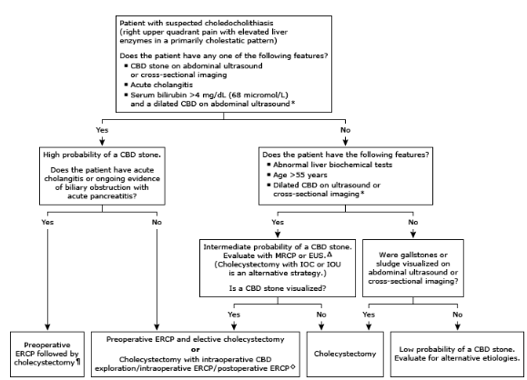

# Choledolithiasis

- **Definition** - presence of gallstone in the CBD
- **Etiology of CBD stone:**
    - <u>Primary choledolithiasis</u> - formation of stones in CBD due to biliary stasis:
        - Post-cholecystectomy
        - Sphinter of Oddi dysfunction
        - Peri-ampullary diverticulum
        - Recurrent pyogenic cholangitis
    - <u>Secondary choledolithiasis</u> (far more common) - migration of stone from gallbladder from CBD (cholecystolithiasis)
- **Clinical features of CBD stone:**
    - <u>Asymptomatic</u> - typically on incidental finding of intraoperative cholangiography during cholecystectomy
    - **Symptomatic uncomplicated choledolithiasis** - caused by <u>transient obstruction of CBD</u> that spontaneously resolves due to 'ball-valve' effect, <u>before systemic inflammation in cholangitis ensues</u>:
        - <u>Recurrent biliary colic</u> - recurrent RUQ or epigastric pain that lasts longer than typical biliary colic
        - <u>Obstructive jaundice</u> - pruritis, tea-coloured urine, pale stools
        - <u>Absence of systemic inflammation</u> - afebrile, normal WBC and amylase levels
    - **Features of complications:**
        - <u>Acute cholangitis</u> - **Charcot's triad** (fever, rigors and leukocytosis reflects systemic inflammation)
        - <u>Acute pancreatitis</u> - severe epigastric pain (amylase \> 3x ULN as defining feature)
- **Ix and Dx** - clinical suspicion on compatible Hx, P/E, bloods, and diagnosed on imaging:
    - <u>CBC</u> - leukocytosis if cholangitis present
    - <u>LFT</u> - cholangiohepatitis pattern (raises suspicion of biliary obstruction)
    - <u>Amylase</u> - r/o concurrent pancreatitis
    - <u>Transabdominal US</u> (diagnostic) - demonstration of 1) biliary obstruction, 2) source of gallstones, and 3) visualisation of CBD stone:
        - **Biliary obstruction** (suggestive but non-specific) - demonstration of dilated intra-hepatic bile ducts
        - **Source of gallstones** - echogenic stones in GB that cause accoustic shadowings
        - **CBD stones** - through dilatation of CBD, and direct visualisation of stones (seen in only 50%)
    - <u>MRCP</u> - if diagnostic uncertainty on TAUS where immediate Mx is not necessary as uncomplicated (no cholangitis or pancreatitis picture)
- **Mx:**
    - **Principles of Mx:**
        - General measures - treat complicating features such as cholangitis and pancreatitis
        - Biliary drainage - relieve biliary obstruction through ERCP, PTBD, or surgical drainage
        - Prevention of recurrence - cholecystectomy
    - **Pre-operative risk stratification for CBD stone** (ASGE 2019):
        - <u>Rationale</u> - clinical picture of CBD stone is variable, esepcially when TAUS and LFT are non-definitive in the absence of complicating features (cholangitis or panccreatitis)
        - <u>Risk stratification</u>:
            - **High risk** - 1) presence of CBD stone, 2) acute cholangitis, 3) laboratory and sonographic evidence of biliary obstruction (bil \> 68 mmol/L, dilated CBD US \> 6mm or \> 8mm if prior cholecystectomy)
            - **Intermediate risk** - 1) Abnormal LFT, 2) Age \> 55, 3) sonographic evidece of dilated CBD
            - **Low risk** - no predictors present
        - <u>Affects subsequent management</u>:
            - **High risk** - 1) pre-operative ERCP w/ stone removal and elective cholecystectomy, 2) Laproscopic cholecystectomy with intraoperative exploration of CBD or post-operative ERCP (selective patients)
            - **Intermediate risk** - 1) confirm Dx with additional imaging (MRCP or EUS), 2) Manage accordingly based on results of additional imaging
            - **Low risk** - seek alternative diagnosis if gallstone sludge not present 
            
