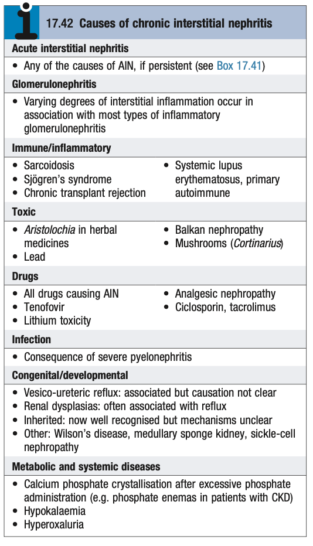

# Chronic Interstitial Nephritis

- **Definition** - renal dysfunction and tubular damage in association with chronic inflammation of the tubulo-interstitium, characterised by fibrosis, and mononuclear infiltration
- **Etiology of CIN:**
    - <u>Acute interstitial nephritis</u> - any cause of persistent AIN
    - <u>Glomerulonephritis</u> - particularly inflammatory GN
    - <u>Inflammatory lesions</u> - SLE, Sjogren's syndrome, Sarcoidosis, Chronic transplant rejection
    - <u>Drug-induced</u> - e.g. analgesic nephropathy, calcinurin inhibitors (cyclosporin, tacrolimus), tenovofir, lithium toxicity, all drugs leading to AIN
    - <u>Toxic</u> - Balkan nephropathy, herbal medicine (Aristolochia), lead, mushrooms

  
  
- **Pathophysiology of CIN:**
    - **Chronic inflammation in the tubulo-interstitium** - progresses and typically presents as G3CKD, HTN, and fibrosed kidneys in adulthood with no indentifiable underlying cause
    - **Tubular damage** - results in tubular dysfunction with more severe electrolyte abnormalities compared w/ other causes of CKD:
        - <u>Hyperkalaemia and acidosis</u> - due to tubular dysfunction
        - <u>Hypovolaemic hyponatraemia</u> - due to salt-losing nephropathy
        - <u>Renal tubular acidosis</u> - mostly seen in Sjogren's syndrome, myeloma, sarcoidosis, amyloidosis, cystinosis
- **Clinical features of CIN** - typically indolent clinical course presenting late with CKD in adulthood:
    - **Presentation as CKD** - presentation often at <u>stage 3 CKD</u> in adulthood, with accompanying HTN and fibrotic kidney (C/I biopsy)
    - **Features of tubular dysfunction** - electrolyte and acid-base disturbances are much more marked due to tubular damage:
        - <u>Hyperkalaemia and acidosis</u> - ?due to distal tubular dysfunction
        - <u>Salt-losing nephropathy</u> - excessive salt wasting from impaired urine-concentrating ability and sodium conservation, can present as **polyuria**, **hypotension**, **hypovolaemic hyponatraemia**, and AKI during acute illness
        - <u>Distal RTA</u> - typically complicate in Sjogren's syndrome, myeloma, sarcoidosis, amyloidosis, and cystinosis
- **Mx:**
    - <u>Standard CKD Mx</u> - supportive Mx with correction of fluid and electrolyte status +/- RRT
