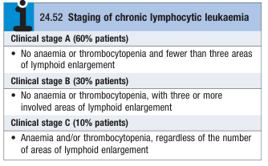

# Chronic Lymphocytic Leukaemia

- **Definition** - the most common variety of leukaemia (30%) arising from mutations of B lymphocytes resulting in an ever-increasing mass of immuno-incompetent cells

<!-- -->

- **Epidemiology:**
    - <u>Incidence</u> - most common form of leukaemia worldwide (rarity in Chinese and related race)
    - <u>Demographic</u> - increasing incidence w/ age (median age of presentation at 65-70y), male preponderance (M:F = 2:1)
- **Pathophysiology of CLL:**
    - <u>Mutation of B cell lineage</u> - mutations resulting in increased proliferation of defective B cells that are unable to mount humoral response against an infection
    - <u>Detrimental effects on immune function</u> - typically manifests as recurrent infections
    - <u>Detrimental effects on bone marrow function</u> - normal haematopoiesis is affected, resulting in anaemia, infections, and bleeding
- **Clinical features of CLL** - extremely indolent clinical course:
    - **Asymptomatic** (70%) - Dx is made incidentally on routine CBC, as onset is indolent
    - **Features of bone marrow failure** - presence of which implies late-stage disease (clinical stage C):
        - Anaemia
        - Infections
        - Bleeding
    - **Systemic Sx** - e.g. painless generalised lymphadenopathy, weight loss, night sweats
- **Ix and Dx evaluation** - Dx made based on mature lymphocytosis with characteristic morphology and immunophenotyping:
    - **CBC with differentials:**
        - <u>Absolute lymphocyte count</u> - absolute lymphocytosis (\> 5 x 109/L)
    - **Immunophenotyping** - <u>flow cytometry of peripheral blood</u> shows monoclonal expansion of B cells:
        - Presence of B cell Ag - CD19, CD23
        - Light chain restriction - i.e. kappa or lambda light chains
        - Presence of CD5 (aberrant T cell Ag)
    - **Reticulocyte count** - detection of marrow failure
    - **Direct Coombs test** - as warm AIHA may occur in patients w/ CLL
    - **Serum Ig levels** - degree of immunosuppression is often progressive
    - +/- **Bone marrow examination** - not essential for Dx
- **Clinical staging of CLL:** 

- **Mx:**
    - **Principles of Mx:**
        - <u>Stage-dependent Tx</u> - requires balancing risk and benefits of careful observation, and specific Tx:
            - No specific Tx - uncomplicated stage A disease
            - Specific Tx instantiated for:
                - Evidence of marrow failure
                - Progressive lymphadenopathy and splenomegaly
                - Distressing systemic features - e.g. night sweats, weight loss
                - Rapidly progressive disease - e.g. rapidly increasing absolute lymphocyte count
                - AIHA
                - Thrombocytopenia
        - <u>Supportive Tx</u> - increasingly required in progressive disease
        - <u>Specific Tx</u> - e.g. oral mono-chemotherapy vs combined chemotherapy
        - <u>Radiotherapy</u> - reserved for infiltrative lesions (e.g. lymphadenopathy and splenomegaly) causing obstruction or discomfort
        - <u>Splenectomy</u> - reduced autoimmune destruction in selected patients
    - **Chlorambucil** - initial therapy for stage B/C CLL
    - **Fludarabine, cyclophosphamide and rituximab** - increased remission rates and disease-free survival at increased risk of immunsuppression (infections, secondary malignancy)
- **Prognosis:**
    - **Prognostic factor of CLL:**
        - <u>Clinical stage</u>:
            - Stage A disease - normal life-expectancy
            - Stage B-C disease - reduced survival
        - <u>Immunophenotyping</u> - e.g. CD38 a/w poorer prognosis
        - <u>Cytogenetics and genetics</u> - abnormal Ch11, 17, absence of IgVH gene
    - **Risk of transformation** - rarely CLL transforms to aggressive high-grade lymphoma (<u>'Ritcher's transformation'</u>)
