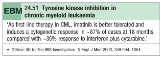

# Chronic Myeloid Leukaemia

- **Definition** - a myeloproliferative disorder characterised by the <u>chromosomal abnormality known as Philadelphia (Ph) choromosome</u> resulting in proliferation in all haematopoietic lineages, with farly normal maturation, manifesting predominantly in the granulocytic series
- **Pathophysiology of CML** - defined by t(9;22):
    - <u>Philadelphia chromosome</u> (Ph) - shortened chromosome 22 occuring at breakpoint cluster region (BCR), where fragment chromosome 9 joining BCR carries ABL-oncogene
    - <u>Increased proliferation</u> - BCR-ABL fusion gene encodes for 210 kDa protein with constituitively active tyrosine kinase activity, influencing cellular proliferation, differentiation and survival
- **Natural Hx of CML** - tri-phasic disease:
    - **Chronic phase** (3-5 y) - phase in which disease is <u>responsive to targeted Tx</u> and is easily unde control (prolonged since the advent of targeted therapy, i.e. imatinib)
    - **Accelerated phase** (not always seen) - disease control becomes <u>difficult</u>
    - **Blast crisis** (timing unpredictable) - phase in which disease <u>transforms into acute leukaemia</u> (either myeloid, or lymphoblastic), and becomes <u>refractory to targeted Tx</u>, attributing to **significant mortality** (prior to imatinib therapy, blast crisis occurs at a rate of 10%/y, but is lowered to 0.5-2.5%/y with therapy)
- **Clinical features of CML:**
    - **Asymptomatic** - roughly 25% are asymptomatic at Dx and are only revealed in routine CBC for other purposes, or from abnormal examination findings (e.g. incidental massive splenomegaly)
    - **Constitutional Sx** - presentation w/ non-specific complaints (e.g. lethargy, weight loss, night sweats)
    - **Abdominal Sx:**
        - <u>Mild abdominal discomfort</u> - attributable to splenomegaly resulting in mild, distending abdominal discomfort, which may be a/w early satiety and hence weight loss
        - <u>Sudden LUQ abdominal pain</u> - may occur in cases of splenic infarction
- **Signs of CML:**
    - **General examination** - pallor (NcNc anaemia)
    - **Abdominal examination:**
        - <u>Splenomegaly</u> (90%) - 10% of which are massive (\> 15cm), and maybe tender and a/w friction rub in cases of splenic infarct
        - <u>Hepatomegaly</u> (50%) - mild-to-moderate infiltrative hepatomegaly
    - **LN** - lymphadenopathy is typically <u>absent</u>, presence of LN is unusual
- **Ix:**
    - **CBC with differentials:**
        - <u>Hb and MCV</u> - usually a NcNc anaemia
        - <u>WBC</u> - leukocytosis ranging from 10-600 x 109/L
        - <u>PLT</u> - thrombocytosis in 33% patients, ocassionally as high as 2000 x 109/L (drops rapidly at blast transformation due to marrow failure)
        - <u>Eos</u> - increased **absolute Eos count** (eosinophilia)
        - <u>Basophil</u> - increased absolute basophilic count and tends to increase as disease progress (basophilia)
    - **Peripheral blood smear:**
        - <u>Full range of granulocyte precursors</u> - ranging from myeloblasts (by definition \< 10% of all WBC) to mature neutrophils and myelocytes, with increased proportion of primitive cells in accelerated phase and blast crisis
        - <u>Peripheral eosinophilia and basophilia</u> - common findings in PBS
        - <u>Nucleated red cells</u> - common findings in PBS
    - **LDH, urate** - high reflecting high cellular breakdown
    - **Bone marrow examination** - confirm Dx by morphology, chromosomal analysis (Ph chromosome), and RNA analysis to demonstrate presence of BCR/ABL gene products
- **Mx:**
    - **Principles of Mx:**
        - <u>Phase-specific Tx</u>:
            - Chronic phase - targed therapy by TK inhibitors (e.g. imatinib) or cytotoxic therapy
            - Accelerated phase - targeted therapy +/- hydroxycarbimide or low-dose cytarabine
            - Blast phase - determine lineage of origin and Tx as acute leukaemia and supportive Tx
        - <u>Tx target</u>:
            - Historically targets a cytogenetic response (absence of Ph chromosome), but demonstrable to have increased risk of recurrence
            - Currently targetting a molecular response (absence of BCR-ABL gene products) through PCR
    - **Targeted therapy** - tyrosine kinase inhibitor:
        - <u>Selection of TKIs</u>:
            - 1st-line - imatinib
            - 2nd-line - dasatinib, nilotinib
        - <u>MOA</u> - inhibition of uncontrolled proliferation of WBC to induce disease response
        - <u>Tx target</u>:
            - 1\. Cytogenetic response (dissapearance of Ph chromosome in repeated BM examination) in 76% within 18 mo
            - 2\. Major molecular response (dissapearance of transcription products in PCR)

    
    
    - **Cytotoxic therapy:**
        - <u>Regimens</u>:
            - Interferon with cytarabine (70% achieve control)
            - Hydroxycarbamide (mainly applied in palliative conditions)
