# Chronic Obstructive Pulmonary Disease

- **Definition** - per GOLD guidelines, COPD is a <u>clinical syndrome</u> defined as:
    - A <u>preventable</u> and <u>treatable</u> disease state
    - Characterised by a <u>persistent, irreversible and progressive</u> clinical course
    - Of respiratory signs and symptoms reflecting <u>chronic airflow limitation</u> (confirmed on spirometry)
    - Attributable to a <u>noxious environmental exposure</u>, most commonly products of combustion (95% attributed to cigarette smoking)
- **Other terminologies** - likely reflect varying degree in a spectrum of COPD patients, usually not fitting the classical definition due to absence of airflow limitation:
    - <u>Emphysema</u> - patho-anatomically defined as destruction of lung alveolar wall with enlargement of air space distal to the terminal bronchioles
    - <u>Chronic bronchitis</u> - clinically defined as chronic cough and sputum (most days for \>= 3 mo, in 2 consecutive years), not attributable to another condition
    - <u>Small airway disease</u> - condition in which small broncioles are narrowed and reduced in number
- **Epidemiology:**
    - <u>Prevalence</u> - 480 million individuals world wide, forcasted to be 3rd most important cause of death
    - <u>Demographic</u> - increases w/ age due to prolonged exposure (10% of elderly), male preponderance (M \> F)
    - <u>Association w/ smokers</u> - accounts for 95% cases of COPD, with ?increased risk if \> 30 pack years
- **Risk factors of COPD** - by definition, a diagnosis of COPD requires the presence of a chronic noxious exposure:
    - **Cigarette smoking and novel forms of smoking** - long established as a major risk factor of COPD by the Advisory Committee to the Surgeon General of the United States (1964):
        - Longitudinal studies showed <u>accelerated decline in FEV1</u> in a dose-response relationship, which also partly explains higher prevalence of COPD with increasing age
        - Marked <u>individual variability</u> in response to smokings, where only 15% of variability of FEV1 is attributable to pack-years
        - Additional developmental, environmental +/- genetic factors contribute to the impact of smoking on chronic airflow limitation
        - Cigar and pipe smoking have less compelling evidence supporting their associations with COPD possibly due to lower dose of inhaled tobacco by-products
        - E-smoking and vaping has indentified increased risk of pulmonary Sx but not COPD per say
	    
	    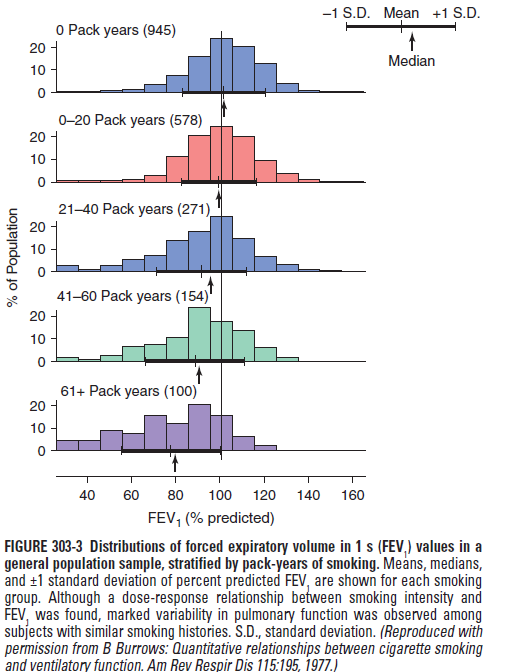
    - **Airway responsiveness** - while often viewed as different disease mechanisms (allergic vs inflammatory), chronic asthma and COPD may likely share similar environmental and genetic factors, such that asthma and airway responsiveness are risk factors of COPD:
        - A study from the Childhood Asthma Management Program demonstrated that Asthmatics with low baseline lung functions were likely to develop persistent airflow airflow obstruction in early adulthood
        - The associatin is particularly relevant for childhood asthmatics who chronically smoke throughout adulthood
    - **Respiratory infections** - controversial relationship between chest infections and declining lung functions in normal subjects, but significant in COPD patients:
        - COPDGene and ECLIPSE studies showed AECOPD due to respiratory tract infections are associated w/ increased loss of lung function longitudinally, especially among those individuals with better baseline lung functions
        - Childhood respiratory illnesses, especially TB (tuberculosis-associated COPD) may increase risk of COPD in later life but lacks convincing longitudinal data
        - HIV infection is an increased risk of COPD and emphysema from opportunistic chest infections, and is frequently underdiagnosed in this setting
    - **Occupational expposures** - airflow obstruction is suggested to result from exposure to vapors, gas, dust or fumes (VGDF):
        - Non-smokers in these occupations can develop some reduction in FEV1, but unsure whether it is an independent risk factor or confounded by second-hand cigarette exposure during occupation
        - Coal mine dust exposure was a significant risk factor for emphysema irrespective of smoking status
    - **Air pollution and climate change** - increased respiratory symptoms in those living in urban compared to rural areas, but relationship w/ COPD is unproven
    - **Early-life passive smoke exposure** - esp. with maternal tobacco smoking during in utero development
    - **Genetic fators:**
        - <u>Alpha-1-antitrypsin deficiency</u> (S, Z or null allele) - proven genetic risk factor, although studies showed ascertainment bias in that genetic testing is performed after COPD diagnosis (fraction of A1AT deficiency patients developing COPD is unknown, and age of COPD onset is unknown)
        - <u>Other genetic risk factors</u> - GWAS showed \> 80 regions, particularly region near HHIP gene on chromosome 14 etc.
- **Associated comorbidities** - attributes to the pathophysiological spiral, and often required to be managed concurrently:
    - Cardiovascular disease
    - Cerebrovascular disease
    - Metabolic syndrome
    - Osteoporosis
    - Gastroesophageal reflux disease
    - Depression
    - Lung cancer
- **DDx of COPD:**
    - Chronic asthma - variability in dyspnoea +/- features of atopy
    - Tuberculosis - always remain vigilant
    - Bronchiectasis - typically sputum is purulent in amount (can co-exist with COPD)
    - Congestive heart failure - known CVS risk factors
- **Complications of COPD:**
    - <u>Acute complications</u> - due to superimposed infection, or secondary spontaneous pneumothorax, manifesting as:
        - Respiratory failure - T1RF or T2RF
        - Cor pulmonale and RHF
    - <u>Chronic complications</u>:
        - Chronic respiratory failure
        - Secondary polycythaemia
        - Pulmonary HTN
        - Cor pulmonale
        - Bronchial carcinoma
        - Pulmonary embolism

## Pathology, Pathogenesis, and Pathophysiology of COPD

- **Pathoanatomy of COPD** - cigarrette smoke exposure can affect 1) large airways, 2) small airways and 3) alveoli, the most clinically significant physiological marker being the resultant airflow limitation:
    - **Large airway disease:**
        - <u>Mucus hypersecretion</u> - loblet cell hyperplasia and mucus gland enlargement (+/- increase in extent in bronchial tree) leading to <u>cough and sputum</u> (mucus plugs seen in CT) seen in <u>chronic bronchitis</u>
        - <u>Bronchial hyper-reactivity</u> - hyper-reactivity of large areas attributes to airflow limitations, which is not seen in asthma
        - <u>Chronic inflammation</u> - neutrophilic influx associated with purulent sputum during respiratory tract infections
        - <u>Squamous metaplasia</u> - in response to noxious exposures and attributes to carcinogenesis and disrupts mucocilliary clearence (predisposes to infections)
    - **Small airway disease** (\< 2mm in diameter):
        - <u>Luminal narrowing</u> - caused by smooth muscle hypertrophy, fibrosis, mucus, edema and cellular infiltrates
        - <u>Goblet cell metaplasia</u> - replacing surfactant-secreting club cells resulting in increased surface tension predisposing to airway narrowing and <u>collapse</u>
        - <u>Parenchymal destruction</u> - narrowing and drop-out of small airways typically followed by onset of emphysematous destruction
    - **Lung parenchyma destruction and progression to emphysema** - various inflammatory infiltrates distal to terminal bronchioles results in obliteration alveolar wall perforation and subsequent obliteration and coalescence into large emphysematous air spaces:
        - <u>Centrilobular emphysema</u> - most common type w/ cigarette smoking with initial enlargement of air spaces in association with respiratory bronchioles, most prominent in upper lobes and superior segments of lower lobes
        - <u>Panlobular emphysema</u> - typically seen with A1AT deficiency, abnormally large spaces evenly distributed within and across acinar unit, with a predilection of lower lobes
        - <u>Paraseptal emphysema</u> - may be seen in chronic smokers, with distribution along pleural margins with relative sparing of the lung core or central regions
- **Pathogenesis of emphysema** - 4 interrelated events leading to emphysema: 
    - 
    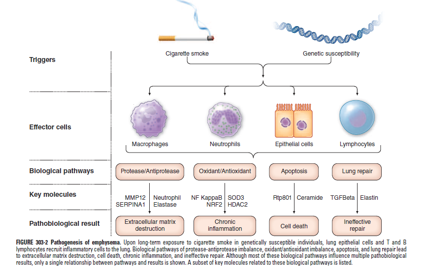
	- **Chronic noxious exposure in genetically susceptible individual** - triggers **inflammatory and immune cell recruitment** within **large and small airways** and in the **terminal air spaces**
	- **Inflammation and Proteinase-anti-proteinase imbalance** - damage extracellular matrix, vasculature and gas exchage surfaces:
		- <u>Elastase:antielastase hypothesis</u> - balance of elastin-degrading enzymes (serine protease and MMPs) and their inhibitors determines susceptibility to lung destruction and emphysema, observed in A1AT deficiency and animal models
		- <u>Oxidative-stress as key inciting componant of COPD pathobiology</u> - macrophage activation through oxidant-induced inactivation of histone deacetylase-2 (HDAC2), exposes NF-kappaB, leading to transcription of MMPs and cytokines (IL-8, TNF-alpha) that mediateneutrophil recruitment
		- <u>CD8+ T cells</u> - may release IP-10, CXCL-7 that result in macrophage production of MMP12
	- **Structural cell death through oxidant-induced damage** - 'premature aging of the lung' associated with cell death and additional mechanisms associated with cell senescence, beyond shifting altering proteinase expression
	- **Ineffective repair** - disordered repair of elastin and other ECM contributes to air-space enlargement and emphysema
- **Pathophysiology of COPD** - persistent irreversible airflow limitation is the defining abnormality in COPD:
    - **Airflow limitation** - persistent and irreversible, as demonstrated by a chronically reduced FEV1/FVC ratio that does not normalise following bronchodilation treatment, attributing to wheeze, dyspnoea and prolonged expiratory phase
    - **Hyperinflation** - as a compensatory mechanism for airflow limitation to **preserve maximum expiratory airflow**, as increased lung volume favours mechanics of breathing through, 1) elastic recoil pressure increases, and 2) airway enlarges and airway resistance decreased:
        - <u>Flattening of the diaphragm</u> - results in the following adverse effects on ventilation:
            - Decreased zone of apposition between diaphragm and the abdominal wall, preventing effective transfer of +ve intrabdominal pressure to chest wall during inspiration
            - Non-optimal 'zone of overlap' during cross bridge formation, as muscle fibres in the flattened diaphragm are shorter than those of a more normally curved diaphragm
            - Greater tension needed by the flattened diaphragm to create the same transpulmonary pressure required to produce tidal breathing
            - Abnormal chest wall static mechanics as additional work from inspiratory muscles necessary to overcome resistance of the thoracic cage rather than gaining the normal assistance from the outward recoil pressure of the chest wall at resting volume
        - <u>Progressive hyperinflation during tachypnoea</u> - due to shortened expiratory time, resulting in progressive air trapping which manifests as **progressive exertional dyspnoea**
        - <u>Changes in lung volume studies</u> - disease progression identified by two pathophysiological processes defined on lung volume studies:
            - Air trapping - increased RV and increased RV/TLC ratio
            - Progressive hyperinflation - increased TLC
    - **Gas exchange abnormalities** - typically attributed to **VQ mismatch** caused by non-uniform ventilations (regional differences in compliance and airway resistance) with minimal shunting, such that **modest elevations of FiO2 is typically required to correct hypoxaemia**
- **Systemic sequelae of COPD**:
    - Weight loss - ?due to altered fat metabolism in response to hypoxaemia
    - Skeletal muscle weakness - due to progressive deconditioning
    - Peripheral oedema - attributed to RHF, and excessive salt and water retention by the hypoxic, hypercapnic kidney
	  
	  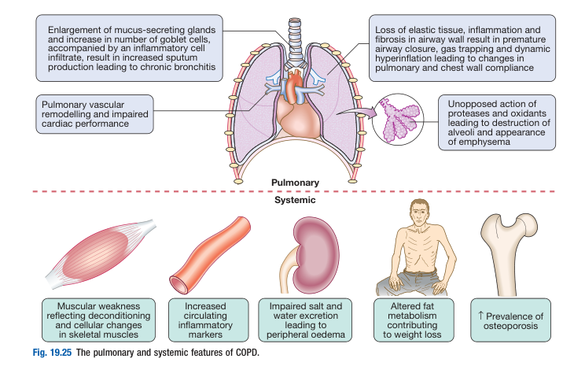

## Natural History of COPD

- **Normal trajectory of pulmonary function in a healthy individual** - individuals tend to track their quantiles of pulmonary function based on environmetal and genetic factors that put them on different tracts:
    - Steady trajectory of increasing pulmonary function in childhood and adolescence
    - Plateau in early adulthood
    - Gradual decline with aging starting from 4th decade of life
- **Natural Hx of COPD** - altered trajectory with accelerated decline of pulmonary function resulting in clinical disease:
    - Onset and rate of decline function depends on intensity, timing of noxious exposure (cigarette smoking) and baseline lung functions
    - Subsequent rate of decline in pulmonary function can be modified by changing environmental exposures (i.e. smoking cessation), especially at an earlier age providing the most beneficial effects
    - Absolute annual loss in FEV1 is highest in mild COPD and lowest in severe COPD
	  
	  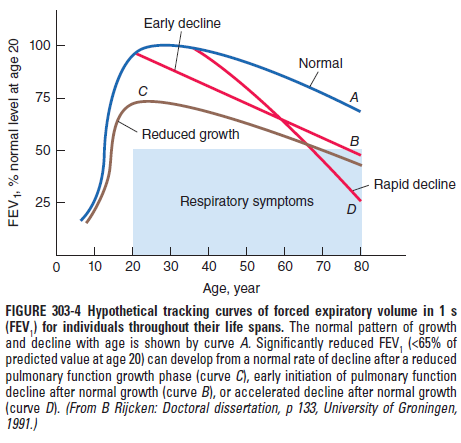
- **Natural Hx of other COPD-like disease entities:**
    - <u>Pre-COPD</u> - presence of substantial chest CT changes (emphysema and airway wall thickening) with normal spirometry in patients at risk of COPD progress in two patterns: 1) emphysema-predominant vs 2) airway predominant
    - <u>Preserved ratio-impaired spirometry (PRISm)</u> - reduced FEV1% predicted despite normal ratio is a/w increased risk of mortality, cardiovascular, and respiratory events (GOLD-Unclassified Smokers, AJRCCM 2011)

## Clinical Features of COPD

- **Clinical features of COPD** - perisiste and progressive clinical course:
    - **Cough and sputum** - attributed as 'smoker's cough', and prolonged nature fits the definition of chronic bronchitis
    - **Chronic exertional dyspnoea** (precipitates presentation to healthcare) - typically progressive in nature initially provoked by exertion (shortened expiration), and advances to resting breathlessness, characterised by functional decline documented by exercise tolerance, or MRC dyspnoea scale
    - **+ve Hx of smoking** - consider other DDx in a non-smoker, although it can be possible
    - **Features of late disease** - when disease complicated as T2RF, cor pulmonale etc:
        - <u>Peripheral oedema</u> - typically first noticable in advanced disease complicating as RHF (or hypoxic, hypercapnic kidney)
        - <u>Morning headaches</u> - sensitive feature suggestive of hypercapnia
- **Hx:**
    - Cardinal Sx of cough, sputum production, and progressive exertional dyspnoea are often present for months to years prior to first presentation, but many patients date the onset of disease to day of acute exacerbation (N.B. careful Hx probing Sx prior to first presentation is important)
    - Dyspnoea often described as chest tightness, increased effort to breath, air hunger or gasping, but can be insidious
    - Reduced exercise tolerance is insidious, and is best elicited by careful history focused on typical physical activities and have patients ability to perform them has changed (?individualised metric):
        - Characteristically activities involving significant arm work are poorly tolerated (due to difficulty in recruiting accessory muscles), while activities that enable patients to brace their arms (pushing shopping cart, walking on trendmill) are better tolerated
        - Principle feature of progressive dyspnoea is characterised by intrusion of ability to perform vocational and avocational activities
        - Final stage is characterised by breathlessness doing basic activities and resting hypoxaemia
    - Hx to elicit common comorbidities such as cardiovascular disease, gsatroesophageal reflux, osteoporosis, frailty, depression, anxiety
- **Signs of COPD:**
    - **General examination:**
        - <u>Cachexia</u> - weight loss and diffuse loss of subcutaneous adipoe tissue due to poor oral intake and pro-inflammatory cytokines and is an **independent poor prognostic factor**
        - <u>Cyanosis</u> - visible on lips and nail beds suggesting resting hypoxaemia signifying advanced disease
        - <u>Clubbing</u> - not a sign of COPD, but new-onset clubbing raises suspicion of CA lung
    - **Respiratory examination:**
        - <u>Cardinal features of COPD</u> - tripod position, recruitment of accessory respiratory muscles, barrel chest etc.
        - <u>Hyper-resonnance on percussion</u> - increased resonnance w/ poor diaphragmatic excursion
        - <u>Airflow limitation on auscultation</u> - prolonged expiratory phase w/ diffuse expiratory wheeze (+/- focal crackles if superimposed chest infections)
    - **Cardiovascular examination:**
        - <u>LL oedema</u> - classically attributed to cor pulmonale but is due to salt and water retention by the hypoxic hypercapnic kidney
        - <u>Parasternal heave and elevated JVP</u> - overt RHF
        - <u>Loud P2</u> - pulmonary HTN, especially if persistent activity limitations or LL oedema

## Investigations and Diagnostic Evaluation of COPD

- **Aims of Ix:**
    - <u>Diagnostic evaluation</u> - objective demonstration of the presence of airflow limitation and its severity
    - <u>Identification of complications</u> - e.g. secondary polycythaemia, pulmonary HTN, cor pulmonale, CA lung
    - <u>Detecting exacerbations</u> - typically more important in the acute setting
- **Common Ix employed in assessment of COPD:**
    - <u>Routine bloods</u> - CBC, biochemistries
    - <u>Imaging</u> - CXR, +/- HRCT
    - <u>Lung function test</u> - spirometry +/- lung volume studies, DLCO
    - <u>6 min walk test</u> - measurement of exercise tolerance
    - <u>Sputum and blood culture</u> - typically if suggesting infective episodes
    - Oximetry and <u>ABG</u> - for evaluation of suspected respiratory failure
    - <u>ECG, echocardiogram</u> - evaluation of cardiovascular comorbidities
    - +/- <u>Alpha-1-antitrypsin</u> - young (\< 45y) Caucasian
- **Routine bloods** - CBC and biochemistries:
    - **CBC:**
        - <u>Hb</u> - r/o anaemia (common cause of SOBOE), detect secondary polycythaemia
        - <u>HCT</u> - detect secondary polycythaemia
        - <u>WBC</u> - detect infections
        - <u>Eos</u> - predicts magnitude of effects of ICS
    - **RFT** - increased HCO3 may reflect <u>renal compensation for chronic respiratory alkalosis</u>
- **CXR** - non diagnostic for COPD, typically for <u>r/o of other pathologies and assess comorbidities</u>:
    - <u>Compatible findings</u> - Hyperlucency and hyperinflation (does not correlate w/ severity)
    - <u>r/o other DDx of chronic exertional dyspnoea and smoking</u>:
        - Congestive heart failure - Upper lobe cephalisation, Kerley B lines, peribronchial oedema, Batwing opacity
        - Bronchiectasis - +/- tramline sign
        - Lung cancer - pulmonary nodule or mass
        - Presence of bullae
    - <u>Assessment of comorbidities</u>:
        - Cor pulmonale - prominent pulmonary arteries +/- cardiomegaly
- **HRCT** - typically r/o bronchiectasis, but enables detection, characterisation and quantification of emphysema and presence of bullae (and r/o other comorbidities)
- **Lung function test** - <u>diagnostic</u> and <u>assessment of severity</u>:
    - <u>Spirometry</u> - post-bronchodilator FEV1/FVC ratio \< 70% (diagnostic), where FEV1% predicted is for assessment of severity
    - <u>Lung volumes</u> - increased RV and TLC
    - <u>DLCO</u> - normal or decreased in severe emphysema
- **6MWT** - documentation of ET and as a baseline for judging response to bronchodilator therapy or rehabilitation programes
- **A1AT deficiency testing** - guideline suggests testing in all (caucasian) subjects:
    - <u>Serum A1AT levels</u> - as initial test
    - <u>MS or molecular genotyping</u> - determining PI variants (M, S, and Z)
- **BODE index** - better predictor of mortality than spirometry alone:
    - Body mass index
    - Airflow obstruction
    - Dyspnoea
    - Exercise tolerance
- **Dx** - clinical Dx, spirometrically confirmed
- **Assessment of disease severity** - GOLD ABE assessment tool (GOLD 2024):
    - <u>Assessment of airflow limitations</u> - based on FEV1% predicted (prediction based on weight, and demographic): 
        - 
        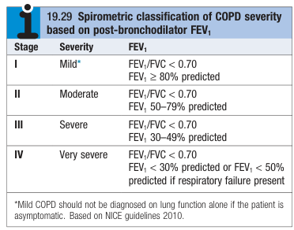
    - <u>Assessment of disease severity</u> - implicates management by stratifying patients into ABE groups:
        - Assessment of symptomatology - mMRC dyspnoea scale or COPD Assessment Tests (CAT)
        - Number of exacerbations - moderate exacerbations and exacerbations leading to hospitalisation 
        
        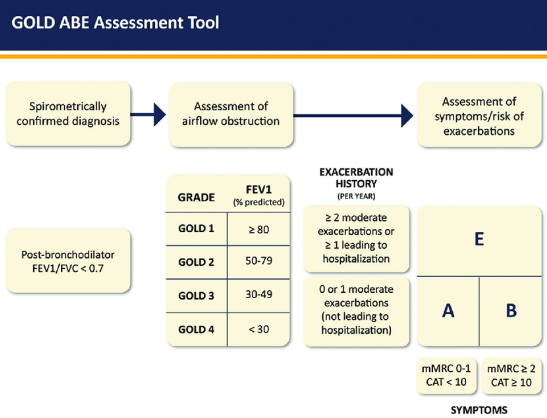

## Management of Stable COPD

- **Principles of Mx:**
    - **Goals of Mx:**
        - <u>Symptomatic relief</u> - reduce respiratory symptoms, improve ET, improve physical health
        - <u>Reduce future risk</u> - prevent disease progression, prevent and Tx exacerbations, reduce mortality
    - **Evidence-based therapy** - goals are to 1) reduce mortality, 2) reduce exacerbation, and 3) slow disease progrssion
    - **Approach to individualised therapy** - based on Sx evaluation and risk of progression: 
        - 
        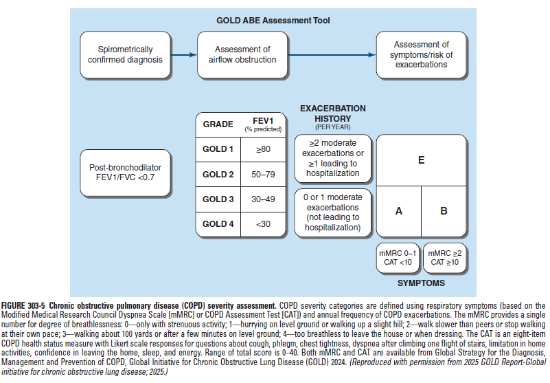
    - **Modalities of Tx** - pharmacological therapy vs non-pharmacological therapy
- **Evidence for existing therapy:**
    - Smoking cessation, LTO2 in chronically hypoxaemic patients, and lung volume reduction surgery in selected patients with emphysema have strong evidence demonstrating improved survival
    - Evidence less strong for early NIV during hospitalisation, pulmonary rehabilitation programmes and lung transplant
    - Triple-inhaled therapy have shown to reduce mortality
- **Assessing of disease severity and risk stratification of patients** - GOLD Grade group defined by 1) symptomatology on objective scale (e.g. mMRC, CAT), and 2) risk of exacerbation:
    - **Assessment:**
        - <u>Symptomatology</u> - use of validated instruments such as modified MRC dyspneoa scale or COPD assessment test (CAT)
        - <u>Risk of exacerbation</u> - determined based on patient's history of exacerbation and their severity in the past year (an exacerbation is defined as the clinical need to initiate systemic corticosteroids +/- hospitalisation), and partly related to %FEV1 predicted
    - **GOLD-grade groups** - note GOLD-grade groups are arbitrarily defined on <u>retrospective data</u>:
        - <u>Group A</u> - less symptomatic (mMRC 0-1), and low risk of exacerbation (\<= 1 exacerbation with no hospitalisation)
        - <u>Group B</u> - more symptomatic (mMRC \>= 2), and low risk of exacerbation (\<= 1 exacerbation with no hospitalisation)
        - <u>Groupe E</u> - high risk of future exacerbations (\>= 2 exacerbations or \>= 1 exacerbation leading to hospitalisation)
- **General measures:**
    - <u>Patient education</u> - explain clinical course of COPD, and explain role of smoking cessation and maintenance therapy, and educate on inhaler technique
    - <u>Smoking cessation</u> (Fletcher's graph) - explain single most important factor in reducing rate of decline in lung function:
         
         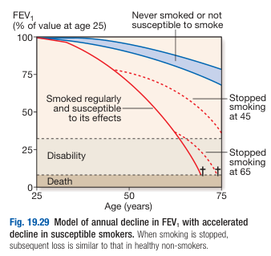
    - <u>Pulmonary rehabilitation</u> - participation in comprehensive pulmonary rehabilitation program that includes exercise, healthy behaviours, and psychological support demonstrated to improve ET, and QoL
    - <u>Vaccination</u> - pneumococcal, annual influenza, COVID-19 +/- RSV to prevent exacerbation
- **Non-pharmacological therapy:**
    - <u>Pulmonary rehabilitation programmes</u> - physical training, nutritional counselling, disease education by multidisciplinary efforts
    - <u>Long-term domiciliary oxygen therapy</u> (LTOT) - O2 concentrator that concentrates O2 from room air and delievers to patients:
        - **Evidence** - MRC trial reveals that maintaining PaO2 \>= 8kPa for \>= 15h/d increases 3y overal survival
        - **Treatment goal** - maintain SpO2 \> 90% or paO2 \> 60 mmHg
        - **Indications:**
            - Continuous LTOT (\> 15h/d) - Resting PaO2 \< 7.3kPa on 2 separate ocassions 3 weeks apart, or Resting PaO2 \< 8kPa if complications occur (cor pulmonale, pHTN, secondary polycythaemia, nocturnal hypoxaemia)
            - Intermittent LTOT:
                - Exercise - PaO2 \< 7.3kPa on low levels of exertion
                - Nocturnal - PaO2 \< 7.3kPa with associated complications (pHTN, daytime somnolence, cardiac arrhythmias)
    - <u>Surgical interventions</u>:
        - **Bullectomy** - large bullae on otherwise normal COPD (limited airflow limitation and lack of generalised emphysema)
        - **Lung volume reduction surgery** (LVRS) - predominant upper emphysema, with no evidence of pHTN or decreased gas transfer
        - **Lung transplantation**
- **Initial pharmacological therapy:** 
	
	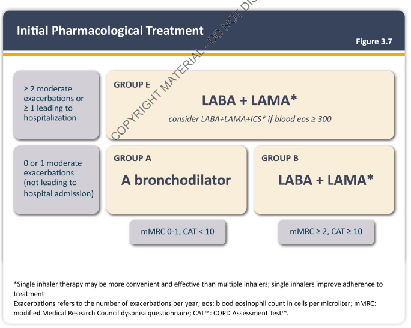
- **Pharmacological therapy:**
    - <u>Initial pharmacological therapy</u> - based on symptomatology and exacerbation Hx: 
        - 
        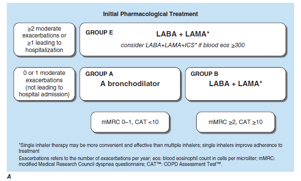
		- **Initial maintenance therapy for GOLD Group A** - single long-acting bronchodilator:
			- <u>Selection</u> - LAMA prefererd but choice dependent on Sx, comorbidities and medication S/E:
				- LAMA (preferred) - e.g. tiotropium
				- LABA - e.g. salmeterol, formoterol, indacaterol
			- <u>Comparative efficacy</u> - LAMA preferred due to potential benefits in reducing exacerbation risks in a Cochrane Meta-Analysis:
				- No significant difference in reported symptomatic relief
				- Tiotropium a/w significant reduction in exacerbations (OR 0.86) but does not translate to reduced hospitalisation or mortality
		- **Initial maintenance therapy for GOLD Group B** - dual bronchodilator therapy (LAMA-LABA therapy) may provided adequate relief for severe breathlessness
		- **Initial maintenance therapy for GOLD Group E** - dual bronchodilator therapy +/- ICS:
			- <u>Rationale for dual bronchodilator therapy</u>:
				- Meta-analysis reveals a reduction of moderate-to-severe exacerbations with dual bronchodilator therapy compared w/ LABA or LAMA alone
			- <u>Rationales for ICS therapy</u> - indicated only if Eos \> 300/mL, where LABA-LAMA-ICS therapy demonstrate 1) reduction in exacerbation, 2) reduction in mortality, and 3) improved lung functions
    - <u>Escalation of pharmacological therapy</u> - if persistent Sx or exacerbations refractory to therapy:
        - **Worsening dyspnoea** - consider LABA/LAMA, switching inhaler device, or escalation of non-pharmacological Tx
        - **Exacerbations** - bronchodilator –\> LAMA/LABA +/- ICS (based on Eos) –\> Add on roflumilast or azithromycin
		
		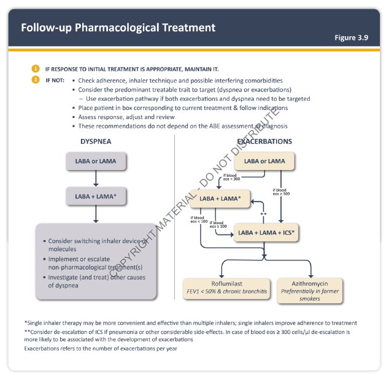
		
		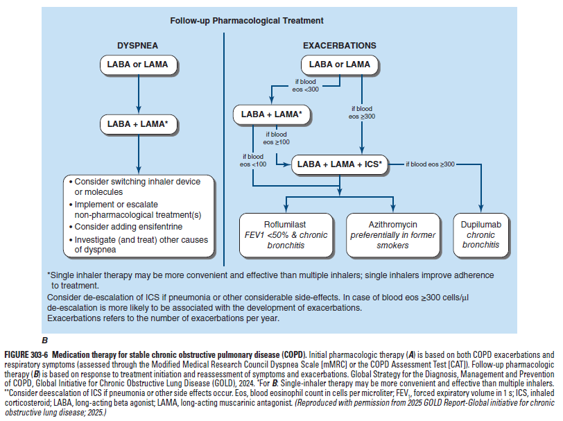
- **Bronchodilators** - short-acting bronchodilators prn + maintenance long-acting bronchodilators:
    - **Muscarinic antagonists:**
        - <u>Selections</u>:
            - SAMA - ipratropium bromide
            - LAMA - aclidinium, glycopyrrolate, glycopyrronium, tiotropium, umeclidinium, revefenacin
        - <u>Clinical efficacy</u>:
            - SAMA symptomatic improvement by increasing FEV1
            - LAMA symptomatic relief and **prevents exacerbation** (according to a Cochrane meta-analysis and thus preferred)
        - <u>S/E</u> (typically minor):
            - Dry mouth
    - **Beta agonists:**
        - <u>Selection</u>:
            - SABA - salbutarol
            - LABA - arformoterol, formoterol, indacaterol, olodaterol, salmeterol, vilanterol
        - <u>Clinical efficacy</u> - symptomatic relief and reduced exacerbations (lesser extent than LAMA)
        - <u>S/E</u>:
            - Tremors
            - Tacahycardia
    - **Rescue bronchodilators** - as-needed therapy for all patients:
        - <u>Selection</u> - dependent on drug used for maintenance therapy:
            - SABA alone - e.g. albuterol, levalbuterol
            - SAMA alone - e.g. ipratropium, tiotropium
            - SABA-SAMA - e.g. ipratropium-albuterol
        - <u>Approach to selection of rescue bronchodilators</u> - dependent on maintenance therapy:
            - **Patient on LAMA** (LAMA alone or w/ LABA) - SABA recommended (SAMA avoided due to cumulative cholinergic S/E)
            - **Patients on LABA alone** - SAMA alone or combination of SABA/SAMA
    - **LABA:**
        - <u>Selection and dosing</u>: 
	        - 
	        
        - <u>S/E</u>:
            - Tachyarrhythmias (minimal risk)
            - Tremors
            - Hypokalaemia (typically only if repeated use of SABA)
    - **LAMA:**
        - <u>Selection and dosing</u>: 
	        - 
	        
        - <u>S/E</u> - local irritation and anti-cholinergic effects:
            - Dry mouth
            - Pharyngitis and URTI
            - Cataracts
            - Blurry vision
            - Urinary retention
            - AF/ SVT
    - **Combined LABA and LAMA** - indications if very symptomatic or w/ exacerbations
- **Corticosteroids:**
    - **Inhaled corticosteroids** - main role to reduce exacerbations and does not provide symptomatic improvement:
        - <u>Indications</u>:
            - Definite indications if Eos \> 300 w/ exacerbations
            - Contemplated by considering benefits to risk if Eos \> 100 w/ frequent exacerbations despite dual bronchodilator therapy
        - <u>Clinical efficacy</u> - according to population studies:
            - No benefit if Eos \< 100
            - Increasing benefit as Eos increase beyond 100
        - <u>Withdrawal</u> - considered in stable patients w/o exacerbations (demonstrated to not increase risk of exacerbations)
        - <u>S/E</u>:
            - Infections - oropharyngeal candidiasis, pneumonia
            - Osteoporosis or osteopenia
            - Cateracts
    - **Oral glucocorticoids** - not used for stable COPD due to unvafourable benefit to risk ratio
- **PDE4 inhibitors** (Roflumilast):
    - <u>Clinical efficacy</u>:
        - Mainly to reduce exacerbations of COPD, chronic bronchitis in patients w/ refractory exacerbations
        - Minimal effect on airflow obstruction and respiratory Sx
    - <u>S/E</u>:
        - N/V
        - Diarrhoea
        - Weight loss
- **Macrolides:**
    - <u>Selection</u> - azithromycin (selected due to anti-inflammatory and anti-microbial effects)
    - <u>Clinical efficacy</u> - RCT demonstrates:
        - Daily azithromycin in patients w/ Hx of exacerbation in past 6 mo shown to have less exacerbation and longer time to first exacerbation
    - <u>S/E</u>:
        - Hearling loss
        - TdP (avoided in prolonged QTc)
        - Development of macrolide-resistant organisms
- **IL-4/IL-13 inhibitor** - Dupilumab:
    - <u>Indications</u> - severe COPD w/ Eos \> 300 w/ frequent exacerbations despite triple therapy
- **A1AT augmentation therapy:**
    - <u>Indications</u> - serum A1AT levels \< 11 microM (typically PiZ patients) w/ diagnosed COPD
    - <u>Clinical efficacy</u> - controversial

## Acute Exacerbation of COPD

- **Definition** (GOLD Definition) - an event characterised by dyspnoea and/or cough and sputum that worsens over \<= 14 d, which may be accompanied by tachypnoea and/or tachycardia, and is often associated w/ increased local and systemic inflammation caused by airway infection, pollution, or other insult to the airways
- **Clinical identification of AECOPD** - acute increases in one or more of the cardinal Sx:
    - Cough
    - Sputum production
    - Dyspnoea
- **Risk factors and of AECOPD** - GOLD guidelines suggest that <u>Hx of previous exacerbations</u> is the single best predictor of exacerbations <u>irrespective of severity of airflow limitations</u> as noted in the ECLIPSE study:
    - **Patient factors** - advanced age
    - **Disease factors** - Hx of exacerbations, longer duration of COPD, more severe Sx, higher Eos
    - **Comorbidities** - Hx of ischaemic heart disease, DM, heart failure, concomitant asthma, GERD
- **Triggers for AECOPD:**
    - <u>Respiratory tract infections</u> (70%) - most commonly viral (e.g. rhinovirus) or community-acquired pneumonia (rarely atypical bacteria)
    - <u>Environmental triggers</u> - cold temperature, environmental pollution
    - <u>Other medical conditions</u> - e.g. secondary spontaneous pneumothorax, pulmonary embolism, heart failure, myocardial ischaemia
- **P/E:**
    - **Primary assessment:**
        - <u>Airway</u> - wheezing, difficulty to speak due to dyspnoea
        - <u>Breathing</u> - low SpO2, respiratory distress, use of accessory respiratory muscles, paradoxical chest wall and abdomen movement
        - <u>Circulation</u> - tachycardia +/- hypotension (+/- new onset AF)
        - <u>Disability</u> - decreased GC could reflect hypoxemia or hypercapnia; asterixis could indicated hypercapnia
    - **General examination:**
        - <u>Temperature</u> - fever suggests an infective cause
        - <u>JVP</u> - raised, suggestive
        - <u>LL oedema</u> - increased LL oedema can be a result of 1) fluid retention by the hypoxic, hypercapnic kidney, 2) venous congestion by right heart failure
    - **Chest examination** - hyperresonant chest, wheeze, focal areas of crackles and increased focal resonance (silent chest in very severe airflow limitations)
    - **Cardiovascular examination** - assessment of RHF (e.g. parasternal heave)
- **Ix** - <u>septic workup</u> if pyrexic; other Ix mainly to r/o other causes of acute SOB and respiratory S/S:
    - **Routine bloods** - CBC, LRFT, CRP, RBG +/- ABG, troponin, NT-proBNP:
        - **CBC:**
            - <u>Hb and HCT</u> - detection of secondary polycythaemia
            - <u>WBC and differentials</u> - neutrophilic leukocytosis suggestive of a bacterial infection (N.B. neutropenia is poor prognostic factor in CAP)
        - **LFT** - hypoalbuminaemia as APR to bacterial infection (N.B. in the context of pneumonia)
        - **RFT:**
            - <u>K</u> - avoid excessive use of SABA if already hypoK before replacement
            - <u>HCO3</u> (best if comparing w/ prior results) - persistently elevated HCO3 suggestive of compensation for chronci respiratory acidosis
        - **CRP** - non-specifically elevated due to systemic inflammation
        - **RBG** - stress hyperglycaemia
        - **ABG** - obtained if low SpO2 or suspected acute-on-chronic respiratory acidosis suspected
        - **Troponin** - r/o myocardial ischaemia
        - **NT-proBNP** - r/o concomitent HF
    - **CXR** - single most important Ix to r/o other DDx:
        - <u>Key DDx to be ruled out on CXR</u>:
            - Pneumothorax (i.e. secondary spontaneous pneumothorax in a COPD patients)
            - Pneumonia
            - Pleural effusion
            - Pulmonary oedema
    - **ECG** - for evaluation of arrhythmias (e.g. AF) or ongoing myocardial ischaemia (ST/T changes)
    - **Echocardiogam** - for evaluation of MI or HF if cannot be r/o on routine bloods, CXR, ECG
    - **Microbiology:**
        - <u>Nasopharyngeal swab</u> - for respiratory viral testing
        - <u>Sputum culture</u> - Gram stain and C/ST if suspecting bacterial infections
        - <u>Blood culture</u> - esp. if pyrexic
- **Mx:**
    - **Principles of Mx:**
        - **Tx setting** - identification of patients that require higher level of care:
            - <u>Out-patient setting</u> - for mild Sx with absence of life-threatening clinical features and are to visit AED if Sx worsens
            - <u>In-patient setting</u> - always consider if life-threatening or suspected need for ventilatory support (e.g. altered mental status, morning headache, peripheral oedema)
        - **Approach to Mx:**
            - <u>Rule out other causes of acute SOB or respiratory Sx</u> - consider DDx that requires additional Mx (e.g. pneumothorax, pneumonia, heart failure, MI, pulmonary embolism)
            - <u>Initial therapies for Sx relief</u> - appropriate O2 therapy, nebulised bronchodilators, systemic corticosteroids
            - <u>Identification and Tx of underlying cause</u> - e.g. Tx of underlying pneumonia or viral infections
            - <u>Discharge planning</u> - consider whether patient can be discharged, site of disposition, and consider preventitive measures, as to 1) improve prognosis, and 2) prevent rehospitalisation
    - **Assessment of exacerbation severity in primary care setting** - Rome classification criteria for COPD exacerbation severity (cf DECAF score): 
        - 
        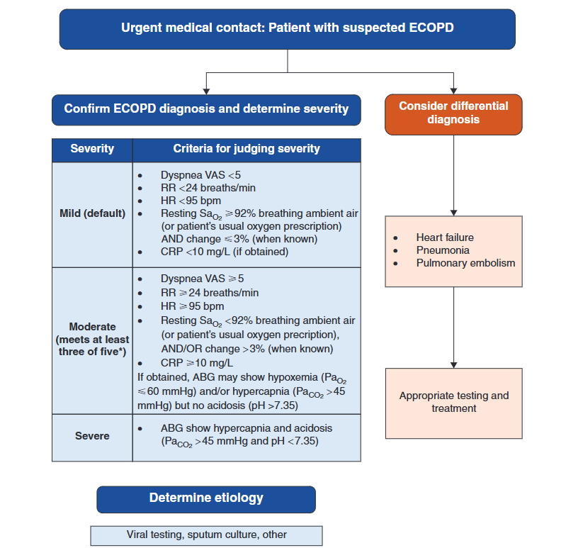
    - **Routine monitoring:**
        - <u>Respiratory status</u> - RR, respiratory efforts, wheezing, SpO2 (+/- serial ABG to assess respiratory acidosis)
        - <u>Circulatory status</u> - BP/P, rhythm, volume status, JVP, parasternal haeve
    - **Short acting bronchodilators as reliever therapy:**
        - <u>Route of administration</u> - nebulised over MDI technique due to difficulty to co-ordinate inhalation in setitng of exacerbation
        - <u>Selection:</u>
            - SAMA-SABA combination therapy - ipratropium and albutarol
            - SABA alone - albutarol
    - **O2 therapy** - low-flow O2 to avoid risking worsening hypercapnia (consider early NIV):
        - <u>Target SpO2</u> - 88-92% (i.e. PaO2 60-70 mmHg)
    - **Systemic glucocorticoids:**
        - <u>RoA</u> - IV or oral
        - <u>Dosing</u> - no known optimal dose, where duration by range from 5-14d:
            - Non-critically ill patients - prednisolone 40 mg od for 5d
            - Critically ill patients - methylprednisolone 60 mg bid w/ tapering after 48-72h
        - <u>Clinical efficacy</u> - meta-analysis shows reduced risk of Tx failure (OR 0.48) and reduced risk of relapse at 30d (0.78)
    - **IV ABx** - on clinical suspicion of pneumonia:
        - <u>Indications</u>:
            - Clinical suspicion of pneumonia (e.g. fever, suggestive P/E, suggestive CXR)
            - Empircally characterised by increase in \>= 2/3 of the cardinal Sx
        - <u>Selection</u>:
            - Augmentin + macrolide
            - 3rd-generation Cephalosporin
            - Tasozin (if high-risk of Pseudomonal infections)
