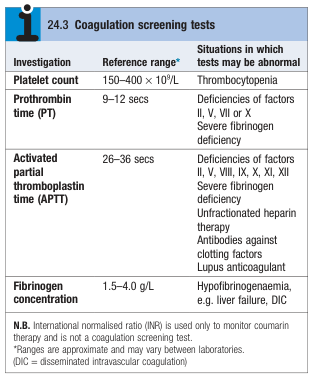

# Clotting Profiles

- **Ix for patients w/ bleeding disorders:**
    - <u>PLT</u> - detection of thrombocytopenia
    - <u>Clotting profile</u> - PT, aPTT
    - <u>Fibrinogen concentration</u>

  
  
- **Clotting profiles** - measure of the time to clot formation <u>in vitro</u> in a plasma sample after the clotting process is <u>initiated by calcium and activators</u>:
    - **Prothrombin time** (PT) - measures extrinsic pathway:
        - <u>Activator</u> - tissue factor
        - <u>Situations where PT may be abnormal</u>:
            - Deficiencies of factor II, V, VII or X
            - Severe fibrinogen deficiency
    - **Activated partial thromboplastin time** (aPTT) - measures intrinsic pathway:
        - <u>Activator</u> - kaolin (PTTK)
        - <u>Situations where aPTT may be abnormal</u>:
            - Deficiencies of factor II, V, VII, IX, X, XI, XII (including von Willebrand disease)
            - Severe fibrinogen deficiency
            - Unfractionated heparin therapy
            - Antibodies against factor VII
            - Lupus anticoagulant
- **1:1 mixing test** - differentiation between coagulation factor deficiency or presence of inhibitor of coagulation:
    - <u>Procedure</u> - mixing normal plasma and plasma sample in 1:1 ratio
    - <u>Interpretation</u>:
        - Prolonged time corrects - indicative of coagulation factor deficiency
        - Prolonged time does not correct - indicative of inhibitor of coagulation factor (lupus anticoagulant or acquired haemophilia A)
