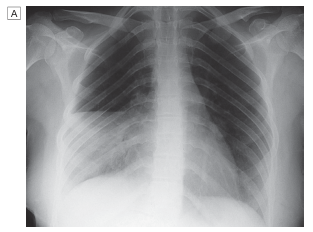
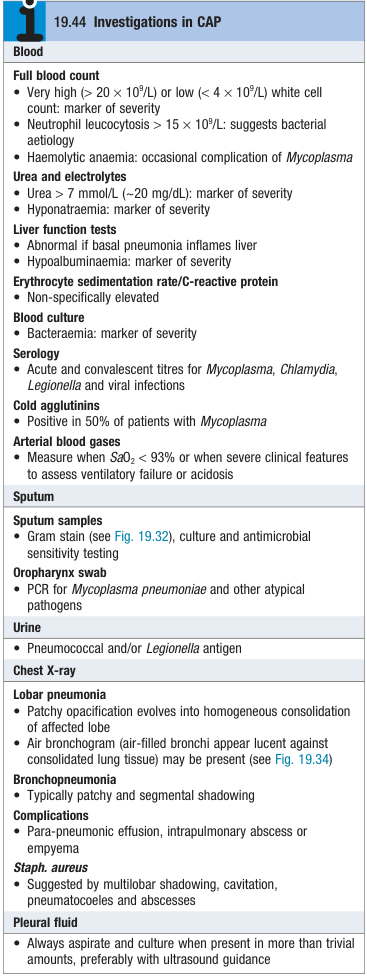
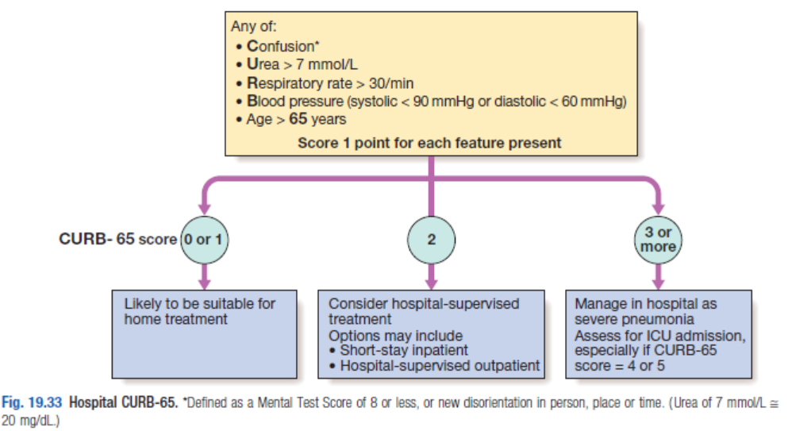
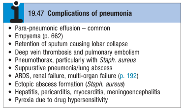

# Community-Acquired Pneumonia

- **Definition** - clinical syndrome that presents w/ pneumonia-like picture that is suspected to be acquired in the community, pointing towards certain etiological agents
- **Epidemiology:**
    - <u>Incidence</u> - 5-12% of LRTIs
    - <u>Age</u> - affects all age groups, extremely common cause at extremes of age:
    - Children - first in mortality of children worldwide
    - Elderly - propensity to ease passing of the frail and old ("Old man's friend)
- **Etiological agents of CAP:**
    - **Typical pneumonia:**
    - <u>G+ organisms</u> - S. pneumoniae, S. aureus (MSSA, or CA-MRSA)
    - <u>G- organisms</u> (aerobes) - H. influenzae, K. pneumoniae, **Pseudomonas aeruginosa** (esp. if bronchiectasis patients)
    - **Atypical pneumonia:**
    - Legionella pneumophilia
    - Mycoplasma pneumoniae
    - Chlamydia pneumoniae
    - Chlamydia psitacci
- **Clinical features of CAP** - acute onset of S/S that is compatible w/ infective cause and +ve TOCC Hx:
    - **Non-specific systemic manifestations** - malaise, fever, chills or rigors (may be the only manifestation in atypical pneumonia)
    - **Compatible respiratory Sx:**
    - <u>Cough and sputum</u> - initially a dry, painful cough, and subsequently becomes productive and purulent
    - <u>Dyspnoea</u> - sudden onset of SOB as a result of pulmonary congestion, pleural effusion etc.
    - <u>Chest pains</u> - pleuritic chest pains (sharp, lateralised, well-localised, exacerbated on inspiration and coughing) occurs if involvement of the visceral pleura
    - **Other manifestations:**
    - <u>Confusion</u> - not an uncommon presentation, esp. in the elderly, which may be attributed to a systemic illness, but also **cerebral oedema** due to SIADH
    - <u>RUQ pain</u> - lower lobe pneumonia results in inflammation of the liver
- **Signs of CAP:**
    - **Primary assessment:**
    - <u>Airway</u> - patent, consider intubation if deteriorating GCS
    - <u>Breathing</u> - reduced SpO2, tachypnoea, respiratory distress
    - <u>Circulation</u> - tachycardia +/- hypotension (poor prognostic factor)
    - <u>Disability</u> - assessment of GCS (altered mental status or delirium)
    - **General examination:**
    - <u>Temperature</u> - pyrexic
    - <u>Sputum mug</u> - mucopurulent sputum in general, rusty sputum in pneumococcal infection (consider alternative DDx if presentation w/ haemoptysis)
    - **Chest examination** - characteristic consolidation pattern with 1) dullness on percussion, 2) bronchial breath sounds +/- coarse crackles, 3) increased vocal resonance
    - <u>Inspection</u> - reduced chest expansion
    - <u>Palpation</u> - reduced chest expansion (no mediastinal shift)
    - <u>Percussion</u> - focal dullness may be detected
    - <u>Auscultation</u>:
      - Reduced breath sounds and bronchial breath sounds
      - Coarse crackles
      - Increased vocal resonance
    - **Systems review** - e.g. CVS to identify comorbidities
- **Approach to workup of suspected CAP:**
    - <u>Septic workup</u> - confirm clinical and radiological Dx of CAP and enables retrospective identification of organism for tailoring ABx therapy
    - <u>Assessment of severity</u> - severity of disease assessed on clinical, radiological and laboratory grounds
    - <u>Initiate empirical ABx</u> - IV empirical ABx after blood cultures to cover most likely typical and atypical organisms
    - <u>Other supportive Mx</u> - O2, fluid replacement, analgesics, Mx of comorbidities or complications
- **Ix** - septic workup:
    - **Microbiology** - blood culture, sputum culture, nasopharyngeal swab for respiratory virus testing +/- urine Ag test for Legionella or Pneumococcal infection
    - **CXR** - characteristic findings include:
    - Consolidations in lobar pneumonia
    - Patchy infiltrates in bronchopneumonia
    - 
    
    - **Routine bloods** - CBC, LRFT, ESR/CRP, RBG, LDH, ABG:
    - **CBC:**
      - <u>Hb</u> - presence of haemolytic anaemia may suggest Mycoplasma pneumoniae (consider performing DAT for cold agglutinins)
      - <u>WBC</u> - severe neutrophilia or leukopenia suggestive of infections and are poor prognostic markers
    - **LFT:**
      - <u>Alb</u> - hypoalbuminaemia as acute-phase response
      - <u>ALT/AST</u> - elevated transaminase may reflect liver irritation in lower-lobe pneumonia
    - **RFT:**
      - <u>Urea</u> - increased urea (\>= 7 mmol/L) as a poor-prognostic marker (N.B. CURB-65)
      - <u>Na</u> - hypoNa may be due to SIADH
      - <u>SCr</u> - baseline renal function for renal dosing of ABx
    - **ESR/CRP** - non-specifically elevated
    - **ABG** - if altered mental status suggestive of respiratory failure
    - **Additional Ix:**
    - <u>Cardiac evaluation</u> - CK, TnT, NT-proBNP, ECG +/- echocardiogram if unable to r/o MI/ HF or if cardiac complications occur
    - <u>Diagnostic thoracocentesis</u> - if any more than trivial amounts for biochemical and microbiological studies
    - <u>Atypical pneumonia serology</u> - typically for retrospective diagnosis
    - 
    
- **Assessment of severity** - CURB-65:
    - 
    
- **Complications of CAP:**
    - 
    
    - <u>Local complications</u> - para-pneumonic effusions, empyema, retention of sputum causing lobar collapse, suppurative pneumonia, pneumothorax
    - <u>Systemic complications</u>:
      - AF +/- HF
      - ARDS
      - AKI
      - Multiorgan failure
      - Ectopic abscess formation (due to S. aureus bacteraemia)
- **Mx:**
    - **Principles of Mx:**
    - <u>Empirical IV ABx</u> - must target common typical and atypical causes of CAP
    - <u>General measures</u> - O2 therapy, fluid balances, analgesics, chest therapies, nutritional support
    - **O2 therapy:**
    - <u>Indications</u> - to all patients w/ tachypnoea, hypoxaemia, hypotension or acidosis
    - <u>Flow</u> - high-flow O2 (35%) given to all patients w/o risk of worsening hypercapnia as in COPD patients
    - <u>Target</u> - SpO2 \> 92% (i.e. PaO2 ~ 60 mmHg)
    - <u>Considerations if remain hypoxic after high-flow oxygen</u>:
      - CPAP
      - NIV/ MV
    - **Fluid balance:**
    - <u>Fluid replacement</u> - typically oral for those who can tolerate fluid intake (IV if severe illness, older patients); fluid restriction may be required if SIADH present
    - **Analgesics:**
    - <u>Rationale</u> - relieve pleural pain for normal breathing and efficient coughing
    - <u>Selection</u> - paracetamol, NSAIDs
    - **Chest therapy** - for expectoration of sputum in those w/ suppress cough due to pleural pain
    - **ABx therapy** - empirical ABx therapy to cover typical and atypical coverage, w/ subsequently narrowing of agent based on microbial findings:
    - <u>Timing</u> - within 4h for best outcome (avoid Tx w/o Dx as use may result in C diff colitis)
    - <u>Duration</u> - 7-10d
    - <u>Empirical regimen</u>:
      - Augmentin + macrolide (erythromycin/ clarithromycin) or doxycycline
      - Consider tasozin if severe pneumonia
