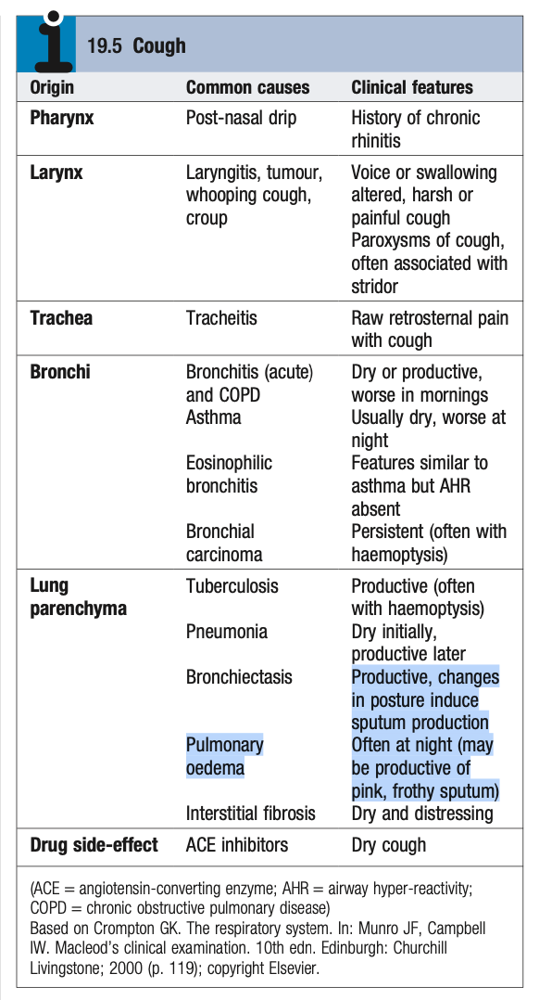
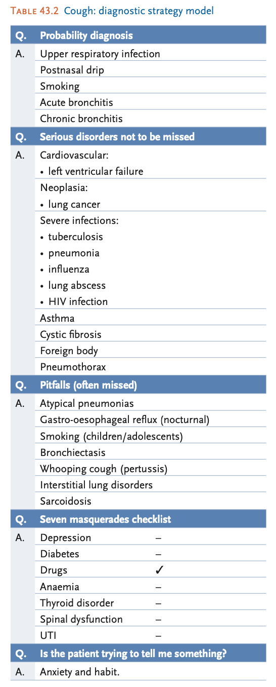
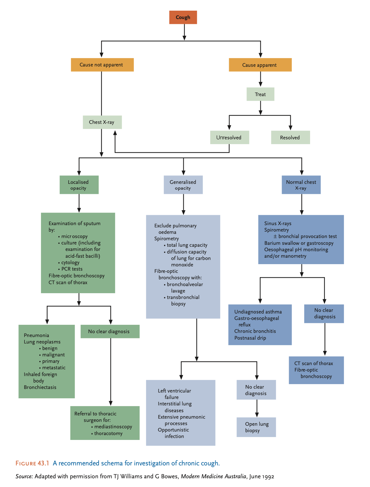

# Cough

- **Definition** - sudden expulsion of air from the lungs
- **Principles related to approach to cough** - key facts to keep in mind:
    - <u>Cough can have a psychogenic basis</u> - persistent chronic cough may produce anxiety of sinister organic disease
    - <u>Cough reflects a lower respiratory tract problem</u> - reflects by pathological process occuring within the lower respiratory tract (distal to larynx), and is the most common manifestation of lower respiratory tract infection
    - <u>Most common cause of chronic cough is post-nasal drip from URTI or sinusitis</u> - postnasal drip causes chronic cough is characteristically nocturnal caused by secretions tracking down to the larynx and trachea during sleep
    - <u>Postviral cough have a physiological basis</u> - postviral cough may persist for many weeks following acute URTI as a result of residual bronchial inflammation and increased airway responsiveness
    - <u>Haemoptysis is a malignant symptom until proven othewise</u> - the 5 most commonest cause of haemoptysis are 1) URTI (24%), 2) Unknown (22%), 3) Acute or chronic bronchitis (17%), 4) Bronchiectasis (13%), 5) TB (10%), and 6) Bronchogenic Carcinoma (4%)
- **Etiology of cough** - common diagnosis by anatomical classification:
    - <u>Pharynx</u> - acute pharyngitis, post-nasal drip, GERD
    - <u>Larynx</u> - laryngitis, tumour, pertussis, croup
    - <u>Trachea</u> - tracheitis
    - <u>Bronchi</u> - acute bronchitis, chronic bronchitis, asthma, eosinophilic bronchitis, bronchial carcinoma
    - <u>Lung parenchyma</u> - TB, pneumonia, bronchiectasis, pulmonary oedema, interstitial fibrosis
    - <u>Drug side-effect</u> - ACEi
    - <u>Psychogenic</u> - psychogenic cough
	  
	  
- **DDx of cough** - different etiology dependent on character of cough:
    - **Non-productive cough** (dry cough):
        - <u>Infectious cause</u> - e.g. sinusitis and post-nasal drip, URTI, LRTI (viral, mycopalasma, initial phase of CAP), pertussis, **TB**
        - <u>Drug-induced cough</u> - ACEi, beta-blockers, inhaled steroids, sulfasalazine, bleomycin
        - <u>Inhaled irritants</u> - e.g. smoke, dust, fumes
        - <u>Interstitial lung disease</u> - e.g. idiopathic pulmonary fibrosis, pneumoconiosis, extrinsic allergic alveolitis, fibrosing alveolitis
        - <u>Bronchial neoplasms</u> - bronchogenic carcinoma
        - <u>Pleurisy</u> - e.g. pleural effusion, pneumothorax, pulmonary embolism
        - <u>Chronic acid reflux</u> - gastroesophageal reflux disease and hiatal hernia
        - <u>Pulmonary oedema</u> - congestive heart failure (esp. nocturnal cough and postural)
    - **Productive cough** (cough w/ sputum):
        - <u>Infective cause</u> - Pneumonia, tuberculosis (when cavitating), lung abscess
        - <u>Obstructive lung disease</u> - chronic bronchitis and COPD, asthma, bronchiectasis
        - <u>Bronchial neoplasm</u> - bronchogenic carcinoma
- **Murtagh's safe diagnostic model for cough:** 
	- 
	
    - **Probability diagnosis** - acute respiratory infections whether URTI, post-nasal drip or bronchitis
    - **Life-threatening conditions:**
        - <u>Bronchogenic carcinoma</u> - typically manifests as chronic, worsening cough, or a change in quality in a smoker's cough, where classical teaching of 'bovine cough' (i.e. cough w/o power) only occurs when there is **vocal cord paralysis** caused by CA infiltrating LRLN (do not attribute cough in smoker to chronic bronchitis)
        - <u>Severe infections</u> - pneumonia, TB (<u>esp. in the elderly and infirmed</u>), influenza, lung abscess, PJP in HIV patient
        - <u>Foreign body inhalation</u> - must be considered in children
        - <u>Congestive heart failure</u> - associated chronic exertional dyspnoea with associated orthopnoea, PND, and nocturnal cough
        - <u>Asthma</u> - nocturnal cough with or without wheezing
    - **Pitfalls** (often missed):
        - <u>Bronchogenic carcinoma</u> - attributing cough to smoker's cough without considering diagnosis of cancer
        - <u>TB</u> - esp. in certain populations, e.g. elderly, infirmed, immunosuppression
        - <u>Pertussis</u> - often considered a childhood infection when in fact there is a rising incidence in adults
        - <u>Acid reflux</u> - chronic acid reflux from GERD or hiatal hernia can be a cause of nocturnal cough
    - **Masquerades** - drugs applicable:
        - <u>Drug-induced cough</u> - classically ACEi causing intractable cough, but also described in BBs, inhaled steroids, and sulfasalazine
        - <u>Drug-induced ILD</u> - esp. bleomycin
        - <u>Drugs causing diffuse alveolitis and DAD</u> (SLE-like syndrome) - certain drugs known to produce SLE-like syndrome, sometimes complicated by pulmonary infiltrates and fibrosis
- **Salient points of Hx:**
    - **HPI** - may provide some diagnostic clues, but often less relevant:
        - <u>Onset</u> - acute vs chronic cough
        - <u>Progression</u> - any change in quality or severity of the cough
        - <u>Quality</u> - how would you describe the cough:
            - **Presence of sputum** - differentiation between productive and non-productive cough
            - **Presence of blood** - haemoptysis narrows down the DDx
            - **Pain** - suggestive of tracheitis, CHF
            - **Brassy** - tracheitis and bronchitis
            - **Barking or croupy** - laryngeal disorders
            - **Bovine or weak cough** - vocal cord paralysis due to left laryngeal recurrent nerve infiltration
            - **Amount** - teaspoonful vs eggcupful or more (suggesetive of bronchiectasis)
        - <u>Timing</u> - nocturnal vs waking:
            - **Nocturnal cough** - post-nasal drip, asthma, CHF, whooping cough
            - **Waking cough** - bronchiectasis, GERD
        - <u>Provacation</u> - relationship w/ meals and change in posture:
            - **Changing posture** - drainage of purulent sputum in bronchiectasis and rarely lung abscess
            - **Relationship with meals** - GERD, hiatal hernia, Zenker's diverticulum, tracheo-esophageal fistula
    - **Associated Sx** - provides the most diagnostic value:
        - <u>Sputum</u> - reflects mucus hypersecretion suggestive of infectious process, cigarette smoking, chronic bronchitis
        - <u>Haemoptysis</u> - see above
        - <u>Wheezing</u> - suggestive of obstructive process like asthma
        - <u>Dyspnoea</u> - asthma, COPD, CHF, ILD etc.
        - <u>Chest discomfort</u> - asthma attacks, pleurisy but may reflect myocardial ischaemia if exertional
        - <u>LL swelling</u> - CHF if bilateral, or DVT if unilateral
        - <u>Heartburn</u> - GERD or hiatal hernia
        - <u>Fever, chills, rigors</u> - severe infection
        - <u>Weight loss</u> - malignancy
    - **PMH:**
        - <u>Previous episodes of wheezing</u> - points towards asthma
        - <u>Hx of atopy</u> - look for Hx of allergic rhinitis (Hay fever), eczema or asthma in patient or in family
        - <u>Hx of recurrent chest infections</u> - esp. recurrent infections in childhood suggestive of ciliary disorders (primary ciliary dyskinesia, cystic fibrosis), bronchiectasis, or CVID etc.
        - <u>Hx of CTD</u> - causes ILD (esp. Sjogren's)
        - <u>Prior operations or immobilisation</u> - screen for DVT and PE
        - <u>Hx of cardiovascular disease</u> - progression into CHF
    - **Drug Hx** - look for NSAID use or other agents causing lung fibrosis
    - **TOCC:**
        - <u>Recent travel</u> - note endemic regions esp for TB
        - <u>Occupation</u> - any occupational exposure to certain infections e.g. TB
        - <u>Contact</u> - contact w/ people w/ persistent cough, recent exposure to birds (e.g. birds nesting outside bedroom, bird keepers)
        - <u>Clusters</u> - family Hx of TB or persistent cough
    - **SHx:**
        - <u>Occupational exposure</u> - e.g. smoke and fumes, asbestos
        - <u>Smoking</u> - risk factor of COPD and CA lung
    - **FHx** - relevant Hx of TB, asthma etc.
- **P/E:**
    - <u>General examination</u> - enlarged cervical or axillary LN, Horner syndrome (ptosis and constricted pupil), clubbing, inspection of sputum cup
    - <u>Auscultation of the chest</u>:
        - Fine crackles - pulmonary oedema, ILD, early lobar pneumonia
        - Coarse crackles - resolving pneumonia, bronchiectasis, TB etc.
    - <u>Cardiovascular examination</u>
- **Ix** - reserved for selected patients:
    - **Routine bloods** - CBC, LRFT, Inflammatory markers
    - **Microbiology** - blood cultures, sputum cytology and cultures
    - **Imaging** - CXR, HRCT, CTPA, VP scan etc.
    - **Lung function test**
    - **Tuberculin skin test**
    - **Bronchoscopy and lung Bx** - best at time of haemoptysis
	  
	  
- **Causes of chronic cough** - challenging especially when P/E, CXR and lung function studies are normal:
    - <u>Asthma</u> - cough-variant asthma (where cough is principal clinical manifestation) especially if associated with variability and associated with known allergen
    - <u>Post-nasal drip</u> - secondary to nasal or sinus disease
    - <u>GERD with aspiration</u> - especially with known heartburn symptoms, and symptoms are typically nocturnal (diagnosis by ambulatory esophageal pH monitoring)
    - <u>ACEi</u> - 10-15% patients (particularly women) who just started on ACEi develop chronic dry cough
    - <u>Tuberculosis</u> - always a DDx in chronic cough associated with low-grade fever, night sweats etc.
    - <u>Pertussis</u> - suspected in protracted cough with history of close contact with children
    - <u>Bronchial carcinoma</u> - usually presents with abnormal CXR on presentation, but CT or bronchoscopy is advisable in most adults w/ risk factors (esp. smokers) which can reveal endobronchial tumour
    - <u>Interstitial lung disease</u> - dry cough may be the presenting feature prior to the relentless progressive exertional dyspnoea in a small percentage of patients
- **Ix for chronic cough:**
    - <u>CXR</u> - if chronic cough is otherwise unexplained
    - <u>High resolution CT thorax</u> - offered to high risk groups (adult smokers) even if CXR is -ve for CA lung
    - <u>Bronchoscopy</u>
