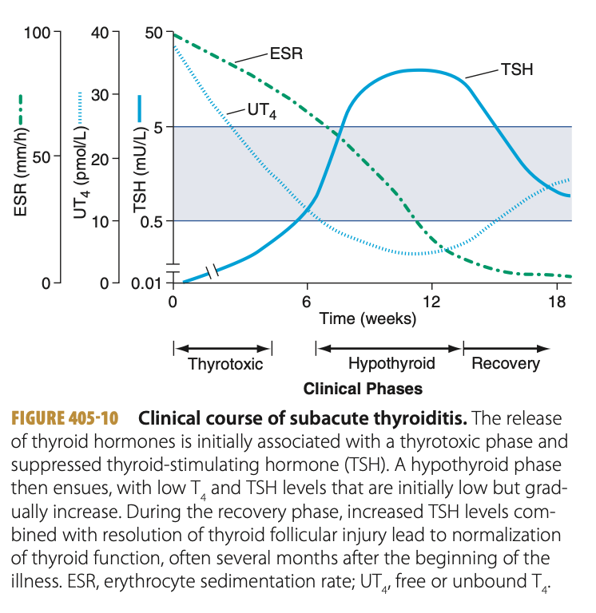
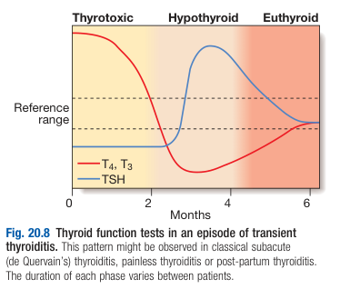

# De Quervain's Thyroiditis

- **Definition** - also referred as <u>subacute thyroiditis</u>, <u>granulomatous thyroiditis</u>, <u>viral thyroiditis</u>, or <u>painful thyroiditis</u>, characterised by viral infections and chronic granulomatous inflammation of the thyroid gland
- **Epidemiology:**
    - <u>Incidence</u> - often overlooked as Sx can mimic pharyngitis
    - <u>Demographic</u>:
        - Age - peak incidence at 30-50y
        - Sex - female preponderance (F:M = 3:1)
- **Pathophysiology of de Quervain's thyroiditis** - viral infection w/ patchy inflammatory infiltration leading to <u>disruption of thyroid follicles</u>, progresses to granuloma and subsequent fibrosis:
    - **Initial precipitating event** - classically triggered by viral infection:
        - <u>Viral infection</u> - classical painful form involves prior infection by Coxackie, mumps or adenovirus
        - <u>Drugs</u> - interferon-alpha, lithium
    - **Inflammation of the thyroid gland** - results in the sequelae of events:
        - <u>Release of colloid and stored T3/4</u> - attributes to thyrotoxicosis for 4-6 weeks until pre-formed colloid is depleted
        - <u>Damage to follicular cells and impaired T3/4 synthesis</u> - results in transient hypothyroidism of variable severity for 4-5 mo

    
    
    - **Regeneration of thyroid follicular cells** - follicular cells recover and patient becomes euthyroid (permanent hypothyroidism in 15%)
- **Clinical features of de Quervain's thyroiditis:**
    - **Pain** - pain and tenderness of the thyroid, but may be painless in patient w/ autoimmune disease:
        - <u>Site</u> - over the thyroid gland
        - <u>Quality</u> - inflammatory-type pain
        - <u>Radiation</u> - to the angle of the mandible to the ear
        - <u>Exacerbating factors</u> - worse on swallowing, coughiing and movement
    - **Non-specific systemic upset** - common
    - **Systemic upset** - common
    - **Altered thyroid function** - always manifests biochemically:
        - <u>Hyperthyroidism</u> - some patients present in the initial hyperthyroid state
        - <u>Hypothyroidism</u> - some patients present in the subsequent hypothyroid state
- **Signs:**
    - <u>General examination</u> - pyrexia, systemically unwell
    - <u>Neck examination</u>:
        - Erythema over thyroid gland on inspection
        - Tenderness on palpation
        - Minimal goitre
    - <u>Assessment of thyroid status</u> - variable dependent on stage of presentation
- **Ix:**
    - **TFT** - progresses from hyperthyroidism (high T4, low TSH) to hypothryoidism (low T4, high TSH), to euthyroid: 
    
    - **Anti-thyroid Ab** - present at low titres (high titres reflect autoimmune pathology and increased risk of lifelong hypothyroidism requiring Tx)
    - **ESR** - non-specifically elevated
    - **Radioactive iodine scan** - low uptake of radiodine
    - **FNA Bx** - if doubtful to r/o bleeding into a cyst or neoplasm
- **Mx:**
    - **Principles of Mx:**
        - <u>Suppression of inflammation</u> - typically responds to high dose ASA, NSAIDs, and ocassionally glucocorticoids
        - <u>Routine monitoring</u> - routine TFT every 2-4 weeks
        - <u>Mx of Sx of thyrotoxicosis or hypothyroidism</u>:
            - Thyrotoxicosis - Sx ameliorated by use of beta-blockers
            - Levothyroxine - at low doses to abort Sx related to hypothyroidism
    - **Suppression of inflammation** - approach includes:
        - <u>High-dose aspirin</u> - 600 mg q4-6h
        - <u>NSAIDs</u>
        - <u>Glucocorticoids</u> - 40-60 mg tapered over 6-8 weeks
    - **Levothyroxine replacement:**
        - <u>Indication</u> - if prolonged hypothyroidism
        - <u>Dosing</u> - low doses (50-100 mcg/d) to allow for TSH-mediated recovery
