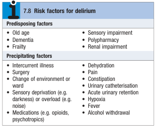
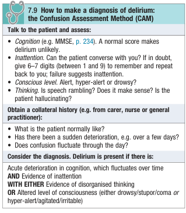
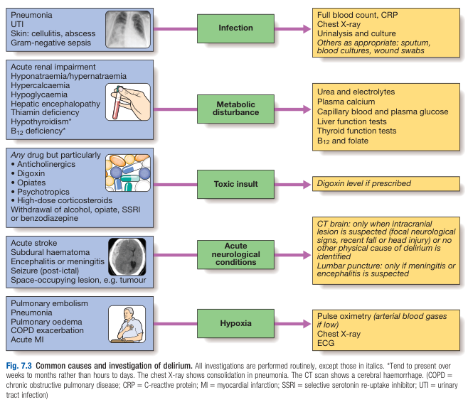

# Delirium

- **Definition** - syndrome of transient, reversible cognitive dysfunction, commonly affecting older hospital inpatients
- **Epidemiology** - up to 30% of older hospital inpatients, either at <u>admission</u> or <u>during hospital stay</u>
- **Pathophysiology of delirium** - unclear, but proposed to be:
    - <u>Stress response</u> - increased corticol release during acute illness
    - <u>Increased Sn of cholinergic neurotransmission</u> - in response to toxic insult
- **Risk factors for delirium** - predisposing and precipitating factors: 

- **DDx of delirium:**
    - <u>Infection</u> - e.g. pneumonia, UTI, cellulitis, abscesses, G- sepsis
    - <u>Metabolic disturbances</u>:
        - Hypontraemia/ Hypernatraemia
        - Hypercalcaemia
        - Hypoglycaemia
        - Uraemia
        - Hepatic encaphalopathy
        - B12 deficiency
        - Hypothyroidism
    - <u>Drugs</u> - esp. digoxin, antidepressants, anticonvulsants, opiates, alcohol withdrawal
    - <u>Acute neurological conditions</u> - e.g. ischaemic/ haemorrhagic stroke, seizure, SOL, CNS infection
    - <u>Hypoxia</u> - e.g. silent MI, AECOPD, PE, HF
- **Approach to clinical assessment:**
    - 1\. Establish diagnosis of delirium
    - 2\. Identify reversible precipitating factors to allow optimal Tx
- **Salient points of Hx** - collateral Hx from relative or carer to distinguish delirium from dementia:
    - **HPI** - onset, duration, timing, and pre-morbid cognition to distinguish acute from chronic features:
        - What is the patient normally like?
        - Since when is the sudden deterioration detected (e.g. over a few days)?
        - Does confusion fluctuate through the day or is it progressively worse?
    - **Associated Sx** - identify Sx of physical illness:
        - <u>Sx of infections</u> - fever, dyspnoea, abdominal pain
        - <u>Sx of acute neurological condition</u> - changes in GC, head trauma, dysphagia, dyspnoia
    - **Detailed drug Hx** - ascertain whether any drugs have been recently stopped or started
    - **Alchol Hx** - alcohol withdrawal is an important DDx of delirium
- **P/E** - primary assessment and systematic review, noting for:
    - Assessment of consciousness
    - Pyrexia and signs localising to infection of the chest, skin, urine or abdomen
    - SpO2
    - Signs of alcohol withdrawal, such as tremors or sweating
    - Any focal neurological signs
- **Dx of delirium** - the Confusion Assessment Method (CAM) through brief conversation w/ patient:
    - **Components in Dx of delirium:**
        - <u>Cognition</u> - by AMT or MMSE, normal score makes delirium unlikely
        - <u>Inattention</u> - ability to converse, or to remember and repeat digits
        - <u>Conscious level</u> - alert, hyper-alert or drowsy
        - <u>Thinking</u> - any evidence of rambling speech, disorganised thinking or hallucination
    - **Dx of delirium** - presence of:
        - Acute deterioration in cognition which fluctuates over time
        - Evidence of inattention
        - Evidence of disorganised thinking or altered level of consciousness

  
  
- **Ix** - septic workup often required: 

    - **12-lead ECG** - look for MI, pulmonary embolism
    - **CXR** - identify:
        - Chest infections
        - Pulmonary oedema
        - AECOPD
        - Pulmonary embolism
    - **Routine bloods** - CBC, LRFT, Ca, RBG, TFT, CRP, B12 and folate, ABG:
        - **CBC** - leukocytosis for infections
        - **LFT** - derranged LFT raises suspicion of hepatic encephalopathy
        - **RFT:**
            - <u>SCr, Urea, eGFR</u> - consider AKI
            - <u>Na</u> - hypoNa, hyperNa
        - **Ca** - hyperCa
        - **RBG** - hypo-glycaemia or hyper-glycaemia
        - **TFT** - screen for hypothyroidism
        - **CRP** - raised CRP suggestive of occult infection or inflammatory process
        - **B12 and folate** - deficiency may result in delirium
        - **ABG** - only if SpO2 low
    - **Microbiology** - blood culture, urine microscopy and culture, +/- sputum, wound swabs, LP as appropriate
    - **CT brain** - only if raised ICP suspected (e.g. focal neurological signs, reducing GC, head injury) or if no other cause of delirium identified
- **Mx:**
    - **Principles of Mx:**
        - <u>General measures</u> - e.g. prevention of delirium, address fall risk, pressure sore prevention, hydration, nutrition and continence
        - <u>Dx and Tx of underlying cause</u> - e.g. commencement of ABx after septic workup if pyrexic
        - <u>Sedation</u> - only considered if patient is endagering themselves or others
    - **Sedatives** - not indicated for all patients as can precipitate delirium:
        - <u>Selection</u>:
            - Haloperidol 0.5 tid (increase dose if failed to respond)
            - Reducing dose benzodiazepine (only indicated for alcohol withdrawal and Lewy Body dementia)
        - <u>Route of administration</u>:
            - Oral if possible
            - IM only if absolutely necessary
- **Prognosis** - resolution may be slow and incomplete:
    - Most fail to recover to pre-morbid cognition
    - May be first presentation of dementia and is risk factor for subsequent dementia
