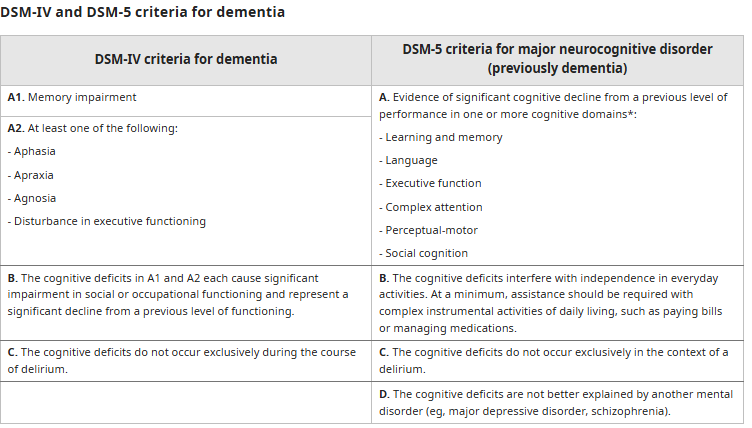
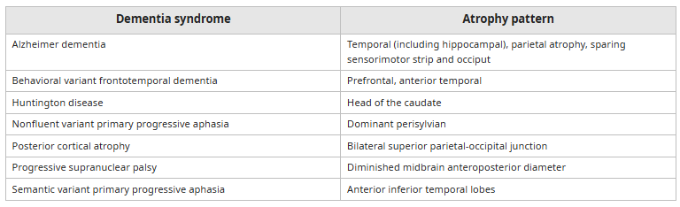
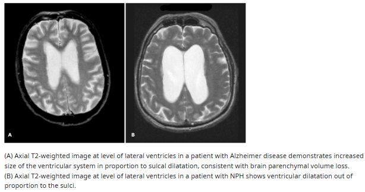

# Dementia and Cognitive Impairment

- **Definition** - an acquired global cognitive impairment, involving intellect, memory, and personality, without impairment of consciousness (Burns and Illiffe 2009), usually, but not always progressive
- **Dementia vs neurocognitive disorders** - DSM-V critieria only requires substantial decline in one single cognitive domain, rather than decline in at leaat two cognitive domains for defining neurocognitive disorders:
    - _Dementia_ - acquired disorder that is characterized by decline in cognition involving \>= 1 cognitive domains severe enough to interfere with daily function and independence
    - _Mild cognitive impairment_ - state between normal cognition and dementia where there are objective cognitive impairments in \>= 1 domain, but no decline in overall level of function
- **Domains of cognition:**
	- Learning and memory
	- Language
    - Attention
    - Perceptual-motor/ Visuospatial functions
    - Social cognition
- **DSM-5 Dx criteria for dementia** - centrality of memory dysfunction has been de-emphaisized in DSM-5 which all six cognitive domains given equal weight:
    - A. Evidence from Hx and clinical assessment that indicates significant cognitive impairment in at least one of the following congitive domains:
        - Learning and memory
        - Language
        - Executive function
        - Complex attention
        - Perceptual-motor function
        - Social cognition
    - B. The impairment must be acquired and represent a significant decline from a previous level of functioning
    - C. The cognitive deficits must interfere with independence in everyday activities
    - D. The disturbances are not occuring exclusively during the course of delirium
    - E. The disturbances are not better accounted for by another mental disorder (e.g. MDD, Schizophrenia)
	  
- **Etiology** - the most common being 1) Alzheimer's disease, and 2) Cerebrovascular dementia and Lewy Body dementia:
    - **Neurodegenerative disorders:**
        - _Common conditions_ - Alzheimer disease (AD), Lewy body dementia (LBD), Frontotemporal dementia (FTD), Parkinson disease dementia (PDD)
        - _Less common conditions_ - progressive supranuclear palsy (PSP), corticobasal degeneration (CBD), multisystem atrophy, Hungtingtons disease
    - **Non-neurodegenerative disorder** - may be resversible, progression may be slowed or halted if underlying cause is identified and adequately treated:
        - _Vascular_ - Vascular dementia
        - _Infective_ - Neurosyphillis, HIV-associated neurocognitive disorders, Creutzfeldt-Jakob disease
        - _Metabolic_ - B12 deficiency, folate deficiency, chronic alcohol use
        - _Traumatic_ - chronic subdural haematoma, chronic traumatic encephalopathy
        - _Hydrocephalus_ - normal pressure hydrocephalus
	
- **Demential syndromes** - gradual and progressive cognitive impairment from baseline, but the different causes of dementia present w/ _different pattern of cognitive impairment_ (see below):
    - _Memory difficulty_ - difficulty in retaining new information (e.g. remembering upcoming events), in terms of short-term and long-term memory
    - _Declined executive function and attention_ - e.g. difficulty in handling complex tasks, and reasoning
    - _Decline in language function_ - may manifest as word finding in conversations
    - _Perceptuo-motor and soscial dysfunction_ - dysfunction of spatial ability and orientation (e.g. getting lost in original places) and odd behaviour
- **Natural Hx of dementia syndromes:**
    - Although by definition involves a global or generalised disorder (i.e. \>=2/6 cognitive functions impaired), it often begins with focal cognitive or behavioural disturbances, with limited functional impairments
    - Hence, a diagnosis of mild cognitive impairment (ICD-10), or minor neurocognitive disorder (DSM-5) should be given
- **Clinical presentation of dementia:**
    - **Demential syndromes** - gradual and progressive cognitive impairment from baseline, but the different causes of dementia present w/ _different pattern of cognitive impairment_ (see below):
        - _Memory difficulty_ (most common) - difficulty in retaining new information (e.g. remembering upcoming events), in terms of short-term and long-term memory
        - _Declined executive function and attention_ - e.g. difficulty in handling complex tasks, and reasoning
        - _Decline in language function_ - may manifest as word finding in conversations
        - _Perceptuo-motor and soscial dysfunction_ - dysfunction of spatial ability and orientation (e.g. getting lost in original places) and odd behaviour
    - **Disturbances in behaviour, personality, and psychiatric manifestations:**
        - Behavioural manifestations often risking and at the expense of carers
        - Change in personality
        - Psychiatric manifestations such as disturbances of mood and perception
- **Clinical features of dementia** - picture much determined by 1) underlying cause, and 2) premorbid personality and functioning:
    - **Difficulties with memory** - forgetfulness is usually early and prominent, but difficult to detect in early stages:
        - _Contents of memory loss_ - usually more evident for recent, than for remote features
        - _Forms of memory loss_ - episodic memory affected more while procedural memory is generally preserved:
            - Episodic memory - forgetfulness of day-to-day events (?forgetting to turn off stove) usually apparent for trivial tasks, but may be subtle
            - Procedural memory - long-term implicit memory responsible for performing learned skills without much conscious effort, as well as general knowledge of the world at large is usually preserved initially
            - Semantic memory - memory of meaning of words, and of the object one is referring to usually occurs late, as in certain frontotemporal dementia
    - **Difficulties with attention and concentration** - common feature but non-specific
    - **Difficulties in learaning** - usually present but is a very conspicuous feature
    - **Inflexibility and poor adaptability to new or unfamiliar situations:**
        - _Organic orderliness_ - appearance of rigid and stereotyped routines
        - _Catastrophic reactions_ - sudden explosions of rage or grief **when taxed beyong restricted capabilities**
    - **Disorientation** - initially for time, but later for place and person
    - **Behavioural, affective, and psychotic features** (BPSD) - often accompanying the cognitive deficits, appear to be part of the underlying underlying biology but also a psychological response to realisation of declining cognition esp. when insight is preserved:
        - _Affective deficits_
            - Mood disturbances particularly common w/ distress, anxiety, irritability, and depression
            - Restricted affect w/ sudden emotional outbursts and mood swings occur in late stageso
        - _Psychotic features_:
            - Overvalued ideas or delusions, usually of persecutory kind gains ground easily
            - Other pscyhotic symptoms such as hallucinations may be a common and fluctuating features of dementia
        - _Behavioural features_:
            - Reactive aggression on the basis of affective and psychotic influence
            - Aimless wandering may be a behavioural change that is often seen
            - Features of catatonia such as stereotypy, mannerisms, and mutism seen in extremely late stages
- **DDx of dementia or MCI** - dementia mimics:
    - Delirium
    - Depression
- **Differentiating features between major causes of dementia:** 
	
- **Subcortical and cortical dementia** - classified based on putative neuroanatomical basis, but distinction is blurred clinically:
    - _Subcortical dementia_ - a difficult in coordination resulting in slowing in execution and speech, and emotional expression:
        - Syndrome of slowness of thought, difficulty w/ complex sequential intellectual tasks, and impoverishment of affect and personality
        - Relative preservation of learning, language, and calculation
    - _Cortical dementia_ - spectrum of dysfunctions particularly in perceptual-motor, language, and memory
	  
	  
- **Presenile and senile dementia** - cutoff of 65y, clinically significant because _most common causes differ_:
    - _Presenile dementia_ (early-onset dementia; \< 65y) - Alzheimers disease is most common, while fronto-temporal dementia, prion diseases are more common, while vascular cause is rarer
    - _Senile dementia_ (late-onset dementia; \> 65y) - once thought that vascular dementia is the most common, but Alzheimer's disease subsequently is also common
- **Approach to assessment of dementia:**
    - Early detection of dementia
    - Consider differential diagnoses of cognitive impairment, such as delirium, amnesia, mild cognitive impairment and depression
    - Assessment of severity and clinical profile
    - Assessment of its cause, and identification of potentially reversible components
    - Assessment of risk in dementia
- **Assessment of the severity and clinical profile:**
    - _Screening tests_ - applied for assessing multiple domains of cognition, behavioural symptoms, global functioning and activities of daily living, and depression: 
	    
    - _Clinical assessment of behavioural and psychiatric symptoms_:
        - Integral part of assessment as are common, poses stress to carers, and often part of risks
        - Should be repeated during the illness, as often fluctuating in nature
- **Assessment of the cause of dementia:**
    - _Initial probabilistic diagnosis by clinical profiles_ - made by experienced clinician on the basis of differing profiles of varioous dementias w/ reasonable accuracy (presumptive diagnosis of AD and VD if in the absence of compelling features): - **Presence of parkisonism** - sugestive of PDD, LBD, PSP, CBD, or MSA
        - **Presence of visual hallucinations and sleep disturbances** - early feature of LBD
        - **Behavioural abnormalities and personality changes** - suggestive of behaviourial variant of FTD
        - **Aphasia out of proportion to memory impairment** - suggestive of primary progressive aphasia in frontotemporal dementia
        - **Gait impairment and urinary incontinence preceeding memory dysfunction** - classical of NPH
        - **Rapidly progressive dementia** - consider CJD
    - _Ix_:
        - biochemical, radiological, and genetic investigations modestly improve diagnostic dementia
        - Main role is for diagnosis of 1) **rarer**, and 2) **reversible causes**
        - Evolving biomarkers such as **serum beta-amyloids**, **CSF proteins**, and **PET imaging** utilised in differential diagnosis of dementia
	    
- **Assessment of risk in dementia:**
    - _Major risks in dementia_:
        - Self-neglect (esp. in poor physical health)
        - Poor judgement, including wandering
        - Abuse
        - Violence (due to agitation or disinhibited behaviour)
    - _Approach to assessment_ - liase w/ OT:
        - Assessment of functional ability including ADLs and IADLs
        - Specific considerations including driving (subjected to annual review)
- **Presymptomatic diagnosis and biomarkers** - i.e. _at-risk for Alzheimers disease_, may be detected premorbidly, long before overt symptoms of any kind (including MCI) are present (Jack et al 2013):
    - Olfactory deficit as a simple and valuable biomarker (Devenand et al 2015)
    - CSF biomarkers (e.g. amyloid A-beta-1-42, tau)
    - PET imaging biomarkers (e.g. amyloid or FDG imaging)
    - Neuroimaging (CT/ MRI for hippocampal atrophy)	  
	  
- **Salient points of Hx** - derived from an informant:
    - **HPI** - onset, progression, brief assessment of different domains of cognition, establishment of baseline:
        - _Onset_ - oftain uncertain as osnset is insiduous (note when informant first notice memory loss)
        - _Progression_ - ask infornant to detail progression of cognition/ memory loss since it was first noticed
        - _Assessment of different cognitive domains_ - brief, formal assessment when performing cognitive testing
        - _Daily functions_ - e.g. managing finances, driving
        - _Baseline_ - through Hx of patients daily activity, and from work and education history
	- **Assessment of cognitive Sx:**
		- _Memory_ (最近記性點) - patient's description w/ memory loss, particularly 1) **conversations**, 2) **events**, and 3) **affairs**:
			- Subjective cognitive impairment likely if person complains of memory loss but capable of providing considerable details regarding incidents of forgetfulness
			- MCI or dementia likely if person is reminded by forgetfulness and cannot recall instances where memory loss is forgetful
			- Difficulties w/ episodic memory always results in loss of **short-term memory preceeding long-term memory**
		- _Lanaguage_ (講野方面有無啲唔同) - characterise 1) **naming**, 2) **circumlocutions**, 3) **comprehension**, and **fluency**:
			- _Naming_ (諗好耐先知諗到講; ) - difficulties w/ word finding and experiences of circumlocutious descriptions
			- _Comprehension_ - difficulties for patient to comprehend carer (同佢傾計佢明唔明) or vice cersa (語無倫次)
			- _Fluency_ - changes in volume, tone, and amounts (**poverty of speech**; 多野講左定係少野講), and presence of **grammatical/ syntatical errors**
		- _Complex attention_ (好容易分心，集中唔到) - N.B. comparison w/ activities known capable of doing (e.g. sitting still and reading newspaper, watching TV, playing mahjong)
		- _Visuospatial skills_ - characterise 1) **dressing apraxia**, and 2) **route-finding impairments**
		- _Executive function_ - characterised planning in complex tasks (N.B. comparison w/ activities known capable of doing prior)
		- ![[Pasted image 20260525154123.png]]
	- **Daily functioning and assessment of baseline** - baseline assessed based on 1) education level, and 2) informant perceived normal daily functioning:
		- _I-ADL_ - cooking, grocery shopping, travelling alone, use of telephone, handling finances (banking/ paying bills)
		- _Basic ADL_ (起居飲食; 照顧自己) - any need for **prompting**:
			- Bathing and showering
			- Dressing
			- Toileting
			- Continence
			- Eating/ feeding
			- Transferring and mobility
    - **Associated Sx** - focal neurological Sx to determine DDx:
        - _Tremors_ - suggestive of parkinsonism if unilateral fine rest tremors
        - _Difficulty in walking_ - gait disturbances reflective of frontal lesion or is a classical feature of NPH
        - _Poor balance and falls_ - suggestive of a extrapyramidal disorder
        - _Sleep disturbances_ - abnormal REM sleep suggestive of LBD; insomia suggestive of depression
        - _Visual hallucinations or loss of vision_ - ?lewy body dementia
        - _Urinary incontinence_ - mesial frontal dysfunction or NPH
        - _Personality and behavioural changes_ - suggestive of frontal lobe dysfunction, particularly mesial frontal degeneration causes patient to become increasingly withdrawn, unresponsive and mute
    - **PMH** - note medical and psychiatric Hx:
	    - _Vascular risk factors_ - HTN, DM, HL, Hx of cardiovascular diseases
	    - _Parkison's disease_ - known Hx of Parkison's disease or classical Sx (e.g. resting tremor, bradykinesia)
	    - _Thyroid disorders_ - Hx of hyper- or hypothyroidism
	    - _Head injuries_ - Hx of previous head injuries for chronic subdural haematoma or chronic traumatic encephalopathy
	    - _Sexually transmitted disease_ - for HIV-associated dementia or neurosyphilis
    - **Drug Hx** - detailed to identify drugs that can impair cognition:
        - Analgesics (esp. opioids)
        - Anticholinergic
        - Psychotrophic agents
        - Sedative-hypnotics
    - **Social Hx** - particularly excessive alcohol use
    - **FHx** - dementia and AD
    - **Assessment of carer stress:**
	    - Identify main carer, and other informal caregivers and the care they provide
	    - Assess for carer stress and coping strategies
	    - Identify physical, psycho-social problems experienced by the carers
- **P/E:**
	- **General examination:**
		- _Vitals_ - BP/P
		- _Thyroid status_ - features of hyper- and hypothyroidism
		- _Pallor and glossitis_ - suggestive of B12 deficiency
	- **Neurological examination:**
		- _Features of parkisonism_ - e.g. masked facies, resting tremor, lead-pipe/ cogwheel rigidity, bradykinesia
		- _Assessment of gait_:
			- Extrapyramidal gait (shuffling/ festinating gait) - parkinson's disease
			- Hemiplegic gait (focal neurological S/S) - Hx of stroke
			- Apraxic gait - diffuse frontal lobe disease, normal pressure hydrocephalus
- **Cognitive testing** - varying levels of rigor, but requires correlation with the severity of complaint:
    - _Screening tools_ - Mini-Mental State Examination (MMSE), Montreal Cognitive Assessment (MOCA), Abbreviated Mental Test (AMT), Clock Drawing Test (CDT)
    - _Detailed mental status assessment_ - exended mental state examination (incorporation of mood and thought content as they have strong impact on cognitive function)
    - _Neuropsychiatric assessment_ - additional psychometric batteries required only for selected patients
    - ![[Pasted image 20260525162315.png]]
- **Ix:**
    - **Routine bloods** - CBC, LRFT, Ca, FBG, lipid profile, B12, folate, TFT, VDRL:
	    - _FBG, lipid profile_ - atherosclerotic disease risk
        - _CBC, B12, folate_ - r/o hemantic deficiency as a cause of reversible dementia
        - _TFT_ - screen for hypothyroidism
        - _VDRL_ - screen for neurosyphillis
    - **Neuroimaging** - required in some patients to r/o non-neurodegenerative causes:
        - _Indications_ - routine use is controversial, but recommeded by AAN as may pick up some patients w/ treatable causes (e.g. NPH, subdural haematoma):
            - Acute onset cognitive impairment or rapid neurological deterioration
            - Presence of focal neurological S/S on hx or P/E suggestive of subdural haematoma, stroke or other SOL
        - _Preferred modality_ - MRI or CT:
            - NCCT - if uncooperative patient or MRI contraindicated (e.g. pacemaker)
            - MRI - usually preferred as more Sn and less ionizing radiation
        - _Common findings on neuroimaging_:
            - **Cerebral atrophy** - focal or generalised widening of sulci, narrowing of gyri with thinning of grey matter and dimished white matter volume often seen in neurodegenerative dementia but also in normal aging 
	            
            - **Ventriculomegaly** - ventricular enlargement due to neurodegeneration (proportional to sulci dilatation), but may laso be a/w NPH 
	            
            - **Ischaemic cerebrovascular disease** - neuroimaging findings are required for diagnosis of vascular dementia (e.g. NINDS-AIREN criteria)
            - **Microhaemorrhages** - due to vascular anomalies like cerebral amyloid angiopathy (in AD) or hypertensive microangiopathy
- **Mx:**
	- **Principles of Mx:**
		- ![[Pasted image 20260525163512.png]]
		- _Reassurance and education_ - educate on reversible and non-reversible etiology and likely natural Hx of MCI/ dementia
		- _Advise_ - aimed at dementia prevention, and Mx of comorbidities:
			- **Advise for patients** - Lifestyle modifications including memory aids, structured lifestyle, diet, exercise, social interactions (+/- health supplements)
			- **Advise for carers** - regular orientation information in a simple and calm environment, promoting communications (e.g. discussion w/ current events), communication techniques, avoid adversaria debates, graded assistance 
			- **Community resources** - providing community resources for use by patient and carers (eg. elderly centres), education on future planning (including enduring power of attorney, advance directive, guardianship order)
		- _Ix and medical Mx_:
			- **Corretion of reversible causes** - e.g. hypothyroidism, B12 deficiency, NPH, CSDH
			- **Diagnosis and Tx of underlying neuropathology** - e.g. AD, vascular dementia
			- **Addressing co-morbidities:**
				- _Medical comorbidities_ - e.g. vascular risk factors known to worsen both VCID and AD
				- _Psychiatric comorbidities_ - e.g. depression and anxiety
			- **Optimising medications** - review of medications for the necessity of potentially psychoactive medications (offer alternatives if possible)
			- **Symptomatic pharmacological Mx** - cholinesterase inhibitors, memantine
				- _MCI_ - no evidence for benefits of pharmacological therapies
				- _Mild AD_ - prefer use of ChEI
				- _Moderate-to-severe AD_ - add on memantine
		- _Referral_:
			- OT - structured activity training and cognitive stimulation program to maintain cognitive and functional performance
			- PT - for fall prevention, pain Mx, and exercise prescription
			- MSW - assessment of social needs for referral to relevant social services, e.g. financial assistance, counselling services, community care and support services, residential care services
			- Specialists (Geriatricians/ Neurologists/ Neurosurgeons/ Psychiatrists) - for diagnostic or management difficulties
		- _F/U_ - regular follow up for:
			- Monitor of cognition and function
			- Features of depression and BPSD
			- Carer stress and unmet needs
			- Anticipation of acite episodic problems
	- **Education of disease course** - precise prediction on prognosis is often difficult and likely dependent on underlying etiology:
		- _Progression from MCI to dementia_ - slow gradual process w/ abundance of time for Mx:
			- Generally a slow process, 40-70% patients w/ MCI do not progress to dementia after 10y
			- Reported annual rates of MCI conversion to dementia in community-dwelling elderly was 6.3% in a local study
		- _Progression of dementia_ - irreversible pathology, but many interventions to ensure comfort for patient and family
	- **Daily advices for MCI and dementia:**
		- **Advise for patients:**
			- _Memory aids_ - e.g. writing in calendar, reminders for bringing out keys, reminders for handling finances
			- _Scheduling_ - avoid changes and try to maintain order in daily scheduling (e.g. scheduled/ prompting)
			- _Diet_ - Mx of vascular risk factors; Mediterranian diet shown to slow cognitive decline
			- _Exercise and physical activities_ - encounrage exercise and practice of body-mind interaction activities such as Qigong Baduanjin (八段錦)
			- _Social interactions_ - prioritise activities of cognitive stimulation (e.g. chess), promote social activities and interactions with others
		- **Advise for family and care givers:**
			- _Environmental hazards_ - provision of a safe and calm environment:
				- Clutter - remove clutter for risk of falls
				- Electric stoves - esp. if patient enjoys to cook
			- _Orientation_ - regular orientation information to the patient
			- _Communication_:
				- Use of simple short sentences to make verbal communication clear
				- Use materials such as newspapers, TV programes to promote communication, orient patient to current events, and stimulate memories
				- Avoid adversarial debates
			- _ADLs_ - offer graded assistance (as little help as possible), via role modelling, prompting, and positive reinforcements to promote independence