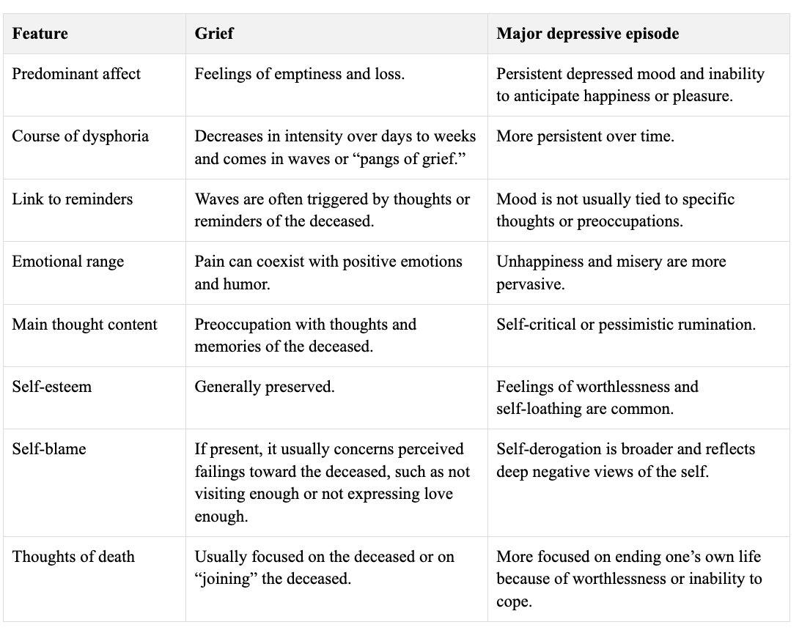

# Depression

- **Common features of depressive disorders:**
	- Changes of mood reflecting sadness, emptiness, or ocassionally irritability
	- Somatic changes
	- Cognitive changes
	- Significantly affects the individual's capacity to function
- **Differences between different depressive disorders:**
	- Duration
	- Timing
	- Presumed etiology
- **Depressive disorders under DSM-5 conventions:**
	- <u>Disruptive mood dysregulation disorder</u> - diagnosis for mood dysfunction in children that predicts progression to unipolar depression and anxiety as they mature into adolescence and adulthood
	- <u>Major depressive disorder</u> (including major depressive episode) - prototypical depressive disorder characteristic of clear cut changes in affect, neurovegetative functions, cognition, each episode lasting at least 2 weeks with complete inter-episodic remission
	- <u>Persistent depressive disorder</u> (dysthymia) - a chronic form of mood disturbances that persist for at least 2 years in adults, or 1 year in children
	- <u>Premenstrual dysphoric disorder</u> - specific, and treatment responsive form of depression that begins following ovulation and remits in a few days of menses and has a marked impact on functioning
	- Substance/ medication-induced depressive disorder
	- Depressive disorders due to another medical condition
	- Unspecified depressive disorder
- **Diagnostic features of major depressive episode:**
	- **Depressed mood** (A1) - by definition, either depressed mood or anhedonia must be present for a diagnosis of MDE/MDD to be made, although often depressed mood is denied:
	    - <u>Timing and progression</u> - for at least two weeks, although usually much longer:
			- Usually persistent, and occurs for most of the day, nearly everyday
			- Unrelated to any specific thoughts or occupations
			- Morning depression is characteristic of major depressive episode, as with loss of diurnal variations of mood
	    - <u>Description of depressed mood</u> - sadness may be denied, but may be elicited during interview (e.g. commenting that the patient appears that is about to cry):
			- May be described as hopeless, "down in the dumps", discouraged, sad
			- Description of depressed mood may be described in somatic terms depending on cultural contexts, but may have insight to their prevailing mood
			- Some present w/ somatic complaints (e.g. bodily aches and pain, insomnia) but does not attribute to mood
			- Irritability may manifest as persistently angry, tendancy to respond w/ outbursts, or severe frustrations over minor matters (usually common in children)
	  - **Anhedonia** (A2) - nearly always present to some extent, by definition inability to experience pleasure or happiness, resulting in loss of interest:
	    - <u>Assessment</u> - often requires eliciting personal descriptions, descriptions from family and friends, and views on other's perception:
			- What are your interests and hobbies? Do you still play? If yes, Do you still find them pleasurable? If no, why do you not perform yet?
			- Have family claimed that you have been more withdrawn?
		- <u>Manifestations</u> - N.B. this should be persistent nearly every day:
			- Acknowledged reduced interest in, and thus avoids hobbies previously find pleasurable ("not caring anymore")
			- Acknowledged social withdrawal and reduced pleasurable avocations but does not attribute to reduced interests
			- Continue to perform these hobbies but acknowledges reduced pleasure derived from them
	  - **Biological symptoms:**
	    - <u>Changes of appetite and weight</u> (A3) - can occur in either directions:
			- Some report that they have reduced appetite have to force themselves to eat
			- Appetite changes that are severe may result in significant loss or gain in weight
			- In children, consider a failure to make expected weight gains
	    - <u>Sleep disturbances</u> (A4) - may take the form of insomnia or hypersomnelensce, which may be the **initial presentation of depression**:
			- Insomnia - difficulty in initiating, or maintaining sleep, where early-morning wakening a/w morning depression is specific for MDE
			- Hypersomnia - may be experienced as prolonged sleeping episodes or increased daytime sleep
	    - <u>Psychomotor changes</u> (A5) - must be severe enough to be observable by others and not represent merely as subjective feelings:
			- Psychomotor agitation, e.g. inability to sit still, pacing, hand wringling, rubbing of skin, clothing, or other objects
			- Psychomotor retardation, slowing of speech, thinking and body movements, w/ reduced variety of content, tone, and volume observable during speech
	    - <u>Fatigue</u> (A6) - loss of energy, fatigue, or tiredness subjectively felt everyday, but additional clarification include sustained fatigue w/o physical exertion, substantial efforts for initiation of small tasks, and reduced efficiency
	    - <u>Poor attention or concentration</u> (A8) - easily distractable, memory problems, or general impaired ability to think, concentrate and make minor decisions (N.B. "pseudodementia" in elderly), but generally abate when mood improves
	  - **Depressive cognition** (A7) - unrealistic evaluations of one's past, currrent worth and guilt, and hope for the future, but does not include the guilt of being sick:
	    - <u>Ruminations of the past</u> - sense of guilt or ruminations regarding trivial past events
	    - <u>Worthlessness or hoplessness</u> - sense of **low self-esteem**, is perpetuated by misinterpretation of neutral or trivial day-to-day events as evidence of personal defects, and have an exagerated self responsibility to untowards events
	    - <u>Hopelessness</u> - strongly held belief that one has reached rock bottom and unable to recover
	  - **Suicidal ideations, planning, and attempt** (A9) - motivations are variable and may include a desire to give up in facing insurmoutable obstacles, ending a perceived unending, excrutiating painful emotion, hopelessness regarding forseable future in life, and not being a burden for others:
	    - <u>Passive suicidal ideations</u> - passive wish of to awaken in the morning or a belief that others would be better off if the individual were dead
	    - <u>Active suicidal ideations</u> - ranging from transient but recurrent thoughts of suicide, to a specific suicide plan
	    - <u>Active sucide planning</u>:
			- Contemplated on the approach to suicide, and acquiring the needed materials (e.g. rope, medications), and perceived lethality
			- Determining the the exact time and location
			- Putting affairs in orders (e.g. settling debts, death note, updating wills)
	    - <u>Suicide attempt</u> - greatest predictor of subsequent suicide risk
- **Associated features supporting diagnosis:**
	- <u>Psychotic features</u> - usually mood-congruent delusions (e.g. guilt, nihlistic, hypochondriacal, persecutory) or hallucinations
	- <u>Agitation and anxiety</u> - general anxiety, obsessive ruminations, phobias, or worries over physical health, separation anxiety in children
	- <u>Laboratory and biological features</u> - hypercortisolism (a/w melancholic features, psychotic features, and linked to suicide), functional neuroimaging
- **Approach to assessment of a patient with depression:**
	- _Basic components of Hx_ - sociodemographic, reason for consultation, history of presenting illness (mood symptoms, psychotic symptoms, risk assessment), past psychiatric history and past medical history, personal history (etiology), premorbid personality, family history, social history
	- _Eliciting mood symptoms_ - open-ended to close ended, broadly grouped into 4 categories:
		- Core mood symptoms (pervasive low mood, and anhedonia, prior elated mood)
		- Biological symptoms (sleep, appetite/ weight, energy, concentration)
		- Negative cognition (self-worth, guilt, hopelessness)
	- _Psychotic symptoms_ - greatly influences risk assessment:
		- Core delusional themes - delusion of guilt, delusion of reference, delusion of persecution, nihlistic delusions
		- Core hallucinations - mood congruent hallucinations relating to negative cognition, may take the form of **derogatory contents**, or possibly **commanding of self harm**
	- _Risk assessment_ - 4 key domains involved:
		- Self harm (suicide {see section on [[Suicide]]} , alcohol/ substance use)
		- Violence
		- Self neglect
		- Neglect to others
- **Eliciting mood symptoms:**
	- **Pervasive low mood:**
		- _Patient's own description_ -  你呢幾個月情緒點樣？有人說你看起來悲傷、情緒低落或抑鬱嗎？
			- 你有冇大部分時間都覺得情緒低落或者傷心？
			- 你有冇試過情緒異常高漲或者特別亢奮？
		- _Etiology_:
			-  最近是不是發生了什麼事 令你情緒那麼差? 
			-  我看見這件事對您的影響也挺大,令您這幾個月很大壓力
		- _Timing_ - pervasiveness, and duration criteria of a MDE:
			- 幾乎每天嗎？持續了多久？
			- 呢排有冇值得開心嘅事呀？ 記唔記得嗰陣時心情點？ 會唔會覺得嗰陣時都開心唔起呀？
		- _Perception by others and patients own views on other's description_:
			- 其他人也注意到了嗎？他們 注意到了什麼？
			- 咁你又點睇呢 ？
	- **Anhedonia:**
		- 平時有什麼興趣呢?
		-  最近還有沒有做? 是沒有時間、沒心機、沒精神、沒動力還是怎樣?
		- 有的話,那做的時候感覺越好,有沒有動力的?開不開心的?
	- **Biological symptoms:**
		- _Sleep_ - 最近睡成怎樣? 會不會很難入睡? 中間常常眨醒? 或者特別早起床?
		-  _Fatigue_ - 那精神怎樣? 會不會影響到日常生活呢?怎麼會影響呢?
		- _Poor concentration_ - 專注力點? 會不會影響到日常生活呢? 平時有沒有看報紙的習慣?看不看得完一份報紙?看手機又專心得到?
		-   _Psychomotor retardation_ - 有些人很累的時候做事,想事情都會慢一點? 那其他人留意到?他們留意到什麼? 
		-  胃口如何?會不會沒有什麼胃口?體重有沒有改變? 
	- **Negative cognition:**
		- _Low-self esteem_ (worthlessness) - 有些人心情差時會影響到自信,那如何影響呢?
		-  _Pathological guilt_ - 平時會不會很內疚?實際上內疚些甚麼? 
		-  _Hopelessness_ - 怎樣看未來啊?會不會覺得很困住在這個處境很辛苦?
- **Eliciting psychotic symptoms:**
- **Diagnostic criteria of major depressive episode:**
	 
	 ![[major_depressive_episode_dsm_5.png]]
- **DDx of depressive episodes:**
	- **Psychiatric differential diagnosis:**
		- _Normal grief and sadness_ - Dx of depression not to be made unless severe (\>5 Sx including cardinal features), prolonged (most of the day, nearly everyday for 2 weeks) and causes significant distress or functional impairment
		- _Adjustment disorder with depressed mood_ - occurs in response to psychosocial stressor
		- _Bipolar disorder presenting as a major depressive episode_ - requires careful probing of prior manic or hypomanic episodes
		- _Manic episodes with irritable mood or mixed episodes_ - requires careful clinical evaluation of manic symptoms
		- _Mood disorders related to another medical condition_ - e.g. neurological (MS, PD), endocrine (hypothyroidism), medication-induced, infectious disease
		- _Substance/medication-induced depressive or bipolar disorderu>/u> - a substance appears to be etiologically related to mood disturbance either during intoxication (e.g. ), or withdrawal (e.g. phenycyclidine and other hallucinogens, stimulants)
		- _Schizophrenia-spectrum disorders_ - during evaluation of suspected psychotic depressions, consider whether mood disturbance is primary or secondary to the psychotic features
		- _Attention-deficit hyperactivity disorder_ - irritability, distractibility and low frustration tolerance are overlapping features in both disorders, esp. if the mood is characterized by irritable rather than depressed and anhedonic
	- **Medical differential diagnosis:**
		- _Neurological disorders_ - e.g. Parkinson's disease, dementia, multiple sclerosis etc.
		- _Endocrinopathies_ - e.g. hypothyroidism, hyperthyroidism, Addisons disease, Cushing's syndrome, hyperparathyroidism
		- _Medication-induced depression_ - e.g. sedatives, methyldopa, alcohol, cocaine, amphetamines etc.
		- _Infectious disease_ - e.g. HIV, Lyme disease, syphilis
- **Distinguishing major depressive episodes and grief:**
	- response of significant loss (e.g. bereavement, financial ruin, losses from natural disaster, serious medical illness, or disability) may mimic much of features noted in criteria a, namely intense sadness, ruminations of the loss, insomnia, poor appetite, and weight loss
	- However, although the response can be considered appropriate for the loss, the presence of mde on top of normal grief should be carefully considered
	- **Core distinguishing features of major depressive episodes:**
		- Depressed mood in criteria a should be present for most of the day, for every day
		- All symptoms in criteria a must be present nearly every day to be considered present, except for 1) weight changes, 2) or suicidal ideations
		- Certain features have high prevalence in MDEs (fatigue, sleep disturbances) where absence should raise alternative dx
		- Certain features are less common (psychomotor disturbances, delusional guilt) but are more specific, and indicative of greater overall severity
	
	
- **Differentiating features between bipolar and unipolar depression** - differentiated based on symptomatology, clinical course, and family Hx:
	
	![[Pasted image 20260405152341.png]]