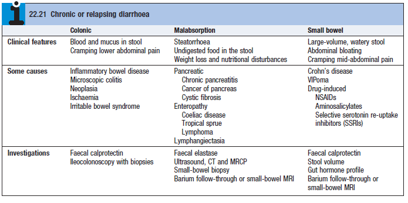

# Diarrhoea

- **Definition** - passage of \> 200g of stool daily
- **Clinical features of diarrhoea:**
    - <u>Urgency of defaecation</u> - probably the most problematic Sx for many patients, where **faecal incontinence** is a common event in acute and chronic diarrhoea
    - <u>Dehydration and metabolic derrangements</u> - severe diarrhoea results in S/S and effects of hypovolaemia, w/ or w/o metabolic derrangements including metabolic acidosis and hypoK
- **Etiology of diarrhoea:**
    - **Acute diarrhoea** - **infective gastroenteritis** due to faecal oral transmission of bacteria or their toxins, viruses or infective (short-lived and clinical course \< 10d)
    - **Chronic diarrhoea** - classfied into SB diarrhoea, colonic diarrhoea, or malabsorptive diarrhoea:
        - **Small bowel diarrhoea** - usually large volume of watery stool, a/w bloating and periumbilical abdominal pain:
            - <u>Inflammatory disease</u> - Crohn's disease, chronic SB infections (e.g. TB etneritis, Yersinia, Actinomyces)
            - <u>Drug-induced diarrhoea</u> - NSAIDs, aminosalicylates, SSRIs, PPIs, ABx, cytotoxic drugs
            - <u>Neoplastic disorder</u> - VIPoma
        - **Large bowel diarrhoea** - bloody and mucus in stool, a/w cramping lower abdominal pain:
            - <u>Inflammatory disease</u> - inflammatory bowel disease, microscopic colitis
            - <u>Functional or motility disorder</u> - irritable bowel syndrome
            - <u>Vascular</u> - mesenteric ischaemia
            - <u>Neoplastic disease</u> - colonic polyp (esp. villous adenoma), colorectal carcinoma
        - **Malabsorptive diarrhoea** - characterised by stearrhoea, undigested food in stool, weight loss and nutritional disturbances:
            - <u>Pancreatic disorders</u> - chronic pancreatitis, pancreatic adenocarcinoma, cystic fibrosis
            - <u>Enteropathy</u> - lymphoma, tropical sprue, coeliac disease
            - <u>Lymphangiectasia</u>

  
  
