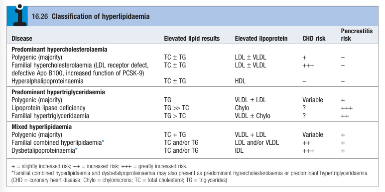
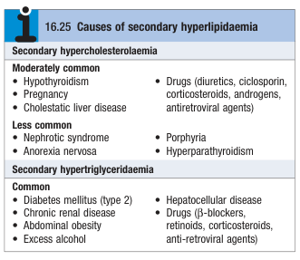
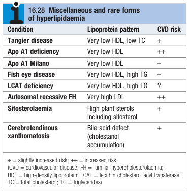
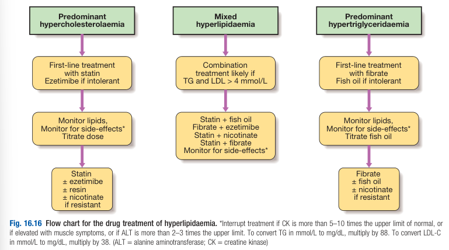
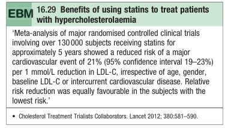
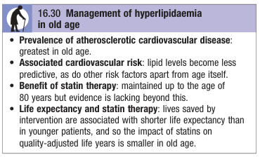

# Dyslipidaemia

- **Definition** - abnormal lipid profile associated w/ increased risk of cardiovascular disease
- **Indications for lipid profile:**
    - 1\. Screening for primary and secondary prevention of cardiovascular disease
    - 2\. Ix of patient w/ clinical features of lipid disorders and their relatives
    - 3\. Monitoring of response of lipids to diet, weight control and emdications
- **Etiology of dyslipidaeia** - classified into primary dyslipidaemia and secondary dyslipidaemia:
    - **Primary hyperlipidaemia** - classified according to predominant lipid problem, and may be associated w/ single gene disorder, or polygenic disorders: 
	    - 
	    
        - <u>Predominant hypercholesterolaemia</u> - predominant rise of TC and LDL-C, where risk is proportional to degree of LDL-C elavation, modified by other major factors (e.g. low HDL-C):
            - **Polygenic hypercholesterolaemia** - most common, resulting in mild-to-moderate rise in hypercholesterolaemia (signs often absent)
            - **Familial hypercholesterolaemia** - rare (0.2%) group of single gene disorders (LOF LDLR, ApoB100, GOF PCSK9), resulting in moderate-to-severe hypercholesterolaemia, manifesting as premature cardiovascular disease accompanied by signs
            - **Familial combined hyperlipidaemia** - may present w/ pattern of predominant hypercholeseterolaemia
            - **Dysbetalipoproteinaemia** - may present w/ pattern of predominant hypercholesteroaemia (see below)
        - <u>Predominant hypertriglyceridaemia</u> - predominant rise in TG, often w/ associated low HDL-C:
            - **Polygenic hypertriglyceridaemia** - most common, resulting variable rise to TG and often a/w comorbidities manifesting from insulin resistance
            - **Lipoprotein lipase deficiency** - rare genetic disorder caused by LOF mutation of LPL gene, or the APOC gene (ApoC2 serves as co-factor), which is not readily amenable to drug Tx, presenting often w/ acute abdomen w/ pancreatitis of a child
            - **Familial hypertrilgyceridaemia** - rare genetic disorder inherited in AD pattern a/w mutation of APOA5 gene (ApoA5 serves as co-factor of LPL)
        - <u>Mixed hyperlipidaemia</u>:
            - **Primary mixed hyperlipidaemia** - polygenic, and a/w comorbidities manifesting from insulin resistance as in polygenic hypertriglyceridaemia
            - **Familial combined hyperlipidaemia** - inherited tendancy towards over production of atherogenic Apo B-containing lipoprotein (but absence of pathognomonic signs), likely one end of a heterogenous spectrum that overlaps insulin resistance (for clinical practice)
            - **Dysbetalipoproteinaemia** - homozygous inheritance of ApoE2 allele, which is less avidly recognised by LDL, resulting in premature cardiovascular disease, and associated signs of dyslipidaemia
    - **Secondary dyslipidaemia:**
        - <u>Secondary hypercholesterolaemia</u>:
            - Clinical or subclinical hypothyroidism
            - Drugs - diuretics, cyclosporin, corticosteroids, androgens, anti-retroviral agents
            - Pregnancy
            - Cholestatic liver disease
            - Nephrotic syndrome
            - Hyperparathyroidism
            - Porphyria
            - Anorexia norvosa
        - <u>Secondary hypertriglyceridaemia</u>:
            - Metabolic syndrome - T2DM, abdominal obesity
            - Drugs - beta-blockers, retinoids, corticosteroids, anti-retroviral therapy
            - Excess alcohol
            - Chronic renal disease
            - Hepatocellular disease
		- 
		
    - **Rare dyslipidaemias:** 
	    - 
	    
- **Approach to dyslipidaemia:**
    - 1\. Rule out secondary cause - drug review and TFT
    - 2\. Assessment of risk factors of insulin resistance (e.g. obesity, physical inactivity)
    - 3\. Assessment of cardiovascular risk - HTN, DM, smoking, FHx of cardiovascular disease
    - 4\. Management by non-pharmacological and pharmacological means (see below)
- **Mx:**
    - **Principles of Mx:**
        - <u>Goals of Mx</u> - primary or secondary prevention of atherosclerosis
        - <u>Indications for lipid-lowering therapy</u> - 10y ASCVD risk \> 20% (established cardiovascular disease, DM, CKD, and FH assumed to be high risk)
        - <u>Target for lipid profile</u> - dependent for risk:
            - **High risk individuals** - HDL-C \> 1 mmol/L, TG \< 2 mmol/L, LDLC \< 1.8 mmol/L
        - <u>Detection and Mx of other risk factors</u> - Tx of other comorbidities
        - <u>Approach to Mx</u> - non-pharmacological Mx for all, and pharmacological Mx when indicated
    - **Non-pharacological Mx** - diet and lifestyle modifications:
        - <u>Dietary modification</u> - effects take place in 3-4 weeks but needed to introduced gradually for sustainability:
            - Reduced intake of saturated and trans-unsaturated fat (\< 7-10% of total energy)
            - Reduced cholesterol intake
            - Replace source of saturated fat and cholesterol w/ alternative foods, such as lean meat, low-fat dairy products, polyunsaturated spreads, low glycaemic index carbohydrates
            - Reduce energy-dense foods such as fats and soft drinks
            - Increased consumption of cardioprotective and nutrient dense foods such as vegentables, unrefined carbohydrates, fishes etc.
            - Reduce alcohol intake if hypertension, hypertriglyceridaemia or central obesity
            - Added benefits for lipid lowering supplements such as n-3 fatty acids, dietary fibre and plant sterols
        - <u>Increased physical activity</u> - exercise per WHO guidelines
        - <u>Weight loss</u> - through diet and physical activity
        - <u>Smoking cessation</u> - as smoking is a cardiovascular risk factor
    - **Pharmacological Mx:**
        - **Principles of pharmacological Mx** - dependent on lipid profile: 
	        - 
	        
            - <u>Predominant hypercholesteroaemia</u> - statins and ezetimibe as first lines, add nicotinate or resins if resistance (consider combination therapy)
            - <u>Predominant hypertriglyceridaemia</u> - fibrates or fish oil
            - <u>Mixed hyperlipidaemia</u> - combination therapy necessary (statin monotherapy ineffective if fasting TG \> 4 mmol/L):
                - **When TG not too high** - statin with fish oil
                - **When TG high** - statin with ezetimibe, nicotinic acid, fibrates
        - **Statins:**
            - <u>MOA</u> - HMG-CoA reductase inhibitor (inhibition of de novo cholesterol synthesis, resulting in unregulation of LDL receptors)
            - <u>Clinical efficacy</u> - clear evidence against MACE and CVS mortality across spectrum of CVD risk:
                - LDL-C - 60% reduction
                - HDL-C - 10% increase
                - TG - 40% reduction
		        - 
		        
            - <u>S/E</u> - generally well tolerated and serious S/E rare (\< 2%):
                - Derranged LFT
                - Muscle problems - myalgia, asymptomatic increased CK, myositis, rhabdomyositis
            - <u>Drug-drug interaction</u> - increased drug level if taken w/ CYP3A4 inhibitors
        - **Ezetimibe** (10mg/d):
            - <u>MOA</u> - cholesterol absorption inhibitor (intestinal NPC1L1 blocked, and depletion of hepatic cholesterol results in increased LDL expression, synergistic w/ statins)
            - <u>Clinical efficacy</u>:
                - LDL-C - 15-20% on monotherapy, slightly higher (17-25%) w/ statins
        - **Bile acid sequestering resins:**
            - <u>Selection</u>:
                - Cholestyramine
                - Colestipol
                - Colesvelam
            - <u>MOA</u> - prevent reabsorption of bile acid, increasing de novo bile acid synthesis (depletion of hepatic cholesterol and up regulation of LDL, synergistic w/ statins)
            - <u>Clinical efficacy</u>:
                - LDL-C - reduction
                - HDL-C - increase
                - TG - increase
            - <u>S/E</u> - GI disturbance
            - <u>Drug-drug interaction</u> - reduce bioavailability of other drugs
        - **Nicotinic acid** - RCTs evidence inconclusive and thuse used for combination therapy
        - **Fibrates:**
            - <u>MOA</u> - Stimulation of PPAR-alpha:
                - Enhanced activity of LPL resulting in reduced TG and VLDL
                - Increased ApoA1 and ABCA1 expression results in enhanced RCT via HDL
            - <u>Clinical efficacy</u>:
                - TG - 50% reduction
                - HDL-C - 20% increase
                - LDL-C - variable
            - <u>S/E</u> - similar S/E profile as statins:
                - Derranged LFTs
                - Muscle problems
                - Increased risk of cholelithiasis
                - Prolonged action of anticoagulants
        - **Fish oil** - high in highly polyunsaturated long-chain n3 fatty acids:
            - <u>MOA</u> - potent inhibition of VLDL TG formation (+/- antiplatelet activity in animal models documented)
            - <u>Clinical efficacy</u>:
                - TG - 50% reduction
                - LDL-C - variable
                - HDL-C - variable
    - **Monitoring** - reassess 6 weeks after initiation of drug therapy:
        - Review lipid response
        - Review S/E
        - Review bloods - LFT, CK:
            - CK - discontinue if CK \> 5-10x ULN
            - LFT - discontinue if ALT \> 2-3x ULN
        - Review complications (e.g. Sx of cardiovascular disease)
	    - 
	    
