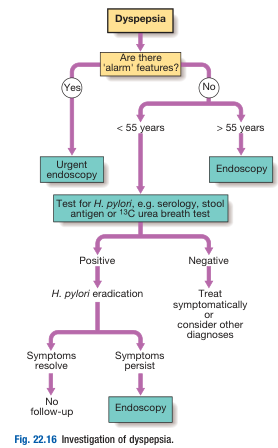

# Dyspepsia

- **Definition** - constellation of Sx that is meal related that is thought to originate from upper GI tract:
    - <u>Bloating</u> (abdominal fullness) - especially after meal
    - <u>Early satiety</u> - unable to finish full-sized meal due to postprandial discomfort
    - <u>Nausea</u> - the subjective sensation of needing to vomit
    - <u>Epigastric pain/ heartburn</u> - may or may not be meal-realated
- **DDx of dyspepsia:**
    - **Upper GI disorders:**
    - <u>Esophageal disorders</u> - GERD, esophageal spasms, esophageal motility disorders (e.g. achalasia), **CA esophagus**
    - <u>Gastric disorders</u> - functional dyspepsia, gastritis, peptic ulcer disease, gastroparesis, CA stomach
    - **Lower GI disorders** - irritable bowel syndrome, colonic carcinoma
    - **Hepatopancreatic and biliary disorders:**
    - <u>Biliary disorders</u> - Biliary colic, cholidolithiasis
    - <u>Hepatic disorders</u> - Hepatitis, \*liver metastasis, **primary liver tumour**
    - <u>Pancreatic disorders</u> - chronic pancreatitis, **CA pancreas**
    - **Drug-related causes:**
    - <u>Aspirin and NSAID</u> - NSAID-related dyspepsia
    - <u>Iron supplements</u>
    - <u>KCl tablets</u>
    - <u>Bisphosphonate</u>
    - <u>Digoxin</u>
    - **Metabolic derrangements** - HyperCa, uraemia
    - **Others:**
    - Psychological
    - Alcohol
- **Alarm features** - identify 'red flag features' requiring urgent evaluation:
    - <u>Dysphagia</u> - suspicious of esophageal malignancy
    - <u>Overt UGIB</u> - haematemesis +/- melena
    - <u>Anaemia</u> - esp. unexplained Fe-deficiency anaemia related to occult blood loss
    - <u>Persistent vomiting</u>
    - <u>Unintentional eight loss</u> - \>= 10% within 6 mo
    - <u>Palpable abdominal mass</u>
    - +/- FHx of upper GI cancer
- **Ix of dyspepsia** - indications dependent on age, clinical presentation, and alarm features:
    - **Routine bloods not indicated** - no role of CBC, LRFT and thyroid function as they are demonstrated to be cost-ineffective if solely present with dyspepsia
    - **H. pylori testing:**
    - <u>Non-invasive H. pylori testing</u> - for young patients w/o alarm features
    - <u>Invasive H. pylori testing</u> - for old patients or those w/ alarm features
    - **Upper endoscopy** (w/ Bx) - urgent endoscopy for those w/ alarm features

  
  
