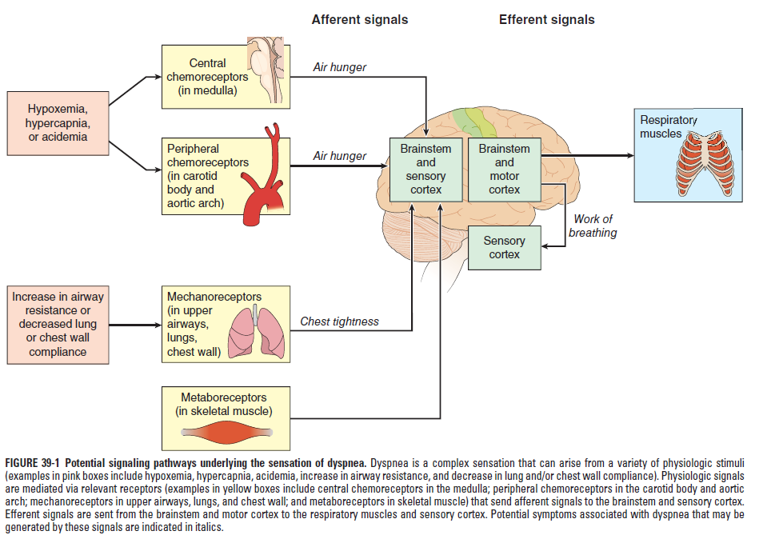
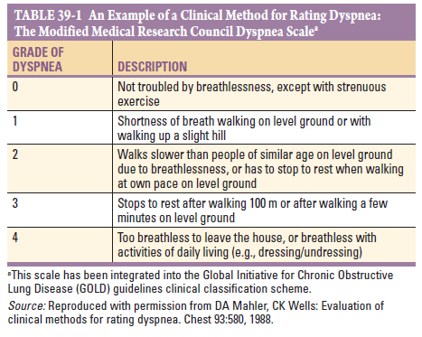
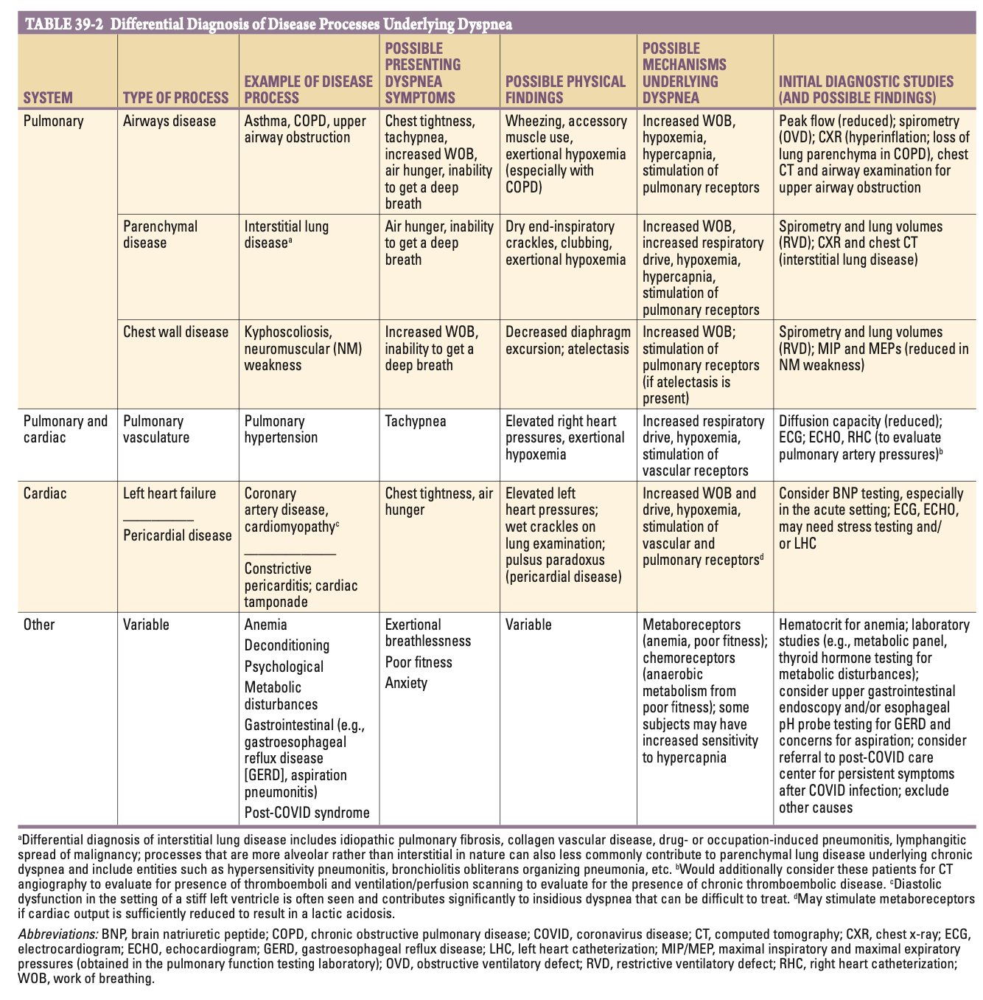
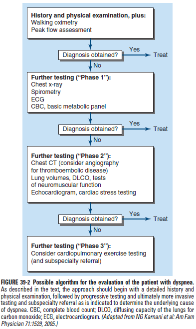

# Dyspnoea

- **Definition** (American Thoracic Society) - a subjective experience of breathing discomfort that consists of qualitatively distinct sensations that vary in intensity; The experience derives from interactions among multiple physiological, psychological, social, and environmental factors and may induce secondary physiological and behavioural response
- **Signs of increased work of breathing:**
    - Tachypnoea
    - Accessory muscle use
    - Intercostal retraction
- **Epidemiology:**
    - <u>Prevalence</u> - 9-13% in the community (\> 50% inpatient, \> 25% ambulatory outpatients)
    - <u>Incidence</u> - frequent cause of admission (3-4 million visits)
    - <u>Demographic</u> - increasing incidence w/ age (up to 37% in \>=70%)

- **Mechanisms underlying dyspnoea** - efferent-reafferent mismatch:
    - **Afferent signals** - signals from receptors from peripheral vasculature and lungs to the CNS:
        - <u>Chemoreceptors</u> - found in the aortic arch and carotid bodies responsible for **detection of hypoxaemia, hypercapnia, acidosis**, and production of a **sense of "air hunger"**
        - <u>Mechanoreceptors</u> - found in upper airways, lung parenchyma and chest wall stimulated by **increased work of breathing** (e.g. increased airway resistance or reduced compliance) and is responsible for a sensation of **chest tightness**
        - <u>Metaboreceptors</u> - found in skeletal muscles and pulmonary vasculature and detect changes in biochemical environment, modulating sense of dyspnoea
    - **Efferent signals** - signals from the CNS (motor cortex and brainstem) to respiratory muscles, with <u>corollary discharges to the sensory cortex</u>, and is postlated to be interpereted as the "**work of breathing**", as seen in fear or anxiety
	  
	  

- **Domains of the dyspnoea experience:**
    - Sensory-perceptual experience - quality of breathlessness as experienced by the patient itself
    - Affective distress - fear and anxiety provoked by the sense of dyspnoea
    - Symptom burden - functional limitation and reduced exercise tolerance as a result of exertional dyspnoea

- **Dyspnoea assessment tools:**
    - Number of emerging tools for formal dyspnoea assessment, as symptom severity found to correlate better with disease severity than objective Ix (N.B. COPD)
    - The Modified Medical Research Council Dyspnoea Scale is one of such tools
	  
	  
    - However, consensus opinion holds that dyspnoea should be formally assessed in a context most relevant and beneficial for patient Mx, and hence all domains of the dyspnoea experience (see above) should be addressed

- **DDx of acute dyspnoea** - keep in mind and r/o life-threatening causes:
    - **Pulmonary disease:**
        - <u>Airway disease</u> - acute asthmatic attack (or status asthmaticus), AECOPD, upper airway obstruction (**anaphyaxis**, **laryngeal spasm** (hypoCa), **foreign body**)
        - <u>Pulmonary parenchymal disease</u> - pneumonia, APO, or other alveolar filling processes
        - <u>Pulmonary vascular disease</u> - **pulmonary embolism**, diffuse alveolar haemorrhage (DAH) etc.
        - <u>Disease of the pleura</u> - pleural effusion, **tension pneumothorax**
    - **Cardiovascular disease** - any cause of APO (esp. ACS, AD etc.)
    - **Others** - metabolic acidosis (consider DKA)

- **DDx of chronic dyspnoea** (\> 1 mo) - up to 85% attributable to pulmonary or cardiac conditions:
    - **Pulmonary diseases:**
        - <u>Airway disease</u> - asthma, COPD, upper airway obstruction (consider laryngeal spasm)
        - <u>Interstitial lung disease</u> - idiopathic pulmonary fibrosis, NSIP, collagen vascular disease, drug- or occupation-induced pneumonitis, lymphangitic spread of malignancy
        - <u>Parenchymal disease w/ alveolar filling processes</u> - hypersensitivity pneumonitis, bronchiolitis obliterans organizing pneumonia, COP
        - <u>Disease of the chest wall</u> - severe kyphoscoliosis, neuromuscular weakness (e.g. GBS, MG, ALS)
        - <u>Disease of the pulmonary vasculature</u> - pulmonary hypertension, chronic thromboembolic disease (N.B. consider VTE always)
        - <u>Disease of the pleura</u> - pleural effusion
    - **Cardiovascular diseases:**
        - <u>Left heart failure</u> - e.g. CAD, cardiomyopathy, valvular heart disease etc.
        - <u>Pericardial disease</u> - constrictive pericarditis, cardiac tamponade
    - **Other causes:**
        - <u>Anaemia</u> - occult anaemia as a common cause of SOBOE, screened by based on Hb and HCT
        - <u>GI disease</u> (GERD, aspiration pneumonitis) - consider OGD +/- pH probe testing for GERD and considerations for aspiration
        - <u>Metabolic disturbances</u> - e.g. metabolic acidosis, thyroid dysfunction
        - <u>Aniety and panic attack</u> - evidence of hyperventilation, may manifest as carpopedal spasm and digital/ perioral parasthesia due to metabolic alkalosis and functional hypocalcaemia
        - <u>Deconditioning</u> - as part of geriatric syndrome
        - <u>Post-COVID syndrome</u> - vague entity w/ persistence of breathlessness (exclude other causes)
	
	

- **Graded approach to the patient with chronic dyspnoea** - two-thirds of patient will require diagnostic testing beyond initial evaluation: 
	- 
	

    - <u>New onset dyspnoea</u> - determine underlying etiology
    - <u>Known worsening dyspnoea</u> - determine whether caused by progression of known cause or develooped new process that is known to cause dyspnoea

- **Salient points of Hx:**
    - **HPI:**
        - <u>Onset and duration</u> - chronic dyspnoea typically defined as \> 1mo
        - <u>Quality</u> - patient asked to describe in their own words on the discomfort:
            - Chest tightness - suggests possibility of broncoconstriction
            - Inability to take a deep breath - suggests hyperinflation state (COPD +/- asthma attack) especially if experienced when tachypnoeic
            - Air hunger - consider alveolar filling processes such as CHF
        - <u>Progression</u> - whether 1) marked temporal variability, or 2) progressive exertional dyspnoea
        - <u>Precipitating factors</u> - consider relations of dyspnoea w/ 1) position, 2) infections, and 3) environmental stimuli:
            - Nocturnal dyspnoea - suggests CHF or asthma
            - Orthopnoea/ paroxysmal nocturnal dyspnoea - suggests CHF, obesity-hypoventilation syndrome, GERD-associated asthma
            - Platypnea (dyspnoea in upright position) - raises suspicion of atrial myxoma or hepatopulmonary syndrome
        - <u>Severity and progression</u> - objectively by assessment tools (+/- evaluation in changes of the domains of dyspnoea experience)
        - <u>Timing</u>:
            - Acute, intermittent dyspnoea - associated w/ myocardial ischaemia, bronchoconstriction (e.g. asthma), pulmonary embolism
            - Chronic, persistent dyspnoea - associated with COPD, ILD, chronic thromboembolic disease
    - **Associated Sx:**
        - <u>Cough and sputum</u> - cough a mark accompaniment for most cardiopulmonary disease, however further characterisation may delineate underlying cause
        - <u>Haemoptysis</u> - blood-streak vs frank haemoptysis to differentiate underlying cause
        - <u>Chest pain</u> - cardiac chest pain points towards a cardiac cause, while pleuritic chest pain suggest pleurisy
        - <u>Palpitations</u> - reflects 1) arrhythmia, 2) structural heart disease, and 3) hyperdyanamic state
        - <u>Syncope</u> - cardiac cause likely but cardiopulmonary causes (esp. massive pulmonary embolism) should still be considered
        - <u>Fever</u> - possibly an infective component
        - <u>Weight loss</u> - consider malignancy, although advanced cardiopulmonary disease may also result in weight loss
    - **PMH and Drug Hx** - risk factor assessment for drug-induced lung disease or coronary artery disease:
        - <u>Risk factors for CAD</u> - HTN, HL, DM (+/- FHx of SCD)
        - <u>Risk factors for ILD</u> - Hx of radiation to the chest, amiodarone, bleomycin, Hx of rheumatological disorders (esp. Sjogren's Syndrome and immune-mediated myositis)
        - <u>Risk factor for pulmonary embolism</u> - 1) Hx of PE/ DVT, 2) active malignancy, 3) unilateral leg swelling and tenderness, 4) COC pills and pregnancy
        - <u>Other comorbidities</u> - e.g. renal, liver disease, active malignancy
    - **SHx** - smoking and alcohol (COC pills if F)
    - **FHx** - relevant FHx of pulmonary and cardiac disorders

- **P/E:**
    - **Vital signs and primary assessment:**
        - **Airway:**
            - <u>Speak in sentences</u> - inability of patient to speak full sentence before deep breath suggests 1) condition stimulating controller (e.g. efferent signal), or 2) reduced vital capacity (e.g. hyperinflation, restrictive pathophysiology)
        - **Breathing:**
            - <u>Work of breathing</u> - suggests increased airway resistance or reduced compliance of lung-chest wall system:
                - Supraclavicular retractions
                - Use of respiratory accessory muscles in ventilation
                - Tripod position
            - <u>Respiratory rate</u> - tachypnoea (also measure changes in SBP for pulsus paradoxus)
            - <u>SpO2</u> - resting hypoxemia suggests processes relating to 1) hypercapnia, 2) VQ mismatch, 3) shunt physiology, or 4) reduced diffusion capacity
        - **Circulation:**
            - <u>HR</u> - tachycardia a/w underlying fever, cardiac dysfunction or deconditioning
            - <u>BP</u>:
                - Elevated BP in setting of HF suggests diastolic dysfunction
                - Decrease of SBP on inspiration by \> 10 mmHg (pulsus paradoxus) raises suspicion of hyperinflation states or pericardial disease
        - **Temperature** - fever suggestive of underlying infectious or inflammatory proesses
    - **General examination** - head to toe:
        - <u>Pallor</u> - signs of anaemia
        - <u>Cyanosis</u> - cyanotic heart disease if not severely in distress
        - <u>Stigmata of chronic liver disease</u> - e.g. spider angioma, gynaecomastia, jaundice
        - <u>Clubbing</u> - IPF, bronchiectasis etc.
        - <u>LL oedema</u> - unilateral vs bilateral
    - **Chest examination:**
        - <u>Inspection and palpation</u> - unilateral vs bilateral disease
        - <u>Percussion</u> - dull (pleural effusion) or hyperesonant (pneumothorax or emphhysema)
        - <u>Auscultation</u>:
            - Airway pathologies - wheeze, rhonchi, prolonged expiratory phases, diminished breath sounds
            - Alveolar/ interstitial pathologies - crackles
    - **Cardiac examination:**
        - <u>Right heart pressure</u> - JVP, edema, accentuated P2
        - <u>LV dysfunction</u> - S3/ S4 gallop
        - <u>Valvular diseases</u> - murmurs
    - **Examination on walking and walking oximetry** - aimed at reproducing Sx to yield new findings that are not present at rest

- **Ix:**
    - **CXR** - provides useful information but non are diagnostic (see below)
    - **Routine bloods** - CBC, RFT +/- ABG:
        - <u>CBC</u> - r/o anaemia; Eos for COPD/asthma
        - <u>HCO3</u> - metabolic acidosis or suggestive of chronic respiratory alkalosis as evident by elevated bicarbonate (ABG useful)
        - <u>ABG</u> - delineate chronic respiratory failure
    - **ECG** - provides evidence for:
        - <u>Old MI</u> - deep Q waves, TWI
        - <u>LVH</u> - deep S waves in V1-2, tall R waves in V5-6 +/- strain patterns such as ST depression, TWI
    - **Spirometry** - typically performed prior to other lung function studies as more tolerable:
        - Diagnostic of obstructive pathophysiology - i.e. FEV1/FVC \< 0.7
        - Suggestive but not diagnostic for restrictive pathophysiology - prompts additional lung function studies such as lung volumes and DLCO
    - **Additional testing:**
        - <u>HRCT</u> - for interstital lung disease
        - <u>CTPA</u> - for thromboembolic disease
        - <u>Echocardiography</u> - indicated when systolic dysfunction, pHTN, or valvular heart disease suspected
        - <u>Broncoprovocative testing +/- home peak-flow monitoring</u> - for suspected asthma but normal on P/E and testing
        - <u>Cardiac stress testing</u> - if suspecting chronic coronary syndrome

- **Role of CXR in initial assessment** - correlate the degree of abnormality w/ the severity of dyspnoea (e.g. small pleural effusions should not be used to attribute to dyspnoea and hypoxaemia in a patient on 4L of O2):
    - **Lung volumes:**
        - <u>Hyperinflation</u> - suggests obstructive lung disease
        - <u>Low lung volume</u> - interstitial oedema, interestitial fibrosis, diaphragmatic dysfunction, impaired chest wall motion
    - **Lung fields** - evaluation of pulmonary parenchyma for:
        - Focal opacities
        - Emphysema
        - Interstitial disease and infiltrates (e.g. reticulo-nodular shadowing)
    - **HF changes:**
        - Upper lobe cephalisation
        - Kerley B lines
        - Batwing opacity
    - **Cardiac sillhuoette** - for cardiomegaly and changes in heart border as evidence for chamber enlargements
    - **Costophrenic angles:**
        - <u>Bilateral pleural effusion</u> - typical of CHF and some forms of collagen-vascular disease
        - <u>Unilateral effusion</u> - raises suspicion of CA lung, pulmonary embolism, but also occurs in parapneumonic effusion or CHF

- **DDx of hypoxaemia and dyspnoea despite normal CXR:**

- **Role of POCUS:**

- **Distinguishing cardiovasclar from respiratory dyspnoea** - <u>cardiopulmonary exercise test</u> (CPET) to identify system responsible for exercise limitations:
    - Incremental symptom-limited exercise with measurements of both cardiac and respiratory functions
    - Pulmonary functions through measurement of ventilation, pulmonary gas exchange and SpO2
    - Cardiac functions measured by, BP, O2-pulse (proxy for stroke volume), ECG +/- non-invasive/ invasive measures of CO
    - Pulmonary problem if predicted maximal ventilation, bronchospasm or hypoxaemia occurs at peak exercise
    - Cardiac problem if changes in BP, fall in O2-pulse, ischaemic changes on ECG at peak exercise

- **Mx:**
    - **Principles of Mx:**
        - <u>Tx of reversible causes</u> - addressing potentially reversible causes (e.g. hypoxemia) with appropriate treatment for the particular condition (dyspnoea may be multifactorial and mandates multiple different interventions)
        - <u>Symptomatic Tx</u>:
            - Reduce efferent signals for ventilations - e.g. LTO2 if SpO2 \<= 88% or if desaturation w/ activity or sleep (N.B. LTO2 shown to improve survival in terminal COPD patients)
            - Reduce afferent signals - use of anxiolytics and opioids controversial but recent RCT (JAMA 2022) does not support use in COPD patients
        - <u>Pulmonary rehabilitation programs</u> - demonstrated +ve effects on dyspnoea, exercise capacity and rates of hospitalisation in COPD and post-COVID syndrome
